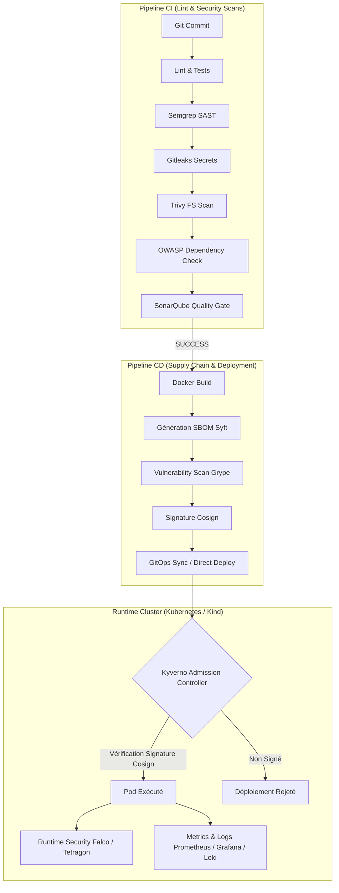

# Résumé Complet de la Machine DevSecOps & Outils Utilisés

**SecureRAG Hub** is a Cloud-Native DevSecOps Platform implementing secure software delivery practices across the entire application lifecycle. The platform integrates CI/CD automation, SAST, SCA, secret detection, container security, SBOM generation, image signing, policy enforcement, runtime threat detection, observability, and Kubernetes-native deployment workflows. Security controls are embedded from code commit to runtime execution, following DevSecOps and Software Supply Chain Security best practices inspired by SLSA, CIS Benchmarks, OWASP, CNCF and Sigstore ecosystems.

Ce document présente une vue d'ensemble exhaustive de la plateforme **SecureRAG Hub DevSecOps**. L'infrastructure est conçue selon les meilleurs standards de sécurité de l'industrie (alignée sur les niveaux de conformité **SLSA 3+** et **CIS Benchmarks**).

---

## 1. Orchestration & Intégration Continue (CI/CD)

| Outil | Rôle / Utilisation dans le Projet | Fichiers associés |
| :--- | :--- | :--- |
| **Jenkins** | Orchestrateur central de la chaîne de CI/CD. Exécute les pipelines de validation, d'audit, de construction et de déploiement. | `Jenkinsfile`, `Jenkinsfile.recette`, `Jenkinsfile.cd` |
| **JCasC (Jenkins Configuration as Code)** | Automatise la configuration de Jenkins (création des credentials SSH/Sonar, installation des librairies partagées, etc.) via du code YAML. | [jenkins.yaml](file:///root/MasterPFE/infra/jenkins/casc/jenkins.yaml), [kubernetes-agents.yaml](file:///root/MasterPFE/infra/jenkins/casc/kubernetes-agents.yaml) |
| **Job DSL (Jenkins)** | Définit et génère dynamiquement les jobs et les pipelines Jenkins sous forme de scripts Groovy (CI, CD, Recette). | [securerag-hub-ci.groovy](file:///root/MasterPFE/infra/jenkins/jobs/securerag-hub-ci.groovy), [securerag-hub-recette.groovy](file:///root/MasterPFE/infra/jenkins/jobs/securerag-hub-recette.groovy), [securerag-hub-cd.groovy](file:///root/MasterPFE/infra/jenkins/jobs/securerag-hub-cd.groovy) |
| **Docker Compose** | Utilisé sur la machine de recette pour instancier et configurer localement le conteneur Jenkins et ses dépendances. | [docker-compose.yml](file:///root/MasterPFE/infra/jenkins/docker-compose.yml) |

---

## 2. Infrastructure Locale & Conteneurisation

| Outil | Rôle / Utilisation dans le Projet | Fichiers associés |
| :--- | :--- | :--- |
| **Docker** | Moteur de conteneurisation pour construire les microservices applicatifs et faire tourner l'ensemble de la stack d'outils. | `Dockerfile.unified`, Dockerfiles de services |
| **Kind (Kubernetes in Docker)** | Permet d'exécuter un cluster Kubernetes local multi-nœuds (nœuds de contrôle et nœuds de travail) dans des conteneurs Docker pour les tests et la recette. | [kind-dev.yaml](file:///root/MasterPFE/infra/kind/kind-dev.yaml), [kind-production.yaml](file:///root/MasterPFE/infra/kind/kind-production.yaml) |
| **Registry OCI local** | Registre Docker privé configuré sur le port `5001` de la machine hôte pour stocker les images construites localement avant déploiement. | [registry-config.sh](file:///root/MasterPFE/infra/kind/registry-config.sh), [create-kind.sh](file:///root/MasterPFE/scripts/deploy/create-kind.sh) |
| **Kustomize** | Outil natif de Kubernetes pour gérer les configurations d'overlays selon les environnements (Dev, Demo, Production, Recette). | Dossier `infra/k8s/overlays/` |
| **Helm** | Gestionnaire de paquets Kubernetes pour déployer les services d'infrastructure (Vault, Prometheus, Grafana, Loki, Falco). | Dossier `infra/helm/` |

---

## 3. Sécurité Appliquée : SAST, DAST, SCA & Secrets

| Outil | Catégorie | Rôle / Utilisation dans le Projet | Fichiers associés |
| :--- | :--- | :--- | :--- |
| **SonarQube** | SAST / Qualité | Analyse statique de code propriétaire pour détecter les vulnérabilités OWASP Top 10, les bugs de logique, et mesurer la couverture de code. | [run-sonar-analysis.sh](file:///root/MasterPFE/scripts/ci/run-sonar-analysis.sh) |
| **Semgrep** | SAST | Analyse statique légère et rapide focalisée sur la sécurité et le respect des règles internes de codage. | `security/semgrep/semgrep.yml` |
| **Gitleaks** | Secrets Detection | Recherche des secrets, clés privées, tokens ou mots de passe codés en dur dans tout l'historique Git du dépôt. | `.gitleaks.toml` |
| **Trivy FS** | Vulnerability Scan | Scanne le système de fichiers (packages OS et dépendances applicatives) à la recherche de CVE connues. | `security/trivy/trivy.yaml`, `.trivyignore` |
| **OWASP Dependency Check** | SCA | Analyse de composition logicielle pour détecter les dépendances obsolètes ou vulnérables (Composer/NPM) du portail Laravel. | [run-owasp-dependency-check.sh](file:///root/MasterPFE/scripts/ci/run-owasp-dependency-check.sh) |
| **OWASP ZAP** | DAST | Tests de sécurité applicatifs dynamiques sur le portail portal-web actif pour détecter les failles d'injection, XSS, et d'authentification. | `scripts/validate/validate-dast-report.sh` |

---

## 4. Sécurité de la Chaîne d'Approvisionnement Logicielle (Supply Chain Security)

| Outil | Rôle / Utilisation dans le Projet | Fichiers associés |
| :--- | :--- | :--- |
| **Syft (Anchore)** | Génération de SBOM (Software Bill of Materials) au format standard **CycloneDX JSON** pour lister exhaustivement les composants logiciels embarqués dans chaque image. | [generate-sbom.sh](file:///root/MasterPFE/scripts/release/generate-sbom.sh) |
| **Grype (Anchore)** | Scanne les fichiers SBOM générés par Syft pour détecter d'éventuelles vulnérabilités (CVE) associées aux bibliothèques répertoriées. | [Jenkinsfile](file:///root/MasterPFE/Jenkinsfile#L191-L197) |
| **Cosign (Sigstore)** | Signature cryptographique des images de conteneurs à l'aide d'une clé privée (`cosign.key`) et vérification à l'aide de la clé publique (`cosign.pub`). | [sign-images.sh](file:///root/MasterPFE/scripts/release/sign-images.sh), [verify-signatures.sh](file:///root/MasterPFE/scripts/release/verify-signatures.sh) |
| **Kyverno** | Moteur de politiques d'admission Kubernetes. Applique des ClusterPolicies en mode **Enforce** pour interdire le déploiement d'images non signées par Cosign ou n'ayant pas de SBOM valide. | Dossier `infra/k8s/policies/kyverno/` |

---

## 5. Gestion des Secrets & Durcissement (Hardening)

| Outil / Concept | Rôle / Utilisation dans le Projet | Fichiers associés |
| :--- | :--- | :--- |
| **Mozilla SOPS + Age** | Chiffre de bout en bout les secrets sensibles stockés dans Git (`.enc.yaml`) à l'aide de clés asymétriques Age. Permet de versionner les configurations Kubernetes sans compromettre les secrets. | `.sops.yaml`, Dossier `infra/secrets/` |
| **HashiCorp Vault + ESO** | *Production Target* : HashiCorp Vault est déployé comme coffre-fort centralisé de secrets, synchronisé avec Kubernetes via **External Secrets Operator** (ESO). | Dossier `infra/helm/vault/` |
| **Pod Security Standards** | Configuration stricte des contextes de sécurité des Pods en conformité avec le profil **Restricted** de Kubernetes (readOnlyRootFilesystem=true, runAsNonRoot=true, drop capabilities ALL). | Configurations Kustomize et manifests applicatifs |
| **NetworkPolicies** | Restreint les communications réseau entre Pods au sein du cluster Kubernetes selon le principe du moindre privilège (default deny-all, puis autorisations explicites par flux). | manifests applicatifs |

---

## 6. Observabilité & Sécurité d'Exécution (Runtime Security)

| Outil | Rôle / Utilisation dans le Projet | Fichiers associés |
| :--- | :--- | :--- |
| **Falco (CNCF)** | Détecte en temps réel les comportements anormaux au niveau du noyau Linux (accès à des fichiers sensibles, exécution de shells dans un conteneur, etc.). | Dossier `infra/k8s/runtime-detection/` |
| **Tetragon (eBPF)** | Observabilité de sécurité en temps réel basée sur eBPF pour filtrer et appliquer des contrôles de sécurité directement dans le noyau de la machine hôte. | manifests de sécurité |
| **Loki & Tempo (Grafana)** | Stack d'observabilité centralisée pour collecter, indexer les logs et effectuer du traçage distribué des microservices applicatifs. | Dossier `infra/k8s/observability/` |
| **Prometheus & Grafana** | Collecte et visualisation des métriques de performance et de sécurité en temps réel pour le cluster Kubernetes et les applications. | Dossier `infra/k8s/observability/` |

---

## 7. Résumé Architectural du Flux DevSecOps

