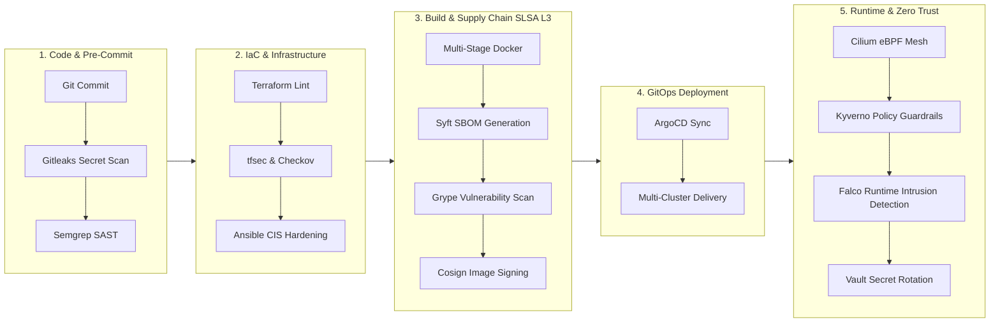

# DEVSECOPS PIPELINE DEEP DIVE — SecureRAG Hub

**Date**: 2026-07-27  
**Lead Architect**: Senior DevSecOps Architect, SRE & Cloud-Native Engineer  
**Project**: SecureRAG Hub — Enterprise RAG & DevSecOps Platform  

---

## 1. Vue d'Ensemble de la Chaîne DevSecOps Enterprise

---

## 2. Zoom Détaillé par Phase DevSecOps

### 🔎 1. Sécurité du Code & Pre-Commit (SAST & Secret Detection)

Cette phase empêche la fuite de secrets et la propagation de faiblesses applicatives dès l'écriture du code source.

- **Gitleaks** :
  - **Rôle** : Scan statique des commits et de l'historique Git à la recherche d'API Keys, jetons JWT, clés privées SSH, mots de passe ou certificats.
  - **Mise en œuvre** : Intégré en pre-commit hook local et dans la première étape du pipeline Jenkins (`Jenkinsfile`).
- **Semgrep (SAST)** :
  - **Rôle** : Static Application Security Testing léger et personnalisable couvrant Python, Go, JavaScript, PHP.
  - **Détection** : Injections SQL, XSS, désérialisation non sécurisée, mauvaises pratiques de gestion de mémoire.
- **SonarQube** :
  - **Rôle** : Qualité du code, couverture de tests, mesure de la dette technique et Quality Gate bloquant en cas de failles critiques.

---

### 🔎 2. Sécurité de l'Infrastructure as Code (IaC & Hardening)

Sécurise la définition de l'infrastructure Cloud (AWS, Azure, GCP) et la configuration des serveurs avant tout provisionnement.

- **Terraform Lint & Validate** :
  - Validation syntaxique et reformatage automatique ([`infra/terraform/`](file:///root/MasterPFE/infra/terraform)).
- **tfsec (Aqua Security)** :
  - Scan ultra-rapide du code Terraform (**73 checks de sécurité validés**).
  - Vérification du chiffrement des disques EBS/S3, de la restriction des groupes de sécurité et de la désactivation des IPs publiques inutiles.
- **Checkov (Bridgecrew)** :
  - Analyse de conformité et règles de gouvernance Cloud (AWS, Azure, GCP) et manifests Kubernetes/Helm (`v3.3.8`).
- **Ansible OS Hardening & CIS Benchmarks** :
  - Application automatique du benchmark CIS (Center for Internet Security) sur les nœuds OS via les rôles Ansible ([`infra/ansible/roles/os-hardening`](file:///root/MasterPFE/infra/ansible/roles/os-hardening/tasks/main.yml)).
  - Hardening du kernel Linux (`sysctl`), sécurisation du démon SSH, fermeture des ports inutiles.

---

### 🔎 3. Build & Supply Chain Security (SLSA Level 3/4)

Garantit l'intégrité de la chaîne d'approvisionnement logicielle, de l'image Docker jusqu'au registre.

- **Multi-Stage Docker Builds** :
  - Utilisation d'images de base minimales (Alpine/Distroless) et exécution sous des utilisateurs **non-root** (`UID 10001`).
- **Syft (Génération de SBOM)** :
  - Génération automatique du **Software Bill of Materials** (liste exhaustive des packages OS et dépendances applicatives) aux formats SPDX et CycloneDX.
- **Grype (Vulnerability Scanner)** :
  - Cross-référencement du SBOM avec les bases de failles CVE à jour (NVD). Interdiction de déployer toute image contenant une faille critique non corrigée.
- **Cosign / Sigstore (Signature d'Image)** :
  - Signature numérique d'images de conteneurs sans gestion complexe de clés (Keyless signing via OIDC) pour garantir l'immuabilité et l'origine de l'image.

---

### 🔎 4. Déploiement GitOps Multi-Clusters (ArgoCD)

Automatise la livraison continue en s'assurant que l'état réel du cluster Kubernetes correspond exactement à l'état désiré dans Git.

- **ArgoCD ApplicationSets** :
  - Orchestration centralisée pour les environnements `dev`, `staging` et `production` ([`applicationset-multi-cluster.yaml`](file:///root/MasterPFE/infra/argocd/applicationsets/applicationset-multi-cluster.yaml)).
- **Self-Healing & Drift Detection** :
  - En cas de modification manuelle non autorisée sur le cluster (drift), ArgoCD réaligne automatiquement le cluster avec le dépôt Git.
- **Rollback Automatique** :
  - Annulation automatique en cas d'échec des Probes de Readiness Kubernetes après déploiement.

---

### 🔎 5. Protection Runtime & Zero Trust Architecture

Assure la protection active des microservices en exécution à l'intérieur du cluster Kubernetes.

- **Cilium eBPF CNI (Réseau & Micro-segmentation)** :
  - Application de la politique **Default-Deny** aux niveaux L3/L4 et L7 ([`default-deny-networkpolicy.yaml`](file:///root/MasterPFE/infra/k8s/policies/cilium/default-deny-networkpolicy.yaml)).
  - Observabilité du trafic réseau en temps réel avec **Hubble**.
- **Kyverno Policy Engine (Guardrails Kubernetes)** :
  - Application stricte du **Pod Security Standard (PSS Restricted)** ([`enterprise-guardrails.yaml`](file:///root/MasterPFE/infra/k8s/policies/kyverno/enforce/enterprise-guardrails.yaml)).
  - Interdiction du mode Privilégié, obligation de système de fichiers racine en lecture seule (`readOnlyRootFilesystem`), restriction des registres Docker autorisés.
- **Falco (Détection d'Intrusions Runtime)** :
  - Surveillance eBPF au niveau du Kernel Linux pour détecter en temps réel :
    - Les tentatives d'évasion de conteneur (*Container Escape*).
    - L'ouverture de shell interactif (`/bin/sh`, `/bin/bash`) dans un Pod de production.
    - La modification de fichiers système sensibles (`/etc/shadow`, `/etc/pam.d`).
- **HashiCorp Vault + External Secrets Operator (ESO)** :
  - Gestion centralisée des secrets avec génération dynamique et rotation automatique des jetons de bases de données et clés API.

---

### 🔎 6. Observabilité, Monitoring & Métriques DORA

Fournit une visibilité complète sur la santé, la sécurité et la performance de la chaîne DevSecOps.

- **Prometheus & AlertManager** :
  - Capture des métriques via **ServiceMonitors** et **PodMonitors** ([`servicemonitors.yaml`](file:///root/MasterPFE/infra/k8s/observability/servicemonitors.yaml)).
  - Alertes critiques préconfigurées pour la latence API, les redémarrages de Pods (CrashLoop), la dégradation d'etcd et les événements de sécurité Falco.
- **Tests de Performance k6** :
  - Passages de portes de performance (SLO) intégrés dans Jenkins.
- **Suivi des Métriques DORA** :
  - Mesure des 4 indicateurs clés : **Deployment Frequency**, **Lead Time for Changes**, **Mean Time to Recovery (MTTR)** et **Change Failure Rate**.

---

## 3. Tableau Récapitulatif des Outils par Phase

| Phase | Outils Clés | Standard & Conformité |
| :--- | :--- | :--- |
| **1. Code** | Gitleaks, Semgrep, SonarQube | OWASP Top 10 |
| **2. IaC** | Terraform, tfsec, Checkov, Ansible | CIS Benchmarks |
| **3. Supply Chain** | Docker Multi-Stage, Syft, Grype, Cosign | **SLSA Level 3/4** |
| **4. GitOps** | ArgoCD ApplicationSets | GitOps Principles |
| **5. Runtime** | Cilium eBPF, Kyverno, Falco, Vault | **Zero Trust Architecture** |
| **6. Observabilité** | Prometheus, Grafana, Loki, k6, DORA | SOC2 Type II & CNCF Landscape |
