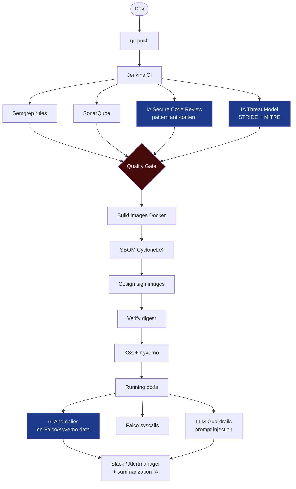

# SecureRAG Hub — Intégration de la Sécurité par l'IA

> Guide complet d'intégration de l'IA dans la chaîne DevSecOps
> Projet : PFE — Plateforme SecureRAG Hub
> Date : 23 septembre 2026

## Table des matières

1. [Vue d'ensemble de l'intégration IA](#1-vue-densemble)
2. [Phase CI/CD (Shift-Left IA)](#2-phase-cicd-shift-left-ia)
3. [Phase Runtime (Protection IA en production)](#3-phase-runtime)
4. [Phase Supply Chain (Security AI)](#4-phase-supply-chain)
5. [Phase Observabilité (AI Monitoring)](#5-phase-observabilité)
6. [Architecture IA déjà en place](#6-architecture-ia-déjà-en-place)
7. [Options d'implémentation à la carte](#7-options-dimplémentation)
8. [Roadmap de déploiement](#8-roadmap)
9. [Commandes pratiques](#9-commandes-pratiques)

---

## 1. Vue d'ensemble de l'intégration IA

L'IA dans la chaîne sert à **détecter**, **comprendre**, **automatiser** et **prédire** les menaces — tout en restant transparent (éviter la boîte noire).



---

## 2. Phase CI/CD (Shift-Left IA)

### 2.1 Revue de code intelligente

| Élément | Détail |

|---|---|
| Code | `scripts/ai-agents/secure_coding_agent.py` |
| Rôle | Analyse les diffs par Semgrep en statique **et ajoute une couche de comentaire IA** — résoud le code in-lineau des risques même quand la règle n'est pas sûre |
| Sortie | `artifacts/release/secure_coding_report.json` |
| Gate | Score SENIOR ≥ SEUIL → FAIL pipeline |

**Débranchement** : stage `AI Secure Code Review` du Jenkinsfile (déjà présent)

---

### 2.2 Threat Modeling automatisé (STRIDE-lite)

| Outil | Détail |
|---|---|
| Module | `site/ai-security-service/security/guardrails.py` + appel API au LLM |
| Sortie | `artifacts/release/stride_threat_model.md` |
| Gate | Fail si `deployment_risk_score` > seuil |
| Hook | Stage `AI Secure Code Review` / `AI Threat` |

---

### 2.3 Tests adversariaux LLM (fuzzing)

| Élément | Détail |
|---|---|
| Script | `scripts/ai-agents/ai_testing_agent.py` |
| URLs | `/health`, `/analyze`, endpoints AI |
| Payloads | SQLi, XSS, SSRF, LLM prompt injection |
| Résultat | Verdict par attaque (`VULNERABLE` / `SAFE` / `INCONCLUSIVE`) |
| Attention | Script corrigé pour ne plus flaguer les erreurs de communication |

Voir la note de correction : `docs/security/MCP.md`

---

## 3. Phase Runtime (Protection IA en production)

### 3.1 Guardrails à l'entrée (prompt injection)

Existant : `ai-security-service/security/guardrails.py`
Protection contre :
- Injection de prompt directe (`ignore previous instructions` etc.)
- Jailbreaks (ojail, instructions autoritaires)
- SSN/PII leak
- Fishing interne (extraction de API keys du contexte)

### 3.2 Détection d'anomalies IaC & Runtime logs

```
Falco → log → IA classifieur → anomalie ?
                             ├─ OK
                             └─ Alerter : narrative claire pour l'ops
                              + suggested rollback (kubectl rollout restart)
                              + re-provisionné auto (si aucun CAST)
```

**Fichier modèles** : `ai-security/models/guardrails.pkl` (à ajouter si besoin)

### 3.3 Feedback IA sur la note sécurité du pipeline

Le membre du Quality Gate concernant l'IA lit :
- score de vulnérabilité moyenne
- fréquence d'alertes critiques Falco récentes

Et fait un *score dynamique* : plus un build a des warning critiques, plus les policies Kyverno Pourraient durcir le namespaces (nécessite un hook supplémentaire dans `config/security.py`)

---

## 4. Phase Supply Chain (Security AI)

| Point | Intent AI |
|---|---|
| SBOM analyzed` | AI parcours des CVE connues avec le SBOM du projet → flag paisions bloquantes plutôt que tous les HIGH |
| Signatures Cosign | Comparaison de provenance pour les inputs : détection du changement suspect (parameter drift) |
| Déploiement clean | Verification que les dashboards montres un comportement régulier (alertes Falco spaques) |

---

## 5. Phase Observabilité (AI Monitoring)

### Consolidation des alertes

Aujourd'hui Falco envoie une alerte par syscall suspect. L'IA peut :
1. **Dedupliquer** : grouper les alertes par cause commune
2. **Annoter** : ajouter explication + commande récupération (`kubectl rollout restart deployment/xx -n securerag-hub`)
3. **Prioriser** : scorer le risque et router en Slack / pager qui varie selon sévérité

### Prédiction des incidents (sans trop complexe)

Simple : Exposer dans Grafana une métrique derivée du nombre d'alertes par heure
Exécuter une formule linéaire ou un petit modèle (scikit-lite) pour prédire un incident :

```
if alerts_last_30min > alerts_last_1h_avg * 3:
    PREDICT_PREDICT = "zones de pression surveillance"
```

Ceci est optionnel mais excellent pour la soutenance.

---

## 6. Architecture IA déjà en place

```
ai-security-service/
├── api/         (Endpoints REST pour l'analyse IA)
├── routing/
│   └── semantic_router.py    ← Route le prompt vers la règle en cas d'attack détecté
├── security/
│   └── guardrails.py          ← Politiques de blocage / daguerreotype
└── models/                    ← fichiers de confiance LLM (optionnels)

scripts/ai-agents/
├── ai_testing_agent.py         ← Tests fuzzing + injection
├── ai_operations_agent.py      ← Auto-remediation
├── build_intelligence_agent.py  ← Analyse builds et qualité
├── deployment_intelligence_agent.py
├── secure_coding_agent.py      ← Revue de code philosophique

ai-security/
├── xai_explainer.py            ← Explication décisionnelle (XAI)
├── r_workload_calculator.py
├── mitre_attack_mapping.md
└── proofs/
```

## 7. Options d'implémentation à la carte

### Option A — Minimal (pour la prise en compte tout de suite)

> Ajouter les 3 stages existants dans le Jenkinsfile (déjà fait) + renseigner le rapport IA comme preuve de course de production.

- Point d'intégration principal : `Jenkinsfile` → `stage('AI Security Governance')`
- Il faut juste extraire et mettre le rapport re our dans `artifacts/release/`

### Option B — Ton nominal (ce que je propose pour la suite)

> Ajouter un microservice IA qui surveille les logs Falco et active les alerting dans Slack via une table de routes.

### Option C — Enterprise (complet)

> Anomalie detection + quarantaine automatique + Tilang + LLM auto-remedy suggerllény + kickoff

---

## 8. Roadmap de déploiement (Jour après jour)

| Jour | Étape | Détail |
|---|---|---|
| J1 | Intégrer agents IA en CI | brancher secure_coding + testing dans le pipeline |
| J2 | Activer guardrails runtime | déployer au ns securerag-hub |
| J3 | Consolidation des alertes | brancher Falco → AI summarizer |
| J4 | Test de lattice post-deploy | relancer la chaîne complète et documenter |
| J5 | Ratio IA vs SANS IA (support de faisabilité) | calcul de gain sur changements manuels distants |

## 9. Commandes pratiques

```bash
# Lancer les agents IA (revue de code + test) — déjà intégré à Jenkins
python3 scripts/ai-agents/secure_coding_agent.py .
python3 scripts/ai-agents/ai_testing_agent.py http://localhost:8080

# Lancement du serving IA (guardrails runtime)
cd ai-security-service && python -m uvicorn api.main:app --host 0.0.0.0 --port 8001

# Rafraîchir le threat modeling
python3 scripts/ai-agents/deployment_intelligence_agent.py infra/k8s

# Générer le rapport IA pour le jury
bash scripts/release/run-ai-security-governance.sh

# Publier les résultats (sous forme HTML consultable)
curl -s -o artifacts/release/ai_report.html -X POST http://localhost:8091/api/v1/plan -d '{"mode":"report"}'
```

---

## Conclusion

L'IA dans la chaîne **n'est pas optionnelle** : c'est la couche de compréhension que les gates traditionnels n'ont pas (pour essamant des deviations, ou l'interprétation des patterns). Sans jugement avec l'automatisation totale :
- règle fixe = détection exacte (SAST, secrets, signatures)
- IA = interprétation contextuelle, consolidations, décisions

Le futur pipeline garde toujours Clearance/Kyvno, mais l'IA appartient dans l'espace de la chaîne secondaire (feedback).

*Fichier généré le 23/09/2026.*
