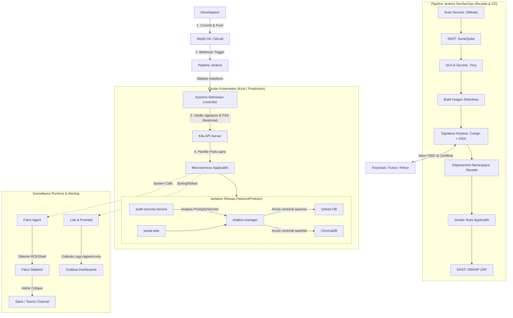

# SecureRAG Hub — Documentation Centrale DevSecOps

Ce document présente l'architecture de sécurité, le pipeline d'intégration/déploiement continus (CI/CD), et les procédures opérationnelles permettant de déployer et contribuer de manière sécurisée au projet **SecureRAG Hub**.

---

## 1. Diagramme d'Architecture Sécurisée

Ce diagramme Mermaid illustre le cycle de vie complet du code, des pipelines CI/CD DevSecOps, des mécanismes d'admission dans le cluster Kubernetes, ainsi que la surveillance en cours d'exécution (runtime).



---

## 2. Quick Start : Lancement Local de la Stack Complète

Suivez ces instructions pour instancier localement le cluster Kind et déployer l'intégralité de la stack d'infrastructure et de sécurité de SecureRAG Hub.

### Prérequis
- Linux (Ubuntu 22.04+ recommandé)
- Docker Engine installé et configuré sans root (`sudo-less`)
- Outils CLI installés : `kubectl`, `kind`, `helm`, `cosign`, `sops`

### Étape 1 : Initialisation du Cluster Kind
Créer le cluster à l'aide de la configuration Kind fournie (incluant le mapping des ports ingress et l'activation des configurations avancées) :
```bash
kind create cluster --config infra/kind/kind-config.yaml --name securerag-cluster
```

### Étape 2 : Déploiement de la Stack d'Infrastructure Commune
Lancer le script de déploiement tout-en-un qui configure les namespaces, installe Kyverno (en mode Audit initial), Argo CD, Jenkins, Keycloak, et HashiCorp Vault :
```bash
./install_securerag_hub_all_in_one.sh
```

### Étape 3 : Configuration locale du DNS
Pour accéder aux différentes interfaces du cluster localement, ajoutez ces entrées dans votre fichier `/etc/hosts` :
```text
127.0.0.1 staging.portal.securerag.local
127.0.0.1 keycloak.securerag.local
127.0.0.1 rekor.securerag.local
127.0.0.1 vault.securerag.local
127.0.0.1 jenkins.securerag.local
```

### Étape 4 : Lancement des Microservices SecureRAG Hub
Une fois les composants de sécurité et d'admission en ligne, déployez l'application principale :
```bash
./securerag-launch-all.sh --env staging
```
Vérifiez que toutes les NetworkPolicies sont appliquées et que les pods démarrent correctement :
```bash
kubectl get pods -n securerag-hub
kubectl get networkpolicy -n securerag-hub
```

---

## 3. Guide de Contribution Sécurisée

Pour maintenir le niveau de conformité **SLSA 3** et **PSS Restricted**, chaque contributeur doit respecter les consignes suivantes :

### A. Pre-commit Hooks Obligatoires
Avant de soumettre un commit, vous devez installer et activer les contrôles locaux pour éviter les régressions de style ou la fuite de clés :
1. Installer pre-commit : `pip install pre-commit`
2. Activer les hooks sur le dépôt : `pre-commit install`
*Les hooks configurés incluent Gitleaks pour bloquer les commits contenant des secrets en clair et des validateurs de syntaxe YAML/JSON.*

### B. Gestion des Branches et Pull Requests
- Aucun push direct sur la branche `main` ou `develop`.
- Les modifications doivent s'effectuer sur une branche de feature (`feature/nom-feature`) ou de correctif (`hotfix/nom-cve`).
- Chaque PR doit être validée par les vérifications de la CI (SAST, SCA, compilation) avant d'être éligible à la revue de code par un pair.

### C. Signature des Commits
Tous les commits Git doivent être signés avec votre clé GPG personnelle configurée sur GitHub/GitLab :
```bash
git commit -S -m "feat: ajout de la politique de validation des schemas"
```

---

## 4. Tableau des Outils et Versions de Référence

Afin de garantir la reproductibilité des builds et éviter les failles logicielles, les outils utilisés sur la plateforme SecureRAG Hub sont figés sur les versions de référence suivantes :

| Catégorie | Outil / Composant | Version de Référence | Description / Rôle |
| :--- | :--- | :--- | :--- |
| **Pipeline & CI/CD** | Jenkins | `v2.440.1 LTS` | Moteur d'exécution des pipelines CI/CD |
| **Orchestration** | Kubernetes (Kind) | `v1.29.2` | Moteur de conteneurs de développement et de prod |
| **GitOps** | Argo CD | `v2.10.4` | Gestionnaire de déploiement continu déclaratif |
| **Admission Control** | Kyverno | `v1.11.4` | Moteur d'enforcement des politiques de sécurité |
| **Signature** | Sigstore Cosign | `v2.2.3` | Signature cryptographique d'images et attestations |
| **Gestion Secrets** | HashiCorp Vault | `v1.15.5` | Centralisation et rotation dynamique des secrets |
| **Identity Provider** | Keycloak | `v23.0.7` | Fournisseur OIDC pour l'authentification keyless |
| **Scanners CI** | Trivy | `v0.49.1` | Scanner de vulnérabilités d'images et de packages (SCA) |
| **Scanners CI** | Gitleaks | `v8.18.2` | Détection de fuites de secrets dans l'historique Git |
| **SAST** | SonarQube | `v10.4.1` | Analyse statique de la qualité et sécurité du code |
| **DAST** | OWASP ZAP | `v2.14.0` | Tests dynamiques de sécurité applicative et API |
| **Runtime Security** | Falco | `v0.37.0` | Détecteur d'intrusions système et d'anomalies syscalls |
| **Bases de Données** | Qdrant | `v1.7.4` | Base de données vectorielle principale (RAG) |
| **Bases de Données** | ChromaDB | `v0.4.22` | Base vectorielle secondaire / d'audit |
| **Bases de Données** | PostgreSQL | `v16.1` | Stockage relationnel des conversations et de l'auth |
