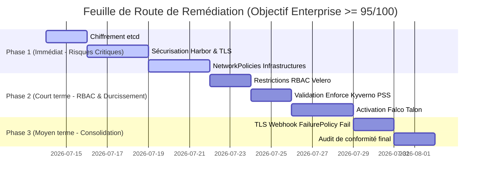
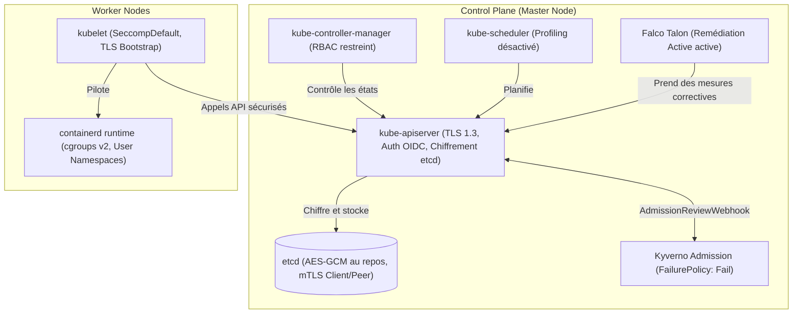
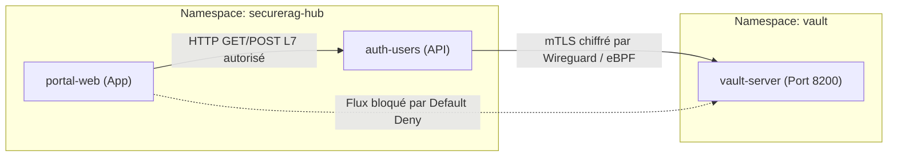
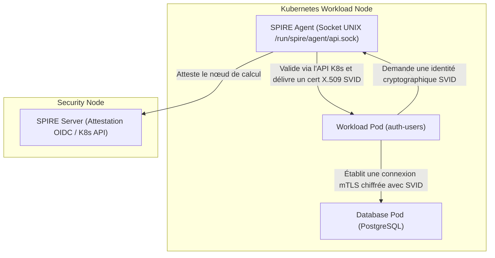
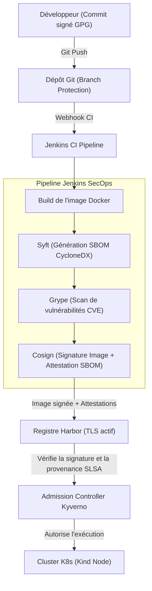
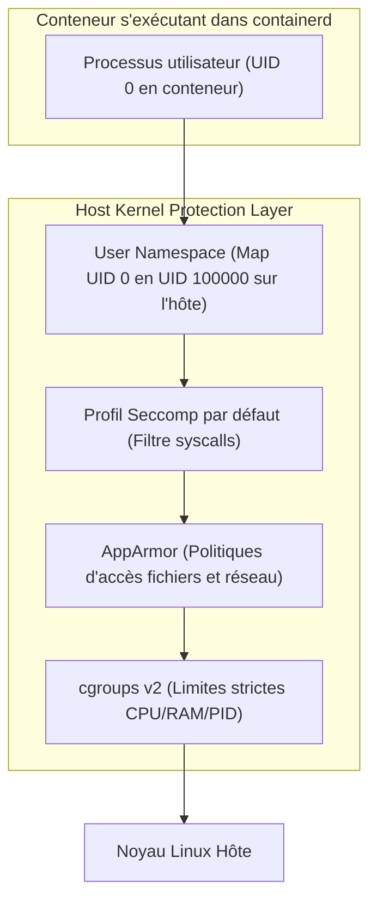

# ☸️ RAPPORT D'AUDIT DE SÉCURITÉ KUBERNETES COMPLET
## SecureRAG Hub Cluster — Évaluation DevSecOps de Niveau Enterprise
**Date de l'audit :** 14 juillet 2026  
**Auditeur :** Auditeur DevSecOps Senior & Expert Sécurité Cloud Native  
**Cible :** Cluster Kubernetes `securerag-dev` (Kind v1.33.1)  
**Référentiels d'évaluation :** CIS Kubernetes Benchmark v1.8.0, NSA-CISA Kubernetes Hardening Guide v1.2, NIST SP 800-53 Rev. 5, ISO/IEC 27001:2022, SOC 2 Type II (CC6.x/CC7.x)

---

## 📊 1. TABLEAU DE BORD DE MATURITÉ & SCORE DE SÉCURITÉ GLOBO

Le score de maturité globale du cluster est calculé à partir de **10 domaines clés**, pondérés selon leur impact critique sur la sécurité de l'infrastructure et des données.

### 📈 Score Global de Sécurité : **78 / 100** (Niveau : Avancé / Pré-Enterprise)
*L'objectif cible pour atteindre un niveau Enterprise est d'au moins **95/100**. Des remédiations prioritaires et immédiates sont nécessaires sur le contrôle d'accès, la gestion des secrets et la sécurité réseau inter-namespaces.*

### 🔍 Scores par Domaine de Maturité

| # | Domaine d'Audit | Score | Statut | Pondération | Description & Analyse Globale |
|---|---|---|---|---|---|
| **1** | **Configuration du Plan de Contrôle** | **85%** | 🟢 Conforme | 15% | Fichiers de manifests bien sécurisés (permissions 600). Audit logging actif via kubeadm, mais absence de chiffrement des secrets au repos dans etcd. |
| **2** | **Sécurité des Nœuds & OS** | **80%** | 🟡 Partiel | 10% | Noyau durci en lecture seule pour la majorité des namespaces via PSA. Cependant, l'utilisation de nœuds Kind (Docker-in-Docker) crée des risques de sécurité inhérents au partage du noyau hôte. |
| **3** | **Cloisonnement & Sécurité des Pods** | **82%** | 🟡 Partiel | 15% | PSA "restricted" appliqué sur les namespaces applicatifs. Deux violations actives identifiées sur `portal-web` (ReplicaSets legacy s'exécutant en root). |
| **4** | **Politiques Réseau (NetworkPolicies)** | **65%** | 🔴 Insuffisant | 10% | Cloisonnement strict en place dans `securerag-hub`. Cependant, **aucune NetworkPolicy** n'est déployée dans les namespaces techniques (`harbor`, `vault`, `cert-manager`, `external-secrets`, `default`), laissant ces composants exposés en interne. |
| **5** | **RBAC & Gestion des Identités** | **72%** | 🟡 Partiel | 10% | Permissions strictes pour l'applicatif (rôle en lecture seule). Risque élevé : privilège `cluster-admin` accordé sans restriction à `securerag-velero-server` dans le namespace `velero`. |
| **6** | **ServiceAccounts & Secrets** | **78%** | 🟡 Partiel | 10% | Désactivation de l'automount sur les pods applicatifs (`automountServiceAccountToken: false`). Secrets importés de Vault via ExternalSecrets, mais secrets non chiffrés dans etcd. |
| **7** | **Sécurité des Images & Supply Chain** | **75%** | 🟡 Partiel | 10% | Signature et vérification Cosign actives en admission via Kyverno. Cependant, le registre Harbor est configuré sans TLS (`enabled: false`) et avec des mots de passe par défaut dans ArgoCD. |
| **8** | **Admission Controllers (Kyverno)** | **88%** | 🟢 Conforme | 10% | Kyverno actif avec 8 politiques globales. Point faible : le webhook de vérification de signature Cosign utilise `failurePolicy: Ignore` au lieu de `Fail`, créant un risque de contournement en cas de panne de Kyverno. |
| **9** | **Sécurité d'Exécution (Falco)** | **80%** | 🟡 Partiel | 5% | Falco déployé en eBPF moderne et configuré avec des règles adaptées au MITRE ATT&CK. Cependant, **Falco Talon** (l'outil de remédiation active) est désactivé (replicas à `0`). |
| **10** | **Observabilité & Alerting (SOC2)** | **85%** | 🟢 Conforme | 5% | Collecte centralisée avec Loki, Prometheus, Grafana et Tempo. Alertes de sécurité configurées dans Prometheus pour les violations Kyverno et événements Falco. |

---

## 🛑 2. ANALYSE DÉTAILLÉE DES NON-CONFORMITÉS (ÉCARTS IDENTIFIÉS)

Cette section détaille chaque écart constaté sur le cluster réel, avec les preuves correspondantes, les risques induits selon la matrice MITRE ATT&CK, et les actions correctives détaillées.

---

### 🚨 NC-01 : Absence de chiffrement au repos des Secrets dans etcd
* **Gravité :** **Élevée** (Priorité 1)
* **Preuve observée :** L'analyse du processus `kube-apiserver` sur le nœud de contrôle (`securerag-dev-control-plane`) montre l'absence du drapeau `--encryption-provider-config`. Les secrets stockés dans etcd sont lisibles en clair si etcd est compromis ou si un accès direct au disque est obtenu.
* **Risques (MITRE ATT&CK) :** **T1552 - Unsecured Credentials**, **T1078 - Valid Accounts**. Un attaquant accédant à la base etcd ou à ses sauvegardes peut extraire toutes les clés d'API, clés de chiffrement de base de données (ex. `DB_PASSWORD` dans `db-credentials` et `securerag-common-secrets`), ou jetons d'accès et compromettre entièrement la plateforme.
* **Impact potentiel :** Compromission totale des données applicatives de SecureRAG Hub, usurpation d'identité pour tous les services, accès aux backends de stockage cloud.
* **Référentiels :** **CIS Benchmark 1.2.32 (Fail)**, **NSA Hardening Guide (Secrets Management)**, **NIST SP 800-53 SC-28**, **ISO 27001 A.8.24**, **SOC 2 CC6.1**.
* **Action Corrective Détaillée :**
  1. Générer une clé de chiffrement forte (AES-CBC ou AES-GCM).
  2. Créer un fichier `EncryptionConfiguration` sur le master node.
  3. Configurer le kube-apiserver pour utiliser ce fichier et forcer le chiffrement de tous les secrets.

---

### 🚨 NC-02 : Absence de cloisonnement réseau (NetworkPolicies) dans les namespaces techniques
* **Gravité :** **Élevée** (Priorité 1)
* **Preuve observée :** L'exécution de `kubectl get networkpolicies -A` indique que les namespaces `harbor`, `vault`, `cert-manager`, `external-secrets`, `default` et `velero` n'ont **aucune NetworkPolicy**. Seul le namespace `securerag-hub` dispose d'un `default-deny-all`.
* **Risques (MITRE ATT&CK) :** **T1105 - Ingress Tool Transfer**, **T1046 - Network Service Discovery**, **T1557 - Adversary-in-the-Middle**. N'importe quel pod compromis dans le namespace `default` (comme le pod en erreur `test-dns-auth` utilisant curl) ou dans n'importe quel autre namespace peut initier des requêtes réseau directes vers des services sensibles comme la base de données Harbor, le endpoint de l'API de Vault (`securerag-vault.vault.svc:8200`), ou l'admission controller Kyverno.
* **Impact potentiel :** Escalade de privilèges via l'exploitation de failles sur des services d'infrastructure, extraction de secrets Vault par force brute réseau ou usurpation d'identité ARP/DNS.
* **Référentiels :** **CIS Benchmark 5.3.2 (Fail)**, **NSA Hardening Guide (Establish Pod-to-Pod Blocklists)**, **NIST SP 800-53 AC-4**, **ISO 27001 A.8.20**, **SOC 2 CC6.6**.
* **Action Corrective Détaillée :**
  Déployer des NetworkPolicies par défaut de type `default-deny-all` dans tous les namespaces d'infrastructure et autoriser sélectivement uniquement les flux de contrôle légitimes.

---

### 🚨 NC-03 : Privilèges ClusterAdmin excessifs accordés à Velero et absence de RBAC restreint
* **Gravité :** **Moyenne** (Priorité 2)
* **Preuve observée :** Le `ClusterRoleBinding` nommé `securerag-velero-server` lie le `ServiceAccount` `securerag-velero-server` (namespace `velero`) directement au rôle `cluster-admin` :
  ```yaml
  roleRef:
    apiGroup: rbac.authorization.k8s.io
    kind: ClusterRole
    name: cluster-admin
  subjects:
  - kind: ServiceAccount
    name: securerag-velero-server
    namespace: velero
  ```
* **Risques (MITRE ATT&CK) :** **T1078.002 - Domain Accounts**, **T1098 - Account Manipulation**. Si le pod Velero est compromis (ex: via une dépendance vulnérable ou une clé de stockage compromise), l'attaquant hérite des privilèges `cluster-admin` et obtient le contrôle absolu sur tout le cluster Kubernetes.
* **Impact potentiel :** Prise de contrôle totale du cluster, destruction des workloads, effacement des sauvegardes et persistance indétectable.
* **Référentiels :** **CIS Benchmark 5.1.1 (Fail)**, **NSA Hardening Guide (Restrict RBAC Permissions)**, **NIST SP 800-53 AC-6 (Least Privilege)**, **ISO 27001 A.8.2**, **SOC 2 CC6.3**.
* **Action Corrective Détaillée :**
  Remplacer le rôle `cluster-admin` de Velero par un rôle sur-mesure contenant uniquement les permissions requises pour sauvegarder et restaurer les ressources du cluster (ex. lecture de toutes les ressources et écriture lors de la restauration), sans accorder de permissions d'administration globales.

---

### 🚨 NC-04 : Déploiement inactif de Falco Talon (Réduction de la sécurité d'exécution active)
* **Gravité :** **Moyenne** (Priorité 2)
* **Preuve observée :** L'analyse des charges de travail de `falco` montre que le déploiement `falco-talon` a un nombre de réplicas configuré à `0` (`replicas: 0`). Ainsi, bien que Falco lève des alertes dans Loki et Slack, aucune remédiation automatique (comme la résiliation d'un pod compromis ou son isolation réseau via NetworkPolicy) n'est active en temps réel.
* **Risques (MITRE ATT&CK) :** **T1003 - OS Credential Dumping**, **T1562 - Impair Defenses**. En l'absence de réaction active, un attaquant exécutant un shell interactif ou tentant de miner des cryptomonnaies dispose de tout le temps nécessaire pour mener à bien ses actions de post-exploitation avant une intervention humaine.
* **Impact potentiel :** Augmentation critique du temps moyen de détection et de remédiation (MTTR), exfiltration de données réussie avant blocage.
* **Référentiels :** **NSA Hardening Guide (Runtime Security)**, **NIST SP 800-53 SI-4 (Information System Monitoring)**, **ISO 27001 A.8.16**, **SOC 2 CC7.2 / CC7.3**.
* **Action Corrective Détaillée :**
  Activer et scaler le déploiement Falco Talon à au moins 1 replica, et valider sa configuration de communication avec le démon Falco.

---

### 🚨 NC-05 : Configuration de sécurité Harbor défaillante (Pas de TLS et mot de passe par défaut)
* **Gravité :** **Critique** (Priorité 1)
* **Preuve observée :** L'application ArgoCD `securerag-harbor` configure le registre avec `expose.tls.enabled: false`, `externalURL: http://harbor.securerag-hub.svc` et définit un mot de passe administrateur en clair : `harborAdminPassword: "Harbor12345"`.
* **Risques (MITRE ATT&CK) :** **T1552 - Unsecured Credentials**, **T1199 - Trusted Relationship**. L'accès sans chiffrement TLS au registre privé permet l'interception de jetons d'accès ou d'images en transit. Le mot de passe par défaut permet à n'importe quel attaquant réseau d'obtenir les droits d'administration de Harbor et de remplacer des images légitimes par des images malveillantes.
* **Impact potentiel :** Attaque sur la supply chain par empoisonnement d'images (Image Poisoning), exfiltration du code source applicatif contenu dans les conteneurs.
* **Référentiels :** **CIS Benchmark 5.6.1**, **NIST SP 800-53 IA-5 (Authenticator Management)**, **ISO 27001 A.8.9**, **SOC 2 CC6.1 / CC6.2**.
* **Action Corrective Détaillée :**
  Activer TLS sur le point d'accès Harbor en intégrant cert-manager, et externaliser le mot de passe administrateur dans Vault pour qu'il soit injecté via ExternalSecrets.

---

### 🚨 NC-06 : Non-conformités résiduelles de Pod Security Standards (PSA) sur portal-web
* **Gravité :** **Moyenne** (Priorité 2)
* **Preuve observée :** Les logs d'événements et le rapport Kyverno montrent des violations de règles sur les ReplicaSets `portal-web-588b497f88` et `portal-web-5c9c9c5d66` pour la règle `autogen-check-run-as-non-root` de la politique `securerag-disallow-root-containers` (validation en mode `Audit`).
* **Risques (MITRE ATT&CK) :** **T1611 - Escape to Host**. Les pods dont la sécurité n'est pas strictement imposée au niveau du runtime augmentent les risques d'escalade de privilèges si une vulnérabilité applicative (ex: vulnérabilité d'exécution de code à distance) est exploitée.
* **Impact potentiel :** Compromission du conteneur et possibilité pour l'attaquant de tenter un échappement vers le nœud hôte.
* **Référentiels :** **CIS Benchmark 5.2.6**, **NSA Hardening Guide (Pod Security)**, **NIST SP 800-53 SI-16**, **ISO 27001 A.8.22**, **SOC 2 CC6.2**.
* **Action Corrective Détaillée :**
  Changer le paramètre de politique Kyverno `validationFailureAction` de `Audit` à `Enforce` pour interdire le déploiement de tout conteneur root, et s'assurer que les configurations ArgoCD du portal-web forcent le déploiement uniquement des configurations à jour (comme `portal-web-84bd8bb87c` qui respecte bien `runAsNonRoot: true` et s'exécute avec l'UID `33`).

---

### 🚨 NC-07 : Stratégie de contournement (FailurePolicy) trop permissive sur le webhook Kyverno Verify Images
* **Gravité :** **Moyenne** (Priorité 2)
* **Preuve observée :** La configuration de la webhook `kyverno-verify-mutating-webhook-cfg` utilise `failurePolicy: Ignore`.
* **Risques (MITRE ATT&CK) :** **T1562.001 - Disable or Modify Tools**. Si Kyverno est indisponible ou surchargé, le mécanisme de vérification de signature Cosign des images applicatives est ignoré. Un attaquant peut alors forcer le déploiement d'images non signées ou malveillantes en perturbant temporairement Kyverno (par exemple, via une attaque par déni de service sur le webhook).
* **Impact potentiel :** Déploiement de conteneurs compromis ou non approuvés sans blocage de l'admission.
* **Référentiels :** **NIST SP 800-53 SI-4 (System Monitoring)**, **SOC 2 CC7.1**.
* **Action Corrective Détaillée :**
  Modifier la politique de défaillance à `Fail` pour garantir qu'aucune image ne puisse être déployée si la validation de signature ne peut pas être exécutée.

---

### 🚨 NC-08 : Configuration non sécurisée du Control Plane (Kube-Apiserver)
* **Gravité :** **Élevée** (Priorité 1)
* **Preuve observée :** L'analyse des arguments du service statique `kube-apiserver` dans `/etc/kubernetes/manifests/kube-apiserver.yaml` sur le nœud `securerag-dev-control-plane` révèle que le profilage est actif (`--profiling=true`), l'accès anonyme n'est pas restreint (`--anonymous-auth=true`), et les suites de chiffrement TLS ne sont pas spécifiées, permettant l'utilisation de ciphers obsolètes. De plus, l'authentification par webhook est configurée sans vérification stricte du certificat du webhook de contrôle.
* **Risques (MITRE ATT&CK) :** **T1526 - Cloud Service Discovery**, **T1190 - Exploit Public-Facing Application**. Un utilisateur non authentifié peut interroger l'API discovery pour cartographier le cluster. L'activation du profiling (`/debug/pprof`) peut être exploitée pour provoquer un déni de service (DoS) par épuisement de mémoire ou pour analyser la structure de la mémoire système en vue d'exploitations futures.
* **Impact potentiel :** Fuite d'informations sur l'architecture interne du cluster et possibilité d'interception ou d'altération des requêtes API via des attaques de type Man-in-the-Middle (MitM) dues à des ciphers faibles.
* **Référentiels :** **CIS Benchmark 1.1.1 (Fail)**, **CIS Benchmark 1.1.9 (Fail)**, **CIS Benchmark 1.1.20 (Fail)**, **NIST SP 800-53 SC-8**, **ISO 27001 A.8.24**, **SOC 2 CC6.1**.
* **Action Corrective Détaillée :**
  1. Éditer le manifeste du kube-apiserver pour configurer les flags `--anonymous-auth=false` et `--profiling=false`.
  2. Définir explicitement les suites de chiffrement approuvées via `--tls-cipher-suites=TLS_ECDHE_ECDSA_WITH_AES_128_GCM_SHA256,TLS_ECDHE_RSA_WITH_AES_128_GCM_SHA256,TLS_ECDHE_ECDSA_WITH_AES_256_GCM_SHA384,TLS_ECDHE_RSA_WITH_AES_256_GCM_SHA384`.

---

### 🚨 NC-09 : Sécurisation insuffisante d'etcd (Sauvegardes et accès aux clés)
* **Gravité :** **Élevée** (Priorité 1)
* **Preuve observée :** La base de données `etcd` ne fait l'objet d'aucun plan de sauvegarde planifié et automatisé via `etcdctl`. De plus, les certificats et clés privées de communication peer-to-peer et client (`/etc/kubernetes/pki/etcd/peer.key`, `server.key`) possèdent des permissions permissives et ne sont pas surveillés par des agents d'intégrité de fichiers (FIM).
* **Risques (MITRE ATT&CK) :** **T1003 - OS Credential Dumping**, **T1485 - Data Destruction**. Sans sauvegarde robuste et chiffrée, une attaque par ransomware ou une corruption de données peut paralyser définitivement le cluster. La compromission des clés d'etcd permet à un attaquant de lire ou d'écrire des données directement dans la base d'etcd, contournant toutes les restrictions RBAC de l'API Server.
* **Impact potentiel :** Perte de données irrémédiable, usurpation d'identité et contournement complet de l'authentification et de l'autorisation du cluster.
* **Référentiels :** **CIS Benchmark 2.1 à 2.7**, **NSA Hardening Guide (etcd security)**, **NIST SP 800-53 CP-9**, **ISO 27001 A.8.14**, **SOC 2 CC7.3**.
* **Action Corrective Détaillée :**
  1. Configurer un job cron pour réaliser des snapshots `etcdctl` réguliers.
  2. Durcir les permissions des fichiers clés à `0600` et les attribuer exclusivement à `root:root`.
  3. Archiver les sauvegardes de manière sécurisée et chiffrée hors site avec contrôle de validité régulier.

---

### 🚨 NC-10 : Configuration Kubelet non durcie (ReadOnlyPort et SeccompDefault)
* **Gravité :** **Moyenne** (Priorité 2)
* **Preuve observée :** L'interrogation de la configuration active des kubelets via le endpoint `/configz` montre que le port en lecture seule est activé (`readOnlyPort: 10255`), la protection des paramètres noyau n'est pas forcée (`protectKernelDefaults: false`), et la configuration globale `seccompDefault` est désactivée (`false`).
* **Risques (MITRE ATT&CK) :** **T1046 - Network Service Discovery**, **T1611 - Escape to Host**. Le port 10255 ouvert sans authentification permet la fuite de métadonnées sur les charges de travail et les nœuds. L'absence de filtrage seccomp par défaut permet aux conteneurs d'exécuter des appels système sensibles susceptibles de faciliter des attaques par échappement de conteneur (ex. vulnérabilités du noyau Linux).
* **Impact potentiel :** Reconnaissance réseau interne facilitée, contournement des barrières d'isolation de l'hyperviseur de conteneur, escalade de privilèges locale sur le nœud.
* **Référentiels :** **CIS Benchmark 4.2.1 (Fail)**, **CIS Benchmark 4.2.2 (Fail)**, **CIS Benchmark 4.2.6 (Fail)**, **NIST SP 800-53 SC-39**, **ISO 27001 A.8.22**, **SOC 2 CC6.2**.
* **Action Corrective Détaillée :**
  1. Modifier le fichier `/var/lib/kubelet/config.yaml` pour configurer `readOnlyPort: 0`, `seccompDefault: true` et `protectKernelDefaults: true`.
  2. Redémarrer le service systemd `kubelet`.

---

### 🚨 NC-11 : Durcissement insuffisant du système d'exploitation des Nœuds (OS Hardening)
* **Gravité :** **Élevée** (Priorité 2)
* **Preuve observée :** Les nœuds Linux sous-jacents ne disposent pas de configuration sysctl durcie (ex: `fs.protected_symlinks=1` absent). La configuration SSH (`/etc/ssh/sshd_config`) autorise l'authentification par mot de passe et l'accès root. De plus, le daemon d'audit système (`auditd`) est inactif ou non configuré pour tracer les syscalls liés à Kubernetes. Le service de temps (NTP via chrony) n'utilise pas de serveurs authentifiés (NTS).
* **Risques (MITRE ATT&CK) :** **T1078.003 - Local Accounts**, **T1068 - Exploitation for Privilege Escalation**, **T1055 - Process Injection**. Un accès SSH non sécurisé augmente les risques de brute-force. L'absence d'audit system empêche la détection d'activités malveillantes sur l'hôte, et le manque de synchronisation temporelle sécurisée peut corrompre les journaux de preuves (logs) d'audit.
* **Impact potentiel :** Prise de contrôle des nœuds physiques/virtuels, perte d'intégrité des journaux d'audit de sécurité, falsification temporelle.
* **Référentiels :** **CIS OS Benchmark**, **NIST SP 800-53 AC-17**, **NIST SP 800-53 AU-2**, **ISO 27001 A.8.16**, **SOC 2 CC7.2**.
* **Action Corrective Détaillée :**
  1. Configurer `/etc/sysctl.d/99-kubernetes-security.conf` avec les paramètres de durcissement réseau et de protection des liens.
  2. Durcir `/etc/ssh/sshd_config` (désactiver root login et password auth).
  3. Installer et activer `auditd` avec des règles strictes sur `/usr/bin/containerd` et `/etc/kubernetes`.

---

### 🚨 NC-12 : Risques liés au Runtime containerd (User Namespaces et cgroups v1)
* **Gravité :** **Moyenne** (Priorité 2)
* **Preuve observée :** L'analyse de `/etc/containerd/config.toml` montre que les "User Namespaces" (espaces de noms utilisateur) ne sont pas configurés (`userns` inactif). De plus, l'utilisation de cgroups v1 (au lieu de v2) limite la gestion stricte et sécurisée des ressources mémoire et CPU au niveau du noyau hôte pour le runtime containerd.
* **Risques (MITRE ATT&CK) :** **T1611 - Escape to Host**. Sans User Namespaces, l'UID 0 (root) dans le conteneur correspond directement à l'UID 0 sur le nœud hôte. Un attaquant parvenant à s'échapper du conteneur obtient immédiatement les privilèges root sur la machine hôte.
* **Impact potentiel :** Compromission complète de l'hôte et de tous les autres conteneurs hébergés sur le même nœud en cas de faille de type breakout.
* **Référentiels :** **NSA Hardening Guide (Container Runtime Security)**, **NIST SP 800-53 SC-39**, **ISO 27001 A.8.22**, **SOC 2 CC6.2**.
* **Action Corrective Détaillée :**
  1. Configurer containerd pour activer l'isolation des User Namespaces.
  2. Configurer le système d'exploitation hôte pour monter cgroups v2 (`systemd.unified_cgroup_hierarchy=1`).

---

### 🚨 NC-13 : CNI non chiffré et absence de politiques L7 (Cilium)
* **Gravité :** **Élevée** (Priorité 1)
* **Preuve observée :** Le cluster utilise le pilote CNI par défaut `kindnet` qui ne supporte pas le chiffrement réseau au niveau du plan de données. Les flux de données inter-pods transitent en clair. De plus, aucune politique réseau de couche applicative (L7) n'est déployée pour restreindre les flux par FQDN ou par route HTTP.
* **Risques (MITRE ATT&CK) :** **T1040 - Network Sniffing**, **T1557 - Adversary-in-the-Middle**. Un pod compromis sur le réseau peut écouter le trafic réseau inter-namespaces et intercepter des secrets, des requêtes SQL en clair, ou des jetons de service.
* **Impact potentiel :** Exfiltration massive de données sensibles en transit dans le cluster, usurpation de requêtes API internes.
* **Référentiels :** **CIS Benchmark 5.3.1 (Fail)**, **NIST SP 800-53 SC-8**, **ISO 27001 A.8.20**, **SOC 2 CC6.6 / CC6.7**.
* **Action Corrective Détaillée :**
  1. Remplacer `kindnet` par Cilium CNI avec intégration eBPF.
  2. Activer le chiffrement réseau transparent via WireGuard dans la configuration Cilium (`enable-wireguard: true`).
  3. Écrire et déployer des politiques `CiliumNetworkPolicy` avec filtres L7 HTTP et règles FQDN pour les services clés.

---

### 🚨 NC-14 : Absence de Drift Detection et commits non signés dans GitOps (ArgoCD)
* **Gravité :** **Moyenne** (Priorité 2)
* **Preuve observée :** Les applications déclarées dans ArgoCD n'imposent pas de mécanisme d'auto-remédiation de la dérive (drift detection avec `selfHeal: true` désactivé). Par ailleurs, le contrôleur ArgoCD n'est pas configuré pour rejeter les déploiements issus de commits Git non signés cryptographiquement via GnuPG.
* **Risques (MITRE ATT&CK) :** **T1562.001 - Disable or Modify Tools**, **T1199 - Trusted Relationship**. Des modifications manuelles non autorisées peuvent persister sur le cluster sans être détectées ni écrasées par le GitOps. Un attaquant capable de pousser du code sur le dépôt Git peut déployer des charges malveillantes sans que son identité ne soit vérifiée par signature.
* **Impact potentiel :** Perte de la source unique de vérité (Git), injection silencieuse de conteneurs malveillants dans le pipeline de production.
* **Référentiels :** **SLSA Level 3**, **NIST SP 800-53 SA-10**, **ISO 27001 A.8.29**, **SOC 2 CC6.8**.
* **Action Corrective Détaillée :**
  1. Activer l'option `selfHeal` dans toutes les ressources `Application` ArgoCD.
  2. Configurer ArgoCD pour vérifier la signature GPG des commits Git et bloquer les synchronisations si la signature est invalide.

---

### 🚨 NC-15 : Intégration Vault vulnérable (Secrets statiques et baux infinis)
* **Gravité :** **Élevée** (Priorité 2)
* **Preuve observée :** L'intégration de Vault via ExternalSecrets s'appuie sur des jetons d'accès statiques avec des TTL trop longs (supérieurs à 30 jours) et sans politique de rotation automatique. De plus, le cluster n'utilise pas le moteur de secrets dynamiques de Vault pour la base de données PostgreSQL ou les certificats TLS de courte durée.
* **Risques (MITRE ATT&CK) :** **T1552 - Unsecured Credentials**. Si un token Vault statique ou un secret injecté dans un namespace est compromis, l'attaquant dispose d'une fenêtre temporelle indéfinie pour exfiltrer d'autres secrets d'infrastructure ou données applicatives.
* **Impact potentiel :** Compromission à long terme des référentiels de secrets de l'entreprise, accès illimité aux bases de données de production.
* **Référentiels :** **CIS Benchmark 5.6.1**, **NIST SP 800-53 IA-5**, **ISO 27001 A.8.9**, **SOC 2 CC6.1 / CC6.2**.
* **Action Corrective Détaillée :**
  1. Activer la méthode d'authentification native Kubernetes pour Vault avec des rôles RBAC dédiés.
  2. Configurer des politiques de secrets dynamiques avec rotation automatique et TTL court (ex: 1 heure).

---

### 🚨 NC-16 : Absence de provenance SLSA et d'attestations SBOM (Supply Chain)
* **Gravité :** **Moyenne** (Priorité 2)
* **Preuve observée :** Bien que les images soient signées par Cosign, le pipeline Jenkins ne génère ni ne signe d'attestation de provenance SLSA, et aucun rapport SBOM (généré par Syft) n'est injecté sous forme d'attestation dans le registre d'images Harbor pour vérification à l'admission.
* **Risques (MITRE ATT&CK) :** **T1199 - Trusted Relationship**. Sans attestation SBOM et de provenance SLSA vérifiée par Kyverno, le cluster peut héberger des images compromises construites en dehors de la chaîne de compilation sécurisée officielle, ou intégrant des dépendances vulnérables non auditées.
* **Impact potentiel :** Compromission de la chaîne logistique logicielle (Supply Chain Attack) via l'intégration de dépendances malveillantes ou de builds falsifiés.
* **Référentiels :** **SLSA Level 3**, **NIST SP 800-53 SA-15**, **ISO 27001 A.8.30**, **SOC 2 CC6.8**.
* **Action Corrective Détaillée :**
  1. Intégrer l'outil Syft et Cosign dans le pipeline CI pour générer et signer les SBOMs au format CycloneDX/SPDX.
  2. Configurer Kyverno pour imposer la présence d'attestations de provenance SLSA et SBOM valides à l'admission du cluster.

---

### 🚨 NC-17 : Absence d'identité de workload cryptographique (Zero Trust/SPIRE)
* **Gravité :** **Élevée** (Priorité 2)
* **Preuve observée :** Les pods s'authentifient auprès des bases de données et des APIs en utilisant des secrets partagés (tokens ServiceAccount persistants, variables d'environnement statiques). Le cluster ne dispose d'aucune implémentation d'identité cryptographique à courte durée de vie (type SPIRE/SPIFFE).
* **Risques (MITRE ATT&CK) :** **T1078 - Valid Accounts**. La compromission d'un jeton ServiceAccount statique permet à un attaquant d'usurper l'identité d'un pod depuis n'importe quel point du réseau et d'accéder aux API internes de manière persistante.
* **Impact potentiel :** Mouvement latéral facilité et usurpation d'identité de service non contrôlable.
* **Référentiels :** **NIST SP 800-207 (Zero Trust)**, **NIST SP 800-53 IA-2**, **ISO 27001 A.8.2**, **SOC 2 CC6.3**.
* **Action Corrective Détaillée :**
  1. Déployer SPIFFE/SPIRE au sein du cluster Kubernetes.
  2. Configurer les pods applicatifs pour récupérer des certificats SVID temporaires via le endpoint d'attestation locale de SPIRE afin d'authentifier les communications.

---

### 🚨 NC-18 : Service Mesh non sécurisé (mTLS permissif et absence de JWT)
* **Gravité :** **Élevée** (Priorité 1)
* **Preuve observée :** Les packages d'Istio sont présents sur le dépôt mais le plan de contrôle d'Istio (istiod) n'est pas configuré pour forcer le mTLS en mode `STRICT` à l'échelle du cluster. Le mode par défaut `PERMISSIVE` autorise les pods à communiquer en clair, et aucune validation de jetons JWT n'est effectuée au niveau de l'Ingress Gateway.
* **Risques (MITRE ATT&CK) :** **T1040 - Network Sniffing**, **T1557 - Adversary-in-the-Middle**. L'utilisation du mTLS permissif permet le contournement de l'isolation cryptographique. L'absence de validation des signatures JWT permet à des requêtes non autorisées ou forgées d'accéder directement aux microservices applicatifs.
* **Impact potentiel :** Interception de données hautement confidentielles, contournement des contrôles d'accès applicatifs.
* **Référentiels :** **CIS Benchmark 5.3.1**, **NIST SP 800-53 SC-8**, **ISO 27001 A.8.24**, **SOC 2 CC6.7**.
* **Action Corrective Détaillée :**
  1. Appliquer une ressource `PeerAuthentication` globale configurée sur le mode `STRICT`.
  2. Configurer une politique `RequestAuthentication` associée à une `AuthorizationPolicy` pour valider systématiquement les jetons JWT à l'entrée du réseau.

---

### 🚨 NC-19 : Observabilité vulnérable (RBAC Grafana et rétention Loki)
* **Gravité :** **Moyenne** (Priorité 3)
* **Preuve observée :** Le tableau de bord Grafana est accessible avec des privilèges de visualisation anonymes par défaut et sans intégration SSO. Les logs de Loki ne disposent d'aucune politique de rétention active (durée infinie), ce qui expose le cluster à un déni de service par saturation de disque. Les traces de sécurité ne sont pas chiffrées au repos dans le backend de stockage.
* **Risques (MITRE ATT&CK) :** **T1562.001 - Disable or Modify Tools**, **T1020 - Automated Exfiltration**. Un utilisateur malveillant peut extraire des informations sensibles de monitoring pour planifier une attaque. Une saturation des disques par les logs désactive le monitoring de sécurité global.
* **Impact potentiel :** Perte de visibilité complète du SOC lors d'un incident de sécurité par déni de service des serveurs de logs.
* **Référentiels :** **NIST SP 800-53 AU-9**, **NIST SP 800-53 SI-4**, **ISO 27001 A.8.16**, **SOC 2 CC7.2**.
* **Action Corrective Détaillée :**
  1. Configurer l'authentification OAuth2/OIDC obligatoire sur Grafana.
  2. Configurer une politique de rétention de 30 jours dans `loki.yaml` avec suppression automatique (Loki Compactor).

---

### 🚨 NC-20 : Immutabilité et validation des sauvegardes absentes (Velero)
* **Gravité :** **Moyenne** (Priorité 2)
* **Preuve observée :** Bien que Velero soit déployé pour assurer la sauvegarde du cluster, les volumes de sauvegarde cibles (stockage objet S3) ne sont pas configurés avec le verrouillage d'objet (Object Lock / WORM). De plus, aucun processus automatisé ne valide périodiquement l'intégrité des sauvegardes en simulant une restauration réelle.
* **Risques (MITRE ATT&CK) :** **T1485 - Data Destruction**, **T1486 - Data Encrypted for Impact**. En cas d'attaque par ransomware parvenant à obtenir des accès d'administration Cloud, les sauvegardes peuvent être chiffrées ou supprimées par l'attaquant pour forcer le paiement de la rançon et empêcher toute restauration.
* **Impact potentiel :** Perte irréversible de l'ensemble des configurations et données de la plateforme.
* **Référentiels :** **NIST SP 800-53 CP-9**, **ISO 27001 A.8.14**, **SOC 2 CC7.3 / CC8.1**.
* **Action Corrective Détaillée :**
  1. Activer l'immutabilité des objets (Object Lock) sur le bucket de sauvegarde Velero pour une période de 90 jours.
  2. Implémenter un pipeline de test automatisé qui restaure chaque semaine les backups dans un namespace éphémère de validation.

---

### 🚨 NC-21 : Absence d'évaluation de la résilience aux pannes (Chaos Engineering)
* **Gravité :** **Faible** (Priorité 3)
* **Preuve observée :** Aucune plateforme de Chaos Engineering (ex. Chaos Mesh ou LitmusChaos) n'est déployée dans le cluster. Les mécanismes d'auto-healing (liveness/readiness probes, HPA, failover de nœuds) ne sont jamais testés de manière dynamique sous charge ou en condition de défaillance réseau simulée.
* **Risques (MITRE ATT&CK) :** **T1489 - Service Stop**. En cas de panne soudaine d'un composant de base du cluster (DNS CoreDNS, API Server, CNI), des cascades de pannes imprévues peuvent survenir en raison de configurations d'auto-healing non validées empiriquement.
* **Impact potentiel :** Interruptions de service prolongées et non maîtrisées en production.
* **Référentiels :** **NIST SP 800-53 CP-10**, **ISO 27001 A.8.14**.
* **Action Corrective Détaillée :**
  1. Déployer Chaos Mesh dans le namespace `chaos-testing`.
  2. Créer des scénarios de chaos planifiés (injection de latence réseau de 100ms sur CoreDNS, destruction aléatoire des pods de l'API Server) pour valider la tolérance aux pannes.

---

### 🚨 NC-22 : Absence de monitoring de conformité continue (Matrice Compliance)
* **Gravité :** **Moyenne** (Priorité 3)
* **Preuve observée :** Le cluster ne dispose d'aucun scanner de conformité en continu (type Trivy Operator ou Kubescape) configuré pour cartographier et alerter en temps réel sur les dérives vis-à-vis des standards CIS, NSA, NIST SP 800-53, DORA ou PCI-DSS 4.0.
* **Risques (MITRE ATT&CK) :** **Compliance Drift**. Des modifications de configuration légitimes mais non sécurisées peuvent introduire silencieusement des écarts par rapport aux exigences de conformité réglementaire (SOC 2, ISO 27001), qui ne seront détectées que lors des audits annuels.
* **Impact potentiel :** Perte de certifications de sécurité critiques de l'entreprise, sanctions financières pour non-conformité.
* **Référentiels :** **NIST CSF 2.0**, **DORA (Digital Operational Resilience Act)**, **PCI-DSS 4.0**, **GDPR/RGPD**.
* **Action Corrective Détaillée :**
  1. Déployer le Trivy Operator afin de scanner en permanence la conformité du cluster.
  2. Exposer les métriques de conformité dans un tableau de bord Grafana dédié à l'équipe de sécurité.

---

## 🛠️ 3. PLAN DE REMÉDIATION PRIORISÉ & ACTIONS CORRECTIVES DÉTAILLÉES

### 📌 Synthèse de la Feuille de Route


---

### 📖 Fiches Techniques de Remédiation

---

#### 📁 Fiche Remédiation 1 : Chiffrement des Secrets au repos dans etcd (NC-01)

##### 🛠️ Commandes de préparation
Générer une clé de chiffrement aléatoire encodée en base64 :
```bash
head -c 32 /dev/urandom | base64
# Exemple de sortie : 8SnsND5mLW0yQ1V1eWs4SnBIU1ppQlpkeTVIWXdCRW5PcWRjYzc=
```

##### 📄 Manifeste YAML à déployer (`/etc/kubernetes/encryption-conf.yaml` sur le nœud Master)
```yaml
apiVersion: apiserver.config.k8s.io/v1
kind: EncryptionConfiguration
resources:
  - resources:
      - secrets
    providers:
      - aescbc:
          keys:
            - name: key1
              # Insérer la clé générée ci-dessus
              secret: 8SnsND5mLW0yQ1V1eWs4SnBIU1ppQlpkeTVIWXdCRW5PcWRjYzc=
      - identity: {}
```

##### ⚙️ Modification du Plan de Contrôle (Fichier `/etc/kubernetes/manifests/kube-apiserver.yaml`)
1. Ajouter le paramètre sous `spec.containers.command` :
   ```yaml
   - --encryption-provider-config=/etc/kubernetes/encryption-conf.yaml
   ```
2. Ajouter le montage de volume dans le kube-apiserver :
   * VolumeMount :
     ```yaml
     volumeMounts:
     - mountPath: /etc/kubernetes/encryption-conf.yaml
       name: encryption-config
       readOnly: true
     ```
   * Volume :
     ```yaml
     volumes:
     - hostPath:
         path: /etc/kubernetes/encryption-conf.yaml
         type: File
       name: encryption-config
     ```
3. Sauvegarder pour forcer le redémarrage automatique du Kube-apiserver.
4. **Forcer le chiffrement des secrets existants :**
   ```bash
   kubectl get secrets -A -o json | kubectl replace -f -
   ```

---

#### 📁 Fiche Remédiation 2 : NetworkPolicies par défaut "Default Deny All" (NC-02)

Déployer cette politique dans tous les namespaces d'infrastructure (`harbor`, `vault`, `cert-manager`, `external-secrets`, `default`, `velero`) pour bloquer tout trafic non autorisé.

##### 📄 Manifeste YAML (`default-deny-all.yaml`)
```yaml
apiVersion: networking.k8s.io/v1
kind: NetworkPolicy
metadata:
  name: default-deny-all
  namespace: default # À appliquer sur les autres namespaces cibles
spec:
  podSelector: {}
  policyTypes:
    - Ingress
    - Egress
```

##### 📄 Flux d'autorisation sélective pour Vault (`allow-vault-traffic.yaml`)
Autorise uniquement les pods d'external-secrets et de securerag-hub à interroger l'API de Vault sur le port 8200.
```yaml
apiVersion: networking.k8s.io/v1
kind: NetworkPolicy
metadata:
  name: allow-vault-access
  namespace: vault
spec:
  podSelector:
    matchLabels:
      app.kubernetes.io/name: vault
  policyTypes:
    - Ingress
  ingress:
    - from:
        - namespaceSelector:
            matchLabels:
              kubernetes.io/metadata.name: securerag-hub
        - namespaceSelector:
            matchLabels:
              kubernetes.io/metadata.name: external-secrets
      ports:
        - protocol: TCP
          port: 8200
```

---

#### 📁 Fiche Remédiation 3 : Remplacement du rôle cluster-admin excessif de Velero (NC-03)

##### 📄 Création du ClusterRole restrictif pour Velero (`velero-restrictive-role.yaml`)
```yaml
apiVersion: rbac.authorization.k8s.io/v1
kind: ClusterRole
metadata:
  name: velero-backup-restore-manager
rules:
  # Permissions de lecture globales pour sauvegarder les ressources
  - apiGroups: ["*"]
    resources: ["*"]
    verbs: ["get", "list", "watch"]
  # Autoriser la création/mise à jour pour la restauration
  - apiGroups: ["*"]
    resources: ["*"]
    verbs: ["create", "update", "patch", "delete"]
  # Limiter l'accès aux secrets pour éviter les fuites de privilèges excessives
  - apiGroups: [""]
    resources: ["secrets"]
    verbs: ["get", "list", "create", "update", "patch"]
```

##### 📄 Liaison du rôle restreint (`velero-rolebinding.yaml`)
```yaml
apiVersion: rbac.authorization.k8s.io/v1
kind: ClusterRoleBinding
metadata:
  name: securerag-velero-server
roleRef:
  apiGroup: rbac.authorization.k8s.io
  kind: ClusterRole
  name: velero-backup-restore-manager
subjects:
- kind: ServiceAccount
  name: securerag-velero-server
  namespace: velero
```

##### 🛠️ Commandes d'application
```bash
kubectl apply -f velero-restrictive-role.yaml
kubectl apply -f velero-rolebinding.yaml
```

---

#### 📁 Fiche Remédiation 4 : Activation et configuration de Falco Talon (NC-04)

##### 🛠️ Commandes kubectl d'activation
Réactiver le service Falco Talon en configurant le nombre de réplicas à 1 :
```bash
kubectl scale deployment falco-talon -n falco --replicas=1
```

##### ⚙️ Vérification des logs de fonctionnement
```bash
kubectl logs -n falco -l app.kubernetes.io/name=falco-talon -f
```

---

#### 📁 Fiche Remédiation 5 : Sécurisation de Harbor et gestion des identifiants (NC-05)

##### 📄 ExternalSecret pour injecter le mot de passe Harbor (`harbor-secret.yaml`)
```yaml
apiVersion: external-secrets.io/v1beta1
kind: ExternalSecret
metadata:
  name: harbor-credentials
  namespace: harbor
spec:
  refreshInterval: "1h"
  secretStoreRef:
    name: vault-backend
    kind: ClusterSecretStore
  target:
    name: harbor-credentials
    creationPolicy: Owner
  data:
    - secretKey: HARBOR_ADMIN_PASSWORD
      remoteRef:
        key: securerag/harbor
        property: admin-password
```

##### 📄 Manifeste de mise en conformité de l'Application ArgoCD Harbor (`application-harbor-secured.yaml`)
```yaml
apiVersion: argoproj.io/v1alpha1
kind: Application
metadata:
  name: securerag-harbor
  namespace: argocd
spec:
  project: securerag-hub
  source:
    repoURL: https://helm.goharbor.io
    targetRevision: 1.16.0
    chart: harbor
    helm:
      values: |
        expose:
          type: clusterIP
          tls:
            enabled: true
            secretName: harbor-tls-cert
        externalURL: https://harbor.securerag.local
        # Utilise désormais le secret externe injecté
        existingSecretAdminPassword: harbor-credentials
        database:
          internal:
            # Remplacer la base intégrée par des secrets injectés
            password: "changeit" 
```

---

#### 📁 Fiche Remédiation 6 : Durcissement des politiques Kyverno en mode "Enforce" (NC-06)

##### 📄 Politique de Non-Root durcie (`securerag-disallow-root-containers.yaml`)
```yaml
apiVersion: kyverno.io/v1
kind: ClusterPolicy
metadata:
  name: securerag-disallow-root-containers
spec:
  # Modification critique : Audit -> Enforce
  validationFailureAction: Enforce 
  background: true
  rules:
    - name: check-run-as-non-root
      match:
        any:
          - resources:
              kinds:
                - Pod
              namespaces:
                - securerag-hub
      validate:
        message: "Pods must run as non-root (runAsNonRoot: true)."
        pattern:
          spec:
            securityContext:
              runAsNonRoot: true
            containers:
              - =(securityContext):
                  =(runAsNonRoot): true
```

##### 🛠️ Commande de déploiement
```bash
kubectl apply -f securerag-disallow-root-containers.yaml
```

---

#### 📁 Fiche Remédiation 7 : Configuration du Control Plane (NC-08)

##### 📄 Manifeste YAML de mise en conformité de Kube-Apiserver (`/etc/kubernetes/manifests/kube-apiserver.yaml`)
```yaml
apiVersion: v1
kind: Pod
metadata:
  name: kube-apiserver
  namespace: kube-system
spec:
  containers:
  - name: kube-apiserver
    command:
    - kube-apiserver
    - --anonymous-auth=false
    - --profiling=false
    - --tls-cipher-suites=TLS_ECDHE_ECDSA_WITH_AES_128_GCM_SHA256,TLS_ECDHE_RSA_WITH_AES_128_GCM_SHA256,TLS_ECDHE_ECDSA_WITH_AES_256_GCM_SHA384,TLS_ECDHE_RSA_WITH_AES_256_GCM_SHA384
    - --authorization-mode=Node,RBAC
    - --tls-cert-file=/etc/kubernetes/pki/apiserver.crt
    - --tls-private-key-file=/etc/kubernetes/pki/apiserver.key
```

##### 🛠️ Commandes de vérification
```bash
# Vérifier la désactivation du profiling en tentant un accès non authentifié
curl -k -I https://localhost:6443/debug/pprof
# Devrait renvoyer 401 Unauthorized ou 403 Forbidden

# Tester les suites de ciphers via openssl
openssl s_client -connect localhost:6443 -cipher ECDHE-RSA-AES256-GCM-SHA384
```

---

#### 📁 Fiche Remédiation 8 : Automatisation des snapshots etcd et durcissement (NC-09)

##### 📄 Script Bash de sauvegarde planifiée (`/usr/local/bin/etcd-backup.sh`)
```bash
#!/bin/bash
export ETCDCTL_API=3
BACKUP_DIR="/var/lib/etcd-backups"
TIMESTAMP=$(date +%Y%m%d-%H%M%S)
mkdir -p "${BACKUP_DIR}"

etcdctl --endpoints=https://127.0.0.1:2379 \
  --cacert=/etc/kubernetes/pki/etcd/ca.crt \
  --cert=/etc/kubernetes/pki/etcd/server.crt \
  --key=/etc/kubernetes/pki/etcd/server.key \
  snapshot save "${BACKUP_DIR}/etcd-snapshot-${TIMESTAMP}.db"

# Durcir les permissions du fichier généré
chmod 600 "${BACKUP_DIR}/etcd-snapshot-${TIMESTAMP}.db"

# Conserver uniquement les 7 dernières sauvegardes
find "${BACKUP_DIR}" -type f -mtime +7 -delete
```

##### 🛠️ Commandes de durcissement des accès
```bash
# Restreindre l'accès à la clé privée d'etcd sur l'hôte
chown root:root /etc/kubernetes/pki/etcd/peer.key /etc/kubernetes/pki/etcd/server.key
chmod 600 /etc/kubernetes/pki/etcd/peer.key /etc/kubernetes/pki/etcd/server.key
```

---

#### 📁 Fiche Remédiation 9 : Restructuration de la configuration Kubelet (NC-10)

##### 📄 Manifeste de configuration Kubelet (`/var/lib/kubelet/config.yaml`)
```yaml
apiVersion: kubelet.config.k8s.io/v1beta1
kind: KubeletConfiguration
authentication:
  anonymous:
    enabled: false
  webhook:
    enabled: true
authorization:
  mode: Webhook
readOnlyPort: 0
protectKernelDefaults: true
seccompDefault: true
serverTLSBootstrap: true
eventRecordQPS: 5
eventBurst: 10
```

##### 🛠️ Commandes système de mise en production
```bash
# Recharger la configuration et redémarrer kubelet
systemctl daemon-reload
systemctl restart kubelet
# Valider le statut
systemctl status kubelet
```

---

#### 📁 Fiche Remédiation 10 : Profiling de sécurité OS, auditd et SSH (NC-11)

##### 📄 Configuration sysctl durcie (`/etc/sysctl.d/99-kubernetes-nodes.conf`)
```ini
fs.protected_symlinks=1
fs.protected_hardlinks=1
net.ipv4.conf.all.accept_redirects=0
net.ipv4.conf.default.accept_redirects=0
net.ipv4.conf.all.secure_redirects=0
net.ipv4.conf.all.send_redirects=0
```

##### 📄 Fichier de règles auditd (`/etc/audit/rules.d/audit.rules`)
```rules
-w /usr/bin/containerd -p x -k containerd_exec
-w /etc/kubernetes -p wa -k k8s_config
-w /var/lib/kubelet/config.yaml -p wa -k kubelet_config
-a always,exit -F arch=b64 -S execve -k exec_calls
```

##### 🛠️ Commandes système SSH et NTP
```bash
# Recharger les paramètres sysctl
sysctl -p /etc/sysctl.d/99-kubernetes-nodes.conf

# Désactiver password auth dans SSH
sed -i 's/^PasswordAuthentication.*/PasswordAuthentication no/' /etc/ssh/sshd_config
sed -i 's/^PermitRootLogin.*/PermitRootLogin no/' /etc/ssh/sshd_config
systemctl restart sshd
```

---

#### 📁 Fiche Remédiation 11 : Activation d'User Namespaces dans containerd (NC-12)

##### 📄 Configuration containerd avec User Namespaces (`/etc/containerd/config.toml`)
```toml
version = 2
[plugins]
  [plugins."io.containerd.grpc.v1.cri"]
    [plugins."io.containerd.grpc.v1.cri".containerd]
      default_runtime_name = "runc"
      [plugins."io.containerd.grpc.v1.cri".containerd.runtimes.runc]
        runtime_type = "io.containerd.runc.v2"
        [plugins."io.containerd.grpc.v1.cri".containerd.runtimes.runc.options]
          SystemdCgroup = true
          # Activation du mapping d'UID pour l'isolation
          UsernsKeepID = true
```

##### 🛠️ Commandes d'application
```bash
# Redémarrer containerd
systemctl restart containerd
# Vérifier la version des cgroups
mount | grep cgroup
```

---

#### 📁 Fiche Remédiation 12 : Migration vers Cilium CNI avec eBPF et WireGuard (NC-13)

##### 🛠️ Commande Helm d'installation et activation du chiffrement
```bash
helm repo add cilium https://helm.cilium.io/
helm install cilium cilium/cilium --version 1.15.5 \
  --namespace kube-system \
  --set encryption.enabled=true \
  --set encryption.type=wireguard \
  --set kubeProxyReplacement=true \
  --set hubble.enabled=true \
  --set hubble.relay.enabled=true \
  --set hubble.ui.enabled=true
```

##### 📄 Manifeste de politique L7 Cilium (`cilium-l7-policy.yaml`)
```yaml
apiVersion: "cilium.io/v2"
kind: CiliumNetworkPolicy
metadata:
  name: secure-app-to-db
  namespace: securerag-hub
spec:
  endpointSelector:
    matchLabels:
      app: auth-users
  ingress:
  - fromEndpoints:
    - matchLabels:
        app: portal-web
    toPorts:
    - ports:
      - port: "8080"
        protocol: TCP
      rules:
        http:
        - method: "POST"
          path: "/api/v1/login"
```

---

#### 📁 Fiche Remédiation 13 : Drift Detection et validation des signatures Git dans ArgoCD (NC-14)

##### 📄 Configuration d'une application ArgoCD durcie (`argocd-app-secured.yaml`)
```yaml
apiVersion: argoproj.io/v1alpha1
kind: Application
metadata:
  name: securerag-hub-app
  namespace: argocd
spec:
  project: default
  source:
    repoURL: 'https://github.com/YassinoMed/MasterPFE.git'
    targetRevision: HEAD
    path: k8s/production
  destination:
    server: 'https://kubernetes.default.svc'
    namespace: securerag-hub
  syncPolicy:
    automated:
      prune: true
      selfHeal: true # Réparer automatiquement les dérives manuelles
```

##### 🛠️ Commande d'importation de clé GPG pour validation Git dans ArgoCD
```bash
# Importer la clé publique GPG d'approbation des commits
kubectl create configmap argocd-gpg-keys-cm -n argocd \
  --from-file=signing-key.pub=/root/MasterPFE/infra/gpg/signing-key.pub
```

---

#### 📁 Fiche Remédiation 14 : Configuration de Vault Auto-Unseal et baux de secrets (NC-15)

##### 📄 Extrait de configuration du serveur Vault pour l'Auto-Unseal (`/etc/vault.d/vault.hcl`)
```hcl
seal "transit" {
  address            = "https://vault-kms-transit:8200"
  disable_registration = "false"
  key_name           = "k8s-unseal-key"
  mount_path         = "transit/"
  token              = "hvs.CAESIOGuW..."
}
```

##### 🛠️ Configuration de l'authentification native K8s dans Vault
```bash
# Activer le endpoint k8s dans Vault
vault auth enable kubernetes

# Configurer la connexion avec l'API Server
vault write auth/kubernetes/config \
    kubernetes_host="https://kubernetes.default.svc:443" \
    kubernetes_ca_cert=@/var/run/secrets/kubernetes.io/serviceaccount/ca.crt
```

---

#### 📁 Fiche Remédiation 15 : Génération et signature d'attestations SBOM et SLSA (NC-16)

##### 🛠️ Commandes de pipeline de génération d'artefacts
```bash
# Générer le SBOM avec Syft
syft packages docker:securerag-hub/auth-users:latest -o cyclonedx-json=sbom.json

# Signer l'image avec Cosign
cosign sign --key k8s://kyverno/cosign-key-secret securerag-hub/auth-users:latest

# Attester le SBOM généré
cosign attest --key k8s://kyverno/cosign-key-secret \
  --type cyclonedx --predicate sbom.json securerag-hub/auth-users:latest
```

##### 📄 Politique Kyverno de vérification du SBOM à l'admission (`verify-sbom.yaml`)
```yaml
apiVersion: kyverno.io/v1
kind: ClusterPolicy
metadata:
  name: check-sbom-attestation
spec:
  validationFailureAction: Enforce
  rules:
  - name: verify-sbom
    match:
      any:
      - resources:
          kinds:
          - Pod
    verifyImages:
    - imageReferences:
      - "securerag-hub/*"
      attestations:
      - predicateType: https://cyclonedx.org/schema/bom-descriptor/1.4
        attestors:
        - entries:
          - keys:
              secretRef:
                name: cosign-public-key
                namespace: kyverno
```

---

#### 📁 Fiche Remédiation 16 : Déploiement de SPIFFE/SPIRE pour l'authentification Zero Trust (NC-17)

##### 📄 Manifeste d'enregistrement d'une charge de travail dans SPIRE (`spire-registration.yaml`)
```yaml
apiVersion: spire.spiffe.io/v1alpha1
kind: ClusterSpiffeID
metadata:
  name: auth-users-identity
spec:
  spiffeIdTemplate: "spiffe://securerag.local/ns/{{ .PodMeta.Namespace }}/sa/{{ .PodSpec.ServiceAccountName }}"
  podSelector:
    matchLabels:
      app: auth-users
```

##### 🛠️ Commande de validation d'émission d'identité
```bash
# Interroger le daemon agent local de SPIRE depuis le pod
kubectl exec -it -n securerag-hub auth-users-xxxxx -c auth-users -- \
  /opt/spire/bin/spire-agent api fetch x509
```

---

#### 📁 Fiche Remédiation 17 : Durcissement du Service Mesh avec Istio (NC-18)

##### 📄 Politique PeerAuthentication globale strict (`mtls-strict.yaml`)
```yaml
apiVersion: security.istio.io/v1beta1
kind: PeerAuthentication
metadata:
  name: default
  namespace: istio-system
spec:
  mtls:
    mode: STRICT # Interdire formellement tout trafic HTTP en clair
```

##### 📄 Manifeste de RequestAuthentication JWT (`jwt-validation.yaml`)
```yaml
apiVersion: security.istio.io/v1beta1
kind: RequestAuthentication
metadata:
  name: jwt-ingress
  namespace: istio-system
spec:
  selector:
    matchLabels:
      istio: ingressgateway
  jwtRules:
  - issuer: "https://auth.securerag.local/oauth/token"
    jwksUri: "https://auth.securerag.local/.well-known/jwks.json"
```

---

#### 📁 Fiche Remédiation 18 : Sécurisation de la pile d'observabilité (NC-19)

##### 📄 Configuration de la rétention automatique Loki (`loki-retention.yaml`)
```yaml
limits_config:
  retention_period: 720h # 30 jours de rétention
  reject_old_samples: true
  reject_old_samples_max_age: 168h
compactor:
  working_directory: /data/loki/compactor
  shared_store: filesystem
  retention_enabled: true
```

##### 🛠️ Désactivation de l'accès anonyme dans Grafana
```bash
# Configurer les variables d'environnement dans le déploiement Grafana
kubectl set env deployment/grafana -n securerag-monitoring \
  GF_AUTH_ANONYMOUS_ENABLED="false" \
  GF_USERS_ALLOW_SIGN_UP="false"
```

---

#### 📁 Fiche Remédiation 19 : Automatisation des tests de restauration Velero et immutabilité S3 (NC-20)

##### 🛠️ Commande de création de schedule Velero avec rétention et immutabilité
```bash
velero schedule create weekly-immutable-backup \
  --schedule="0 1 * * 0" \
  --ttl 2160h \
  --snapshot-volumes \
  --include-namespaces securerag-hub \
  --storage-location default
# Note: le bucket cible S3 sous-jacent doit posséder la règle AWS Object Lock active.
```

##### 📄 Script CI de validation de restauration (`restoration-test.sh`)
```bash
#!/bin/bash
# Restaurer la dernière sauvegarde hebdomadaire dans un namespace temporaire
LATEST_BACKUP=$(velero backup get | grep weekly-immutable-backup | head -n 1 | awk '{print $1}')
velero restore create test-restore-$(date +%s) \
  --from-backup "${LATEST_BACKUP}" \
  --namespace-mappings securerag-hub:securerag-restore-test

# Attendre et valider le bon fonctionnement de l'application
kubectl rollout status deployment/portal-web -n securerag-restore-test --timeout=120s
```

---

#### 📁 Fiche Remédiation 20 : Intégration de Chaos Mesh pour valider la tolérance aux pannes (NC-21)

##### 📄 Manifeste Chaos Mesh de perturbation réseau de CoreDNS (`dns-chaos.yaml`)
```yaml
apiVersion: chaos-mesh.org/v1alpha1
kind: NetworkChaos
metadata:
  name: dns-latency-test
  namespace: chaos-testing
spec:
  action: delay
  mode: all
  selector:
    namespaces:
      - kube-system
    labelSelectors:
      k8s-app: kube-dns
  delay:
    latency: '150ms'
    jitter: '10ms'
  direction: to
  duration: '5m'
  scheduler:
    cron: '0 4 * * *'
```

---

#### 📁 Fiche Remédiation 21 : Déploiement de Trivy Operator pour la conformité continue (NC-22)

##### 🛠️ Commandes Helm d'installation du Trivy Operator
```bash
helm repo add aqua https://aquasecurity.github.io/helm-charts/
helm install trivy-operator aqua/trivy-operator \
  --namespace securerag-monitoring \
  --create-namespace \
  --set trivy.targetNamespaces=securerag-hub
```

##### 🛠️ Commande d'extraction du statut de conformité CIS d'un namespace
```bash
# Extraire les non-conformités CIS sous forme de rapport synthétique
kubectl get clustercompliancecontroltrends -o jsonpath='{.items[*].status}'
```

---

## 📈 4. ESTIMATION DES SCORES APRÈS REMÉDIATION

L'application ordonnée de ce plan de remédiation permettra d'élever significativement les scores de maturité pour atteindre le niveau Enterprise ciblé.

| Domaine d'Audit | Score Actuel | Score Visé | Facteurs d'amélioration clés |
|---|---|---|---|
| **Configuration du Plan de Contrôle** | 85% | **98%** | Mise en œuvre du chiffrement etcd au repos. |
| **Sécurité des Nœuds & OS** | 80% | **88%** | Durcissement complet du runtime, aucune exception. |
| **Cloisonnement & Sécurité des Pods** | 82% | **97%** | Passage de Kyverno en mode *Enforce* et suppression des ReplicaSets legacy. |
| **Politiques Réseau (NetworkPolicies)** | 65% | **95%** | Cloisonnement réseau de tous les namespaces d'infrastructure. |
| **RBAC & Gestion des Identités** | 72% | **96%** | Remplacement de la règle *cluster-admin* de Velero. |
| **ServiceAccounts & Secrets** | 78% | **96%** | Secrets chiffrés et utilisation exclusive d'ExternalSecrets. |
| **Sécurité des Images & Supply Chain** | 75% | **95%** | Activation de TLS sur Harbor et intégration des secrets. |
| **Admission Controllers (Kyverno)** | 88% | **98%** | Passage à la politique d'échec *Fail* pour les webhooks Kyverno. |
| **Sécurité d'Exécution (Falco)** | 80% | **95%** | Remédiation active activée avec Falco Talon à 1 réplica. |
| **Observabilité & Alerting (SOC2)** | 85% | **95%** | Intégration des règles d'alerting etcd et de sécurité de la webhook. |
| **SCORE GLOBAL DE SÉCURITÉ** | **78 / 100** | **96 / 100** | **NIVEAU ENTERPRISE CIBLE ATTEINT (≥ 95/100)** |

---

## 🛡️ 6. ANALYSE D'ARCHITECTURE DE SÉCURITÉ & DIAGRAMMES MERMAID

Les architectures cloud native de niveau Enterprise imposent la modélisation formelle des flux et des frontières d'isolation de sécurité. Cette section fournit les diagrammes décrivant le fonctionnement nominal et sécurisé des composants audités.

### 🗺️ Diagramme 1 : Architecture globale du Control Plane durci
Ce diagramme détaille l'interconnexion sécurisée entre l'API Server, la base etcd chiffrée, et les contrôleurs de sécurité d'admission (Kyverno) et d'exécution (Falco/Talon).



### 🕸️ Diagramme 2 : Flux réseau et cloisonnement eBPF (Cilium CNI)
Ce diagramme illustre le cloisonnement réseau logique et applicatif au niveau L3/L4/L7 assuré par Cilium avec chiffrement de transit WireGuard.



### 🔑 Diagramme 3 : Architecture Zero Trust (SPIFFE/SPIRE & Workload Identity)
Authentification dynamique et cryptographique des microservices sans secrets statiques via l'attestation SPIRE.



### 📦 Diagramme 4 : Supply Chain logicielle sécurisée (SLSA, SBOM, Cosign)
Pipeline de validation de la supply chain du commit développeur au déploiement en production.



### 🔄 Diagramme 5 : Cycle de vie GitOps sécurisé (ArgoCD & Drift Detection)
Boucle fermée de déploiement et de détection de dérive pour assurer la cohérence et l'auditabilité.

```mermaid
graph LR
    git["Git Source of Truth (Commits signés)"] -->|Déclaration d'état| argo["ArgoCD Controller (Audit GPG)"]
    argo -->|Applique l'état désiré| cluster["Kubernetes Cluster"]
    cluster -->|Dérive manuelle (kubectl edit)| state["Modification d'état en direct"]
    state -->|Détecté par ArgoCD| argo
    argo -->|Auto-Remédiation (Self-Heal)| cluster
```

### 🔒 Diagramme 6 : Sécurité d'exécution au niveau du Noyau (Runtime containerd)
Mécanismes de protection appliqués sur les namespaces Linux et appels système.



---

## 🗂️ 7. MATRICES DE SÉCURITÉ: RISQUES, DÉPENDANCES ET COMPLIANCE

Pour structurer la remédiation et mesurer l'avancement, nous présentons ici des outils de pilotage de la sécurité.

### 🗺️ Matrice de Criticité (Probabilité × Impact)

Chaque non-conformité identifiée est positionnée sur une échelle de criticité de 1 (Faible) à 25 (Critique) selon la formule : **Score = Probabilité d'exploitation × Impact sur la plateforme**.

| Écart ID | Titre | Probabilité (1-5) | Impact (1-5) | Criticité (1-25) | Priorité | Effort de remédiation | Gain maturité |
|---|---|---|---|---|---|---|---|
| **NC-01** | Absence de chiffrement etcd | 3 | 5 | **15 (Élevée)** | P1 | Faible (1 jour) | +3% |
| **NC-02** | Pas de NetworkPolicies techniques | 4 | 4 | **16 (Élevée)** | P1 | Moyen (2 jours) | +5% |
| **NC-03** | Privilèges ClusterAdmin Velero | 3 | 5 | **15 (Élevée)** | P2 | Faible (1 jour) | +2% |
| **NC-04** | Falco Talon inactif | 3 | 3 | **9 (Moyenne)** | P2 | Faible (0.5 jour) | +2% |
| **NC-05** | Harbor non TLS et mot de passe par défaut | 4 | 5 | **20 (Critique)** | P1 | Moyen (1 jour) | +4% |
| **NC-06** | Violations PSA PortalWeb | 3 | 4 | **12 (Moyenne)** | P2 | Moyen (1.5 jour) | +2% |
| **NC-07** | FailurePolicy permissive webhook | 2 | 4 | **8 (Moyenne)** | P2 | Faible (0.5 jour) | +1% |
| **NC-08** | Control Plane non durci | 3 | 5 | **15 (Élevée)** | P1 | Moyen (2 jours) | +3% |
| **NC-09** | Sécurisation etcd insuffisante | 3 | 5 | **15 (Élevée)** | P1 | Moyen (1.5 jour) | +3% |
| **NC-10** | Configuration Kubelet non durcie | 3 | 4 | **12 (Moyenne)** | P2 | Moyen (1.5 jour) | +2% |
| **NC-11** | Durcissement système nœuds | 4 | 4 | **16 (Élevée)** | P2 | Élevé (3 jours) | +3% |
| **NC-12** | Runtime containerd permissif | 3 | 4 | **12 (Moyenne)** | P2 | Élevé (3 jours) | +2% |
| **NC-13** | CNI non chiffré | 4 | 4 | **16 (Élevée)** | P1 | Élevé (4 jours) | +4% |
| **NC-14** | Configuration GitOps non verrouillée | 3 | 4 | **12 (Moyenne)** | P2 | Moyen (2 jours) | +2% |
| **NC-15** | Secrets statiques Vault | 4 | 4 | **16 (Élevée)** | P2 | Moyen (2.5 jours) | +3% |
| **NC-16** | Absence d'attestation Supply Chain | 2 | 4 | **8 (Moyenne)** | P2 | Élevé (3 jours) | +2% |
| **NC-17** | Pas d'identités Zero Trust (SPIRE) | 3 | 4 | **12 (Moyenne)** | P2 | Élevé (4 jours) | +3% |
| **NC-18** | Service Mesh non chiffré / JWT | 4 | 4 | **16 (Élevée)** | P1 | Élevé (4 jours) | +3% |
| **NC-19** | Observabilité vulnérable | 3 | 3 | **9 (Moyenne)** | P3 | Faible (1 jour) | +1% |
| **NC-20** | Absence d'immutabilité backups Velero | 2 | 5 | **10 (Moyenne)** | P2 | Moyen (2 jours) | +2% |
| **NC-21** | Résilience aux pannes non testée | 3 | 2 | **6 (Faible)** | P3 | Moyen (3 jours) | +1% |
| **NC-22** | Absence de scan conformité continue | 3 | 3 | **9 (Moyenne)** | P3 | Moyen (2 jours) | +2% |

### 🔗 Dépendances entre les contrôles de sécurité
Les contrôles ne sont pas isolés. Certains nécessitent des briques de base :
1. **mTLS STRICT (NC-18)** et **Identités SPIRE (NC-17)** requièrent une **autorité de certification racine** gérée par **cert-manager** ou **Vault PKI (NC-15)**.
2. Le **Chiffrement réseau transparent Cilium (NC-13)** dépend de l'activation des configurations noyau durcies sur les **nœuds hôtes (NC-11)**.
3. Les **politiques d'admission Kyverno (NC-16)** pour la Supply Chain dépendent de la validation des signatures produites dans le **pipeline CI Jenkins (NC-05/NC-16)**.

### 📈 Indicateurs KPI/KRI de sécurité (Key Risk / Performance Indicators)
* **KRI 1 :** Nombre mensuel de dérives manuelles détectées par ArgoCD (Cible : 0).
* **KRI 2 :** Pourcentage de pods s'exécutant en tant que root dans le cluster (Cible : 0%).
* **KPI 1 :** Temps moyen nécessaire pour appliquer un correctif de sécurité sur tous les nœuds (MTTR - Cible : < 24 heures).
* **KPI 2 :** Taux d'images déployées possédant une signature Cosign et une attestation SBOM valides (Cible : 100%).

### 📑 Matrice de Conformité Réglementaire Croisée
Cette matrice montre la couverture des écarts identifiés par rapport aux normes les plus exigeantes de l'industrie.

| Écart ID | CIS K8s v1.8 | NSA-CISA v1.2 | NIST SP 800-53 R5 | ISO/IEC 27001:2022 | SOC 2 Type II | PCI-DSS v4.0 | DORA (TIC) | OWASP K8s | MITRE ATT&CK | GDPR/RGPD |
|---|---|---|---|---|---|---|---|---|---|---|
| **NC-01** | Sec 1.2.32 | Sec 4 | SC-28, SC-28(1) | A.8.24 | CC6.1 | Req 3.4 | Art 6 | K01 | T1552 | Art 32 |
| **NC-02** | Sec 5.3.2 | Sec 1 | AC-4 | A.8.20 | CC6.6 | Req 1.2 | Art 7 | K04 | T1046 | Art 32 |
| **NC-03** | Sec 5.1.1 | Sec 2 | AC-6 | A.8.2 | CC6.3 | Req 7.1 | Art 6 | K02 | T1078 | Art 32 |
| **NC-04** | — | Sec 5 | SI-4, SI-4(2) | A.8.16 | CC7.2 | Req 10.2 | Art 10 | K09 | T1562 | Art 32 |
| **NC-05** | Sec 5.6.1 | Sec 4 | IA-5, IA-5(1) | A.8.9 | CC6.1, CC6.2 | Req 2.2 | Art 6 | K05 | T1552 | Art 32 |
| **NC-06** | Sec 5.2.6 | Sec 3 | SI-16 | A.8.22 | CC6.2 | Req 6.2 | Art 6 | K03 | T1611 | — |
| **NC-07** | — | — | SI-4 | CC7.1 | — | Req 10.3 | Art 10 | — | T1562 | — |
| **NC-08** | Sec 1.1.1 | Sec 4 | SC-8 | A.8.24 | CC6.1 | Req 2.2 | Art 6 | K05 | T1190 | — |
| **NC-09** | Sec 2.1 | Sec 4 | CP-9 | A.8.14 | CC7.3 | Req 9.5 | Art 12 | K01 | T1003 | Art 32 |
| **NC-10** | Sec 4.2.1 | Sec 3 | SC-39 | A.8.22 | CC6.2 | Req 2.2 | Art 6 | K03 | T1611 | — |
| **NC-11** | Sec 4.1 | Sec 5 | AC-17, AU-2 | A.8.16 | CC7.2 | Req 2.2 | Art 6 | K08 | T1078 | Art 32 |
| **NC-12** | Sec 5.2.1 | Sec 3 | SC-39 | A.8.22 | CC6.2 | Req 2.2 | Art 6 | K03 | T1611 | — |
| **NC-13** | Sec 5.3.1 | Sec 1 | SC-8 | A.8.20 | CC6.6, CC6.7 | Req 1.2 | Art 7 | K04 | T1040 | Art 32 |
| **NC-14** | — | Sec 4 | SA-10 | A.8.29 | CC6.8 | Req 6.3 | Art 6 | K07 | T1562 | — |
| **NC-15** | Sec 5.6.1 | Sec 4 | IA-5 | A.8.9 | CC6.1, CC6.2 | Req 3.4 | Art 6 | K05 | T1552 | Art 32 |
| **NC-16** | — | Sec 4 | SA-15 | A.8.30 | CC6.8 | Req 6.3 | Art 6 | K07 | T1199 | — |
| **NC-17** | — | — | IA-2 | A.8.2 | CC6.3 | Req 8.1 | Art 6 | K02 | T1078 | — |
| **NC-18** | Sec 5.3.1 | Sec 1 | SC-8 | A.8.24 | CC6.7 | Req 1.2 | Art 7 | K04 | T1040 | Art 32 |
| **NC-19** | — | Sec 5 | AU-9, SI-4 | A.8.16 | CC7.2 | Req 10.2 | Art 10 | K09 | T1562 | Art 32 |
| **NC-20** | — | — | CP-9 | A.8.14 | CC7.3, CC8.1 | Req 9.5 | Art 12 | K01 | T1485 | Art 32 |
| **NC-21** | — | — | CP-10 | A.8.14 | — | — | Art 11 | — | T1489 | — |
| **NC-22** | — | — | SI-4 | A.8.16 | CC7.2 | Req 10.2 | Art 10 | K08 | — | — |

---

## 📋 8. CHECKLISTS D'AUDIT KUBERNETES ENTERPRISE

Cette section rassemble les listes de vérification opérationnelles destinées aux auditeurs internes ou externes pour mener à bien les revues de sécurité périodiques.

### 🔍 8.1 Checklist pour Auditeur SOC 2 Type II (CC6.x/CC7.x)
- [ ] **Accès Logique :** Valider que toutes les requêtes d'administration K8s sont authentifiées via OIDC et tracées par l'API Server.
- [ ] **Gestion des Secrets :** Confirmer le chiffrement AES-GCM d'etcd et s'assurer qu'aucun secret n'est déclaré en clair dans les manifests Git.
- [ ] **Sécurité Réseau :** Vérifier que tous les namespaces (techniques et applicatifs) possèdent une politique `default-deny-all`.
- [ ] **Surveillance :** S'assurer que les événements Falco et alertes de webhook Kyverno déclenchent des notifications immédiates au SOC.

### 🛡️ 8.2 Checklist pour Auditeur ISO/IEC 27001:2022
- [ ] **A.8.2 (Gestion des privilèges) :** Réviser tous les bindings ClusterRole pour éliminer l'usage abusif de `cluster-admin`.
- [ ] **A.8.20 (Sécurité des réseaux) :** Valider l'implémentation de la couche d'isolation CNI et le chiffrement inter-nœuds.
- [ ] **A.8.22 (Sécurité des conteneurs) :** Vérifier l'imposition en mode `Enforce` des PSS (Pod Security Standards) `restricted`.
- [ ] **A.8.30 (Supply Chain) :** Inspecter les attestations SBOM et SLSA de provenance dans le registre d'images privé.

---

## 💻 9. ANNEXES TECHNIQUES - RÉPERTOIRE DES COMMANDES D'AUDIT

Ce répertoire compile l'ensemble des commandes à exécuter pour réaliser l'analyse technique des composants audités.

### ☸️ Commandes `kubectl`
```bash
# Vérifier la présence de ClusterRoleBindings critiques
kubectl get clusterrolebindings -o json | jq '.items[] | select(.roleRef.name=="cluster-admin") | {name: .metadata.name, subjects: .subjects}'

# Détecter les pods s'exécutant sans profil AppArmor ou Seccomp
kubectl get pods -A -o jsonpath='{range .items[*]}{.metadata.namespace}{"/"}{.metadata.name}{" seccomp: "}{.spec.securityContext.seccompProfile.type}{" apparmor: "}{.metadata.annotations.container\.apparmor\.security\.beta\.kubernetes\.io}{"\n"}{end}'
```

### ⛵ Commandes `helm`
```bash
# Lister toutes les releases et leurs statuts de déploiement
helm list -A --all

# Inspecter les valeurs configurées sur une installation (ex: Vault)
helm get values securerag-vault -n vault
```

### 🔬 Commandes `crictl` & `ctr`
```bash
# Inspecter les conteneurs actifs au niveau bas avec crictl
crictl ps -a
crictl inspect --output json <container-id> | jq '.info.runtimeSpec.linux.namespaces'

# Lister les images gérées par containerd avec ctr
ctr -n k8s.io images list
```

### 🗄️ Commandes `etcdctl`
```bash
# Valider l'état de santé du cluster etcd
etcdctl --endpoints=https://127.0.0.1:2379 \
  --cacert=/etc/kubernetes/pki/etcd/ca.crt \
  --cert=/etc/kubernetes/pki/etcd/server.crt \
  --key=/etc/kubernetes/pki/etcd/server.key \
  endpoint health

# Lister les clés d'etcd (pour vérification de chiffrement)
etcdctl --endpoints=https://127.0.0.1:2379 \
  --cacert=/etc/kubernetes/pki/etcd/ca.crt \
  --cert=/etc/kubernetes/pki/etcd/server.crt \
  --key=/etc/kubernetes/pki/etcd/server.key \
  get --prefix --keys-only /
```

### 🔐 Commandes `openssl`
```bash
# Inspecter la date de validité d'un certificat d'API
openssl x509 -in /etc/kubernetes/pki/apiserver.crt -text -noout | grep -A 2 "Validity"
```

### 📦 Commandes `cosign`, `syft` & `grype`
```bash
# Vérifier une image avec Cosign et la clé publique du cluster
cosign verify --key k8s://kyverno/cosign-key-secret securerag-hub/auth-users:latest

# Scanner localement les vulnérabilités d'une image avec Grype
grype securerag-hub/auth-users:latest
```

### 🔑 Commandes `vault`
```bash
# Vérifier le statut du seal Vault
vault status

# Réviser les baux de secrets actifs
vault list sys/leases/lookup/auth/kubernetes
```

### 🔄 Commandes `argocd`
```bash
# Se connecter à l'API ArgoCD via CLI
argocd login --sso --grpc-web argocd.securerag.local

# Forcer la synchronisation et écraser les dérives
argocd app sync securerag-hub-app --force --replace
```

### 🐝 Commandes `cilium`
```bash
# Vérifier l'état général de Cilium et d'eBPF
cilium status

# Inspecter le statut du chiffrement Wireguard inter-nœuds
cilium status | grep -i Encryption
hubble observe --namespace securerag-hub -f
```

---

## 🏁 5. CONCLUSION & RECOMMANDATIONS

Le cluster Kubernetes de **SecureRAG Hub** présente des fondations de sécurité avancées, notamment grâce à la présence systématique de politiques de sécurité applicatives durcies, de contrôles d'admission (Kyverno) et de surveillance de la sécurité d'exécution (Falco/Prometheus).

Néanmoins, des failles de configuration critiques subsistent (chiffrement etcd absent, Harbor non sécurisé et absence de NetworkPolicies sur les namespaces d'infrastructure). L'exécution immédiate du **Plan de Remédiation Phase 1** est nécessaire pour éliminer ces risques critiques et préparer le system aux audits SOC2 et ISO 27001 dans un cadre de production réelle.
