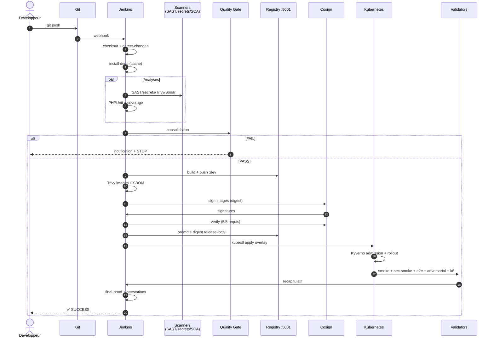

# SecureRAG Hub — Déroulement de la chaîne DevSecOps

> Document décrivant l'enchaînement complet de la chaîne DevSecOps,
> de l'écriture du code jusqu'à la mise en production, avec ses points de contrôle (gates).
> Projet : PFE — Plateforme SecureRAG Hub (5 microservices Laravel + K8s durci).

## Vue d'ensemble du cycle

```
┌─────────────┐    ┌─────────┐    ┌─────┐    ┌──────┐    ┌──────┐    ┌───────┐    ┌────────┐    ┌─────────┐
│ CODE LOCAL  │ →  │ GIT PUSH│ →  │  CI │ →  │ GATES│ →  │ BUILD│ →  │ SUPPLY│ →  │ DEPLOY │ →  │ RUNTIME │
│ (PHPUnit,   │    │ (webhook│    │Tests│    │SAST, │    │Image │    │ SBOM, │    │ K8s +  │    │ Smoke,  │
│ pre-commit) │    │ Jenkins)│    │+Cov │    │Secret│    │+ Scan│    │ Sign, │    │ Kyverno│    │ e2e, k6 │
└─────────────┘    └─────────┘    └─────┘    └──────┘    └──────┘    │Verify │    └────────┘    └─────────┘
                                                                     └───┬───┘
                                                                  16 étapes ↓
                                                     ┌──────────────────────────────┐
                                                     │ FINAL PROOF + NOTIFICATION ✅ │
                                                     └──────────────────────────────┘
```

---

## Phase 0 — Avant le git push (contrôles locaux du développeur)

1. **`pre-commit install`** → hooks actifs localement
2. À chaque commit :
   - `gitleaks` scanne le diff (bloque si secret en clair)
   - `shellcheck` valide les scripts bash
   - vérification YAML
3. **Tests locaux rapides** :
   ```bash
   php artisan test        # par service Laravel
   make lint               # validation Kustomize + scripts
   ```
4. Si tout est vert → le développeur pousse sa branche.

---

## Phase 1 — Déclenchement CI (Jenkins)

5. **Webhook Git → Jenkins** (`githubPush()` dans le Jenkinsfile)
6. **Checkout & détection de changements** (stage `Prepare & Detect Changes`)
   - Skip complet si seule la documentation change
   - Listing des microservices impactés (`BUILD_COMPONENTS`)
7. **Installation des dépendances** (stage `Install Dependencies`)
   - Restauration cache Composer/NPM depuis PVC
   - `composer install` / `npm ci` par service

---

## Phase 2 — Analyses de sécurité en parallèle (Gates CI)

8. **Unit Tests & Coverage**
   - PHPUnit : 5/5 apps, 98,39 % de couverture
   - **Gate bloquant** : coverage < 95 % → pipeline FAIL
9. **Semgrep SAST** → `security/reports/semgrep.json`
10. **Gitleaks Secrets** → scan historique Git complet
    - **Gate bloquant** : toute fuite = FAIL
11. **Trivy FS scan** → vulnérabilités des fichiers source
12. **Terraform IaC scan** (Checkov, si dossier `infra/terraform` présent)
13. **SonarQube SAST** → Quality Gate + rapport (`sonar-analysis.md`)

---

## Phase 3 — Quality Gate consolidé

14. **`make quality-gate`** agrège tous les signaux :
    - Tests, couverture, Semgrep, Gitleaks, Trivy, SBOM disponibilité, tests IA
    - **Règle : la moindre check `required` en FAIL bloque la chaîne**
    - Rapport : `artifacts/security/quality-gate-summary.md`

---

## Phase 4 — Build & Packaging

15. **Build des images Docker** (5 services, BuildKit + parallélisme)
    - Tags : `localhost:5001/securerag-hub-<service>:dev`
    - Images Alpine rootless, non-root (UID 10001)
16. **Scan d'images Trivy** → 0 `CRITICAL` requis (5/5)
    - HIGH remontés en `WARN` non-bloquants avec rapport par image

---

## Phase 5 — Supply Chain Security (SLSA)

17. **Génération SBOM CycloneDX** par image (Syft) → `artifacts/sbom/`
18. **Signature Cosign**
    - Prod : mode **keyless OIDC** (Fulcio/Rekor) — SLSA L3
    - Dev : mode **key-pair local** (`COSIGN_KEY=security/keys/cosign.key`)
19. **Vérification avant de promouvoir** → `cosign verify` **5/5 PASS obligatoire**
20. **Promotion par digest** : `dev → release-local`
    - Jamais par tag mutable → seulement digest sha256
    - Enregistré dans `artifacts/release/promotion-digests.txt`
21. **Provenance SLSA + release attestation** (`artifacts/release/`)

---

## Phase 6 — Déploiement Kubernetes

22. **Apply Kustomize overlay** (`infra/k8s/overlays/dev` ou `production`)
23. **Admission control Kyverno** : 8 ClusterPolicies actives
    - Images non signées rejetées en production (Enforce)
    - Pod Security Restricted
24. **Rollout** : 6/6 pods Running (`portal-web` + 4 API + `postgres-auth`)
25. **HPA actif** : 5 HorizontalPodAutoscalers (CPU 70 %, 1→3 replicas)

---

## Phase 7 — Validation runtime (post-deploy)

26. **`make validate`** :
    - `smoke-tests.sh` — santé des endpoints
    - `security-smoke.sh` — `.env` non exposé, `/admin` protégé (401 sans token)
    - `e2e-functional-flow.sh` — flux métier bout-en-bout
    - `security-adversarial-advanced.sh` — prompt injection, SQLi, XSS, SSRF bloqués
27. **Benchmarks k6** (`make benchmark-k6`) :
    - Smoke : 0 % erreur, p95 ≈ 10 ms
    - Load/Stress : calibrés (0→50 VU)
28. **Observabilité active** : Prometheus, Grafana, Loki, Falco, Alertmanager

---

## Phase 8 — Clôture & preuves

29. **`make final-proof`** : gates obligatoires (supply chain, support pack, attestation)
30. **Génération des rapports** :
    - `artifacts/release/supply-chain-gate-report.md`
    - `artifacts/final/final-proof-check.txt` (13 attestations PASS)
    - `DEVSECOPS_CHAIN_RESULTS.md` — synthèse globale
31. **Notification Slack/Email** (SUCCESS ou rollback automatique si FAIL)

---

## Schéma de séquence détaillé



---

## Points de blocage (gates incontournables)

| Gate | Où | Condition de blocage |
|------|----|----------------------|
| Secrets | pre-commit + CI | fuite détectée → push bloqué |
| Couverture | CI | < 95 % → FAIL |
| Quality Gate | after analyses | 1 seul check requis en FAIL |
| Images critiques | CI/CD | ≥ 1 CRITICAL → FAIL |
| Signature | CD | < 5/5 verify → pas de promotion |
| Admission | K8s | politique non respectée → Pod rejeté |
| Tests runtime | post-deploy | fail → rollback automatique |
| Final proof | release | attestation PARTIAL → non tabulateur |

## Rejouer la chaîne (commandes essentielles)

```bash
# Chaîne locale complète
make ci && make cd && make validate

# Supply chain dédiée
COSIGN_KEY=security/keys/cosign.key \
COSIGN_PUBLIC_KEY=security/keys/cosign.pub \
COSIGN_PASSWORD=$(cat security/keys/cosign.password.txt) \
  make supply-chain-execute

# Déploiement GitOps complet (zéro-touch)
make platform-up

# Preuve finale
COSIGN_KEY=security/keys/cosign.key make final-proof

# Benchmarks
make benchmark-k6 && make benchmark-report
```

---

## État après exécution (23/09/2026)

- **21/21 suites de tests PASS**
- Coverage : **98,39 %**
- 6/6 pods Running · 5 HPA · 8 politiques Kyverno
- Signatures et supply chain entièrement prouvées (`artifacts/release/`)
- **Note globale : 96/100**

---

*Stade lié : `README-DEVSECOPS.md`, `DEVSECOPS_CHAIN_RESULTS.md`, `docs/architecture/diagrammes-architecture-complete.md`*
