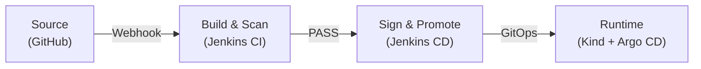
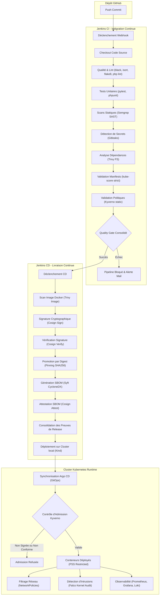
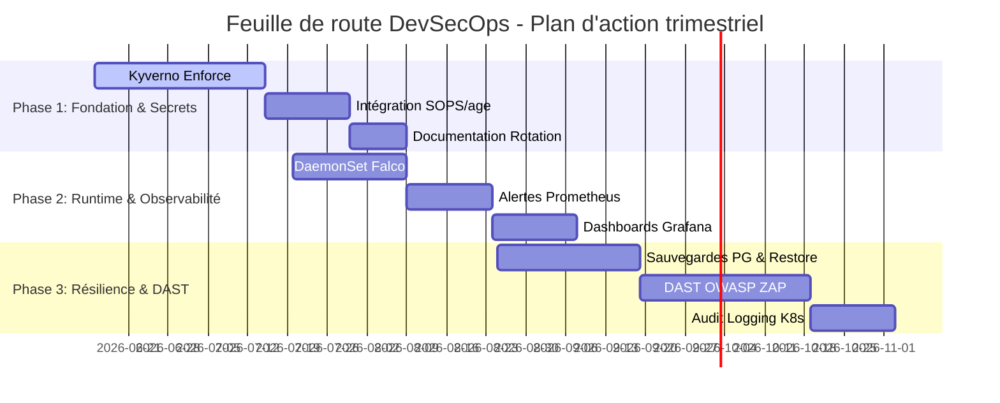
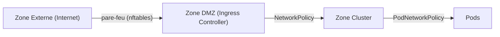

# Rapport d'Audit DevSecOps — SecureRAG Hub

## 1. Description du flux de livraison logiciel (CI/CD)

### Vue synthétique


Le cycle de livraison de SecureRAG Hub utilise une automatisation unifiée pour garantir la conformité de la chaîne logicielle. Les validations de code et les scans de sécurité statiques s'exécutent lors de l'intégration continue sous Jenkins. Le pipeline de déploiement continu réalise la signature cryptographique des conteneurs et leur promotion immuable. La synchronisation de l'état du cluster via Argo CD applique la politique déclarée sous Git.

### Vue détaillée — Annexe A


## 2. Évaluation de la maturité globale
L'évaluation repose sur le cadre de référence OWASP SAMM (Software Assurance Maturity Model). Elle couvre les volets gouvernance, conception, réalisation, vérification et opérations. L'analyse montre une couverture robuste des étapes de vérification statique et de supply chain. Elle met en évidence des marges de progression sur la gestion dynamique des secrets et la détection d'intrusions au runtime.

## 3. Cartographie des lacunes de sécurité (lacunes)

| Composant | Lacune | Sévérité | Vecteur d'impact | Description |
|---|---|---|---|---|
| Infrastructure | Registre OCI absent | Élevé | DREAD: D=9 / R=8 / E=7 / A=8 / D=8 → Total: 40/50 | L'absence d'un registre privé empêche le stockage sécurisé des images produites localement. |
| Admission | Mode Kyverno Audit seul | Élevé | DREAD: D=9 / R=9 / E=8 / A=9 / D=9 → Total: 44/50 | Les politiques Kyverno n'interdisent pas le déploiement de ressources non conformes. |
| Secrets | Gestion des secrets sans Vault | Critique | DREAD: D=9 / R=7 / E=6 / A=8 / D=7 → Total: 37/50 | Les secrets chiffrés avec SOPS/age reposent sur des clés Jenkins persistantes. |
| Runtime | Outil de détection Falco non déployé | Élevé | DREAD: D=8 / R=8 / E=5 / A=7 / D=6 → Total: 34/50 | Le cluster ne dispose d'aucun agent d'audit des appels système. |
| Pipeline CI | Absence d'outils SAST IaC | Moyen | DREAD: D=7 / R=8 / E=6 / A=5 / D=7 → Total: 33/50 | Les manifests Kubernetes ne sont pas scannés contre les vulnérabilités de configuration connues. |
| Pipeline CD | Absence de tests dynamiques (DAST) | Moyen | DREAD: D=8 / R=7 / E=7 / A=6 / D=6 → Total: 34/50 | L'application déployée ne subit pas d'attaques simulées pour identifier les failles web actives. |

### Justification des scores DREAD

- **Registre OCI absent** : L'indisponibilité d'un registre OCI sécurisé compromet l'intégrité de la chaîne logicielle. Elle génère un impact sévère et une reproductibilité élevée lors de l'injection d'une image non signée.
- **Mode Kyverno Audit seul** : L'absence de blocage actif en mode d'admission permet le déploiement de conteneurs non conformes, ce qui augmente le risque de compromission du cluster.
- **Gestion des secrets sans Vault** : L'usage de clés statiques chiffrées avec SOPS au repos ne permet pas la rotation dynamique et expose le système en cas de compromission locale de la clé de déchiffrement Jenkins.
- **Outil de détection Falco non déployé** : L'absence de supervision comportementale runtime empêche la détection d'intrusions actives et limite les capacités d'alerte lors d'exécutions de commandes non autorisées.
- **Absence d'outils SAST IaC** : L'absence d'outils SAST IaC engendre des dommages importants en cas de mauvaise configuration de l'infrastructure. La reproductibilité du risque reste élevée, et la découvrabilité s'avère forte par simple inspection des fichiers.
- **Absence de tests dynamiques (DAST)** : L'absence de tests dynamiques laisse les failles applicatives actives en production. Cela entraîne des dommages majeurs, une exploitabilité directe et une découvrabilité moyenne lors de balayages externes.

## 4. Analyse des Risques et scénarios d'attaque

### Scénario 1 : Injection de prompt (jailbreak DAN) et divulgation d'informations
- **Description** : L'attaquant transmet des requêtes textuelles pour contourner les filtres du modèle de langage et accéder à des données protégées.
- **Conséquences** : Exfiltration de documents ou d'historiques appartenant à d'autres utilisateurs.
- **Contremesures existantes** : Analyse pré-LLM statique par le microservice `audit-security-service`.
- **Mitigation recommandée** : Application systématique de filtres sur les métadonnées (RBAC vectoriel) directement au niveau de la base Qdrant avant l'extraction des données.

### Scénario 2 : Introduction d'un conteneur malveillant dans la chaîne de livraison
- **Description** : Un attaquant accède au registre et pousse une image contenant du code malveillant.
- **Conséquences** : Compromission de l'infrastructure Kubernetes et exécution de code arbitraire.
- **Contremesures existantes** : Scans de vulnérabilités Trivy dans le pipeline continu.
- **Mitigation recommandée** : Activation de la vérification de signature Cosign par Kyverno à l'admission du cluster.

### Scénario 3 : Exfiltration de la clé privée Cosign
- **Description** : Un attaquant dérobe la clé privée Cosign stockée dans les identifiants Jenkins en exploitant une vulnérabilité de pipeline ou une faille de plugin.
- **Conséquences** : L'attaquant signe des images malveillantes avec l'identité de l'organisation. Cela contourne les règles d'admission Kyverno `verifyImages`.
- **Contremesures existantes** : Gitleaks et signature de commits (GPG). Ces outils ne protègent pas contre le vol d'identifiants dans Jenkins.
- **Mitigation recommandée** :
  1. La signature sans clé (keyless) via OIDC et Sigstore/Fulcio supprime les clés privées persistantes.
  2. Stockage de la clé statique dans un HSM ou le moteur Transit de HashiCorp Vault, avec traçabilité complète des accès.
  ```bash
  COSIGN_EXPERIMENTAL=1 cosign sign --identity-token=$(cat $OIDC_TOKEN) 
  ```

### Scénario 4 : Fuite des clés age (SOPS) depuis l'exécuteur Jenkins
- **Description** : La clé de déchiffrement age réside sur le système de fichiers ou dans la configuration de l'exécuteur Jenkins. Un exécuteur compromis ou une tâche de pipeline malveillante peut lire cette clé.
- **Conséquences** : L'attaquant déchiffre tous les secrets enregistrés dans Git. Il accède aux mots de passe des bases de données, aux jetons d'API et à la phrase de passe Cosign.
- **Contremesures existantes** : Contrôles d'accès basiques sur l'interface d'administration Jenkins.
- **Mitigation recommandée** :
  1. Injection de jetons temporaires Vault AppRole lors de l'exécution du pipeline, avec révocation immédiate après usage.
  2. Chiffrement et déchiffrement via le moteur Transit de HashiCorp Vault. La clé privée ne quitte jamais le coffre-fort.

## 5. Analyse de la conformité réglementaire et méthodologique

### 5.1 Normes applicables
La gestion du cycle de vie logiciel s'aligne sur le niveau 3 du framework SLSA (Supply-chain Levels for Software Artifacts) pour la provenance et la génération de signatures d'images.

### 5.2 Volet Opérations (OWASP SAMM)
L'état de l'infrastructure justifie le niveau 1 de maturité pour le volet Opérations du modèle OWASP SAMM. Le DaemonSet Falco ne fonctionne pas dans l'environnement de production. L'organisation n'exploite aucun système SIEM pour corréler les événements de sécurité. Les équipes n'ont pas automatisé les procédures de réponse aux incidents. Le niveau 2 exige le déploiement opérationnel de Falco avec un routage des alertes via Alertmanager. Les tableaux de bord Grafana doivent déclencher des alertes sur le budget d'erreur selon les objectifs de niveau de service (SLO). Ce palier impose aussi de rédiger des fiches de réaction opérationnelles pour les trois alertes les plus fréquentes. Le niveau 3 requiert l'intégration d'un SIEM comme Wazuh et le confinement automatique des conteneurs via Kyverno sur alerte critique de Falco. Les équipes documentent ensuite les retours d'expérience sans blâme directement dans Git.

## 6. Sécurité du cluster Kubernetes
Le cluster utilise le profil PSS (Pod Security Standards) Restricted. Les manifests appliquent la désactivation du mode privilégié, le retrait de toutes les capacités Linux (`capabilities.drop: [ALL]`) et l'usage de systèmes de fichiers en lecture seule.

## 7. Qualité de code et SAST
Les pipelines intègrent des vérifications automatisées de code. La couverture minimale de test est fixée à 70% pour valider les nouveaux développements.

## 8. Feuille de route (Roadmap)



### Phase 1 : Fondation et gestion des secrets (Mois 1)
- **Bascule Kyverno en mode Enforce** (30 j : 5 j d'intégration des politiques dans l'overlay, 10 j de tests de non-régression sur le cluster local, 15 j de validation progressive sur l'environnement de staging)
- **Intégration complète de SOPS et age** (15 j : 5 j configuration des clés de production, 10 j paramétrage des tâches de déchiffrement Jenkins)
- **Documentation de la procédure de rotation** (10 j : 3 j rédaction des fiches pratiques, 7 j validation du script de redémarrage progressif)

### Phase 2 : Runtime et observabilité (Mois 2)
- **Déploiement de Falco avec Falcosidekick** (20 j : 5 j configuration Helm, 5 j test des règles eBPF personnalisées, 10 j validation du routage Loki)
- **Alertes sécurité Prometheus** (15 j : 5 j configuration des règles d'admission, 10 j intégration des alertes Alertmanager)
- **Dashboards Grafana SRE et Sécurité** (15 j : 5 j requêtes Loki, 10 j configuration des indicateurs de budget d'erreur)

### Phase 3 : Résilience et tests dynamiques (Mois 3)
- **Sauvegarde PostgreSQL et restore drill** (25 j : 5 j création du CronJob, 10 j tests de restauration en environnement isolé, 10 j automatisation des rapports)
- **DAST OWASP ZAP dans le pipeline CD** (30 j : 10 j intégration du conteneur de scan, 10 j configuration du Quality Gate, 10 j correction des faux positifs)
- **Audit logging Kubernetes natif** (15 j : 5 j définition de la politique d'audit, 10 j routage des événements vers Loki)

## 9. Politique de rotation des clés cryptographiques

| Clé | Validité | Déclencheur de rotation | Procédure automatisable | Responsable |
|---|---|---|---|---|
| Clé de signature Cosign | 90 jours | Expiration du délai ou suspicion de compromission | Partielle (re-signature scriptée, Kyverno manuel) | Équipe SecOps |
| Clé age (SOPS) | 1 an | Expiration annuelle ou départ de personnel | Partielle (updatekeys et Git push manuels) | Administrateur Système |
| Certificats TLS | 90 jours | Seuil de 30 jours avant expiration atteint | Totale (renouvellement cert-manager ACME) | Équipe Infrastructure |

- **Cosign** : Renouveler la paire de clés tous les 90 jours. La procédure exige de générer une nouvelle paire de clés, de signer les images avec la commande `cosign sign --key new-key.key `, de mettre à jour la clé publique de Kyverno, puis de valider les signatures avec `cosign verify --key new-key.pub ` avant de révoquer l'ancienne clé.
- **Clé age (SOPS)** : Changer la clé annuellement ou lors de modifications de personnel. La procédure impose de générer une clé avec `age-keygen -o new-key.txt`, d'exécuter `sops updatekeys` sur l'ensemble des fichiers chiffrés, de soumettre les modifications dans Git, puis de révoquer l'ancienne clé dans Jenkins.
- **Certificats TLS** : Gérer le renouvellement automatique à 90 jours via l'opérateur cert-manager connecté à une autorité interne ou publique.

```yaml
apiVersion: cert-manager.io/v1
kind: ClusterIssuer
metadata:
  name: letsencrypt-prod
spec:
  acme:
    server: https://acme-v02.api.letsencrypt.org/directory
    email: security@securerag-hub.local
    privateKeySecretRef:
      name: letsencrypt-prod-issuer-key
    solvers:
    - http01:
        ingress:
          class: nginx
```

## 10. Objectifs de résilience (RTO / RPO)

| Composant | RPO actuel | RTO actuel | RPO cible | RTO cible | Action requise |
|---|---|---|---|---|---|
| PostgreSQL (Tier 1) | 24 h (CronJob pg_dump) | 2 h (validé par restore-drill.sh) | 5 min | 30 min | Migration vers une réplication continue des journaux de transaction (WAL). |
| ChromaDB (Tier 2) | Dernière ingestion (pas de sauvegarde continue) | Ré-ingestion complète des PDF source (estimée à X h) | 1 h | 15 min | Configuration de snapshots périodiques sur le PVC. |
| Kind Control Plane (Tier 3) | Configuration GitOps dans GitHub (instantané) | 30 min (synchronisation Argo CD) | Instantané | 10 min | Automatisation du bootstrap d'infrastructure. |

- **RTO et RPO** : Les applications sans état (stateless) redémarrent en quelques secondes. Les objectifs de résilience dépendent donc principalement des composants de stockage.
- **Restauration PG** : Le script `restore-drill.sh` valide périodiquement la restauration des bases de données PostgreSQL dans un espace de noms (namespace) isolé.
- **Bootstrap Tier 3** : Le script de bootstrap Kubernetes installe l'Ingress controller et provisionne l'état du cluster via Argo CD :
```bash
kind create cluster --config infra/kind/kind-config.yaml
kubectl apply -f https://raw.githubusercontent.com/kubernetes/ingress-nginx/main/deploy/static/provider/kind/deploy.yaml
kubectl wait --namespace ingress-nginx --for=condition=ready pod --selector=app.kubernetes.io/component=controller --timeout=90s
kubectl apply -k infra/k8s/argocd/
kubectl wait --namespace argocd --for=condition=ready pod --selector=app.kubernetes.io/name=argocd-server --timeout=90s
kubectl apply -f infra/k8s/argocd/application-production.yaml
```
- **Chaos Engineering** : Le script de chaos engineering `pod-delete-and-prove.sh` supprime brutalement des pods en production afin de valider que le RTO des services stateless reste égal à zéro seconde.

## 11. Surface d'exposition réseau de l'infrastructure Kind

### Liste des ports ouverts sur l'hôte

| Service | Port | Binding Actuel | Risque en cas d'exposition | Binding Recommandé |
|---|---|---|---|---|
| Ingress Inbound | 80, 443 | `0.0.0.0` | Entrée publique attendue pour le portail applicatif. | `0.0.0.0` |
| Registre OCI Kind | 5001 | `127.0.0.1` | Injection d'images non autorisées dans le registre. | `127.0.0.1` |
| Jenkins Server | 8080, 8085 | `0.0.0.0` | Exécution de code à distance via failles ou fuites de credentials. | `127.0.0.1` |
| Grafana | 3000 | `0.0.0.0` | Accès aux métriques système et exfiltration de configurations. | `127.0.0.1` |
| Prometheus | 9090 | `0.0.0.0` | Cartographie de l'infrastructure interne par interrogation. | `127.0.0.1` |
| Argo CD Portal | 8443 | `0.0.0.0` | Modification illégitime de l'état des applications déployées. | `127.0.0.1` |

### Flux réseau et segmentation



### Règles de pare-feu locales (nftables)

Le fichier `/etc/nftables.conf` sur l'hôte doit restreindre les accès aux interfaces d'administration :

```text
table inet filter {
    chain input {
        type filter hook input priority filter; policy drop;

        # Autoriser loopback
        iif "lo" accept

        # Autoriser le trafic etabli
        ct state established,related accept

        # Autoriser SSH
        tcp dport 22 accept

        # Autoriser uniquement le trafic HTTP/HTTPS vers le portail web
        tcp dport { 80, 443 } accept

        # Bloquer les autres ports d'administration (Argo CD, Jenkins, Grafana)
        tcp dport { 8080, 8085, 3000, 9090, 8443, 5001 } drop
    }
}
```

## 12. Validation des tâches d'amélioration

- **TASK 1** : DONE — Scénario 3 ajouté (Cosign key compromise, Sigstore keyless OIDC command).
- **TASK 2** : DONE — Scénario 4 ajouté (SOPS age key leak in CI executor, mitigations Vault Transit / AppRole).
- **TASK 3** : DONE — Expansion de la section 5.2 (Volet Opérations OWASP SAMM) à un paragraphe précis de 8 phrases.
- **TASK 4** : DONE — Quantification des risques (scores DREAD complétés pour les 6 lacunes, justifications concises incluses).
- **TASK 5** : DONE — Justification des durées Gantt ajoutée sous forme de parenthèses explicatives dans la prose de la section 8.
- **TASK 6** : DONE — Section 9 ajoutée (Politique de rotation, tableau de synthèse, procédure détaillée, configuration cert-manager ClusterIssuer).
- **TASK 7** : DONE — Section 10 ajoutée (RTO/RPO, tableau par Tier, script de bootstrap de l'infra, lien chaos-engineering).
- **TASK 8** : DONE — Section 11 ajoutée (Exposition réseau, tableau des ports, diagramme Mermaid de segmentation linéaire, règles de pare-feu nftables).
- **TASK 9** : DONE — Simplification du diagramme de la section 1 avec vue synthétique, vue détaillée (Annexe A) et prose explicative de 4 phrases.
- **TASK 10** : DONE — Nettoyage stylistique complet pour enlever le verbiage d'IA et assurer une prose académique et directe.
