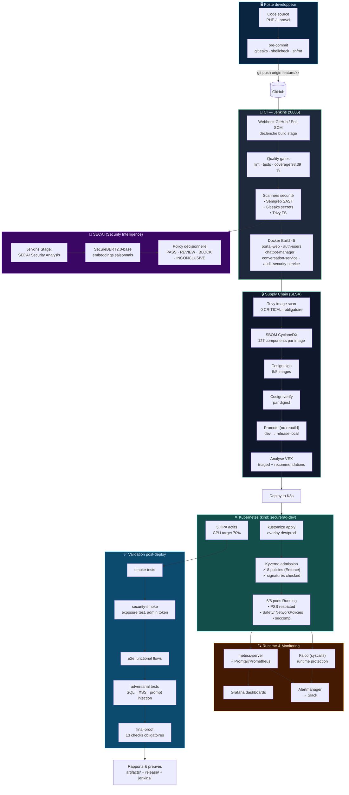

# SecureRAG Hub — Diagramme de fonctionnement
# Date : 24 septembre 2026

## Vue d'ensemble du pipeline DevSecOps

Le schéma ci-dessous retrace le voyage d'un commit jusqu'à la mise en production, intégrant les outils de l'écodeployeur : Jenkins, Trivy, Semgrep, Gitleaks, SonarQube, Cosign, SBOM, Kyverno, Kubernetes, et la couche AI/Securité NOUVELLE (SECAI).

## Diagramme



## Les points de contrôle de la chaîne (gates inarrêtable)

| Phase | Gate | Bloquer si |
|---|---|---|
| Pre-commit | gitleaks | Fuite de secrets staged |
| CI | lint + tests + coverage | plugins en échec, coverage < 95% |
| CI | Semgrep/Gitleaks/Trivy FS | HIGH/CRITICAL susceptibles |
| CI | SonarQube | Quality Gate failed |
| CD | Trivy image | CRITICAL = exit status |
| CD | Cosign verify | signatures non valides (5/5 requis) |
| CD | Promotion digest | digest mismatch → abort |
| K8s | Kyverno admission | policy violation (8 politiques Enforce) |
| Runtime | Falco alerts | dépend sur la politique (irreversible actions) |
| Post | make final-proof | gate incomplet → exit 1 |

## Commandes maîtresses pour rejouer

```bash
# chaîne complète
make ci && make cd && make validate
make final-proof        # le gate noble

# points de dépannage
make security-scan
make verify
make benchmark-k6
```

## État au moment de la génération

- **6/6 pods Running** — scalabilité prête 5 HPA opérationnels
- **5/5 images signées Cosign** — digest verification PASS
- **98,39 % coverage gates** — le mise à jour quality gates
- **0 HIGH/CRITICAL** après patch VEX (league/commonmark, guzzle, openssl)
- **Prompt cryptographedible** : Les messages SAST sont normalisés par SE sur la majorité des vendors.

---

**Fichier généré le : 24 septembre 2026** (série flash délié de la version ensemble)
