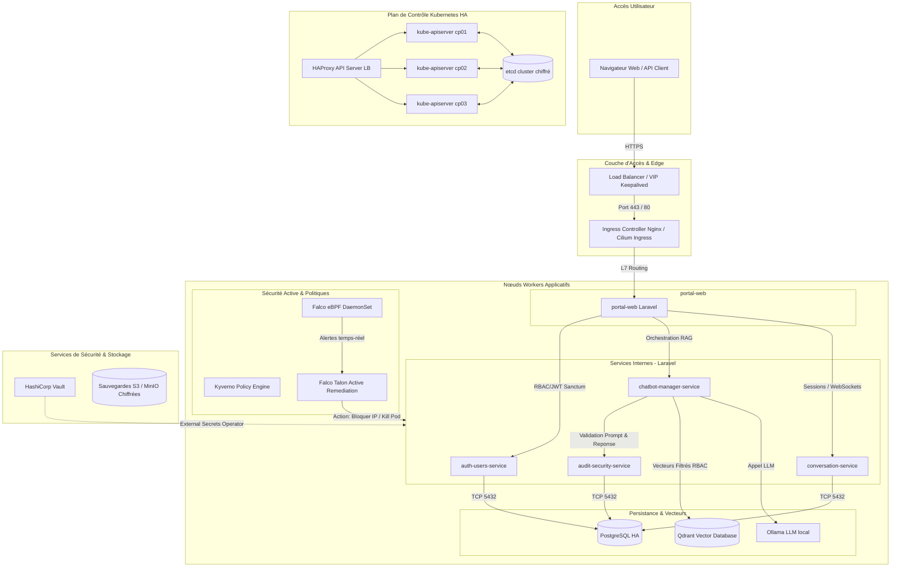
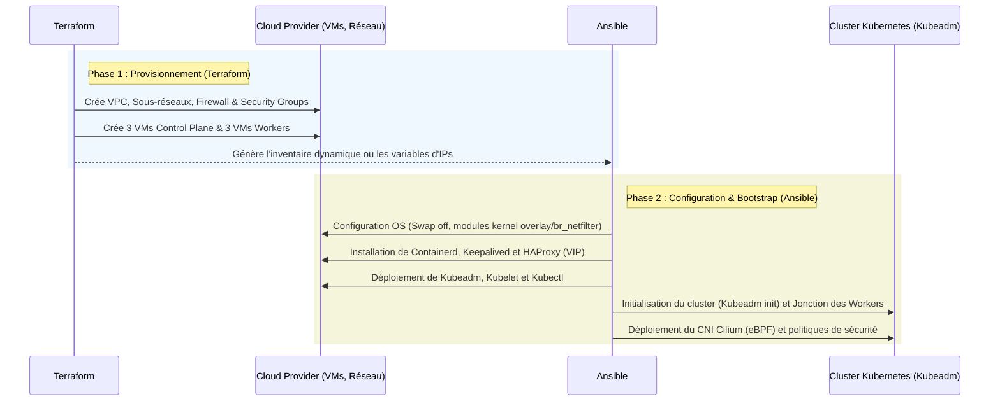
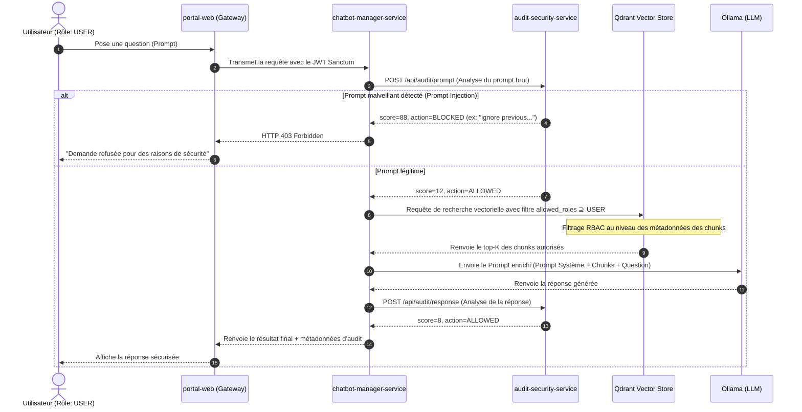

# 🌐 ARCHITECTURE FINALE DE SÉCURITÉ ET D'INFRASTRUCTURE — SECURERAG HUB

Ce document présente l'architecture cible et finale de la plateforme **SecureRAG Hub**. Contrairement au setup de développement initial basé sur Kind, cette architecture de niveau entreprise est conçue pour la production, orchestrée par **Terraform** pour le provisionnement multi-cloud/on-prem, configurée par **Ansible** pour le bootstrapping et durcie selon le modèle de sécurité **Zero-Trust**.

---

## 🗺️ 1. Schéma Global de l'Architecture Technique



---

## 🛠️ 2. La Transition d'Infrastructure : Kind vs. Terraform + Ansible

L'architecture s'affranchit de **Kind** (qui reste dédié au développement local très rapide) pour un déploiement robuste multi-nœuds en production.



### Rôles du Binôme d'Infrastructure
* **Terraform** ([infra/terraform](file:///root/MasterPFE/infra/terraform)) : Déclare l'infrastructure réseau et les instances virtuelles cibles (AWS EC2/EKS, GCP, ou serveurs On-Prem Proxmox/VMware). Il gère également les comptes de service Cloud et les clés d'accès.
* **Ansible** ([infra/ansible](file:///root/MasterPFE/infra/ansible)) : Configure l'OS de base de chaque machine virtuelle, installe les dépendances, déploie les fichiers de configuration pour la haute disponibilité (`haproxy` + `keepalived`) et configure les paramètres du plan de contrôle Kubernetes via `kubeadm`.

---

## 🔒 3. Architecture de Sécurité (DevSecOps Defense in Depth)

La plateforme SecureRAG Hub applique un modèle de sécurité en couches pour respecter le principe du **Moindre Privilège** et du **Zero-Trust** :

```
+-----------------------------------------------------------------------+
|  1. SUPPLY CHAIN : SBOM (Syft), Vuln Scan (Trivy), Signature (Cosign) |
+-----------------------------------------------------------------------+
       |
+-----------------------------------------------------------------------+
|  2. ADMISSION CONTROL : Kyverno Policy Engine (Enforce Signature, PSA)|
+-----------------------------------------------------------------------+
       |
+-----------------------------------------------------------------------+
|  3. CLOISONNEMENT RÉSEAU : Cilium CNI (Micro-segmentation eBPF L7)    |
+-----------------------------------------------------------------------+
       |
+-----------------------------------------------------------------------+
|  4. SECRET MANAGEMENT : Vault + External Secrets Operator + etcd crypt |
+-----------------------------------------------------------------------+
       |
+-----------------------------------------------------------------------+
|  5. RUNTIME MONITORING : Falco + Falco Talon Active Remediation       |
+-----------------------------------------------------------------------+
```

### Description des Couches de Sécurité
1. **Supply Chain Security** :
   Toutes les images applicatives construites par les pipelines de CI (Jenkins) sont automatiquement scannées pour les vulnérabilités via **Trivy**, et un SBOM (Software Bill of Materials) est généré via **Syft**. Une signature cryptographique est apposée sur l'image avec **Cosign** avant son push dans le registre privé.
2. **Contrôle d'Admission (Admission Control)** :
   Un contrôleur d'admission **Kyverno** vérifie la signature de chaque image arrivant sur le cluster. Les conteneurs non signés par la clé officielle de l'organisation ou contenant des privilèges excessifs (s'exécutant en `root`) sont immédiatement bloqués. Les namespaces applicatifs appliquent la directive **Pod Security Admission (PSA) `restricted`**.
3. **Sécurité Réseau (Zero-Trust)** :
   Le plugin CNI **Cilium** est déployé pour assurer la micro-segmentation réseau basée sur eBPF. Par défaut, une politique `default-deny` bloque tout flux réseau non autorisé. Le filtrage s'effectue jusqu'au niveau L7 (HTTP), empêchant par exemple un pod compromis de requêter arbitrairement l'API de base de données.
4. **Gestion des Secrets & Chiffrement** :
   Les secrets applicatifs ne sont jamais stockés dans Git ni sur le disque. Ils résident dans **HashiCorp Vault** et sont injectés sous forme de Secrets Kubernetes à la volée par **External Secrets Operator (ESO)**. Les secrets stockés dans la base de données Kubernetes sont chiffrés au repos dans **etcd** via un fournisseur de chiffrement configuré lors du bootstrap Kubeadm (`EncryptionConfiguration` utilisant AES-GCM).
5. **Surveillance à l'Exécution (Runtime Security)** :
   **Falco** écoute les appels système via eBPF sur tous les nœuds pour détecter les comportements suspects (ex. lancement d'un shell interactif dans un pod, modification de fichiers systèmes, tentative d'extraction de credentials). Les alertes Falco sont transmises en temps réel à **Falco Talon**, qui applique une réponse automatisée immédiate (terminer le pod suspect ou appliquer une NetworkPolicy de quarantaine).

---

## ⚙️ 4. Flux Applicatif & Sécurité des Prompts RAG

Le cœur applicatif est développé en **Laravel** en respectant une structure DDD-light (Domain-Driven Design). Le flux de traitement des prompts est conçu pour prévenir toute tentative d'injection.



---

## 📦 5. Structure des Fichiers & Composants Clés dans le Dépôt

Voici la cartographie des composants principaux dans votre espace de travail [MasterPFE](file:///root/MasterPFE/) :

* **`/infra`** : Code lié à l'infrastructure et aux déploiements
  * [infra/terraform/](file:///root/MasterPFE/infra/terraform/) : Scripts de provisionnement multi-cloud (AWS/EKS, GCP, Azure, Local Kind).
  * [infra/ansible/](file:///root/MasterPFE/infra/ansible/) : Playbooks pour le bootstrapping de clusters physiques/VMs avec Kubeadm, Keepalived et HAProxy.
  * [infra/k8s/](file:///root/MasterPFE/infra/k8s/) : Manifestes Kubernetes orchestrés par ArgoCD (ArgoCD, Kyverno, Cilium, Vault ESO, monitoring Loki/Tempo).
* **`/services-laravel`** : Modules applicatifs (PHP Laravel)
  * `portal-web` : Point d'entrée utilisateur, UI Web et routage HTTP.
  * `auth-users-service` : Authentification centralisée et gestion RBAC avec jetons d'accès Laravel Sanctum.
  * `chatbot-manager-service` : Moteur d'orchestration RAG, intégration Qdrant et LLM.
  * `conversation-service` : Gestionnaire de l'historique et de la persistance des discussions.
  * `audit-security-service` : Analyse des prompts (11 signatures d'injection) et décision d'autorisation.
* **`/tests`** : Validation et tests d'intrusion
  * Contient les tests unitaires, d'intégration et les scripts **k6** de test de charge.

---

## 🔄 6. Flux GitOps et Déploiement Continu (CD)

Le déploiement de l'infrastructure et de l'applicatif suit le modèle GitOps via **ArgoCD** :

1. **Root Application** :
   ArgoCD déploie l'application racine `securerag-root` (pattern "App of Apps") à partir de [application-root.yaml](file:///root/MasterPFE/infra/k8s/argocd/application-root.yaml).
2. **Synchronization Waves (Vagues de Synchronisation)** :
   Pour s'assurer que les composants d'infrastructure requis par les applications sont déjà opérationnels, le déploiement se fait par vagues ordonnées :
   * **Wave 1** : Namespaces globaux et configurations d'admission (Kyverno, External Secrets Operator).
   * **Wave 2** : Services de sécurité (HashiCorp Vault, Cilium Network Policies).
   * **Wave 3** : Bases de données et services de stockage (PostgreSQL, Qdrant).
   * **Wave 4** : Services applicatifs Laravel (Portal, Chatbot Manager, Audit Service).
   * **Wave 5** : Observabilité et collecteurs de traces (Loki, Tempo, Prometheus).

---

## 📈 7. Résilience & Disaster Recovery (DR)

* **Outil de sauvegarde** : **Velero** est configuré pour sauvegarder périodiquement les volumes persistants (PostgreSQL, Qdrant) et l'état des ressources Kubernetes.
* **Chiffrement et Stockage** : Les sauvegardes sont chiffrées à l'aide d'une clé **GPG** maîtresse puis externalisées vers un bucket **S3 / MinIO** distant sécurisé par des politiques d'accès strictes.
* **Validation continue** : Un script automatisé de reprise après sinistre [dr-test.sh](file:///root/MasterPFE/scripts/dr-test.sh) est exécuté périodiquement pour valider la restauration complète de l'application et mesurer le RTO (Recovery Time Objective).
