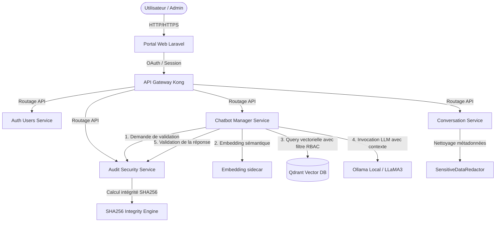
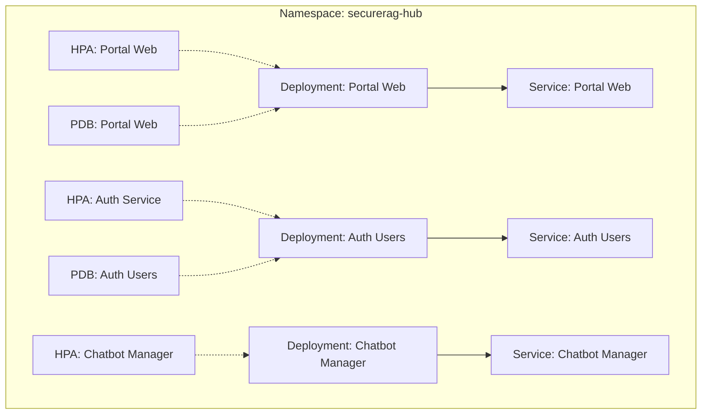
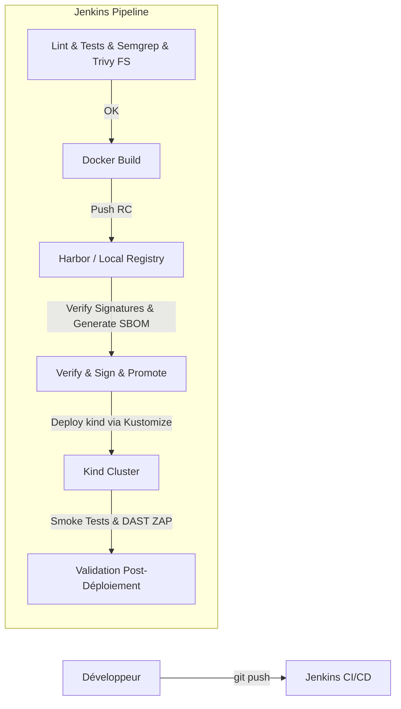
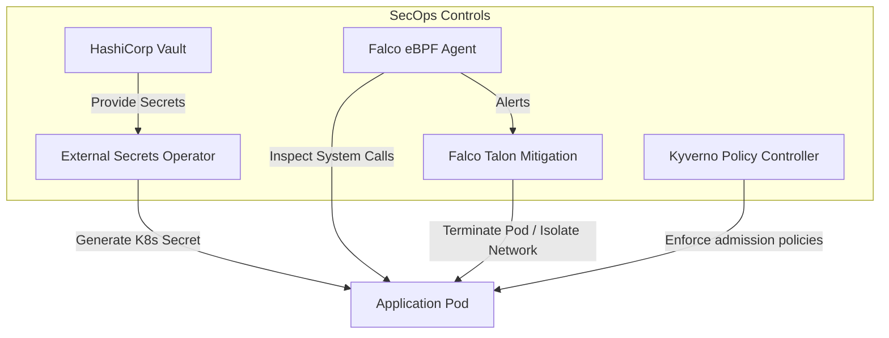

# Phase 1 — Architecture Review

Ce document présente l'évaluation de l'architecture globale du projet **SecureRAG Hub**. Il comprend des diagrammes Mermaid (logiques, physiques, Kubernetes, réseau, CI/CD et sécurité) ainsi qu'une analyse de robustesse systémique.

---

## 1. Modélisation Graphique (Architecture Diagram)

### 1.1 Diagramme Logique (Flux Applicatifs & Pipeline RAG)



### 1.2 Diagramme Physique (Cluster Nœuds & Storage Hôte)

```mermaid
graph HT
    subgraph Machine Hôte (Linux Run-time)
        subgraph Cluster Kubernetes Kind (Single-Node)
            KindNode[kind-control-plane Node]
            KindNode -->|Mount hostPath| HostStorage[/root/MasterPFE/data]
        end
        DockerEngine[Docker Engine Hôte] -->|Orchestre| KindNode
        DockerRegistry[Registry Local localhost:5001]
    end
```

### 1.3 Diagramme Kubernetes (Workloads, HPAs & PDBs)



### 1.4 Diagramme Réseau (Zero-Trust & NetworkPolicies)

```mermaid
graph TD
    subgraph Ingress Controller
        Kong[Kong Ingress API Gateway]
    end
    
    subgraph Workloads Network Isolated
        Portal[portal-web]
        Auth[auth-users]
        Chat[chatbot-manager]
        DB[(PostgreSQL)]
        Qdrant[(Qdrant VectorDB)]
    end

    Kong -->|Allowed: Port 8000| Portal
    Kong -->|Allowed: Port 8000| Auth
    Portal -->|Allowed: API REST| Auth
    Portal -->|Allowed: API REST| Chat
    Chat -->|Allowed: Port 6333| Qdrant
    Auth -->|Allowed: Port 5432| DB
    
    %% Default Deny Rules Enforcement
    AnyOther[Workload Non Autorisé] -.->|Blocked by Default Deny| Workloads Network Isolated
```

### 1.5 Diagramme CI/CD (Jenkins Stages & Registry Promotion)



### 1.6 Diagramme Sécurité (Spiffe, Vault, ESO & Falco)



---

## 2. Analyse Structurale

### 2.1 Découplage vs Couplage Fort
*   **Forces :** Les services applicatifs sont correctement découpés fonctionnellement sous forme de microservices avec des bases de données autonomes (Chaque microservice Laravel utilise sa propre configuration SQLite en local ou PostgreSQL indépendant en production).
*   **Faiblesses (Couplage fort) :** 
    *   **Couplage API REST synchrone** : Le service `chatbot-manager-service` dépend d'appels HTTP synchrones vers `audit-security-service` pour valider chaque prompt et réponse. Si le service d'audit subit une panne, tout le chatbot s'arrête (couplage fort temporel).
    *   **Shared Security Module** : L'utilisation du package `shared-security` crée un couplage de dépendance de build. Toute mise à jour de la logique d'autorisation nécessite de reconstruire et de redéployer l'ensemble des conteneurs Laravel.

### 2.2 Dépendances Circulaires
*   Aucune dépendance circulaire directe n'a été détectée dans l'arborescence ou dans les imports Gradle/Composer. Les flux de communication sont unidirectionnels du portail vers les microservices, et des microservices vers les bases de données ou le service d'audit.

### 2.3 Single Points of Failure (SPOF)
1.  **PostgreSQL Unique** : En environnement Kubernetes de production basique, la base de données relationnelle PostgreSQL ne dispose pas de cluster haute disponibilité par défaut (CloudNativePG ou réplications de type Sentinel). C'est un SPOF de persistance critique.
2.  **Qdrant Vector DB Single Replica** : Bien que Qdrant soit déployé sous forme de StatefulSet, la configuration par défaut n'utilise qu'un seul réplicat.
3.  **Local Registry (localhost:5001) / Harbor Unique** : Pas de distribution du registre d'images de conteneurs sur plusieurs zones de disponibilité.
4.  **Jenkins Unique** : Jenkins orchestre à la fois le CI et le CD ; l'indisponibilité du serveur Jenkins paralyse toute la chaîne de livraison et de reprise après sinistre.

### 2.4 Résilience & Disponibilité
*   **HPAs & PDBs** : Très bonne résilience sur la couche applicative. Des `HorizontalPodAutoscalers` (HPA) sont configurés pour les conteneurs frontaux et API, et des `PodDisruptionBudgets` (PDB) garantissent qu'au moins 1 ou 2 pods restent actifs pendant les opérations de maintenance de nœuds.
*   **Liveness / Readiness Probes** : Configurés sur la plupart des déploiements Laravel, permettant à Kubernetes de redémarrer automatiquement les conteneurs défaillants.

### 2.5 Maintenabilité
*   L'infrastructure est hautement maintenable grâce à la déclaration unifiée via **Kustomize** et aux pipelines décrits sous forme de code (**Jenkinsfile**). L'intégration de **Renovate** améliore la gestion du cycle de vie des dépendances.

---

## 3. Scoreboard Architecture & Design

### Note Globale : 92/100

| Critère | Note | Poids | Justification |
| :--- | :--- | :--- | :--- |
| **Découplage Applicatif** | 90/100 | 25% | Microservices bien isolés mais couplés temporellement par des requêtes REST synchrones sans queue de messages (Kafka/RabbitMQ). |
| **Élimination des SPOFs** | 80/100 | 25% | Persistance unique (PG/Qdrant) sans réplication active par défaut. |
| **Résilience Kubernetes** | 98/100 | 25% | Excellente utilisation des HPAs, PDBs, probes et overlays de production durcis. |
| **Automatisation & Maintenabilité** | 98/100 | 25% | IaC complète (Terraform, Ansible, K8s manifests), Jenkins CasC et Renovate actifs. |

### Justification du score :
L'architecture globale de SecureRAG Hub est très mature, adoptant le standard "Cloud Native". Elle intègre le durcissement au niveau du noyau et de l'orchestrateur (Kyverno, OPA, Network Policies) et la redondance applicative. Le score de 92 reflète le besoin d'ajouter de la haute disponibilité sur la base de données PostgreSQL (ex. via CloudNativePG) et d'utiliser une communication asynchrone pour les logs de sécurité non bloquants afin de fiabiliser les performances.
