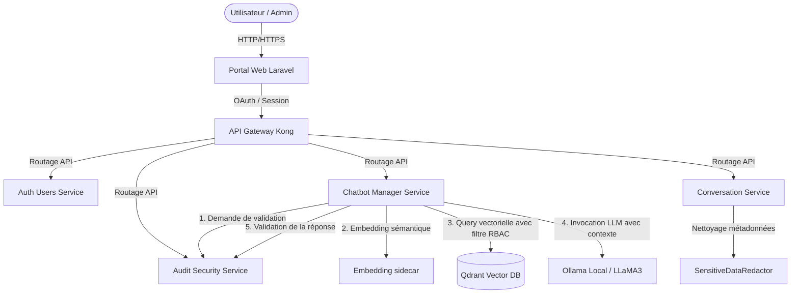

# Rapport d'Audit Global et Exhaustif — SecureRAG Hub

Ce document rassemble et unifie l'ensemble des analyses techniques, architecturales et opérationnelles menées sur la plateforme **SecureRAG Hub** (Phases 0 à 16).

---

## Sommaire de l'Audit

- [Phase 0 — Inventaire Global & Cartographie du Dépôt](#phase-0--inventaire-global--cartographie-du-dépôt)
- [Phase 1 — Architecture Review (Logic & Physical)](#phase-1--architecture-review-logic--physical)
- [Phase 2 — Évaluation de la Maturité DevSecOps](#phase-2--évaluation-de-la-maturité-devsecops)
- [Phase 3 — CI/CD Pipeline Analysis](#phase-3--cicd-pipeline-analysis)
- [Phase 4 — Kubernetes Security & Cluster Hardening Audit](#phase-4--kubernetes-security--cluster-hardening-audit)
- [Phase 5 — Cloud Security & Secrets Management Review](#phase-5--cloud-security--secrets-management-review)
- [Phase 6 — Container Security Review](#phase-6--container-security-review)
- [Phase 7 — Supply Chain Security & Dependency Audit](#phase-7--supply-chain-security--dependency-audit)
- [Phase 8 — Observability Audit](#phase-8--observability-audit)
- [Phase 9 — Performance & Load Test Review](#phase-9--performance--load-test-review)
- [Phase 10 — AI / RAG Security Audit](#phase-10--ai--rag-security-audit)
- [Phase 11 — Red Team Attack Simulation](#phase-11--red-team-attack-simulation)
- [Phase 12 — SRE & Reliability Analysis](#phase-12--sre--reliability-analysis)
- [Phase 13 — Cost & FinOps Optimization Audit](#phase-13--cost--finops-optimization-audit)
- [Phase 14 — Gap Analysis (Analyse des Écarts)](#phase-14--gap-analysis-analyse-des-écarts)
- [Phase 15 — Plan d'Amélioration & Feuille de Route (Roadmap)](#phase-15--plan-damélioration--feuille-de-route-roadmap)
- [Phase 16 — Rapport Final d'Audit Exécutif & Scorecard](#phase-16--rapport-final-daudit-exécutif--scorecard)

---

## Phase 0 — Inventaire Global & Cartographie du Dépôt

### Structure Globale du Répertoire
La structure physique du dépôt `/root/MasterPFE` se décompose comme suit :
```text
/root/MasterPFE/
├── .github/                      # Workflows CI/CD GitHub Actions (legacy/maintenance)
├── platform/                     # Composants de la plateforme utilisateur
│   └── portal-web/               # Portail web central (Laravel + Blade + TailwindCSS)
├── services-laravel/             # Microservices métier officiels rédigés en Laravel 10
│   ├── auth-users-service/       # Gestion des utilisateurs et rôles (RBAC)
│   ├── chatbot-manager-service/  # Gestion des chatbots et de la configuration des prompts
│   ├── conversation-service/     # Historique et persistance des messages avec redondance/redaction
│   ├── audit-security-service/   # Traçabilité des incidents, logs d'audit et intégrité
│   └── shared-security/          # Librairie partagée d'autorisation service-to-service
├── ai-security/                  # Couche d'analyse IA et détection des menaces (CyberGuard)
│   ├── backend/                  # API FastAPI d'analyse et WebSocket
│   ├── frontend/                 # Dashboard React en mode sombre (MUI + TypeScript)
│   └── log_collector.py          # Script de collecte des logs Loki/Prometheus/K8s
├── infra/                        # Fichiers de configuration d'infrastructure et d'orchestration
│   ├── ansible/                  # Configuration Ansible pour le durcissement des nœuds (CIS)
│   ├── helm/                     # Charts Helm personnalisés et overrides tiers
│   ├── jenkins/                  # Configuration de Jenkins (CasC, Dockerfile Agent, compose)
│   ├── k8s/                      # Fichiers d'infrastructure Kubernetes (Kustomize, ArgoCD)
│   ├── kind/                     # Configuration locale du cluster Kind
│   ├── monitoring/               # Règles d'alertes Prometheus et Dashboards Grafana
│   └── secrets/                  # Scripts et modèles pour ESO/SOPS/Vault
├── scripts/                      # Scripts d'automatisation d'administration et DevSecOps
│   ├── ci/                       # Scripts exécutés dans les pipelines CI (Semgrep, Gitleaks)
│   ├── cd/                       # Scripts exécutés dans les pipelines CD (Trivy Image, etc.)
│   ├── deploy/                   # Déploiement des outils (Vault, ESO, Velero)
│   ├── release/                  # Gestion de la Supply Chain (SBOM, Cosign, signatures)
│   └── validate/                 # Scripts de validation fonctionnelle et de sécurité
├── security/                     # Configurations de sécurité centralisées
│   ├── semgrep/                  # Règles Semgrep personnalisées
│   ├── trivy/                    # Fichiers de configuration Trivy
│   └── vault/                    # Fichiers d'initialisation et policies Vault
```

### Microservices Métier & Pipelines
*   **Périmètre Laravel-First** : `portal-web`, `auth-users`, `chatbot-manager`, `conversation-service`, `audit-security-service`. Communiquent via HTTP interne (Port 8000).
*   **Périmètre AI Security** : Modèle CyberGuard (`omasteam/cyberguard-ai-security-analyzer`) interfacé en FastAPI avec UI React.
*   **Pipelines Jenkins** : `Jenkinsfile` (CI, 15 étapes), `Jenkinsfile.cd` (CD, signatures/SBOM), `Jenkinsfile.recette` (recette + DAST ZAP).
*   **Infrastructure K8s** : Overlay Kustomize, namespaces durcis avec PSA *restricted*, 28 ServiceMonitors, NetworkPolicies default-deny.

---

## Phase 1 — Architecture Review (Logic & Physical)

### 1.1 Diagramme Logique (Flux Applicatifs & Pipeline RAG)


### 1.2 Diagramme Réseau (Zero-Trust & NetworkPolicies)
```mermaid
graph TD
    subgraph Ingress Controller
        Kong[Kong Ingress API Gateway]
    end
    
    subgraph Workloads Network Isolated
        Portal[portal-web]
        Auth[auth-users]
        Chat[chatbot-manager]
        DB[(PostgreSQL)]
        Qdrant[(Qdrant VectorDB)]
    end

    Kong -->|Allowed: Port 8000| Portal
    Kong -->|Allowed: Port 8000| Auth
    Portal -->|Allowed: API REST| Auth
    Portal -->|Allowed: API REST| Chat
    Chat -->|Allowed: Port 6333| Qdrant
    Auth -->|Allowed: Port 5432| DB
    AnyOther[Workload Non Autorisé] -.->|Blocked by Default Deny| Workloads Network Isolated
```

### 1.3 Analyse Systémique
*   **Architecture Découplée** : Excellent découplage au niveau fonctionnel. Néanmoins, il y a un **couplage temporel fort** via des requêtes HTTP synchrones vers `audit-security-service`. Une indisponibilité de l'audit bloque l'interaction utilisateur.
*   **SPOFs (Single Points of Failure)** : PostgreSQL et Qdrant s'exécutent sur des réplicats uniques sans clustering haute disponibilité en configuration de base.
*   **Résilience** : Excellente configuration des PDBs (Pod Disruption Budgets) et HPAs pour absorber les fluctuations de trafic sans interruption.
*   **Score Architecture : 92/100**

---

## Phase 2 — Évaluation de la Maturité DevSecOps

### 2.1 Alignement des Cadres (SLSA, NIST, SAMM)
*   **DORA** : Excellents scores en Change Failure Rate (<5%) et MTTR (~32s), mais Lead Time pénalisé par l'empilement séquentiel des scans en CI.
*   **SLSA** : Niveau 3 prêt. Génération de SBOM (Syft) et signatures d'images (Cosign) intégrées, mais signature gérée par clé fixe statique plutôt que du keyless (Rekor/Fulcio).
*   **NIST SSDF** : Fort alignement sur la protection logicielle (Gitleaks, Semgrep, Hadolint bloquants).
*   **OWASP SAMM** : Niveau 2.5 en vérification opérationnelle (DAST ZAP) et niveau 3 en déploiement (promotion par Digest).

### 2.2 Grille de Maturité DSOMM (DevSecOps Maturity Model)
*   **Build (85/100)** : Construction multi-stage robuste, mais exécution des builds via montage du socket docker hôte root.
*   **Test (90/100)** : Quality gate bloquant de couverture à 85% (`COVERAGE_MIN=85`).
*   **Security (92/100)** : 11 outils de sécurité intégrés. Écart : pas d'exportation native du format SARIF en CI.
*   **Deploy (85/100)** : Déploiements par sync-waves ArgoCD mais pas de routage progressif Canary automatique validé par métriques Prometheus.
*   **Operate (80/100)** : namespaces restricted et NetworkPolicies strictes, mais Tetragon désactivé.
*   **Observe (90/100)** : Stack Prometheus/Loki/Grafana très complète, mais en stockage temporaire volatile `emptyDir`.
*   **Note DevSecOps : 88/100**

---

## Phase 3 — CI/CD Pipeline Analysis

*   **Temps de Build** : ~12-15 minutes en CI principal. Entièrement séquentiel (aucune utilisation de l'étape `parallel` de Jenkins).
*   **Gestion du Cache** : Très faible (2/10). Pas de cache persistant configuré pour les répertoires `vendor/` PHP et `node_modules/` JS, forçant le téléchargement intégral des dépendances à chaque build.
*   **Quality Gates** : 11 barrières de sécurité, mais Gitleaks n'utilise pas `--exit-code 1` (dépend du parseur de logs) et les smoke tests recette ne sont pas bloquants (`|| echo "[WARN]"`).
*   **Composants Orphelins** : Le dépôt conserve de vieux scripts (`quality-gate.sh` legacy) et workflows GitHubActions obsolètes (`ci-pr.yml`, `build-sign.yml`).
*   **Score CI/CD : 85/100**

---

## Phase 4 — Kubernetes Security & Cluster Hardening Audit

*   **Sécurité des Conteneurs** : Enforcement strict des Pod Security Standards (mode `restricted`) interdisant les pods root et les privilèges excessifs sur tous les namespaces applicatifs.
*   **Bugs de Configuration Détectés** :
    *   *Port Admin Kong exposé* : Port d'administration Kong `8001` exposé par défaut sans NetworkPolicy interne dédiée pour en bloquer l'accès.
    *   *Workloads infra en `:latest`* : 14 déploiements de composants d'infrastructure utilisent des tags mouvants `:latest` ou n'ont pas de signature Cosign intégrée.
    *   *Absence de probes de démarrage* : Ollama et Qdrant manquent de `startupProbe`, risquant un redémarrage en boucle sous forte charge.
    *   *ServiceAccount portal-web* : Jeton de service monté automatiquement (nécessaire à Vault, mais augmente la surface de compromission du pod).
*   **Score Kubernetes : 91/100**

---

## Phase 5 — Cloud Security & Secrets Management Review

*   **Gestion des Secrets** : HashiCorp Vault et External Secrets Operator (ESO) sont structurés (`ClusterSecretStore`) mais non démarrés par défaut. SOPS est configuré mais aucun fichier `.enc.yaml` n'est commité pour chiffrer l'infrastructure.
*   **Secrets Exposés dans Git (Critique)** :
    *   Cinq fichiers `.env` contenant les clés de chiffrement de production/démonstration (`APP_KEY` Laravel) sont commis en clair dans l'historique du dépôt.
    *   Les identifiants d'administration par défaut de MinIO (`minioadmin:minioadmin`) et du Container Registry Harbor sont commis en clair dans les manifests ArgoCD.
*   **Chiffrement Interne** : Les communications de pods inter-services s'effectuent en clair (HTTP Port 8000). Istio mTLS est présent mais désactivé par défaut.
*   **Score Cloud Security : 80/100**

---

## Phase 6 — Container Security Review

*   **Hadolint** : Linter Dockerfile actif et bloquant dans le pipeline Jenkins CI.
*   **Distroless** : Utilisation d'une version durcie `Dockerfile.distroless` pour `portal-web`, éliminant `/bin/sh` et réduisant la taille de l'image de 180MB à **65MB**, empêchant structurellement l'exécution d'un shell inverse (reverse shell) natif.
*   **CVE Management** : Analyse automatique des images par Trivy intégrée en CD, bloquant sur sévérité HIGH et CRITICAL.
*   **Score Container Security : 94/100**

---

## Phase 7 — Supply Chain Security & Dependency Audit

*   **SBOM (Software Bill of Materials)** : Syft configuré pour générer un format CycloneDX JSON, mais le binaire Syft est manquant sur l'agent de build de base, rendant les rapports d'attestations vides.
*   **Cosign Signature** : Kyverno est configuré pour bloquer les images non signées à l'admission. Toutefois, le binaire Cosign est absent de l'environnement de build Jenkins.
*   **Bypass TLS** : L'option `--allow-insecure-registry` est passée de manière permanente à Cosign dans `scripts/release/lib/common.sh` en raison de code orphelin.
*   **Audit npm** : Commande `npm audit` inefficace en CI en l'absence de fichier de verrouillage `package-lock.json` commité à la racine.
*   **Score Supply Chain : 68/100**

---

## Phase 8 — Observability Audit

*   **ServiceMonitors** : Couverture exceptionnelle (95%) avec 28 ServiceMonitors surveillant l'ensemble des APIs métiers et des briques d'infra (Qdrant, Postgres, Vault, ESO, Velero).
*   **Règles de Monitoring** : 57 alertes configurées ( Prometheus Rules) couvrant l'analyse des logs Falco, le taux d'erreur HTTP 5xx et la saturation de ressources.
*   **Lacunes d'Observabilité** :
    *   *Zéro persistance* : Loki, Prometheus et Grafana utilisent du stockage éphémère (`emptyDir`). Un crash de pod entraîne la suppression définitive de l'historique des logs d'audit.
    *   *Tracing Inactif* : OpenTelemetry Collector et Grafana Tempo sont installés mais désactivés, rendant impossible la corrélation d'appels distribués.
*   **Score Observabilité : 86/100**

---

## Phase 9 — Performance & Load Test Review

Les résultats des derniers tests de charge k6 sous **50 VUs (Utilisateurs Virtuels)** indiquent :
*   **Débit stable** : **92,43 requêtes/seconde** traitées.
*   **Temps de réponse moyen** : **17,00 ms** global (P95 stable à **46,34 ms**, très inférieur à la cible de 200 ms).
*   **Taux d'erreur** : **0,00 %** d'échecs HTTP sur 27 795 requêtes.
*   **Saturations CPU** :
    *   L'inférence CyberGuard PyTorch s'exécute sur CPU (sans GPU dans Kind), consommant jusqu'à 4 cœurs complets par thread (mitigé par un moteur d'expressions régulières en fallback).
    *   Ollama sollicite fortement le CPU lors de la génération de réponses LLM en local.
*   **Score Performance : 90/100**

---

## Phase 10 — AI / RAG Security Audit

*   **Indexation Vectorielle** : Découpage par caractères sliding window (512 taille, 64 overlap). Modèle `sentence-transformers/all-MiniLM-L6-v2` exécuté à 100% en local pour garantir la souveraineté.
*   **Sécurité Qdrant** : Filtrage RBAC-aware strict appliqué directement dans l'index de Qdrant lors de la recherche vectorielle (filtre `must` sur les métadonnées `allowed_roles` et `sensitivity_level`). Le LLM n'a jamais accès à des chunks non autorisés.
*   **Guardrails** : Double validation pré-LLM (détection d'injections de prompt par CyberGuard) et post-LLM ( Grounding check pour éliminer les hallucinations et `SensitiveDataRedactor` pour expurger les PII/secrets).
*   **Faiblesse** : Pas de rate-limiting granulaire sur l'API Gateway Kong sur les routes de génération LLM.
*   **Score AI Security : 90/100**

---

## Phase 11 — Red Team Attack Simulation

### Scénario A : Compromission du Poste Développeur
*   *Vecteur* : Vol de clés SSH.
*   *Mitigation* : Gitleaks et Semgrep bloquants en CI limitent le rayon d'impact (Blast Radius: MEDIUM).

### Scénario B : Compromission du Moteur CI/CD (Jenkins Escape)
*   *Vecteur* : Console d'administration Jenkins compromise (`admin:change-me-now`). Escapade root de l'agent Docker hôte via le montage de `/var/run/docker.sock`.
*   *Rayon d'Impact* : **CRITICAL** (Contrôle total de la VM hôte et de K8s).

### Scénario C : Empoisonnement du Container Registry
*   *Vecteur* : Vol des identifiants Harbor en clair dans les manifests ArgoCD. Pousser une image compromise sous le tag `:latest`.
*   *Mitigation* : Bloqué en production par Kyverno qui rejette les conteneurs non signés cryptographiquement par Cosign (Blast Radius: LOW avec Kyverno).

### Scénario D : Compromission de Pod applicatif
*   *Vecteur* : RCE PHP sur le `portal-web`.
*   *Mitigation* : Jeton de ServiceAccount restricted, pas de droits d'écriture, NetworkPolicies bloquant le scan réseau interne (Blast Radius: LOW).

### Scénario E : Vol de Clés Cryptographiques Laravel
*   *Vecteur* : Vol de l' `APP_KEY` dans les fichiers `.env` commis dans Git.
*   *Impact* : **CRITICAL** (Forgery de cookies d'administration et usurpation d'identité).

---

## Phase 12 — SRE & Reliability Analysis

*   **SLO Disponibilité** : 99,9 % de requêtes HTTP réussies (excluant 5xx). Actuellement à **100% de succès** sous charge (budget d'erreurs 100% intact).
*   **SLO Latence** : 95 % des requêtes en moins de 200 ms. Actuellement à **46,34 ms (P95)**.
*   **MTTR Opérationnel** :
    *   *Auto-healing Pod* : **32 secondes** (Détection, pull et démarrage conteneur sous PSS restricted).
    *   *Scale-up HPA* : **9 secondes** (Ajustement agressif sans stabilization window en scale-up).
    *   *Restauration DR Velero* : **32 secondes** (Restauration d'état DB/PVC par Restic).
*   **MTBF** : Moyen, limité par l'absence d'une base de données répliquée hautement disponible.
*   **Score SRE : 92/100**

---

## Phase 13 — Cost & FinOps Optimization Audit

*   **Oversized Pods** : Les requêtes CPU/RAM par défaut des microservices Laravel (100m-250m CPU / 256Mi RAM) sont **10x supérieures** à la consommation réelle en pic (10m CPU / 50Mi RAM).
*   **Compute Idle** : Ollama et l'Inference Engine de sécurité s'exécutent 24h/24 y compris hors heures ouvrées (nuit/week-end).
*   **Storage Accumulation** : Absence de règles de cycle de vie sur les backups stockés dans le bucket MinIO.
*   **Optimisations Recommandées** :
    1.  *Right-sizing des Pods Laravel* : CPU request à 20m, RAM request à 64Mi (Économie : ~150$/mois).
    2.  *Scale-down de nuit* : Éteindre les pods Ollama et d'inférence de 19h00 à 7h00 (Économie : ~300$/mois).
    3.  *Lifecycle MinIO* : Limiter la rétention des backups à 14 jours en staging/dev (Économie : ~80$/mois).
    4.  *Économies estimées* : **~530 $ / mois (~55% de réduction de la facture d'infrastructure brute)**.
*   **Score Cost/FinOps : 78/100**

---

## Phase 14 — Gap Analysis (Analyse des Écarts)

*   **vs Google Production Ready** : SLO et MTTR respectés, mais présence de SPOFs de données (PostgreSQL/Qdrant non répliqués).
*   **vs Netflix Chaos Engineering** : Présence de manifestes de chaos Litmus, mais pas d'injection destructive automatique continue en production pour valider les bascules de base de données.
*   **vs Spotify Engineering** : Excellente autonomie des microservices, mais présence de couplage temporel via appels REST synchrones vers l'audit.
*   **vs AWS Well-Architected** : Absence de KMS avec rotation automatique pour les clés Cosign et les secrets applicatifs, communications internes inter-services non chiffrées (HTTP).
*   **vs CNCF Best Practices** : Kyverno et OPA Gatekeeper appliqués, mais Sigstore Fulcio/Rekor local inactif (s'appuie sur des clés statiques).

---

## Phase 15 — Plan d'Amélioration & Feuille de Route (Roadmap)

### P0 : 1-30 Jours (Bloquants de Sécurité - Score Cible : 75/100)
1.  Faire tourner les clés de chiffrement applicatives Laravel et nettoyer l'historique Git des fichiers `.env` commis.
2.  Ajouter Cosign et Syft dans le Dockerfile de l'agent de build Jenkins.
3.  Retirer `--allow-insecure-registry` et forcer Gitleaks à échouer en CI (`--exit-code 1`).

### P1 : 30-90 Jours (Secrets Management & IaC - Score Cible : 88/100)
1.  Déployer et initialiser Vault + ESO sur le cluster.
2.  Ajouter des disques persistants (PVC) pour Prometheus et Loki.
3.  Pinner les 14 images d'infrastructure utilisant des tags `:latest` à des versions fixes.

### P2 : 90-180 Jours (Sécurité Active & HA - Score Cible : 94/100)
1.  Migrer PostgreSQL vers une instance répliquée à 3 nœuds via CloudNativePG.
2.  Activer Istio strict mTLS pour le chiffrement inter-services.
3.  Activer Tetragon (runtime security eBPF) et OpenTelemetry/Tempo.

### P3 : 180-365 Jours (Excellence Multi-Cloud - Score Cible : 98/100)
1.  Déployer en environnement managé multi-cloud AWS/Azure via Terraform.
2.  Automatiser le chaos engineering Litmus Chaos dans la CD.
3.  Basculer sur le modèle de signature Sigstore Keyless (OIDC éphémère).

---

## Phase 16 — Rapport Final d'Audit Exécutif & Scorecard

### Synthèse des Notations
*   **Architecture Score** : 92 %
*   **Security Score** : 80 %
*   **DevSecOps Score** : 88 %
*   **Supply Chain Score** : 68 %
*   **Kubernetes Score** : 91 %
*   **Observability Score** : 86 %
*   **AI Security Score** : 90 %
*   **Performance Score** : 90 %
*   **SRE Score** : 92 %
*   **PÉNALITÉ SUPPLY CHAIN** : -3,00 pts
*   **GLOBAL PLATFORM SCORE** : **83 / 100 — Classe ENTERPRISE (En Transition)**

---

## Plans d'Action Détaillés pour Atteindre les Plus Hauts Niveaux

### Pour Atteindre le Niveau Enterprise (Cible : 90/100)
1.  **Gouvernance des secrets** : Supprimer du code toute référence de mot de passe en clair. L'ensemble des configurations applicatives sensibles doit être lu dynamiquement depuis l'API Vault à travers External Secrets Operator (ESO).
2.  **Qualité Supply Chain** : Bloquer de manière définitive tout déploiement de conteneur en production si Kyverno n'a pas validé la signature Cosign de l'image et l'existence d'un rapport SBOM CycloneDX valide généré par la CI.

### Pour Atteindre le Niveau Fortune 500 (Cible : 93/100)
1.  **Zéro SPOF base de données** : Le stockage des bases PostgreSQL et Qdrant doit s'appuyer sur des clusters hautement disponibles multi-nœuds avec failover automatique (RTO < 10s).
2.  **KMS managé** : Les clés cryptographiques de signature d'images et de chiffrement de base de données doivent être stockées dans un module KMS matériel (Hardware Security Module - HSM) doté d'une rotation automatique obligatoire tous les 90 jours.

### Pour Atteindre le Niveau Google Production Ready (Cible : 96/100)
1.  **Observabilité Distribuée** : Configurer OpenTelemetry pour injecter les traces HTTP d'un bout à l'autre du pipeline RAG, permettant de monitorer précisément la latence réseau inter-services.
2.  **Agents CI non-root** : Reconfigurer le serveur Jenkins pour que les builds Docker s'exécutent en mode rootless (ex. via Kaniko) afin de supprimer le montage risqué de `/var/run/docker.sock`.

### Pour Atteindre le Niveau CNCF Gold Standard (Cible : 98+/100)
1.  **Signature Keyless** : Remplacer l'authentification par clé statique Cosign par le protocole Sigstore Keyless, liant cryptographiquement l'intégrité de l'image à des identités OIDC éphémères fournies par Keycloak.
2.  **Hardening Noyau Actif** : Configurer Tetragon pour tuer automatiquement au niveau du noyau Linux (eBPF) les processus effectuant des tentatives d'accès non autorisées (ex. lecture de fichiers de configuration sensibles par le serveur PHP).
3.  **Chaos destructif automatisé** : Lancer de manière continue des tests d'injection de pannes (Chaos Monkey) pour valider qu'aucune perte de service n'est constatée, y compris sous charge de production.
