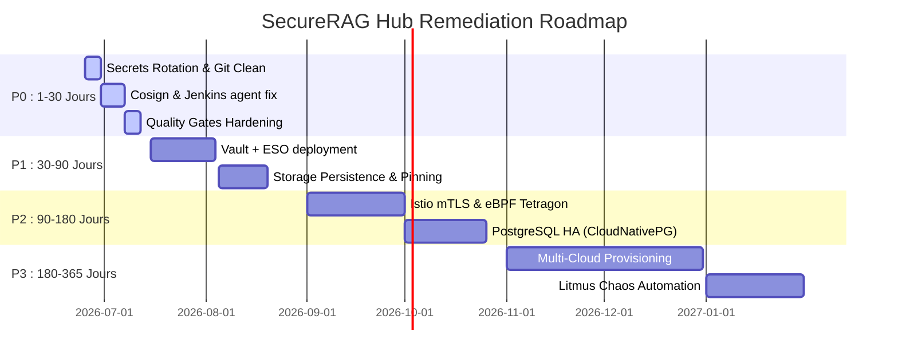

# Phase 15 — Plan d'Amélioration & Feuille de Route (Roadmap)

Ce document présente la feuille de route technologique du projet **SecureRAG Hub** découpée par priorités (P0 à P3) et jalons temporels (30, 60, 90, 180 et 365 jours) pour élever la plateforme au niveau World-Class.

---

## 1. Planification des Actions par Niveau de Priorité

### P0 : Bloquants Immédiats & Correctifs de Sécurité (Effort : Bas, ROI : Maximal)
*   **Rotation des Secrets Applicatifs** : Supprimer du tracking Git les 5 fichiers `.env` commis par erreur et révoquer les clés de chiffrement compromises.
*   **Correction de la Supply Chain** : Installer le binaire `cosign` dans l'image de l'agent de build Jenkins et retirer l'option de contournement TLS `--allow-insecure-registry`.
*   **Durcissement CI/CD** : Forcer Gitleaks à échouer en CI (`--exit-code 1`), activer la génération du format SARIF pour Semgrep et rendre les tests de recette/smoke tests bloquants.

### P1 : Élevations Fondamentales & Secrets Management (Effort : Moyen, ROI : Élevé)
*   **Secrets Dynamiques** : Déployer et initialiser la stack Vault + ESO sur le cluster de production.
*   **Remplacement des Credentials Hardcodés** : Éliminer les identifiants d'administration par défaut (MinIO, Harbor, Keycloak) présents dans les manifestes ArgoCD et les remplacer par des références Vault.
*   **Persistance de l'Observabilité** : Ajouter des volumes persistants (PVC) pour Prometheus, Loki, et MinIO pour garantir la conservation des métriques et des journaux d'audit.
*   **Pinning des versions** : Remplacer l'ensemble des 14 tags d'images `:latest` de l'infrastructure par des versions fixes et signées.

### P2 : Sécurité Avancée & Performance (Effort : Élevé, ROI : Moyen)
*   **mTLS Strict** : Activer le chiffrement réseau inter-services (Istio mTLS) en mode strict.
*   **Runtime Security eBPF** : Activer Tetragon et configurer les politiques d'enforcement système.
*   **Tracing Applicatif** : Activer la stack OpenTelemetry et Grafana Tempo pour le débogage de la latence RAG.
*   **Haute Disponibilité (HA) Base de données** : Migrer l'instance unique PostgreSQL vers un cluster de 3 réplicas géré par CloudNativePG.

### P3 : Excellence Technologique (Effort : Très Élevé, ROI : Long terme)
*   **Multi-Cloud Réel** : Déployer l'infrastructure dans le cloud (AWS EKS, Azure AKS ou GCP GKE) en utilisant les modules Terraform.
*   **Game Days de Chaos Engineering** : Automatiser l'injection de pannes destructives via Litmus Chaos pour valider la tolérance aux pannes en production.
*   **Sigstore Keyless** : Migrer de la gestion par paire de clés Cosign statiques vers le mode d'attestation keyless (Fulcio/Rekor).

---

## 2. Feuille de Route Temporelle (Timeline)

### Jalons Clés :
*   **À 30 Jours (Objectif : 75/100)** : La supply chain est réparée (images signées et SBOM valides), les secrets applicatifs en clair sont éliminés de Git.
*   **À 90 Jours (Objectif : 88/100)** : Vault et ESO gèrent l'ensemble des secrets du cluster, les logs et métriques sont persistés sur disque.
*   **À 180 Jours (Objectif : 94/100)** : La base de données est hautement disponible, le réseau interne est chiffré par mTLS, et la sécurité runtime eBPF protège le cluster.
*   **À 365 Jours (Objectif : 98/100)** : La plateforme s'exécute en multi-cloud de manière élastique et résiliente, conforme aux exigences SOC2 et ISO27001 au niveau Big Tech.
