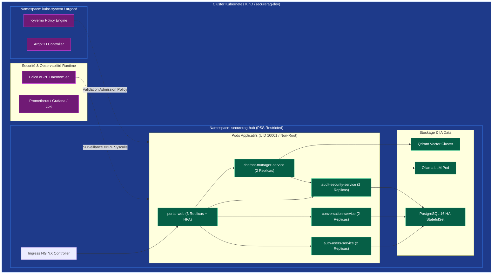
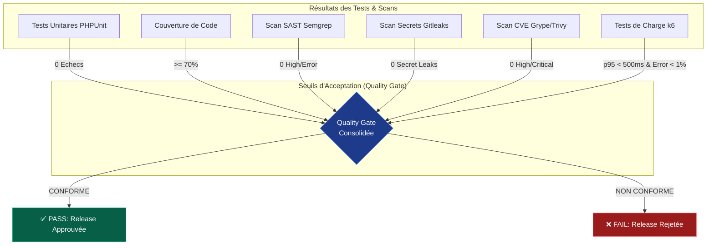

# Guide Complet — Chaîne DevSecOps, Images, Conteneurs & Cluster

> **Projet** : SecureRAG Hub — Architecture DevSecOps  
> **Conformité** : SLSA Level 3/4, Pod Security Standards (PSS) Restricted, OWASP Top 10 API/LLM, Zero Trust Network Architecture.

---

## 1. Vue d'Ensemble & Fonctionnement Général

La chaîne DevSecOps de **SecureRAG Hub** automatise la sécurité à chaque étape du cycle de vie du développement logiciel (*Software Development Life Cycle - SDLC*), depuis le commit du développeur jusqu'à l'exécution en production sur Kubernetes.

### Architecture Globale du Flux DevSecOps

```mermaid
graph TB
    subgraph DevLayer["1. Développement & Git"]
        DEV[Développeur] -->|1. Git Push / PR| GH[GitHub Repository]
        GH -->|2. Webhook OIDC| J[Jenkins CI/CD Server]
    end

    subgraph CILayer["2. Intégration Continue (Jenkinsfile - CI)"]
        J --> PREP[Prepare & Dependencies Cache]
        PREP --> PARALLEL[Parallel Checks & Scans]
        
        subgraph Scans["Analyses Statiques & Sécurité"]
            PARALLEL --> TEST[PHPUnit & Python Tests]
            PARALLEL --> SAST[Semgrep SAST]
            PARALLEL --> SECRETS[Gitleaks Secrets Scan]
            PARALLEL --> SCA[Trivy FS & OWASP DepCheck]
            PARALLEL --> SONAR[SonarQube Quality Gate]
        end

        Scans --> QG1{CI Quality Gate<br/>• Coverage > 70%<br/>• 0 Secrets / 0 SAST Error<br/>• 0 Critical CVE}
        QG1 -->|FAIL| STOP1[❌ Interruption du Pipeline]
    end

    subgraph SupplyChainLayer["3. Supply Chain Security (SLSA L3)"]
        QG1 -->|PASS| BUILD[Docker Multi-Stage Build<br/>Images Pinées SHA256]
        BUILD --> SBOM[Génération SBOM CycloneDX<br/>(Syft)]
        SBOM --> GRYPE[Scan CVE Conteneur<br/>(Grype Fail on High/Critical)]
        GRYPE --> SIGN[Signature Keyless Cosign<br/>(Fulcio OIDC + Rekor Transparency)]
        SIGN --> PROV[Génération SLSA Provenance]
    end

    subgraph CDLayer["4. GitOps & Déploiement Kubernetes"]
        PROV --> GITOPS[Update GitOps Manifests<br/>by SHA256 Digest]
        GITOPS --> ARGO[ArgoCD GitOps Engine]
        ARGO --> K8S[Cluster Kubernetes KinD]

        subgraph K8sAdmission["Admission Control & Runtime Protection"]
            K8S --> KYVERNO[Kyverno Admission Controller<br/>• Verify Cosign Signature<br/>• Enforce PSS Restricted]
            KYVERNO --> PODS[Pods Running<br/>(UID 10001 / Non-Root)]
            PODS --> FALCO[Falco Runtime Security<br/>(eBPF Intrusion Detection)]
        end
    end

    subgraph ValidationLayer["5. Validation Runtime & Performance"]
        PODS --> SMOKE[Smoke Tests HTTP/API]
        SMOKE --> K6[k6 Performance & SLO Gate<br/>• p95 < 500ms<br/>• Error Rate < 1%]
        K6 --> DORA[Generation Evidence & Metrics]
    end

    classDef dev fill:#1f2937,stroke:#4b5563,color:#fff;
    classDef ci fill:#1e1b4b,stroke:#6366f1,color:#fff;
    classDef supply fill:#064e3b,stroke:#059669,color:#fff;
    classDef cd fill:#7c2d12,stroke:#ea580c,color:#fff;
    classDef val fill:#701a75,stroke:#d946ef,color:#fff;

    class DEV,GH,J dev;
    class PREP,PARALLEL,TEST,SAST,SECRETS,SCA,SONAR,QG1,STOP1 ci;
    class BUILD,SBOM,GRYPE,SIGN,PROV supply;
    class GITOPS,ARGO,K8S,KYVERNO,PODS,FALCO cd;
    class SMOKE,K6,DORA val;
```

---

## 2. Détails Exhaustifs des Étapes du Pipeline (`Jenkinsfile`)

Le pipeline est structuré en **22 stages automatisés**, garantissant un contrôle rigoureux avant tout déploiement.

### Table des Étapes du Pipeline

| Étape / Stage | Outil / Technologie | Description & Action Bloquante |
| :--- | :--- | :--- |
| **1. Prepare Workspace** | `git checkout` | Prépare les répertoires d'artefacts (`artifacts/sbom`, `security/reports`) et rend exécutables les scripts CI. |
| **2. Install Dependencies** | `composer`, `npm` | Restaure les paquets depuis le cache PVC persistant (`tar.gz`) en vérifiant les sommes de contrôle `md5sum` des fichiers `.lock`. |
| **3. Parallel Scans** | Multi-thread | Exécute en parallèle les tests unitaires, Semgrep, Gitleaks, Trivy FS et OWASP Dependency Check. |
| **• Unit Tests & Coverage** | PHPUnit | Exécute les tests unitaires des microservices Laravel et collecte le taux de couverture du code (>70% requis). |
| **• Semgrep SAST** | Semgrep | Analyse statique du code PHP/Python pour détecter les vulnérabilités de sécurité (CWE-89 SQLi, XSS, RCE). |
| **• Gitleaks Secrets Scan** | Gitleaks v8 | Recherche les clés privées, mots de passe, tokens JWT ou clés API commités en clair. **Bloquant**. |
| **• Trivy FS Scan** | Trivy | Scanne le système de fichiers et les dépendances du projet contre les vulnérabilités CVE connues. |
| **• OWASP Dep-Check** | OWASP Dependency-Check | Analyse la chaîne de dépendances PHP (Composer) et Node.js (NPM). |
| **4. SonarQube Analysis** | SonarScanner | Calcule la dette technique, les duplications et valide la Quality Gate Sonar. |
| **5. Build Docker Images** | Docker / BuildKit | Compile les images Docker multi-stage pour `portal-web` et les 4 microservices Laravel. |
| **6. Génération SBOM** | Syft / CycloneDX | Génère un inventaire logiciel structuré (SBOM) au format CycloneDX JSON pour chaque image produite. |
| **7. Scan CVE (Grype)** | Grype | Analyse le SBOM généré. **Bloque immédiatement le pipeline** si une vulnérabilité `HIGH` ou `CRITICAL` est trouvée. |
| **8. Signature Cosign** | Cosign Keyless | Signe cryptographiquement les images via le protocole OIDC Sigstore/Fulcio avec transparence Rekor. |
| **9. SLSA Provenance** | Cosign / SLSA Provenance | Atteste de l'origine exacte du build, du commit Git source et des paramètres de compilation (SLSA Level 3). |
| **10. AI Security Agents** | Python Agents | Exécute 6 agents IA spécialisés (Threat Modeling STRIDE, Secure Coding, Kubernetes Audit, DAST, Risk Score). |
| **11. AI Risk Analysis** | Risk Engine | Calcule un **Global Risk Score**. Si `Score >= 50.0`, le déploiement est rejeté. |
| **12. Kubernetes Deploy** | GitOps / Kustomize | Met à jour les manifestes K8s avec les digests SHA256 des nouvelles images et déclenche le refresh d'ArgoCD. |
| **13. Verify Rollout** | `kubectl rollout` | Attend la disponibilité des Pods sur le cluster Kubernetes KinD (timeout 120s). |
| **14. Smoke Tests** | Shell / cURL | Exécute des requêtes de vérification sur l'API publique et les endpoints de santé (`/healthz`). |
| **15. k6 Performance Tests** | k6 | Exécute des tests de charge (Smoke, Load, Stress) pour valider les SLOs de performance. |
| **16. Performance Gate** | Quality Gate | Valide que le **p95 < 500ms**, le taux d'erreur < 1% et la disponibilité > 99%. |

---

## 3. Spécifications des Images & des Conteneurs

Toutes les images applicatives respectent le modèle de conteneurisation sécurisée à 3 étapes.

### Structure du Build Multi-Stage (Exemple `platform/portal-web/Dockerfile`)

```dockerfile
# ── Stage 1: Composer Binary ─────────────────────────────────────
FROM composer:2@sha256:dc292c5c0f95f526b051d4c341bf08e7e2b18504c74625e3203d7f123050e318 AS composer-bin

# ── Stage 2: Builder (compilation des extensions + installation deps)
FROM php:8.4-cli-bookworm@sha256:4714c394e9ea215809c4b68da9fda778044c723435279f7188a251134c64502a AS builder
ENV COMPOSER_ALLOW_SUPERUSER=1
RUN apt-get update && apt-get install -y --no-install-recommends curl unzip libicu-dev libsqlite3-dev libzip-dev libpq-dev \
    && docker-php-ext-install pdo_sqlite pdo_mysql pdo_pgsql intl \
    && apt-get clean && rm -rf /var/lib/apt/lists/*
COPY --from=composer-bin /usr/bin/composer /usr/bin/composer
WORKDIR /var/www/html
COPY platform/portal-web/composer.json platform/portal-web/composer.lock ./
COPY services-laravel/shared-security /var/services-laravel/shared-security
RUN composer install --no-dev --no-interaction --prefer-dist --optimize-autoloader --no-scripts
COPY platform/portal-web ./
RUN composer dump-autoload --optimize && php artisan package:discover --ansi

# ── Stage 3: Runtime Minimal (Sans shell privilégie, non-root UID 10001)
FROM php:8.4-cli-alpine@sha256:f074dc4cd01ef4cba6e3f65301a1c0dad4bde3b3aac923179f6ee6b414e50d1f AS runtime
RUN apk add --no-cache icu-libs libpq sqlite-libs libzip \
    && addgroup -g 10001 app \
    && adduser -u 10001 -G app -H -s /sbin/nologin -D app \
    && rm -rf /var/cache/apk/* /usr/sbin/apk /usr/bin/apk 2>/dev/null || true
COPY --from=builder /usr/local/lib/php/extensions /usr/local/lib/php/extensions
COPY --from=builder /usr/local/etc/php/conf.d /usr/local/etc/php/conf.d
COPY --from=builder /var/www/html /var/www/html
WORKDIR /var/www/html
ENV SECURERAG_RUNTIME_ROOT=/tmp/securerag-runtime
USER 10001:10001
ENTRYPOINT ["docker/entrypoint.sh"]
```

### Principes de Sécurité des Conteneurs

1. **Images de base pinées par Digest** : Aucun tag flottant (`latest` ou `8.4`) n'est autorisé en production. Toutes les images sont associées à leur hachage `sha256` immuable.
2. **Utilisateur Non-Root Obligatoire (UID 10001)** : Le système de fichiers root (`/`) est en lecture seule (*Read-Only Root Filesystem*). Seul le répertoire éphémère `/tmp/securerag-runtime` est accessible en écriture.
3. **Absence d'outils sensibles en Runtime** : `git`, `curl`, `apt`, `apk` et les compilateurs sont supprimés de l'image de runtime pour empêcher l'escalade de privilèges ou le téléchargement de charges utiles malveillantes.

---

## 4. Architecture des Clusters & Ingress Kubernetes

L'environnement de déploiement s'appuie sur un cluster Kubernetes **KinD** (*Kubernetes in Docker*) durci respectant le profil de sécurité **PSS Restricted**.



### Politiques d'Admission Kyverno (Enforce)

Kyverno bloque au niveau du contrôleur d'admission K8s toute tentative de déploiement qui ne respecte pas les règles suivantes :

1. **`disallow-root-execution`** : Rejette tout Pod ayant `runAsNonRoot: false` ou `runAsUser: 0`.
2. **`verify-image-signature`** : Vérifie cryptographiquement que l'image du conteneur est signée par la clé/identité Cosign autorisée.
3. **`enforce-read-only-root-filesystem`** : Exige que `readOnlyRootFilesystem: true` soit configuré sur le conteneur.
4. **`drop-all-capabilities`** : Exige la suppression de toutes les privilèges Linux (`capabilities: drop: ["ALL"]`).

---

## 5. Cadre de Tests, Métriques & Quality Gate

Le pipeline impose un **Quality Gate consolidé** qui évalue plusieurs catégories de tests et de scans avant d'autoriser la promotion.

### Matrice du Quality Gate



### Critères de Validation k6 Performance & SLO

Les tests de performance k6 valident 3 scénarios (Smoke, Load, Stress) avec les contraintes SLO suivantes :

- **Latence p95** : $\le 500\text{ ms}$ sur l'ensemble des endpoints API.
- **Latence p99** : $\le 1000\text{ ms}$.
- **Taux d'erreur HTTP** : $< 1.0\%$.
- **Disponibilité globale** : $\ge 99.0\%$.

---

## 6. Synthèse des Fichiers de Référence

- **Pipeline CI principal** : [`Jenkinsfile`](file:///root/MasterPFE/Jenkinsfile)
- **Validation Dockerfiles Production** : [`scripts/validate/validate-production-dockerfiles.sh`](file:///root/MasterPFE/scripts/validate/validate-production-dockerfiles.sh)
- **Script Quality Gate** : [`scripts/ci/quality-gate.sh`](file:///root/MasterPFE/scripts/ci/quality-gate.sh)
- **Politiques Kyverno** : [`infra/k8s/policies/kyverno/`](file:///root/MasterPFE/infra/k8s/policies/kyverno/)
- **Document d'Architecture Globale** : [`docs/architecture.md`](file:///root/MasterPFE/docs/architecture.md)
