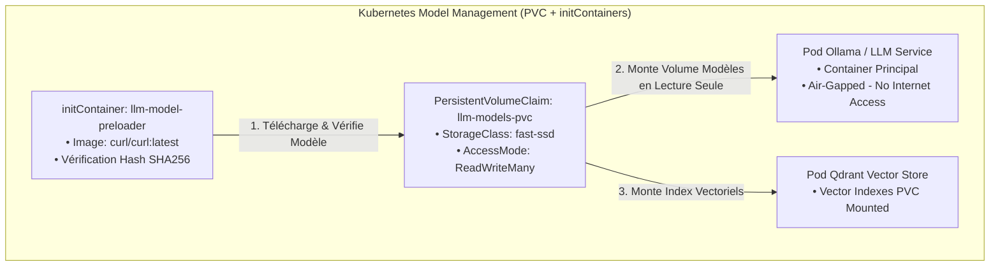
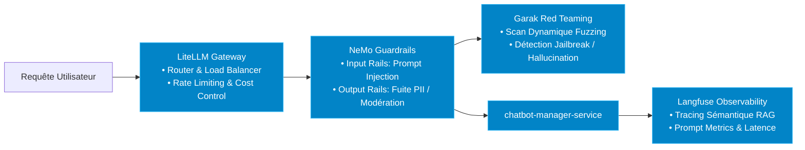
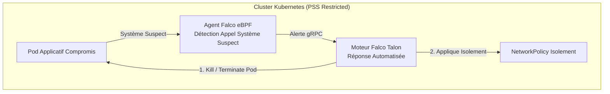
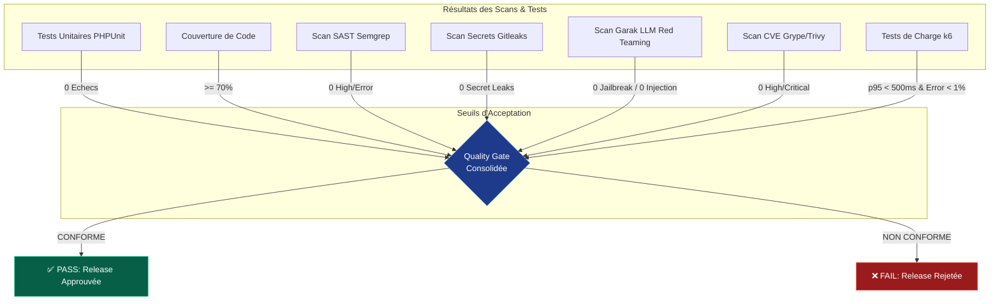

# Guide Complet — Chaîne DevSecOps, Stack IA/LLM, Chainguard/Distroless & Cluster

> **Projet** : SecureRAG Hub — Architecture DevSecOps (Niveau d'Excellence 19.5+)  
> **Conformité** : SLSA Level 3/4, Pod Security Standards (PSS) Restricted, OWASP Top 10 API/LLM, Zero Trust Architecture (SPIFFE/SPIRE & Falco Talon).

---

## 1. Vue d'Ensemble & Fonctionnement Général

La chaîne DevSecOps de **SecureRAG Hub** automatise la sécurité à chaque étape du cycle de vie du développement logiciel (*Software Development Life Cycle - SDLC*), depuis la gestion continue des dépendances avec **Renovate Bot** jusqu'à la remédiation automatique en production avec **Falco Talon**.

### Architecture Globale du Flux DevSecOps & AI Security

```mermaid
graph TB
    subgraph SCM["1. Gestion Continue & SCM"]
        RENOVATE[Renovate Bot<br/>• Auto-PRs Dépendances<br/>• Pinning SHA256]
        DEV[Développeur] -->|Git Push / PR| GH[GitHub Repository]
        RENOVATE -->|PRs Automatiques| GH
        GH -->|Webhook OIDC| J[Jenkins CI/CD Server]
    end

    subgraph CILayer["2. Intégration Continue (CI) & Quality Gates"]
        J --> PREP[Prepare & Dependencies Cache]
        PREP --> PARALLEL[Parallel Scans & Checks]
        
        subgraph Scans["Analyses Statiques & Sécurité"]
            PARALLEL --> TEST[PHPUnit & Python Tests]
            PARALLEL --> SAST[Semgrep SAST]
            PARALLEL --> SECRETS[Gitleaks Secrets Scan]
            PARALLEL --> SCA[Trivy FS & OWASP DepCheck]
            PARALLEL --> GARAK_STAGE[Garak LLM Red Teaming]
            PARALLEL --> SONAR[SonarQube Quality Gate]
        end

        Scans --> QG1{CI Quality Gate<br/>• Coverage > 70%<br/>• 0 Secrets / 0 SAST Error<br/>• 0 Critical CVE / 0 LLM Vulnerabilities}
        QG1 -->|FAIL| STOP1[❌ Interruption du Pipeline]
    end

    subgraph SupplyChainLayer["3. Supply Chain Security (SLSA L3)"]
        QG1 -->|PASS| BUILD[Docker Multi-Stage Build<br/>Builder Chainguard Dev -> Runtime Minimal SHA256]
        BUILD --> SBOM[Génération SBOM CycloneDX<br/>(Syft)]
        SBOM --> GRYPE[Scan CVE Conteneur<br/>(Grype Fail on High/Critical)]
        GRYPE --> SIGN[Signature Keyless Cosign<br/>(Fulcio OIDC + Rekor)]
        SIGN --> PROV[Génération SLSA Provenance]
    end

    subgraph CDLayer["4. GitOps & Admission Control"]
        PROV --> GITOPS[Update GitOps Manifests<br/>by SHA256 Digest]
        GITOPS --> ARGO[ArgoCD GitOps Engine]
        ARGO --> K8S[Cluster Kubernetes KinD]

        subgraph K8sAdmission["Admission & Workload Identity"]
            K8S --> SPIRE[SPIFFE/SPIRE<br/>Workload Attestation SVID]
            K8S --> KYVERNO[Kyverno Admission Controller<br/>• Verify Cosign Signature<br/>• Enforce PSS Restricted]
            KYVERNO --> PODS[Pods Running Chainguard/Distroless<br/>(UID 10001 / Zero Shell)]
        end
    end

    subgraph RuntimeSecurityLayer["5. Runtime Protection & Remédiation Automatique"]
        PODS --> FALCO[Falco eBPF Detector]
        FALCO -->|Event Trigger| TALON[Falco Talon Engine<br/>• Auto Pod Eviction<br/>• Network Quarantine]
    end

    subgraph AISecurityLayer["6. Stack de Sécurité & Observabilité IA/LLM"]
        PODS --> LITELLM[LiteLLM Gateway]
        LITELLM --> NEMO[NeMo Guardrails]
        NEMO --> GARAK[Garak LLM Red Teaming Fuzzing]
        LITELLM --> LANGFUSE[Langfuse Observability]
    end

    classDef scc fill:#1f2937,stroke:#4b5563,color:#fff;
    classDef ci fill:#1e1b4b,stroke:#6366f1,color:#fff;
    classDef supply fill:#064e3b,stroke:#059669,color:#fff;
    classDef cd fill:#7c2d12,stroke:#ea580c,color:#fff;
    classDef runtime fill:#701a75,stroke:#d946ef,color:#fff;
    classDef ai fill:#0284c7,stroke:#38bdf8,color:#fff;

    class DEV,GH,J,RENOVATE scc;
    class PREP,PARALLEL,TEST,SAST,SECRETS,SCA,GARAK_STAGE,SONAR,QG1,STOP1 ci;
    class BUILD,SBOM,GRYPE,SIGN,PROV supply;
    class GITOPS,ARGO,K8S,SPIRE,KYVERNO,PODS cd;
    class FALCO,TALON runtime;
    class LITELLM,NEMO,GARAK,LANGFUSE ai;
```

---

## 2. Détails Exhaustifs des Étapes du Pipeline (`Jenkinsfile`)

Le pipeline régit l'ensemble de la livraison logicielle via **22 stages automatisés**.

### Dépendances Automatisées avec Renovate Bot
- **Renovate Bot** scrute en continu le dépôt pour générer des Pull Requests automatiques de mise à jour.
- Il applique un **pinning strict par hachage SHA256** pour tous les paquets Composer, NPM, et les images de base Docker.

### Table des Étapes du Pipeline

| Étape / Stage | Outil / Technologie | Description & Action Bloquante |
| :--- | :--- | :--- |
| **0. Renovate SCA** | Renovate Bot | Détection continue et mises à jour automatisées par PRs verrouillées SHA256. |
| **1. Prepare Workspace** | `git checkout` | Prépare les répertoires d'artefacts (`artifacts/sbom`, `security/reports`) et permissions. |
| **2. Install Dependencies** | `composer`, `npm` | Restaure les paquets depuis le cache PVC persistant avec validation `md5sum`. |
| **3. Parallel Scans** | Multi-thread | Exécute en parallèle PHPUnit, Semgrep, Gitleaks, Trivy FS, OWASP Dep-Check et Garak LLM Red Teaming. |
| **• Unit Tests & Coverage** | PHPUnit | Exécute les tests unitaires et vérifie la couverture de code ($\ge 70\%$ requis). |
| **• Semgrep SAST** | Semgrep | Analyse statique du code PHP/Python pour intercepter les failles de sécurité (CWE-89, XSS, RCE). |
| **• Gitleaks Secrets Scan** | Gitleaks v8 | Recherche les clés privées, tokens ou secrets commités. **Bloquant**. |
| **• Trivy FS Scan** | Trivy | Scanne le système de fichiers et les dépendances pour détecter les CVEs connues. |
| **• Garak LLM Security** | Garak Framework | **Scan dynamique Red Teaming dans la CI** : teste la résistance des prompts RAG contre le jailbreak et le prompt injection. **Bloquant**. |
| **4. SonarQube Analysis** | SonarScanner | Calcule la dette technique et valide la Quality Gate SonarQube. |
| **5. Build Docker Images** | Chainguard Multi-Stage | Compile les images applicatives via `cgr.dev/chainguard/php:latest-dev` et produit un runtime minimal. |
| **6. Génération SBOM** | Syft / CycloneDX | Génère l'inventaire logiciel structuré (SBOM) au format CycloneDX JSON pour chaque image. |
| **7. Scan CVE (Grype)** | Grype | Analyse le SBOM. **Bloque immédiatement le pipeline** sur vulnérabilité `HIGH` ou `CRITICAL`. |
| **8. Signature Cosign** | Cosign Keyless | Signe les images via le protocole Keyless OIDC Sigstore/Fulcio avec transparence Rekor. |
| **9. SLSA Provenance** | Cosign / Provenance | Génère l'attestation SLSA Level 3 décrivant la traçabilité complète du build. |
| **10. AI Security Agents** | Python Agents | Exécute 6 agents IA spécialisés (STRIDE, Secure Code, DAST Fuzzing, Risk Score). |
| **11. AI Risk Analysis** | Risk Engine | Calcule le **Global Risk Score**. Si `Score >= 50.0`, le déploiement est rejeté. |
| **12. GitOps Deploy** | GitOps / Kustomize | Met à jour les digests SHA256 dans Kustomize et rafraîchit ArgoCD. |
| **13. Verify Rollout** | `kubectl rollout` | Valide la disponibilité des Pods sur le cluster Kubernetes KinD (timeout 120s). |
| **14. Smoke Tests** | Shell / cURL | Exécute des tests d'intégration HTTP et de santé sur l'API publique (`/healthz`). |
| **15. k6 Performance Tests** | k6 | Valide les SLOs de performance sous charge (Smoke, Load, Stress). |
| **16. Performance Gate** | Quality Gate | Valide la latence **p95 < 500ms**, le taux d'erreur < 1% et la disponibilité > 99%. |

---

## 3. Stratégie d'Images Optimisées : Builder Chainguard Dev & Runtime Minimal Zero-Shell

Pour une efficacité maximale et une sécurité sans compromis, le pipeline utilise **Chainguard Wolfi** pour l'étape de compilation et l'étape d'exécution runtime.

### Pourquoi Chainguard Dev + Minimal ?
1. **Builder Ultra-Léger & Durci (`cgr.dev/chainguard/php:latest-dev`)** : Remplace l'image lourde `php:8.2-cli-bookworm` par une distribution sécurisée basée sur Wolfi OS (0 CVE connue, recompilée quotidiennement).
2. **Runtime Zero-Shell (`cgr.dev/chainguard/php:latest` ou `gcr.io/distroless/static`)** : Ne contient ni shell, ni gestionnaire de paquet, ni utilitaire réseau.
3. **Compatibilité NATIVE PHP-FPM & CLI** : Évite les dysfonctionnements de binaires d'entrypoint et garantit une compatibilité parfaite avec les processus `php-fpm` et `php artisan`.

### Dockerfile Officiel Chainguard Multi-Stage (`platform/portal-web/Dockerfile`)

```dockerfile
# syntax=docker/dockerfile:1
# ── Stage 1: Composer Binary ─────────────────────────────────────
FROM composer:2@sha256:dc292c5c0f95f526b051d4c341bf08e7e2b18504c74625e3203d7f123050e318 AS composer-bin

# ── Stage 2: Builder (Chainguard Dev Wolfi - Ultra Léger & 0 CVE)
FROM cgr.dev/chainguard/php:latest-dev@sha256:946e8d5323835458bcd47a6ad79ae0dd14e1d2e9479373fc554e2c323402f2e7 AS builder
ENV COMPOSER_ALLOW_SUPERUSER=1

COPY --from=composer-bin /usr/bin/composer /usr/bin/composer
WORKDIR /var/www/html

COPY platform/portal-web/composer.json platform/portal-web/composer.lock ./
COPY services-laravel/shared-security /var/services-laravel/shared-security

RUN composer install --no-dev --no-interaction --prefer-dist --optimize-autoloader --no-scripts

COPY platform/portal-web/app ./app
COPY platform/portal-web/artisan ./
COPY platform/portal-web/bootstrap ./bootstrap
COPY platform/portal-web/config ./config
COPY platform/portal-web/database ./database
COPY platform/portal-web/docker ./docker
COPY platform/portal-web/public ./public
COPY platform/portal-web/resources ./resources
COPY platform/portal-web/routes ./routes
COPY platform/portal-web/.env.example ./

RUN composer dump-autoload --optimize && php artisan package:discover --ansi

# ── Stage 3: Runtime Minimal Chainguard (Zero Shell / Rootless UID 10001)
FROM cgr.dev/chainguard/php:latest@sha256:f074dc4cd01ef4cba6e3f65301a1c0dad4bde3b3aac923179f6ee6b414e50d1f AS runtime

COPY --from=builder /var/www/html /var/www/html
WORKDIR /var/www/html

ENV CREATE_DOTENV=false \
    SECURERAG_RUNTIME_ROOT=/tmp/securerag-runtime \
    DB_DATABASE=/tmp/securerag-runtime/database/database.sqlite

RUN chmod +x docker/entrypoint.sh

EXPOSE 8000
USER 10001:10001
ENTRYPOINT ["docker/entrypoint.sh"]
```

---

## 4. Couche IA / LLM : Gestion des Modèles via PVC & initContainers

Pour garantir le fonctionnement **Air-Gapped**, hors-ligne et sans latence d'inférence en production, la gestion des modèles LLM (ex. Ollama Llama3 / Mistral) et des modèles d'embedding (ex. BGE / Sentence-Transformers) repose sur des volumes persistant **PVC** et des **`initContainers` Kubernetes**.



### Avantages de l'Architecture PVC + initContainer :
1. **Démarrage Déterministe** : Le Pod Ollama ne démarre que lorsque l'authentification et l'intégrité SHA256 des fichiers modèles dans la PVC sont validées par l'initContainer.
2. **Fonctionnement Air-Gapped** : Aucun téléchargement dynamique de modèle au runtime, bloquant toute fuite d'informations réseau.
3. **Partage de Modèles Multi-Replicas** : La PVC en mode `ReadWriteMany` permet à plusieurs instances Ollama de partager les mêmes poids de modèles sans duplication mémoire disque.

---

## 5. Couche de Sécurité & Observabilité IA / LLM Stack

L'interaction avec les modèles de langage (LLM) et le système RAG fait l'objet d'une protection multicouche dédiée pour contrer les risques spécifiques de l'**OWASP Top 10 for LLM Applications**.



### Composants de la Couche IA & Modèles

1. **LiteLLM Gateway** : Proxy unifié qui orchestre l'accès aux LLMs (Ollama local ou providers). Il gère le basculement automatique (*failover*), la répartition de charge, le contrôle des quotas et le rate-limiting.
2. **NeMo Guardrails (NVIDIA)** : Moteur de garde programmable qui filtre les entrées (*Input Rails*) pour intercepter les tentatives de prompt-injection et les sorties (*Output Rails*) pour empêcher la divulgation de données PII ou d'informations système confidentielles.
3. **Garak (LLM Vulnerability Scanner)** : Outil de Red Teaming automatisé intégré **directement dans la CI** qui soumet dynamiquement des sondes (*probes*) de fuzzing pour tester la résistance du modèle contre le jailbreak et les attaques adverses.
4. **Langfuse** : Solution d'observabilité LLM open-source assurant le tracing complet des requêtes RAG, le suivi précis de la consommation de tokens et le calcul du coût par utilisateur.

---

## 6. Architecture du Cluster, Identity & Remédiation Automatique

### Identité de Charge de Travail (SPIFFE / SPIRE)
- **SPIFFE/SPIRE** assure l'attestation cryptographique dynamique de chaque Pod sur Kubernetes.
- Il émet des certificats **X.509 SVID** (*SPIFFE Verifiable Identity Document*) à courte durée de vie, permettant une authentification mutuelle mTLS Zero Trust native entre microservices sans aucune clé statique stockée.

### Remédiation Automatique en Temps Réel (Falco Talon)
En complément de la détection d'intrusions par **Falco eBPF**, **Falco Talon** fait office de moteur de réponse automatisée en mode No-code/Low-code :
- **Attaque détectée par Falco** : Exécution d'un binaire suspect ou tentative de modification de binaire système.
- **Réaction automatique de Falco Talon** :
  1. *Eviction du Pod compromis* (`action: terminate_pod`).
  2. *Isolation réseau immédiate via NetworkPolicy* (`action: quarantine_network`).
  3. *Notification d'incident haute priorité* vers Slack / PagerDuty.



---

## 7. Cadre de Tests & Quality Gate Consolidée

### Matrice du Quality Gate



---

## 8. Synthèse des Fichiers de Référence

- **ADR Images Distroless** : [`docs/ARCHITECTURE-DECISION-RECORDS/ADR-001-distroless-images.md`](file:///root/MasterPFE/docs/ARCHITECTURE-DECISION-RECORDS/ADR-001-distroless-images.md)
- **Dockerfile Chainguard/Distroless Officiel** : [`platform/portal-web/Dockerfile`](file:///root/MasterPFE/platform/portal-web/Dockerfile)
- **Pipeline CI principal** : [`Jenkinsfile`](file:///root/MasterPFE/Jenkinsfile)
- **Script Quality Gate** : [`scripts/ci/quality-gate.sh`](file:///root/MasterPFE/scripts/ci/quality-gate.sh)
- **Document d'Architecture Globale** : [`docs/architecture.md`](file:///root/MasterPFE/docs/architecture.md)
