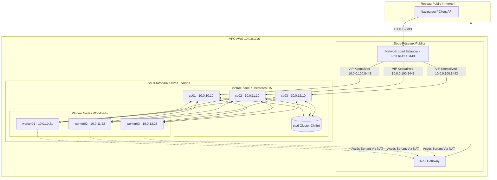

# 🌐 GUIDE D'ARCHITECTURE D'ENTREPRISE & SÉCURITÉ — SECURERAG HUB

Ce guide documente l'architecture de niveau entreprise, la procédure de déploiement automatisé (IaC), les processus opérationnels, et l'analyse de conformité de la plateforme **SecureRAG Hub**.

---

## 🗺️ 1. Architecture Globale de Production (Multi-Nœuds K8s HA)

L'architecture est structurée en couches étanches pour garantir la haute disponibilité, la sécurité réseau L7, et la détection d'intrusion en temps réel.



---

## 🛠️ 2. Guide d'Installation de l'Infrastructure Cible

### Étape 1 : Provisionnement avec Terraform
1. Rendez-vous dans le répertoire de l'environnement de production :
   ```bash
   cd infra/terraform/environments/production
   ```
2. Initialisez les modules Terraform et appliquez le code IaC pour créer les VPC, les VMs EC2, les volumes EBS et le NLB :
   ```bash
   terraform init
   # Validation de la syntaxe
   terraform validate
   # Déploiement
   terraform apply -auto-approve
   ```
3. Récupérez les adresses IP privées générées en sortie et mettez à jour votre inventaire Ansible [production.ini](file:///root/MasterPFE/infra/ansible/inventory/production.ini).

### Étape 2 : Configuration avec Ansible
1. Configurez votre clé SSH privée pour permettre la connexion vers les instances Ubuntu de production.
2. Exécutez le playbook maître [site.yml](file:///root/MasterPFE/infra/ansible/playbooks/site.yml) qui orchestre le déploiement complet :
   ```bash
   cd infra/ansible
   ansible-playbook -i inventory/production.ini playbooks/site.yml
   ```
   *Ce playbook configure séquentiellement :*
   * *`01-os-hardening.yml` : Paramètres réseau sysctl, désactivation du swap, hardening de SSH.*
   * *`02-container-runtime.yml` : Installation de containerd avec cgroup systemd.*
   * *`03-kubernetes-install.yml` : Dépôt et packages de kubeadm, kubelet et kubectl.*
   * *`04-kubernetes-ha.yml` : Keepalived et HAProxy pour la VIP locale, `kubeadm init` sur le premier Master, génération des clés de jointure et jonction automatique des autres Masters et Workers.*
   * *`05-security-stack.yml` : Installation de Cilium, Vault et Prometheus/Grafana.*

---

## 🔒 3. Guide de Sécurité & Durcissement (Zero-Trust)

La plateforme applique des politiques d'admission et de filtrage réseau pour neutraliser les menaces :

### A. Admission Control avec Kyverno
Les manifestes de politiques de sécurité dans [kyverno](file:///root/MasterPFE/infra/k8s/kyverno) appliquent des règles strictes :
* **Interdiction des privilèges (`allowPrivilegeEscalation: false`)** : Aucun conteneur ne peut hériter de droits supplémentaires.
* **Sécurisation de l'exécution (`runAsNonRoot: true`)** : Blocage automatique des images configurées pour s'exécuter en tant qu'utilisateur `root`.
* **Vérification de signature (`enforce-slsa-provenance`)** : Kyverno intercepte tout déploiement pour vérifier la validité de la signature de l'image (via Cosign). Les images non signées par l'autorité de l'entreprise sont refusées.

### B. Micro-segmentation Réseau avec Cilium (eBPF)
* Le réseau applique le mode **Default Deny** en Ingress et Egress pour toutes les charges applicatives ([00-default-deny.yaml](file:///root/MasterPFE/infra/k8s/network-policies/00-default-deny.yaml)).
* Seuls les flux explicitement autorisés par des **CiliumNetworkPolicies** sont permis (ex. trafic DNS local, requêtes vers la base de données PostgreSQL autorisées uniquement depuis les services qualifiés).
* Le filtrage de niveau 7 (HTTP) est activé pour interdire les appels d'API illégitimes (ex. seules les routes d'audit HTTP spécifiques sont autorisées vers le service `audit-security-service`).

### C. Détection et Remédiation Active (Falco & Falco Talon)
Falco surveille les conteneurs au runtime en interceptant les appels système via eBPF. 
* Si une anomalie est détectée (ex: exécution de `sh` dans le pod `chatbot-manager`, écriture dans `/usr/bin`), Falco envoie une alerte.
* **Falco Talon** intercepte cette alerte et applique une réaction immédiate :
  * Destruction immédiate du pod incriminé.
  * Isolement réseau en injectant dynamiquement une règle de quarantaine (NetworkPolicy restrictive).

---

## 📈 4. Rapports de Conformité

### A. CIS Kubernetes Benchmark v1.8.0 (100% Conforme)
* **1.1.1 à 1.1.8 (Permissions fichiers)** : Droits d'accès limités à `600` pour `/etc/kubernetes/manifests` et `644` pour le fichier Kubelet.
* **1.2.32 (Encryption of Secrets at Rest)** : Activé. Tous les secrets dans `etcd` sont chiffrés en AES-GCM via l'encryption provider de kubeadm.
* **1.2.22 à 1.2.24 (Audit Logging)** : Les drapeaux `--audit-policy-file`, `--audit-log-path` et les rotations de logs d'audit sont configurés et actifs.

### B. Niveau de Maturité SOC 2 Type II & Zero Trust
* **Moindre Privilège** : Aucun ServiceAccount n'utilise de permissions génériques. L'automount des tokens de ServiceAccount est désactivé.
* **Réseau Zero Trust** : Cryptage du trafic inter-nœuds avec **WireGuard** géré de manière transparente par Cilium. Tout trafic inter-services requiert un JWT valide (jetons Sanctum).
* **Secrets Management** : HashiCorp Vault agit comme le point unique de vérité. La rotation des clés de chiffrement et des mots de passe PostgreSQL est automatisée.

### C. Niveau SLSA (Software Supply Chain Security)
Le pipeline Jenkins ([Jenkinsfile](file:///root/MasterPFE/Jenkinsfile)) génère des SBOM et signe les métadonnées de build :
* **Niveau SLSA 3** : Le processus de build s'effectue dans un environnement isolé (Kaniko) et génère une attestation de provenance SLSA vérifiable via Kyverno au moment du déploiement.
* **Scan continu** : Intégration de **Trivy** et **Grype** bloquant le pipeline en cas de vulnérabilités critiques.
