# SecureRAG Hub — Diagrammes Mermaid pas à pas DevSecOps

Ce document fournit des diagrammes Mermaid prêts à copier dans le mémoire, la soutenance ou la documentation technique. Le périmètre est strictement DevSecOps, Kubernetes, sécurité, supply chain, observabilité, résilience et preuves.

## 1. Vue globale DevSecOps

```mermaid
flowchart LR
  A["Développeur / Git"] --> B["Jenkins CI"]
  B --> C["Contrôles qualité et sécurité"]
  C --> D["Build images OCI"]
  D --> E["Supply chain"]
  E --> F["Promotion par digest"]
  F --> G["Jenkins CD"]
  G --> H["Kubernetes production-like"]
  H --> I["Preuves runtime"]
  I --> J["Support pack final"]
```

## 2. Gouvernance du dépôt

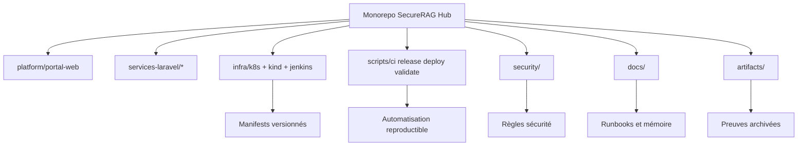

## 3. Déclenchement CI Jenkins

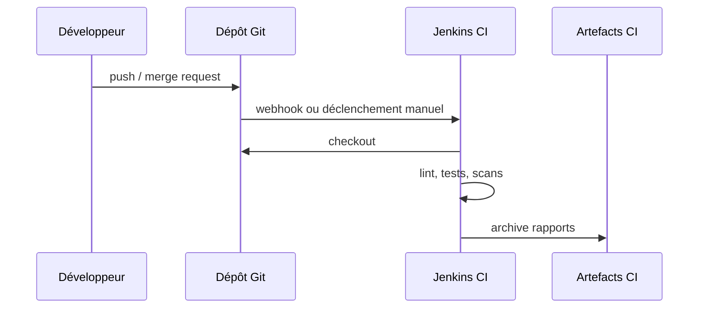

## 4. Pipeline CI qualité

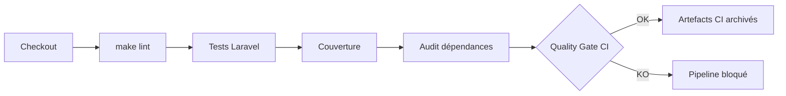

## 5. Contrôles sécurité code

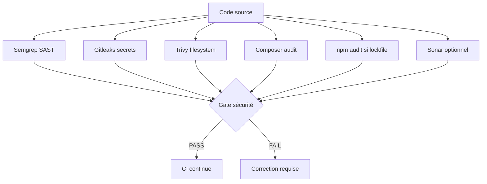

## 6. Validation statique Kubernetes

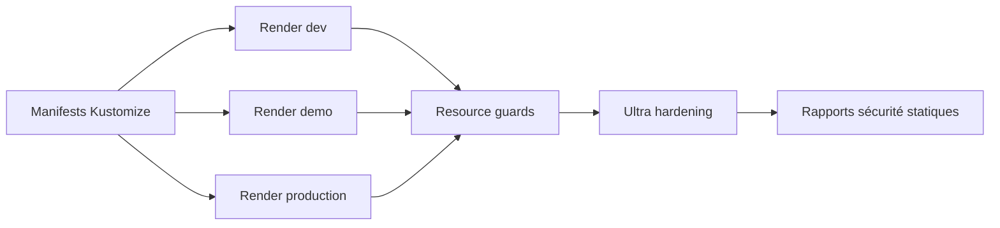

## 7. Construction des images OCI

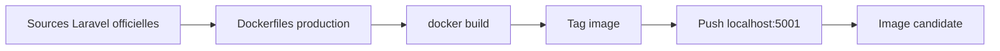

## 8. Scan image Trivy

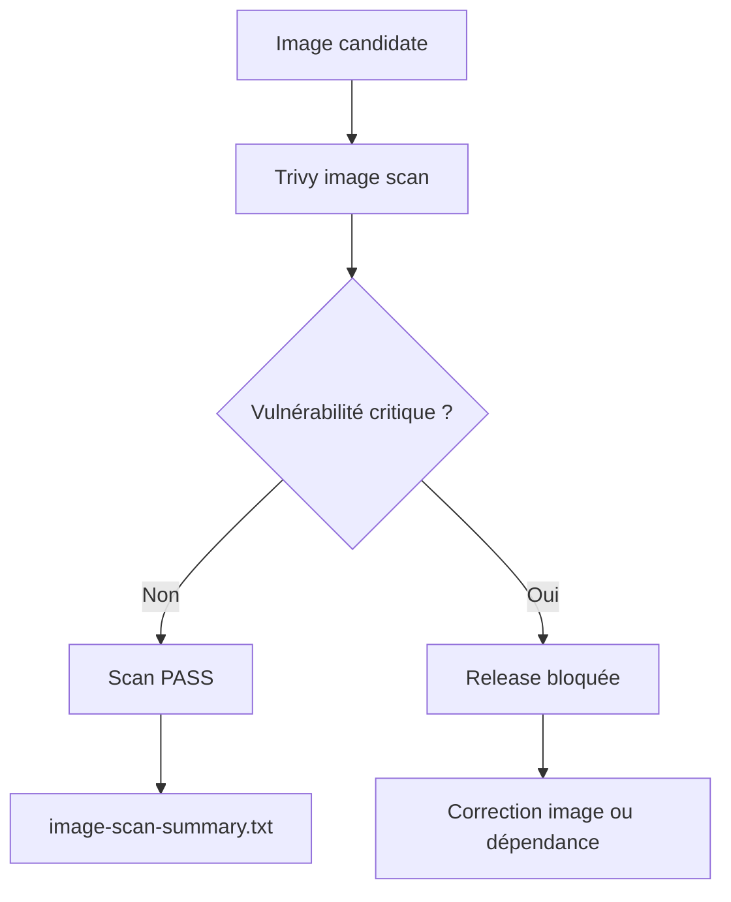

## 9. Génération SBOM Syft

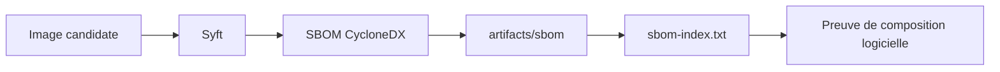

## 10. Signature Cosign

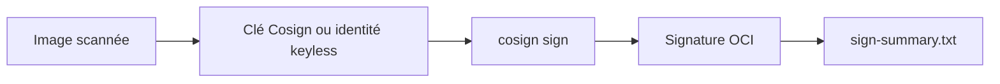

## 11. Vérification Cosign

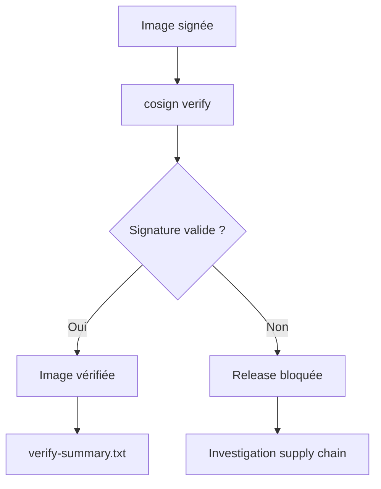

## 12. Promotion par digest

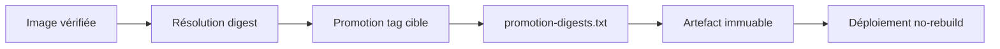

## 13. Gate release obligatoire

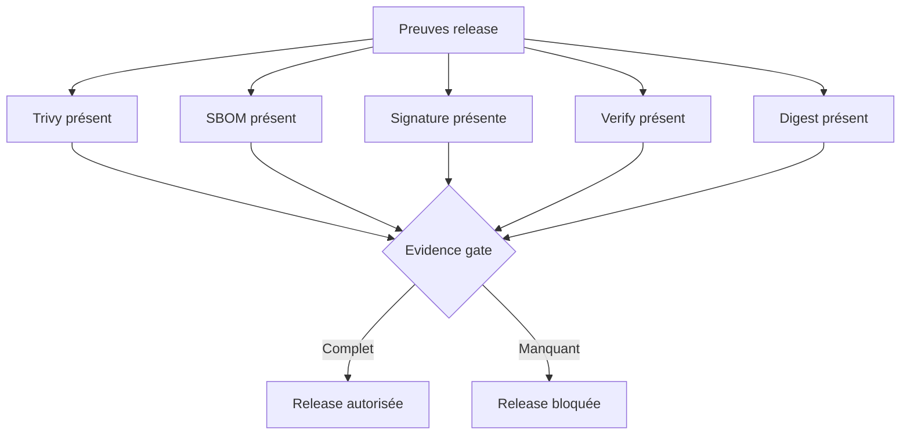

## 14. Déploiement CD sans rebuild

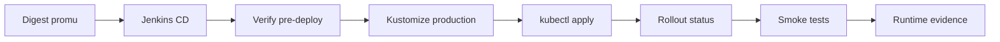

## 15. Architecture Kubernetes production-like

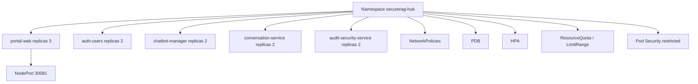

## 16. Durcissement Kubernetes

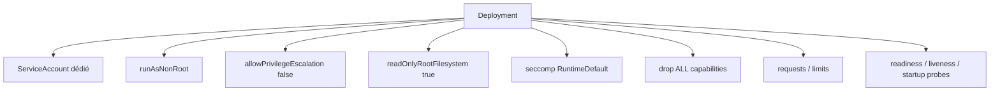

## 17. Séparation production / legacy

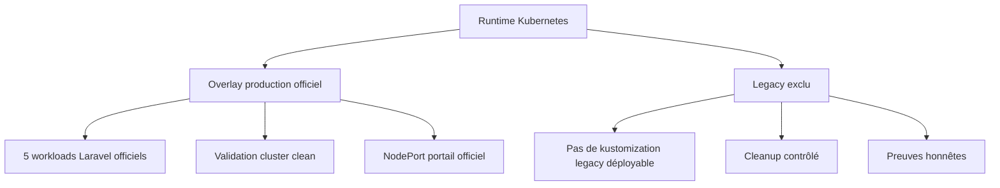

## 18. metrics-server et HPA runtime

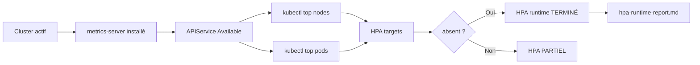

## 19. Kyverno Audit

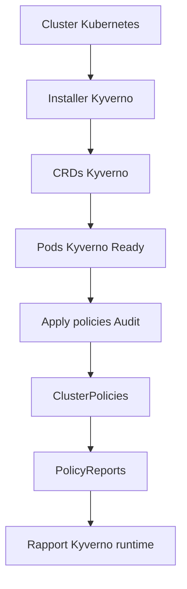

## 20. Préparation Kyverno Enforce

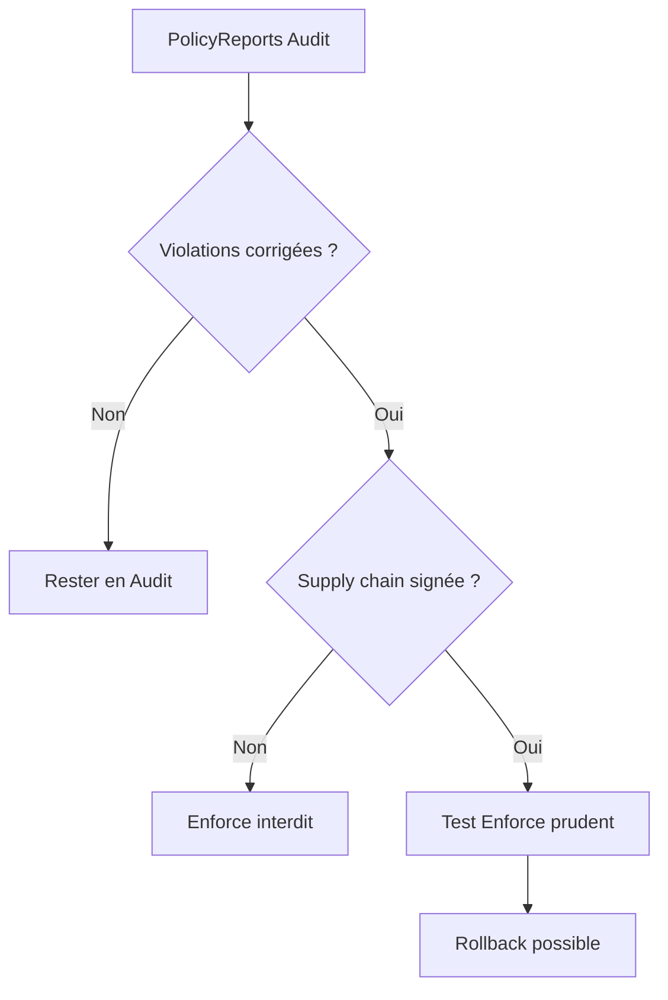

## 21. Secrets management

```mermaid
flowchart TD
  A["Secrets strategy"] --> B["Aucun secret réel dans Git"]
  A --> C["Bootstrap local"]
  A --> D["Credentials Jenkins"]
  A --> E["Secrets Kubernetes"]
  A --> F["Rotation documentée"]

  B --> G[".env.example uniquement"]
  C --> H["scripts/secrets"]
  D --> I["infra/jenkins/secrets local"]
  E --> J["secretRef workloads"]
```

## 22. DB externe, backup et restore

```mermaid
flowchart LR
  A["Workloads Laravel"] --> B["DB externe PostgreSQL"]
  B --> C["Backup"]
  C --> D["Archive backup"]
  D --> E["Restore test"]
  E --> F{"Restore OK ?"}
  F -->|Oui| G["Preuve résilience données"]
  F -->|Non| H["Runbook incident"]
```

## 23. Observabilité runtime

```mermaid
flowchart TD
  A["Cluster runtime"] --> B["Deployments / Pods / Services"]
  A --> C["PDB / HPA"]
  A --> D["Events Kubernetes"]
  A --> E["Logs applicatifs"]
  A --> F["kubectl top"]
  A --> G["Kyverno PolicyReports"]

  B --> H["observability-snapshot.md"]
  C --> H
  D --> H
  E --> H
  F --> H
  G --> H
```

## 24. Support pack final

```mermaid
flowchart LR
  A["Artefacts CI"] --> F["Support pack"]
  B["Artefacts release"] --> F
  C["Artefacts Kubernetes"] --> F
  D["Artefacts sécurité"] --> F
  E["Runbooks"] --> F
  F --> G["Archive finale"]
  G --> H["Mémoire / Soutenance"]
```

## 25. Tableau d’état final

```mermaid
flowchart TD
  A["Collecte preuves"] --> B["TERMINÉ"]
  A --> C["PARTIEL"]
  A --> D["PRÊT_NON_EXÉCUTÉ"]
  A --> E["DÉPENDANT_DE_L_ENVIRONNEMENT"]

  B --> F["Contrôle prouvé"]
  C --> G["Contrôle incomplet"]
  D --> H["Scripts prêts mais non lancés"]
  E --> I["Dépend de Docker/kind/registry/outils"]

  F --> J["Tableau final global"]
  G --> J
  H --> J
  I --> J
```

## 26. Chaîne complète de preuves

```mermaid
flowchart LR
  A["CI reports"] --> B["Security reports"]
  B --> C["Image scan"]
  C --> D["SBOM"]
  D --> E["Signature"]
  E --> F["Verify"]
  F --> G["Digest promotion"]
  G --> H["Deploy evidence"]
  H --> I["Runtime evidence"]
  I --> J["Support pack"]
```

