# SecureRAG Hub — Diagrammes Mermaid DevSecOps

Ce document regroupe les diagrammes Mermaid principaux de la chaine DevSecOps du projet \texttt{SecureRAG Hub}. Chaque bloc peut etre copie tel quel dans un document Markdown, un README, une documentation interne ou un support de soutenance compatible Mermaid.

## 1. Vue globale DevSecOps

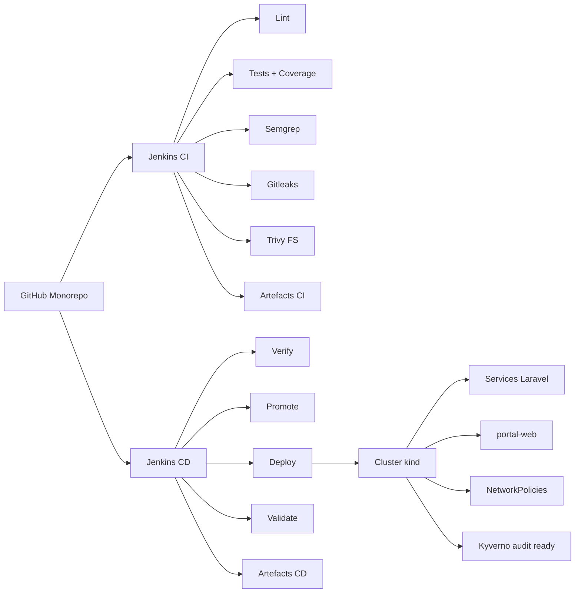

## 2. Pipeline CI Jenkins

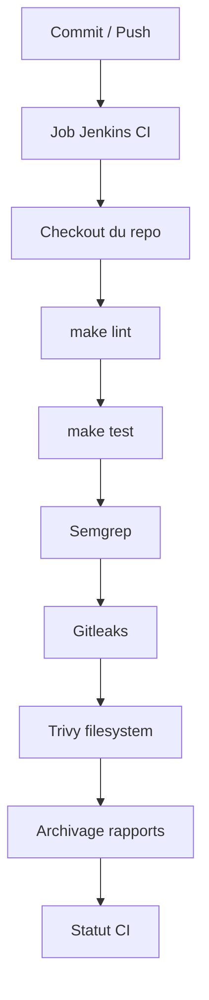

## 3. Pipeline CD et supply chain

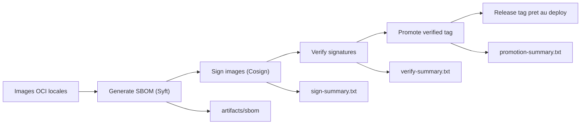

## 4. Job Jenkins CD

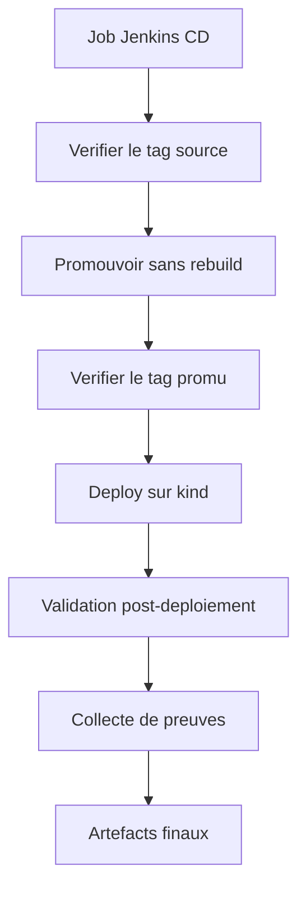

## 5. Deploiement Kubernetes local

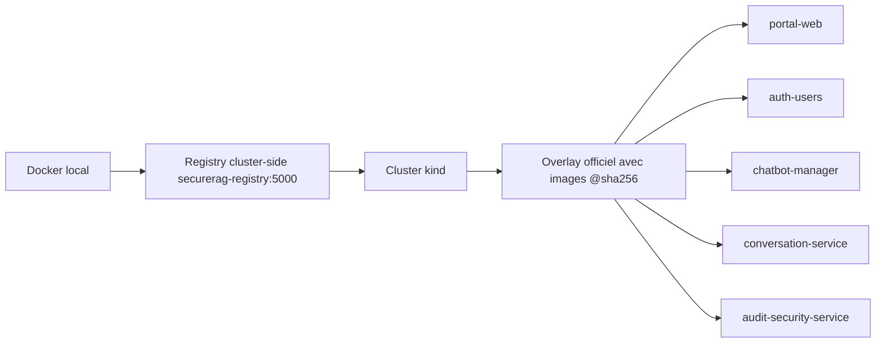

## 6. Securite du cluster

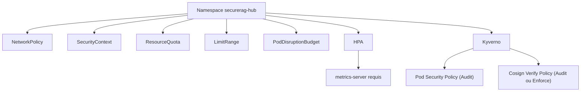

## 7. Addons du cluster

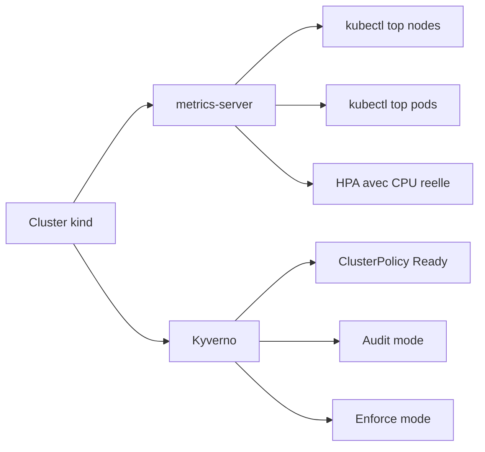

## 8. Gestion des secrets

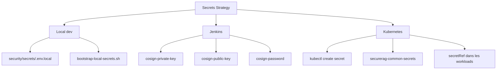

## 9. Runtime officiel vs legacy

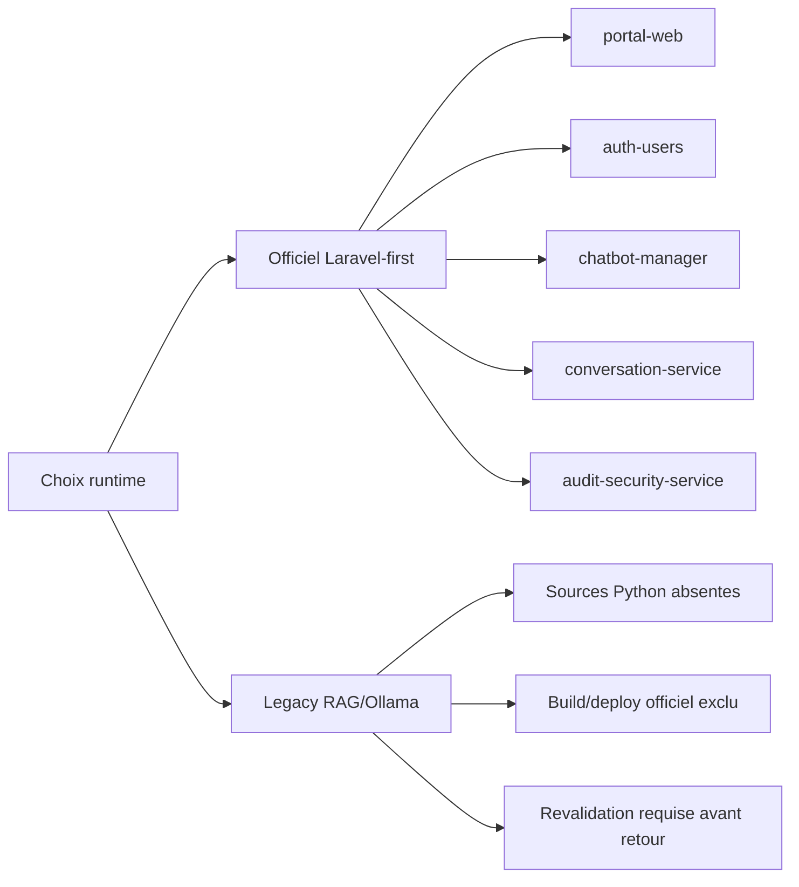

## 10. Validation et preuves

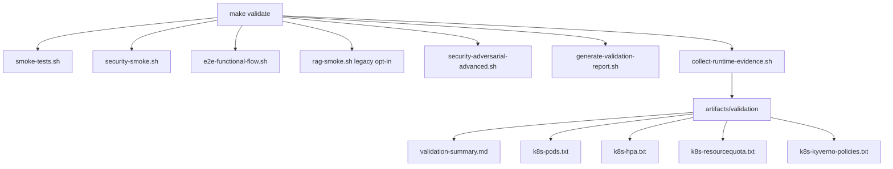

## 11. Campagne finale de reference

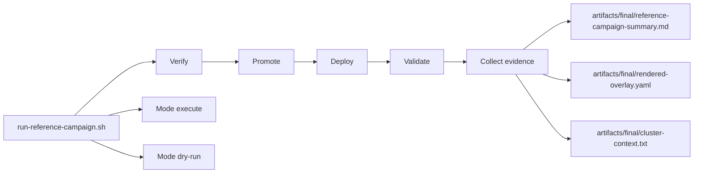

## 12. Gouvernance CI/CD

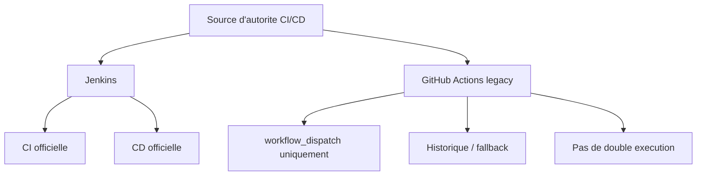
