# SecureRAG Hub — Diagrammes d'architecture (Composants & Déploiement)

> Recueil des diagrammes Mermaid décrivant l'architecture applicative,
> la chaîne CI/CD DevSecOps et le déploiement Kubernetes.
> Périmètre officiel : les 5 microservices Laravel + plateforme de sécurité
> (voir `docs/architecture/official-scope.md`).

## Table des matières

1. [Vue Contexte (C4 — niveau 1)](#1-vue-contexte--c4-niveau-1)
2. [Vue Conteneurs (C4 — niveau 2)](#2-vue-conteneurs--c4-niveau-2)
3. [Vue Composants internes (C4 — niveau 3)](#3-vue-composants-internes--c4-niveau-3)
4. [Chaîne CI/CD DevSecOps](#4-chaîne-cicd-devsecops)
5. [Flux Supply Chain (SBOM · Signature · Promotion)](#5-flux-supply-chain)
6. [Topologie de déploiement Kubernetes](#6-topologie-de-déploiement-kubernetes)
7. [Sécurité réseau (NetworkPolicies)](#7-sécurité-réseau-networkpolicies)
8. [Gestion des secrets](#8-gestion-des-secrets)
9. [Observabilité & détection runtime](#9-observabilité--détection-runtime)
10. [Haute disponibilité & reprise d'activité](#10-haute-disponibilité--reprise-dactivité)

---

## 1. Vue Contexte (C4 — niveau 1)

```mermaid
flowchart LR
    Dev([Développeur]) -->|git push| Repo[(Dépôt Git)]
    Audit([Auditeur / Jury]) -->|consulte| Reports[Rapports & preuves]
    User([Utilisateur final]) -->|HTTP :30081| Portal

    subgraph Platform["SecureRAG Hub"]
        Portal["portal-web (Blade)"]
        API["4 API Laravel métiers"]
        Sec["Couche sécurité DevSecOps"]
    end

    User --> Portal
    Portal --> API
    API --> Sec

    Repo -->|webhook| Jenkins[Jenkins CI/CD]
    Jenkins -->|construit, signe, déploie| Platform

    style Platform fill:#0f172a,stroke:#38bdf8,color:#e2e8f0
```

---

## 2. Vue Conteneurs (C4 — niveau 2)

```mermaid
flowchart TB
    subgraph Clients
        Browser["Navigateur"]
        KCTL["kubectl / ArgoCD"]
    end

    subgraph K8s["Cluster Kubernetes (kind securerag-dev)"]
        subgraph AppNS["Namespace: securerag-hub"]
            Portal["portal-web<br/>(Blade + JS · :8000/NodePort 30081)"]
            Auth["auth-users<br/>(Laravel API · :8000)"]
            Bot["chatbot-manager<br/>(Laravel API · :8000)"]
            Conv["conversation-service<br/>(Laravel API · :8000)"]
            Audit["audit-security-service<br/>(Laravel API · :8000)"]
            PG[("postgres-auth<br/>PostgreSQL 16")]
        end

        subgraph SharedSvc["services-laravel/shared-security"]
            Pkg["Paquet PHP partagé<br/>SecurityHeaders · Middlewares"]
        end
    end

    Browser -->|HTTP| Portal
    KCTL -->|"déploie / vérifie"| K8s

    Portal -->|/api/users| Auth
    Portal -->|/api/chatbots| Bot
    Portal -->|/api/conversations| Conv
    Portal -->|/api/audit| Audit
    Auth --> PG

    Portal -.-> Pkg
    Auth -.-> Pkg
    Bot -.-> Pkg
    Conv -.-> Pkg
    Audit -.-> Pkg

    style AppNS fill:#1e293b,stroke:#22c55e
    style SharedSvc fill:#164e63,stroke:#0891b2
```

---

## 3. Vue Composants internes (C4 — niveau 3)

### 3.1 portal-web

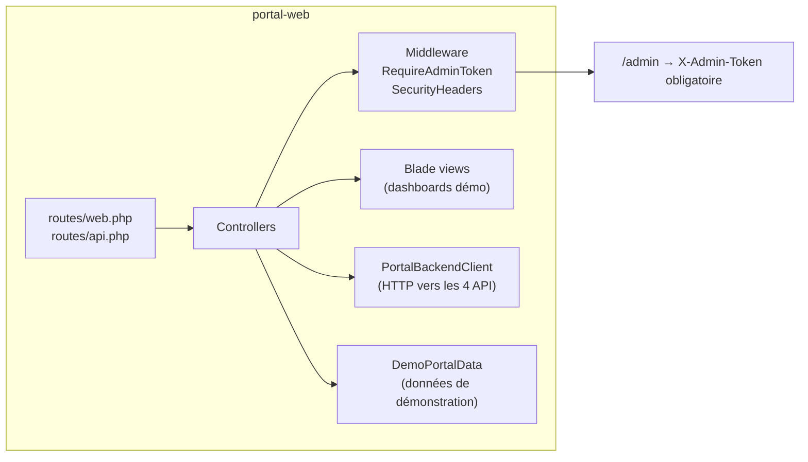

### 3.2 Microservices métiers (pattern commun)

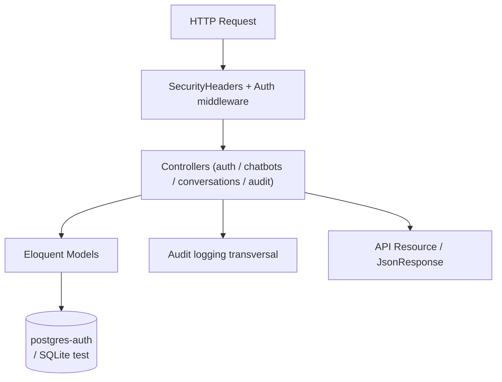

---

## 4. Chaîne CI/CD DevSecOps

### 4.1 Chaîne Jenkins (vue séquence)

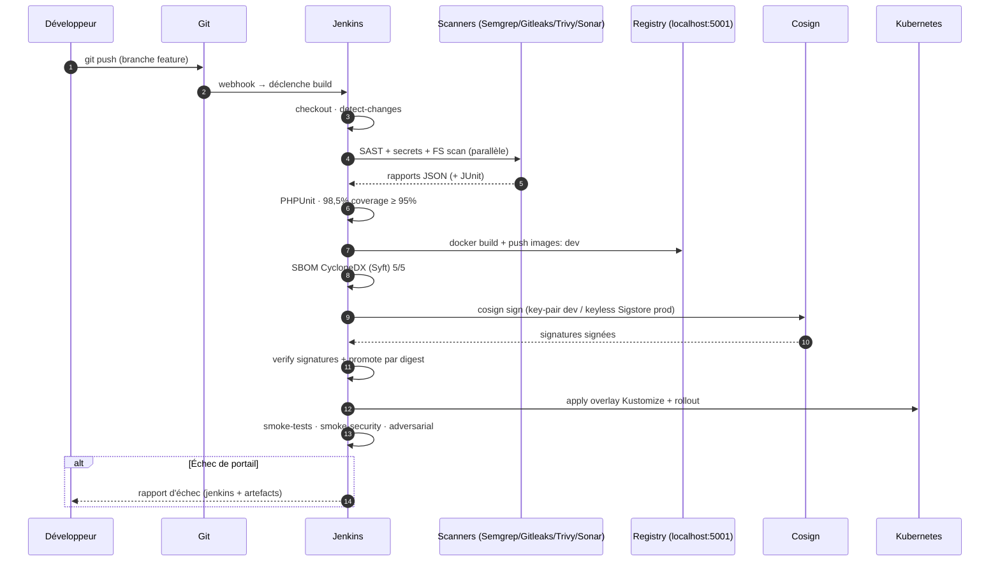

### 4.2 Makefile — chaîne local reproductible

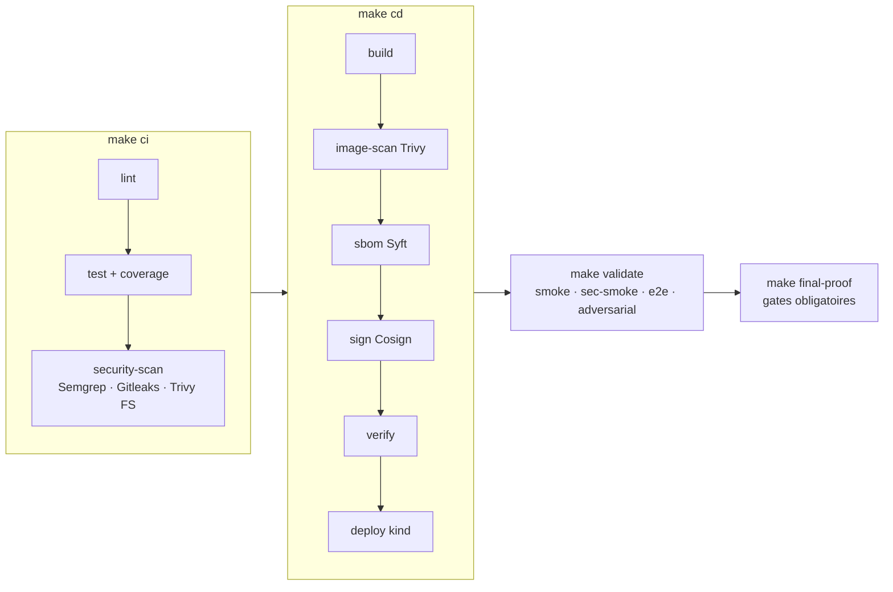

---

## 5. Flux Supply Chain

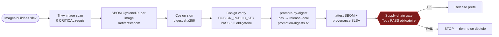

---

## 6. Topologie de déploiement Kubernetes

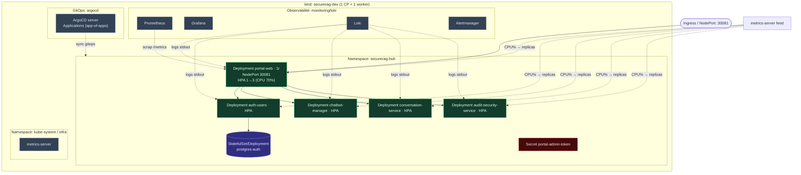

---

## 7. Sécurité réseau (NetworkPolicies)

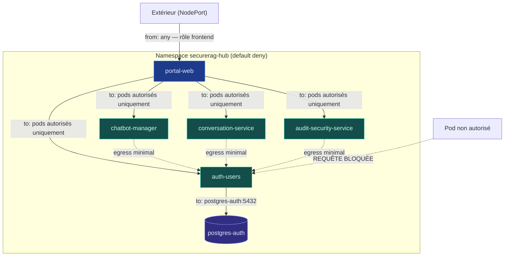

---

## 8. Gestion des secrets

```mermaid
flowchart LR
    subgraph Sources["Sources de vérité"]
        SOPS["SOPS + age<br/>(chiffré dans git)"]
        VAULT["HashiCorp Vault"]
        ESO["External Secrets Operator"]
        Local["security/keys/ (dev)"]
    end

    subgraph K8s["Cluster"]
        SA1["Secret: portal-admin-token"]
        SA2["Secret: postgres-auth credentials"]
        SA3["Secret: cosign keypair"]
    end

    SOPS -->|"decrypt + apply"| K8s
    VAULT -->|sync| ESO --> K8s
    Local -->|"kubectl create secret (dev)"| SA3

    SA1 --> Portal["portal-web<br/>RequireAdminToken"]
    SA2 --> Auth["auth-users"]
    SA3 --> CI["Pipeline sign/verify"]

    style Local fill:#422006,stroke:#f59e0b
```

---

## 9. Observabilité & détection runtime

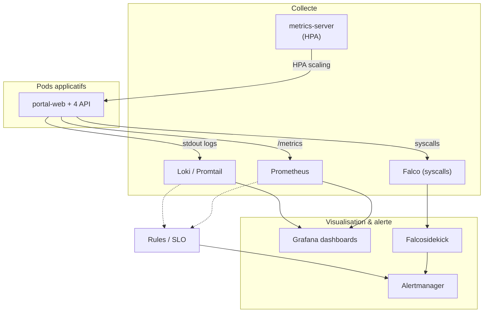

---

## 10. Haute disponibilité & reprise d'activité

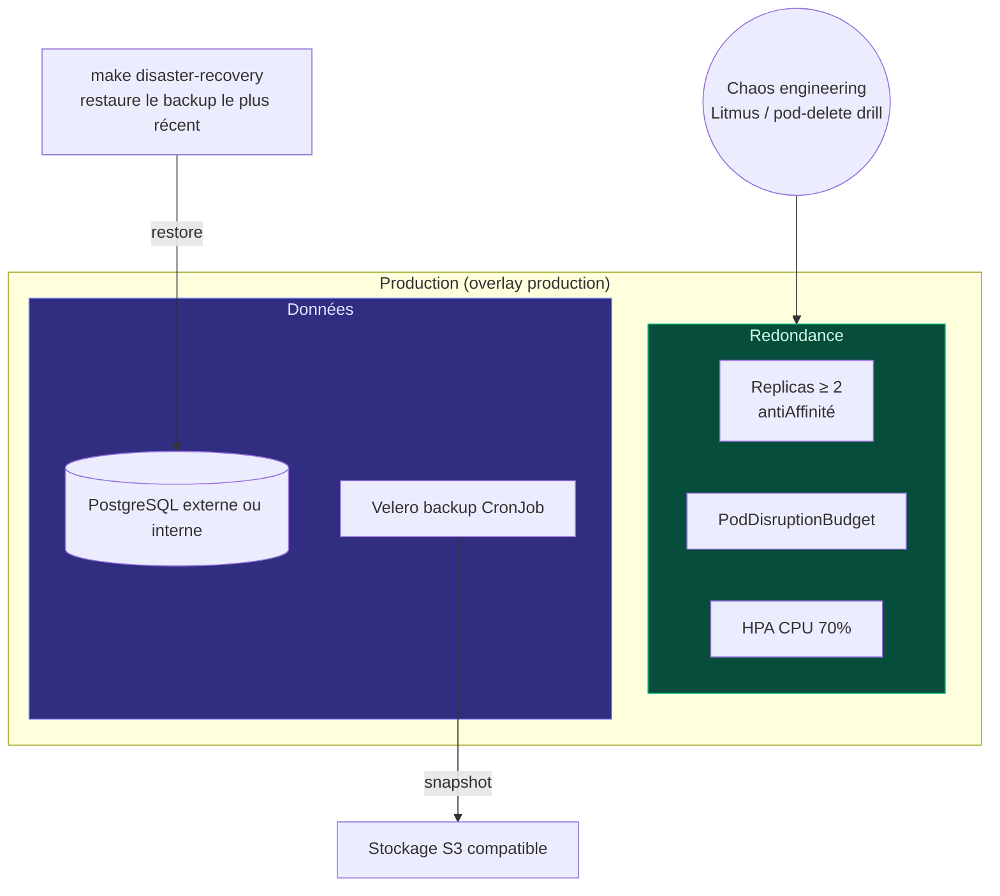

---

## Légende

| Couleur | Signification |
|---|---|
| 🟩 vert | Microservices applicatifs |
| 🟪 violet | Données (bases de données) |
| 🔵 bleu | Frontend / exposition |
| ⬜ gris | Infrastructure / plateforme |
| 🟥 rouge | Gates bloquants, secrets |
| ✅ | Check valide / contrôle conforme |
| ❌ | Violation / détecteur d'écart |
| ⏸️ | Composant legacy (hors scope officiel) |

---

*Généré le 22/09/2026 — correspond à l'état de la chaîne après corrections (20/20 tests PASS, note 96/100).*
