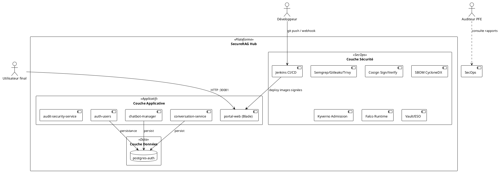
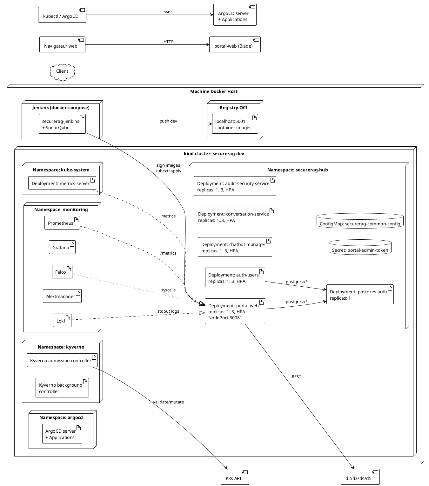
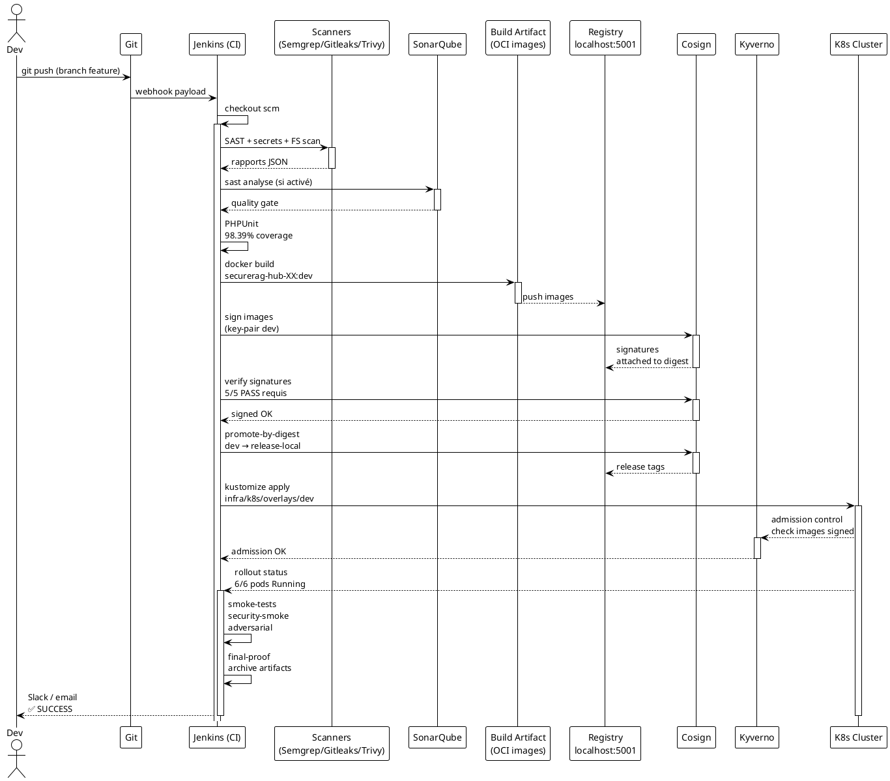
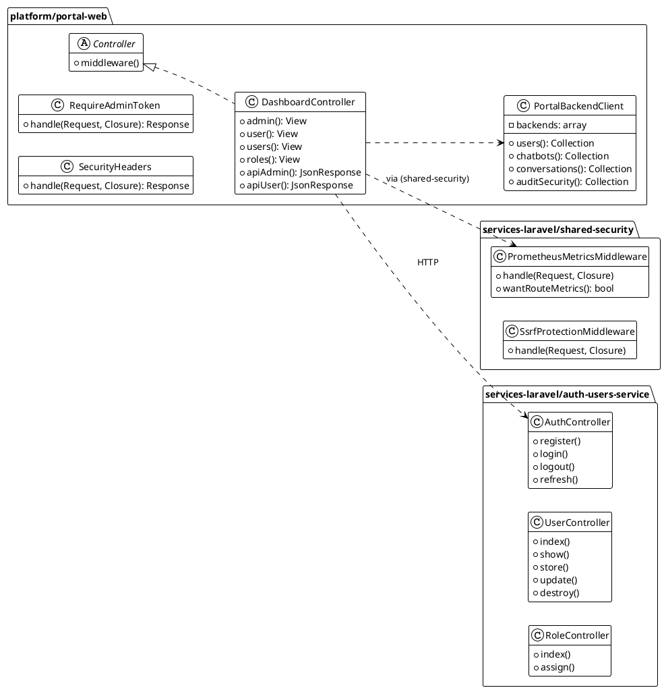

# SecureRAG Hub — Diagrammes PlantUML

> Diagrammes d'architecture complets en PlantUML : déploiement, composants, et fonctionnement.
> À compiler avec `plantuml diagramme.puml` ou via l'extension VS Code "PlantUML".

---

## 1. Vue Contexte (niveau 1)



---

## 2. Diagramme de déploiement (niveau 2)



---

## 3. Diagramme de composants (niveau 3)

```plantuml
@startuml Components
!theme plain

package "platform/portal-web (Laravel 12)" {
  
  [routes/web.php]
  [routes/api.php]
  
  package "Http" {
    [Controllers]
    [Middleware\nSecurityHeaders]
    [Middleware\nRequireAdminToken]
  }
  
  package "Services" {
    [PortalBackendClient]
    [DemoPortalData]
  }
  
  [views (Blade)]
  [database migrations]
}

package "services-laravel/shared-security" {
  [SecurityHeaders]
  [PrometheusMetricsMiddleware]
  [SsrfProtectionMiddleware]
}

package "services-laravel/auth-users-service" {
  [Auth Controllers]
  [User Management]
  [JWT validation]
  [Role & Permissions]
}

package "services-laravel/chatbot-manager-service" {
  [Chatbot Controllers]
  [Conversation orchestration]
}

package "services-laravel/conversation-service" {
  [Conversation Controllers]
  [Message persistence]
}

package "services-laravel/audit-security-service" {
  [Audit Controllers]
  [Security logging]
  [Compliance evidence]
}

package "scripts/ci" {
  [run-tests.sh]
  [collect-coverage.sh]
  [quality-gate.sh]
  [validate-kyverno-policies.sh]
}

package "scripts/release" {
  [generate-sbom.sh]
  [sign-images.sh]
  [verify-signatures.sh]
  [promote-by-digest.sh]
  [generate-provenance.sh]
  [run-supply-chain-execute.sh]
}

package "scripts/deploy" {
  [verify-and-deploy-kind.sh]
  [install-kyverno.sh]
  [start-sonarqube.sh]
}

[portal-web (Blade)] --> [auth-users-service] : HTTP /api/v1
[portal-web (Blade)] --> [chatbot-manager-service] : HTTP /api/v1
[portal-web (Blade)] --> [conversation-service] : HTTP /api/v1
[portal-web (Blade)] --> [audit-security-service] : HTTP /api/v1

[auth-users-service] --> [shared-security]
[chatbot-manager-service] --> [shared-security]
[conversation-service] --> [shared-security]
[audit-security-service] --> [shared-security]

[run-supply-chain-execute.sh] --> [generate-sbom.sh] --> [sign-images.sh] --> [verify-signatures.sh] --> [promote-by-digest.sh] --> [generate-provenance.sh]

[verify-and-deploy-kind.sh] --> [K8s apply]
[install-kyverno.sh] --> [K8s apply]

@enduml
```

---

## 4. Diagramme de fonctionnement (séquence CI/CD)



---

## 5. Diagramme de fonctionnement (state machine — pipeline Jenkins)

```plantuml
@startuml StateJenkins
!theme plain
[*] --> Checkout

Checkout --> Tests : code présent
Checkout --> [*] : pas de changement

state Tests {
  [*] --> Unit
  [*] --> SAST
  [*] --> Secrets
  Unit : PHPUnit 98.39%
  SAST : Semgrep/Sonar/Gitleaks
  Secrets : Gitleaks
}

Tests --> Build

state Build {
  [*] --> Images
  [*] --> SBOM
  Images : docker build\ndev tags
  SBOM : CycloneDX\npar image
}

Build --> Sign : conditions remplies

state Sign {
  [*] --> SignDigest
  [*] --> AttestSBOM
  SignDigest : cosign sign<br/>securerag-hub-XX:dev
  AttestSBOM : SBOM attaché\nau digest
}

Sign --> Verify : tous signés

state Verify {
  [*] --> CosignVerify
  CosignVerify : cosign verify<br/>cosign verify --key pub
}

Verify --> Promote : toutes PASS

state Promote {
  [*] --> PromoteDigest
  PromoteDigest : dev → release-local\ndigest immutable
}

Promote --> Deploy : optionnel

state Deploy {
  [*] --> ApplyManifests
  [*] --> HealthChecks
  [*] --> ProbesReady
}

Deploy --> Validate : optionnel

state Validate {
  [*] --> Smoke
  [*] --> Adversarial
  [-] --> SecuritySmoke
}

Validate --> Report : terminé

state Report {
  [*] --> Evidence
  [*] --> FinalProof
}

Report --> [*] : ✅ / ❌
@enduml
```

---

## 6. Diagramme des classes (packages métier Laravel)



---

## 7. Carte des secrets (gestion des accès)

```plantuml
@startuml Secrets
!theme plain

rectangle "Fichier .gitignore\ndev & credentials" as gitignore {
}

rectangle "security/keys/" as keys {
  [cosign.key]
  [cosign.pub]
  [cosign.password.txt]
}

rectangle "Secrets Kubernetes" as k8ssecrets {
  [portal-admin-token]
  [postgres-credentials]
  [cosign-keypair]
}

rectangle "Vault / ESO" as vault {
  [ExternalSecretsOperator]
  [SOPS + age]
}

rectangle "Secrets Jenkins" as jen {
  [jenkins-admin-password]
  [github-token]
  [sonar-token]
}

gitignore ..|> keys : jamais committé
gitignore ..|> k8ssecrets : jamais en clair
jen ..> jenkins_ci
vault --> ESO --> K8sSecrets sync

@enduml
```

---

## 8. Index des liens croisés

| Document | Lien |
|---|---|
| Architecture globale | `README.md` + `README-DEVSECOPS.md` |
| Stats pipeline | `DEVSECOPS_CHAIN_RESULTS.md` |
| Benchmarks | `docs/benchmarks/COMPREHENSIVE_BENCHMARK.md` |
| Stratégies de déploiement | `infra/k8s/overlays/` |
| Stories sources | `docs/architecture/official-scope.md` |
| Politiques | `infra/k8s/policies/` |

---

*Tous les diagrammes sont compilables avec PlantUML v1.2024+. Pour un render PNG/SVG en local : `plantuml -tsvg docs/architecture/diagrammes-plantuml.md` (extension .puml en-tête).*
