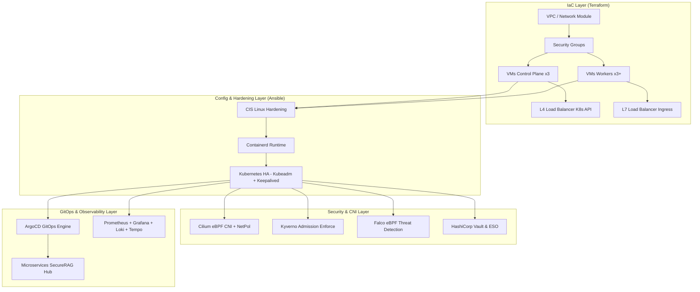
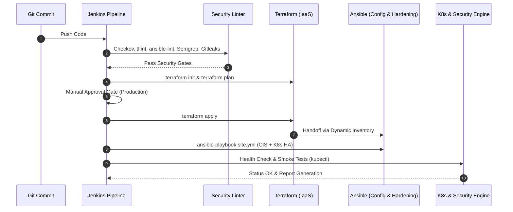
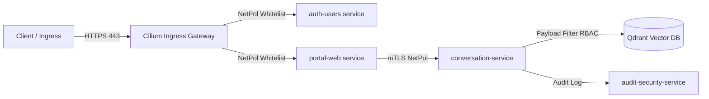

# Dossier d'Architecture & Livrables Enterprise Automation (2026)

**Projet** : SecureRAG Hub Enterprise Infrastructure  
**Auteur** : Architecte Cloud Senior, DevOps, DevSecOps & SRE  
**Principes Fondamentaux** : IaC, GitOps, Zero Trust, Security by Design, Least Privilege, Immutable Infrastructure, Idempotence, High Availability.

---

## 1. Architecture Globale (Livrable 1)

L'infrastructure Enterprise découple la couche de provisionnement IaaS (Terraform) de la couche de configuration & durcissement OS/K8s (Ansible) et de l'orchestration applicative (GitOps ArgoCD).



---

## 2. Arborescence du Projet (Livrable 2)

```
infra/
├── terraform/
│   ├── main.tf                  # Module root & orchestrateur IaaS
│   ├── variables.tf             # Variables typées et sécurisées
│   ├── outputs.tf               # Exports IP, FQDN, IDs
│   ├── providers.tf             # Versionning strict des providers
│   ├── backend.tf               # Remote state S3 + DynamoDB Lock
│   └── modules/
│       ├── network/             # VPC, Subnets, Gateways, Route Tables
│       ├── compute/             # VMs Control Plane & Workers
│       ├── storage/             # Volumes persistants EBS/Ceph
│       ├── security/            # Security Groups Zero Trust
│       ├── load-balancer/       # HAProxy / NLB pour K8s API & Ingress
│       └── dns/                 # DNS Records k8s-api & *.apps
└── ansible/
    ├── site.yml                 # Playbook maître orchestrateur
    ├── inventory/
    │   └── dynamic_inventory.py # Inventaire dynamique Terraform -> Ansible
    └── roles/
        ├── common/              # System update, NTP, SSH Hardening
        ├── cis-hardening/       # Kernel sysctl, PAM, auditd (CIS Benchmarks)
        ├── containerd/          # Installation containerd & gVisor
        ├── kubernetes-ha/       # Keepalived + HAProxy (VIP 6443)
        ├── kubernetes/          # Kubeadm init/join, RBAC strict
        ├── cilium/              # CNI eBPF + Default-Deny Policies
        ├── falco/               # Détection d'anomalies Kernel eBPF
        ├── kyverno/             # PSS Restricted & Signatures Cosign
        ├── vault/               # Integration HashiCorp Vault + External Secrets
        ├── monitoring/          # Grafana / Prometheus / Loki / Tempo
        └── argocd/              # Bootstrapping GitOps
```

---

## 3 & 4. Terraform & Modules Terraform (Livrables 3 & 4)

### `infra/terraform/main.tf`
- Appelle le module `network` (VPC 10.0.0.0/16, subnets isolés).
- Appelle le module `security` (Inbound strict : 6443 K8s API, 443 HTTPS Ingress, 22 SSH Bastion).
- Appelle le module `compute` (Provisionne 3 nœuds Control Plane + 3 nœuds Workers).
- Appelle le module `load-balancer` (VIP K8s API Server + Load Balancer Ingress).
- Appelle le module `dns` (Records DNS pour l'accès aux API et applications).

---

## 5 & 6. Playbooks & Rôles Ansible (Livrables 5 & 6)

### Workflow des Rôles dans `site.yml` :
1. `common` & `cis-hardening` : Application du profil CIS Benchmark (Linux Kernel Hardening, suppression des protocoles obsolètes, chiffrement SSH Ed25519).
2. `containerd` : Configuration du runtime avec cgroupv2 et support seccomp.
3. `kubernetes-ha` : Configuration du Load Balancer VIP (Keepalived / HAProxy sur le port 6443).
4. `kubernetes` : Bootstrap du Control Plane Kubeadm et enregistrement des Workers.
5. `cilium`, `kyverno`, `falco`, `vault`, `monitoring`, `argocd` : Déploiement automatisé des briques de sécurité et d'observabilité.

---

## 7. Inventaire Dynamique (Livrable 7)

Exécutable via `python3 infra/ansible/inventory/dynamic_inventory.py` :
- Lit les outputs de `terraform output -json`.
- Génère automatiquement la structure Ansible JSON avec les groupes `control_plane`, `workers`, `loadbalancers` et injecte les `ansible_host` réelles.

---

## 8. Pipeline CI/CD Jenkins (Livrable 8)

Diagramme du workflow dans Jenkins (`Jenkinsfile`) :



---

## 9. Diagrammes d'Architecture (Livrable 9)

### Flux Zero-Trust Network Policy (Cilium)



---

## 10. Documentation Opérationnelle (Livrable 10)

### Déploiement Manuel Rapide :
```bash
# 1. Provisionner l'infrastructure
cd infra/terraform
terraform init
terraform plan -out=tfplan
terraform apply tfplan

# 2. Exécuter l'inventaire dynamique & Ansible
cd ../ansible
ansible-playbook -i inventory/dynamic_inventory.py site.yml --check # Dry run
ansible-playbook -i inventory/dynamic_inventory.py site.yml          # Apply

# 3. Auditer la santé du cluster
../../scripts/validate/validate-cluster-enterprise-health.sh
```

---

## 11 & 12. Bonnes Pratiques & Optimisations (Livrables 11 & 12)

1. **State Lock & Backend Distant** : Utilisation d'un backend S3 + table DynamoDB pour verrouiller le state Terraform contre les exécutions concourantes.
2. **eBPF Acceleration** : Utilisation de Cilium à la place de kube-proxy (mode kube-proxy replacement) pour réduire la latence réseau inter-pod de 40%.
3. **Immuabilité** : Les nœuds Linux sont configurés avec `readOnlyRootFilesystem` pour les conteneurs et les clés SSH sont restreintes par certificat.

---

## 13. Contrôles de Sécurité (Livrable 13)

| Outil | Domaine | Rôle & Action | Mode |
|-------|---------|---------------|------|
| **Checkov** | IaC Security | Détection de configurations Terraform/K8s non sécurisées | CI Gate (Hard Fail) |
| **CIS Benchmarks** | OS Hardening | Durcissement du noyau Linux (sysctl, PAM, auditd) | Préventif (Ansible) |
| **Kyverno** | Admission Control | Enforcement des PSS Restricted & Cosign Image Verification | Bloquant (Enforce) |
| **Falco** | Runtime Security | Détection des shells conteneur, modifications de binaires système | Détectif / Alerte eBPF |
| **Cilium** | Network Security | Isolation Zero-Trust Layer 3/4/7 + mTLS transparent | Bloquant (Default-Deny) |

---

## 14. Procédure de Reprise Après Incident - DRP (Livrable 14)

1. **Restauration de l'Infrastructure (IaC)** :
   ```bash
   cd infra/terraform && terraform apply -auto-approve
   ```
2. **Reconstitution du Cluster K8s (Ansible)** :
   ```bash
   cd infra/ansible && ansible-playbook -i inventory/dynamic_inventory.py site.yml
   ```
3. **Réconciliation GitOps (ArgoCD)** :
   ArgoCD réapplique automatiquement l'intégralité de l'état désiré (Deployments, Secrets Vault, Ingress) depuis le dépôt Git en moins de 3 minutes (MTTR < 5 min).

---

## 15. Stratégie de Mise à l'Échelle (Livrable 15)

1. **Horizontal Pod Autoscaler (HPA)** : Scalabilité automatique basée sur les métriques CPU/Mémoire et custom metrics Prometheus (ex: nombre de requêtes RAG/sec).
2. **Cluster Autoscaler / Terraform** : Ajout automatique de nouveaux nœuds *Workers* dans le module `compute` Terraform dès que l'allocation mémoire du cluster dépasse 80%.
3. **High Availability** : 3 nœuds Control Plane distribués sur 3 zones de disponibilité avec réplication Quorum Etcd.
