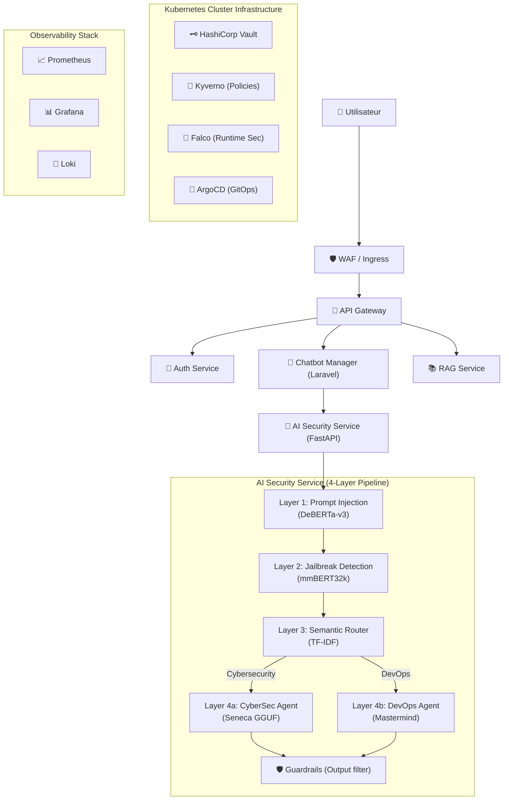

# SecureRAG Hub — Architecture Complète & Outillage
**Date :** 19 Juillet 2026

## 1. Vue d'Ensemble

**SecureRAG Hub** est une plateforme d'IA sécurisée intégrant une architecture de type RAG (Retrieval-Augmented Generation) couplée à un pipeline de sécurité strict à 4 couches. Le projet adopte une approche DevSecOps complète incluant le GitOps, une observabilité avancée, et une sécurité de type "Shift-Left" et "Shield-Right".

---

## 2. Diagramme d'Architecture Global

---

## 3. Pipeline de Sécurité IA (AI Security Service)
Toutes les requêtes d'IA doivent traverser ces 4 couches. Aucun modèle n'est interrogé avant la validation de sécurité.

*   **Layer 1 (Prompt Injection) :** `protectai/deberta-v3-small-prompt-injection-v2`
*   **Layer 2 (Jailbreak Detection) :** `llm-semantic-router/mmbert32k-jailbreak-detector-merged` (avec regex pre-screening pour les attaques DAN, Leakage, Roleplay)
*   **Layer 3 (Semantic Routing) :** `scikit-learn` TF-IDF Vectorizer avec 18+ catégories sémantiques.
*   **Layer 4 (Expert Models) :** 
    *   *CyberSecurity* : `AlicanKiraz0/Seneca-Cybersecurity-LLM-Q4_K_M-GGUF` (via `llama-cpp-python`)
    *   *DevOps* : `kavinduc/devops-mastermind` (via `transformers`)
*   **Guardrails :** Module de vérification des outputs (bloque l'exécution de code, les altérations K8s, Vault, ArgoCD, etc.)

---

## 4. Stack Applicative & Microservices
*   **AI Security Service :** Python 3.12, FastAPI, Uvicorn, Pytest
*   **Chatbot Manager Service :** PHP, Laravel
*   **API Gateway & RAG Service :** Gestion du flux de requêtes, de l'authentification et de la récupération de données.

---

## 5. DevSecOps & Infrastructure (Kubernetes)
*   **Orchestration :** Kubernetes (K8s)
*   **Déploiement / GitOps :** ArgoCD (Synchronisation continue via les manifests K8s et ApplicationSets)
*   **Package Manager :** Helm
*   **Secret Management :** HashiCorp Vault, SOPS, External Secrets Operator (`velero-external-secret.yaml`)
*   **Admission Control & Policies :** Kyverno, Pod Security Admissions (PSA)
*   **Runtime Security :** Falco
*   **Réseau :** NetworkPolicies strictes (Isolation des namespaces et protection des endpoints)
*   **Tests & Qualité :** Pytest avec 90+ cas de tests, couverture CI/CD.

---

## 6. Observabilité (Monitoring & Logging)
*   **Métriques :** Prometheus (via `prometheus-client` & `prometheus-fastapi-instrumentator`)
*   **Dashboards :** Grafana (Monitoring des requêtes IA, taux de blocage, latence p95, VRAM, RAM, CPU)
*   **Logs :** Promtail & Loki (Logs JSON structurés et tracing via `X-Trace-Id`)

---

## 7. Disaster Recovery & Backups
*   **Backups :** Velero (Sauvegarde et restauration de l'état du cluster Kubernetes)
*   **ETCD :** CronJobs de backup ETCD pour la résilience du Control Plane Kubernetes (`etcd-backup-cronjob.yaml`)

> [!TIP]
> **Rappel d'Architecture :** La règle d'or du système est que **« Aucune requête ne doit atteindre un LLM sans validation »** et **« Aucun modèle ne peut exécuter de code ou modifier l'infrastructure (K8s/Vault/ArgoCD) sans validation »**.
