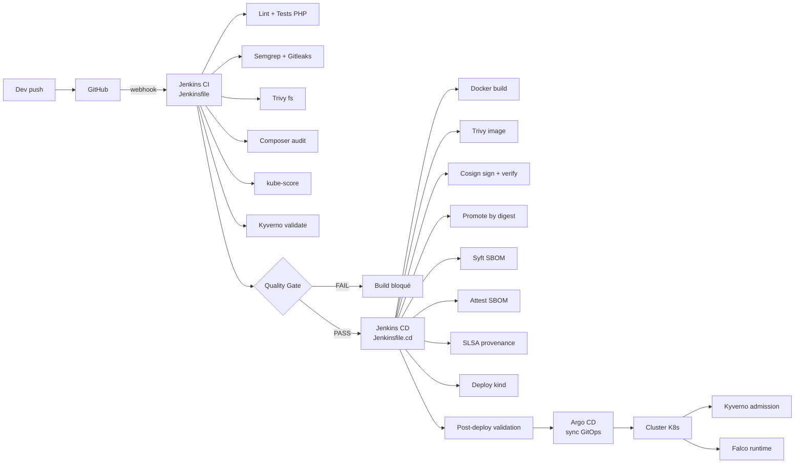

# DevSecOps Pipeline — SecureRAG Hub

> Pipeline complet Laravel-first : CI (`Jenkinsfile`) + CD (`Jenkinsfile.cd`).
> Source canonique : [`docs/architecture/jenkins-devsecops.md`](architecture/jenkins-devsecops.md).
> Voir aussi : [`docs/security/devsecops-hardening-applied.md`](security/devsecops-hardening-applied.md).

## Vue d'ensemble



## Stages CI (`Jenkinsfile`)

1. Checkout SCM (preuve commit)
2. Prepare Workspace
3. Install CI Dependencies (composer + semgrep)
4. Lint + Tests (PHPUnit + coverage)
5. Dependency Audit (Composer + npm)
6. SAST + Secret Scans (Semgrep + Gitleaks + Trivy fs)
7. K8s Policy Checks (kube-score + Kyverno static)
8. **Quality Gate consolidé** ← agrégateur final
9. Sonar Quality Gate (optionnel)

## Stages CD (`Jenkinsfile.cd`)

1. Checkout
2. CD Image Scan (Trivy)
3. Sign Release Candidate Images (Cosign)
4. Verify Release Candidate Signatures
5. Promote Verified Images by Digest
6. Generate SBOM (Syft)
7. Attest SBOMs (Cosign)
8. Assert Mandatory Supply Chain Evidence
9. Generate Release Attestation
10. Generate SLSA Provenance
11. Record Release Evidence
12. Collect Supply Chain Evidence
13. Deploy to kind
14. Post-deploy Validation
15. Build Support Pack

## Critères bloquants

| Critère | Outil | Comportement |
|---------|-------|--------------|
| Test failures | PHPUnit | `make test` exit ≠ 0 |
| Coverage < 70% | coverage.xml / coverage.py | Quality Gate `coverage` = FAIL |
| Secret en clair | Gitleaks | Stage fail |
| CVE CRITICAL filesystem | Trivy fs | Stage fail |
| Pod Security gap | kube-score | strict + seuils, exit ≠ 0 |
| Policy Kyverno violée | `validate-kyverno-policies.sh` | Stage fail |
| Image CRITICAL | Trivy image | Pipeline CD fail |
| Signature Cosign absente | `verify-signatures.sh` | Pipeline CD fail |
| SBOM manquant | Syft + validation | Stage fail |

## Quality Gate consolidé

Le script [`scripts/ci/quality-gate.sh`](../scripts/ci/quality-gate.sh)
aggrège les sorties des stages amont en un **verdict unique** lisible :

```bash
make quality-gate
# → artifacts/security/quality-gate-summary.md (humain)
# → artifacts/security/quality-gate-summary.json (machine)
```

Sortie type :

```
# CI Quality Gate — PASS

| Check | Status | Required | Details |
|-------|:------:|:--------:|---------|
| unit-tests       | ✅ PASS | true | 12 suite(s), 0 failure |
| coverage         | ✅ PASS | true | 76% ≥ 70% |
| semgrep-sast     | ✅ PASS | true | 0 finding |
| gitleaks         | ✅ PASS | true | 0 leak |
| trivy-fs         | ✅ PASS | true | 0 CRITICAL, 2 HIGH |
| dependency-audit | ✅ PASS | true | summary OK |
| kube-score       | ✅ PASS | true | no thresholds exceeded |
| kyverno-static   | ✅ PASS | true | all policies pass |
```

## Séparation CI / CD (P0-3)

- **CI** ne build pas d'image, ne pousse pas vers registry. Travail
  uniquement sur sources.
- **CD** travaille sur images déjà buildées en input (`SOURCE_IMAGE_TAG`),
  les scanne, signe, promote, déploie.
- Cette séparation évite qu'une compromission du CI compromette la
  signature des images de prod.

## Outillage par catégorie

| Catégorie | Outil | Fichier de référence |
|-----------|-------|----------------------|
| Tests unitaires | PHPUnit | `services-laravel/*/phpunit.xml` |
| Coverage | coverage.py + Cobertura | `quality-gate.sh` |
| SAST | Semgrep | `security/semgrep/semgrep.yml` |
| Secrets | Gitleaks | `.gitleaks.toml` |
| Dépendances | Trivy fs + composer audit | `audit-dependencies.sh` |
| Images | Trivy image | `scripts/release/scan-images.sh` |
| SBOM | Syft | `scripts/release/generate-sbom.sh` |
| Signature | Cosign | `scripts/release/sign-images.sh` |
| K8s lint | kube-score | `scripts/ci/validate-kube-score.sh` (strict) |
| K8s policies | Kyverno | `infra/k8s/policies/kyverno/` |
| Runtime | Falco | `infra/k8s/runtime-detection/` |
| Observabilité | Prometheus/Grafana/Loki | `infra/k8s/observability/` |
| GitOps | Argo CD | `infra/k8s/argocd/` |

## Référence pour aller plus loin

[`docs/architecture/jenkins-devsecops.md`](architecture/jenkins-devsecops.md) contient :

- Configuration Jenkins Casc complète
- Setup webhook GitHub
- Procédure d'ajout d'un nouveau stage
- Conventions de credentials
