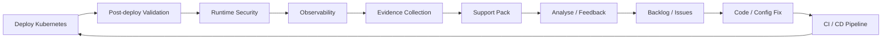

# Feedback Loop DevSecOps — SecureRAG Hub

## Principe fondamental

> **DevSecOps est une boucle continue. Le déploiement n'est pas la fin du processus — c'est le début de la phase de validation, d'observation et d'amélioration.**

## La boucle complète



## Étapes de la boucle

### 1. Déploiement Kubernetes
- Les images vérifiées et signées sont déployées par digest
- Le rollout est contrôlé et surveillé
- Aucune image n'est reconstruite après la signature

### 2. Validation post-déploiement
- **Rollout validation** : pods Running, services actifs, endpoints prêts
- **Smoke tests** : /health accessible, HTTP 200 sur chaque service
- **Security smoke** : SecurityContext appliqué, NetworkPolicies actives
- **E2E functional flow** : flux métier de bout en bout
- **Runtime image proof** : l'image exécutée = digest signé
- **K8s hardening** : PSA restricted, ServiceAccount, probes, resources

### 3. Sécurité runtime
- **Kyverno** : PolicyReports, violations Audit, readiness Enforce
- **Falco** (optionnel) : détection de shell, accès fichiers sensibles, exfiltration réseau
- **Cosign verification** : signatures vérifiées post-déploiement

### 4. Observabilité
- **Prometheus** : métriques CPU, mémoire, latence, erreurs
- **Grafana** : dashboards visuels
- **Loki** : agrégation de logs
- **Alertmanager** : alertes SLO (pod down, latence p95, crash loop)

### 5. Collecte de preuves
- Rapports de validation archivés
- Preuves runtime collectées
- SBOM, signatures, digests documentés
- Evidence Markdown et JSON générées

### 6. Support pack
- Archive tar.gz contenant tous les rapports
- Checksums SHA256 pour l'intégrité
- Manifeste complet des fichiers inclus

### 7. Analyse et feedback
L'analyse des résultats post-déploiement produit :

| Type de retour | Action | Exemple |
|---|---|---|
| Test échoué | Créer un ticket correctif | Smoke test /health timeout |
| Vulnérabilité runtime | Créer un ticket sécurité | Falco: shell in container |
| Policy violation | Ajuster le manifest ou la policy | Kyverno: image sans tag pinné |
| Dégradation performance | Investiguer et optimiser | Latence p95 > SLO |
| Alerte critique | Incident response | Pod crash loop |

### 8. Correction et nouveau cycle
- Le fix est committé dans Git
- Le pipeline CI se déclenche automatiquement
- La chaîne complète se rejoue : CI → CD → post-deploy → feedback

## Outils par étape

| Étape | Outils | Scripts |
|-------|--------|---------|
| Post-deploy | kubectl, curl | `scripts/validate/post-deploy-validation.sh` |
| Runtime security | Kyverno, Falco | `scripts/validate/validate-kyverno-runtime.sh` |
| Observabilité | Prometheus, Grafana, Loki | `make observability-up` |
| Evidence | bash, tar, sha256sum | `scripts/validate/build-support-pack.sh` |
| Feedback | Jenkins, Git, Issues | Pipeline + processus humain |

## Intégration Jenkins

Le pipeline CD inclut la validation post-déploiement comme stage obligatoire :

```groovy
stage('Post-deploy Validation') {
    steps {
        sh 'make post-deploy-validation'
    }
    post {
        failure {
            // Rollback automatique + collecte de preuves
        }
    }
}
```

En cas d'échec, le pipeline :
1. Collecte les événements Kubernetes
2. Exécute `kubectl rollout undo` pour chaque deployment
3. Archive les preuves du rollback
4. Marque le build comme `FAILED`

## Conclusion

La feedback loop garantit que chaque déploiement est :
- **validé** fonctionnellement et sécuritairement ;
- **observé** en temps réel via les métriques et les logs ;
- **documenté** via des preuves techniques archivées ;
- **amélioré** via un cycle continu de correction.

---

*Document créé dans le cadre de la finalisation DevSecOps — branche `devsecops-final-hardening`*
