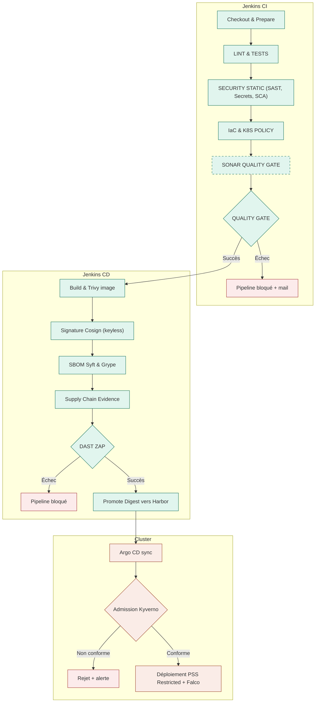
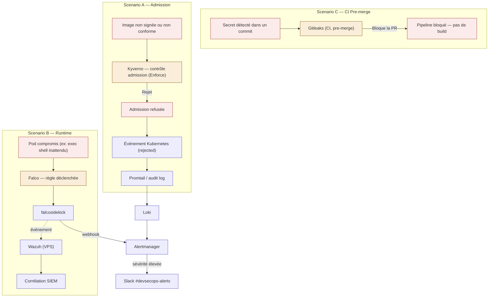
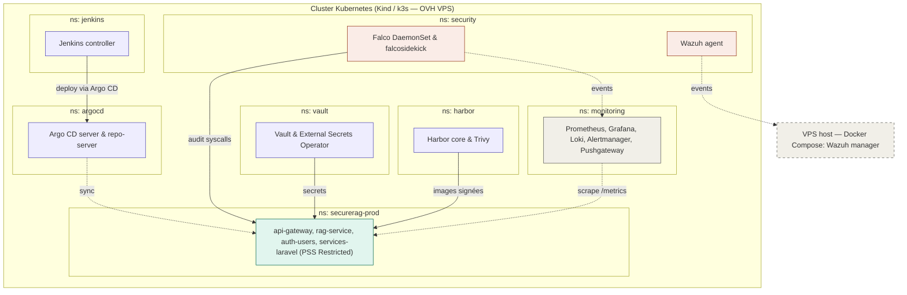

# Diagrammes — Chaîne DevSecOps SecureRAG Hub

## 1. Vue d'ensemble
Ce diagramme présente l'architecture globale de la chaîne DevSecOps. Il illustre le parcours du code depuis le dépôt Git jusqu'au déploiement dans le cluster Kubernetes, en traversant les pipelines d'intégration et de déploiement continus. Les connexions transversales avec les outils d'observabilité figurent en bas du schéma.

```mermaid
flowchart LR
    subgraph "Source"
        github["Dépôt GitHub"]
        gitleaks["Gitleaks pre-commit"]
    end

    subgraph "CI — Jenkins"
        ci_tests["Lint & Tests"]
        ci_scans["SAST, SCA, IaC"]
        ci_qg["Quality Gate"]
    end

    subgraph "CD — Jenkins"
        cd_build["Build & Scan"]
        cd_sign["Sign & SBOM"]
        cd_dast["DAST ZAP & Promote"]
    end

    subgraph "Runtime K8s"
        k8s_sync["Argo CD & Admission"]
        k8s_pods["Pods PSS & Falco"]
    end

    obs["Prometheus, Grafana, Loki, Alertmanager, Wazuh, Vault"]

    github --> gitleaks
    gitleaks --> ci_tests
    ci_tests --> ci_scans
    ci_scans --> ci_qg
    ci_qg --> cd_build
    cd_build --> cd_sign
    cd_sign --> cd_dast
    cd_dast --> k8s_sync
    k8s_sync --> k8s_pods

    gitleaks -.->|"logs"| obs
    ci_qg -.->|"métriques"| obs
    cd_dast -.->|"rapports"| obs
    k8s_pods -.->|"métriques & alertes"| obs

    classDef source fill:#F1EFE8,stroke:#5F5E5A
    classDef pipeline fill:#E1F5EE,stroke:#0F6E56
    classDef runtime fill:#FAECE7,stroke:#993C1D
    classDef obs fill:#EEEDFE,stroke:#534AB7

    class github,gitleaks source
    class ci_tests,ci_scans,ci_qg,cd_build,cd_sign,cd_dast pipeline
    class k8s_sync,k8s_pods runtime
    class obs obs
```

## 2. Flux CI/CD détaillé
Ce flux détaille l'exécution séquentielle des étapes des pipelines Jenkins. Les losanges marquent les portes de qualité qui conditionnent la poursuite du déploiement. L'analyse SonarQube figure en pointillés pour indiquer son statut paramétrable.

## 3. Flux de rejet et alerte sécurité
Ce schéma modélise les boucles de rétroaction en cas d'anomalie de sécurité. Il distingue le rejet lors du contrôle d'admission par Kyverno et la détection comportementale par Falco. Les événements critiques convergent vers Alertmanager pour déclencher une notification immédiate.

## 4. Architecture cluster
L'architecture du cluster Kubernetes sépare rigoureusement les composants par espace de noms. Les flèches indiquent les interactions clés entre l'infrastructure de sécurité, l'observabilité et les charges de travail applicatives. L'agent Wazuh transmet directement les événements à son gestionnaire hébergé sur le serveur virtuel externe.

## Légende des couleurs

| Couleur | Signification |
| --- | --- |
| Vert | Pipeline actif, flux applicatif Nominal |
| Rouge/Corail | Déclencheur, rejet de sécurité ou blocage du pipeline |
| Jaune/Orange | Contrôle de sécurité (Admission, Scan) |
| Violet | Composant de plateforme ou d'observabilité (SIEM, Alertmanager) |
| Gris | Code source, structures englobantes ou composants neutres |
