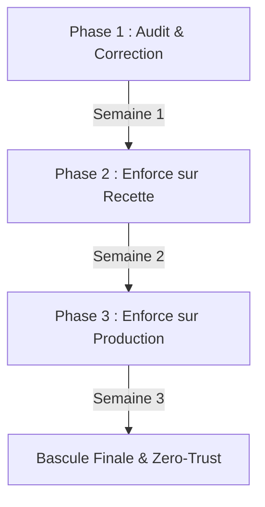

# Guide de Migration Progressive Kyverno : Passage en Mode Enforce

Ce guide décrit la procédure de transition progressive et sécurisée du moteur de politiques Kyverno du mode `Audit` (observation passive) au mode `Enforce` (blocage actif), sans interruption de service sur le cluster de production SecureRAG Hub.

---

## 1. Stratégie de Migration Progressive

Pour limiter les risques de production, la migration s'effectue sur une période de 3 semaines divisée en 3 phases distinctes.



### Phase 1 (Semaine 1) : Audit de l'existant & Correction
L'objectif est d'identifier toutes les ressources en cours d'exécution ou définies dans Git qui violent les 8 nouvelles politiques de sécurité.

1. Exécutez le script d'audit pour simuler le blocage et générer un rapport complet :
   ```bash
   bash security/tests/kyverno-audit-report.sh
   ```
2. Ouvrez le rapport généré dans `security/reports/kyverno-audit-report.html` pour visualiser le **Compliance Score** et la liste détaillée des ressources non conformes par namespace.
3. Corrigez les manifests source dans les repositories de déploiement (Kustomize/Helm) pour y intégrer les exigences de sécurité (limites de ressources, non-root, probes, labels standard).

### Phase 2 (Semaine 2) : Enforce sur le namespace "recette"
L'objectif est de valider le blocage actif et les pipelines de livraison (CI/CD Jenkins) dans un environnement de staging non-production.

1. Appliquez les versions enforce sur le namespace `recette` uniquement (les politiques sont restreintes par namespaces dans leur définition `spec.rules[].match.any[]`).
2. Validez qu'aucun déploiement non-conforme ne passe dans la pipeline Jenkins Recette.
3. Obtenez un retour d'expérience des équipes de développement.

### Phase 3 (Semaine 3) : Enforce sur le namespace "securerag-hub" (prod)
La bascule finale du cluster de production vers le modèle Zero-Trust.

1. Déployez les politiques enforce sur le namespace `securerag-hub`.
2. Surveillez de près les logs d'admission de Kyverno pour détecter d'éventuels rejets inattendus.
3. Activez le plan de rollback immédiat au besoin (voir Section 2).

---

## 2. Plan de Rollback et Diagnostic d'Urgence

### Revenir au mode Audit en moins de 2 minutes
Si un déploiement critique en production est bloqué par erreur et nécessite une restauration immédiate de l'accès, exécutez le script de rollback d'urgence :

```bash
bash security/tests/kyverno-rollback.sh
```

Ce script effectue un patch à chaud (`kubectl patch`) sur toutes les ClusterPolicies actives pour remplacer `validationFailureAction: Enforce` par `validationFailureAction: Audit`. Le blocage est désactivé instantanément à la volée.

### Identifier quel Pod a déclenché le blocage
Lorsqu'un webhook d'admission rejette un pod, le contrôleur parent (ReplicaSet/Deployment) enregistre un événement d'échec. Pour le retrouver :

1. Recherchez les erreurs de création sur les ReplicaSets :
   ```bash
   kubectl get events -A --field-selector reason=FailedCreate --sort-by='.metadata.creationTimestamp' | tail -n 10
   ```
2. Inspectez les logs des contrôleurs Kyverno :
   ```bash
   kubectl logs -n kyverno -l app.kubernetes.io/component=admission-controller --tail=100 | grep -E "validation error|blocked"
   ```

### Accorder une Dérogation Temporaire (PolicyException)
Si vous devez lever le blocage pour une ressource spécifique sans désactiver globalement la politique, utilisez une ressource de type `PolicyException`.

1. Prenez modèle sur `k8s/kyverno-policies/exceptions/policy-exception-template.yaml`.
2. Modifiez le nom du pod et la règle à contourner.
3. Appliquez l'exception :
   ```bash
   kubectl apply -f k8s/kyverno-policies/exceptions/policy-exception-template.yaml
   ```

---

## 3. FAQ et Résolution des Erreurs Courantes

### Erreur 1 : `validation error: Pods must run as non-root (runAsNonRoot: true)...`
* **Cause** : Le Pod ou l'un de ses conteneurs ne spécifie pas `runAsNonRoot: true` ou utilise un ID utilisateur inférieur à 1000.
* **Résolution** : Ajoutez la configuration suivante au niveau de `securityContext` dans votre manifest :
  ```yaml
  spec:
    securityContext:
      runAsNonRoot: true
      runAsUser: 10001
  ```

### Erreur 2 : `validation error: All images must be referenced by their SHA256 digest...`
* **Cause** : L'image est référencée uniquement avec un tag (ex: `image:latest` ou `image:v1.0`), ce qui est sensible à la mutation d'images.
* **Résolution** : Utilisez le digest d'image cryptographique unique généré lors du push de l'image :
  ```yaml
  image: registry.securerag.local/portal-web@sha256:4b8a4f...
  ```

### Erreur 3 : `validation error: Containers must drop ALL capabilities...`
* **Cause** : Les capabilities du noyau Linux ne sont pas droppées ou une capability non autorisée est ajoutée.
* **Résolution** : Ajoutez le block `capabilities` sous `securityContext` du conteneur :
  ```yaml
  securityContext:
    capabilities:
      drop:
        - ALL
      add:
        - NET_BIND_SERVICE # Optionnel et autorisé si nécessaire
  ```
