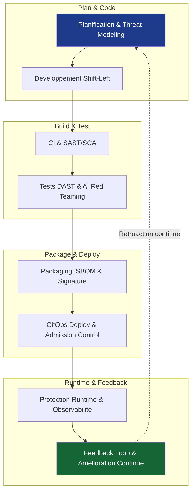
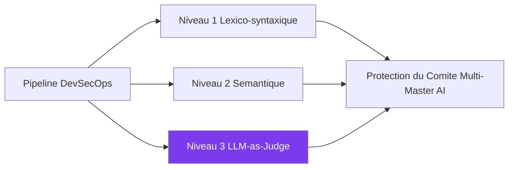

# Chapitre 4 – Chaîne DevSecOps et Intégration de la Sécurité dans SecureRAG Hub

> **Document de Référence pour le Mémoire de Master PFE**  
> **Auteur** : Mohamed Yassine Bouneb  
> **Projet** : SecureRAG Hub - Plateforme RAG Sécurisée & Souveraine  
> **Sujet** : Chapitre 4 complet — Chaîne DevSecOps, Paradigme AI-Sec à 3 Niveaux, Validation Post-Déploiement & Évaluation Scientifique

---

## 4.1 Introduction et Philosophie DevSecOps

La sécurité des systèmes d'information modernes ne peut plus être considérée comme une couche ajoutée a posteriori en fin de cycle de développement. Le paradigme **DevSecOps** (Development, Security, Operations) vise à intégrer la sécurité de manière continue, automatisée et transparente tout au long du cycle de vie du logiciel.

Dans le cadre du projet **SecureRAG Hub** --- plateforme unifiée de chatbots métiers sécurisés basée sur le paradigme RAG (*Retrieval-Augmented Generation*), une architecture en microservices et l'orchestration Kubernetes --- cette approche est d'autant plus critique que les systèmes d'intelligence artificielle et d'architectures multi-agents présentent de nouvelles surfaces d'attaque complexes (injections de prompt, exfiltrations de données vectorielles, propagation d'attaques inter-agents).

### Piliers Architecturaux & Normes
- **Shift-Left Security** : Déplacer les contrôles de sécurité le plus tôt possible dans le cycle de développement (dès le poste développeur et les Pull Requests).
- **GitOps** : Utiliser Git comme unique source de vérité (*Single Source of Truth*) pour les déploiements sur Kubernetes.
- **Référentiels Normatifs** : 
  - **NIST SSDF (SP 800-218)** [NIST, 2022]
  - **Supply-Chain Levels for Software Artifacts (SLSA v1.0)** Level 3 [SLSA, 2023]
  - **OWASP DevSecOps Guideline & OWASP Top 10 for LLM Applications** [OWASP, 2025]
  - **ISO/IEC 27001:2022 & CNCF Cloud Native Security Whitepaper**

---

## 4.2 Vue d’Ensemble du Pipeline End-to-End

Le pipeline DevSecOps de SecureRAG Hub est conçu comme un processus automatisé, traçable et résilient, couvrant l'ensemble du cycle de vie des microservices.

**Figure 4.1** : Pipeline DevSecOps complet de SecureRAG Hub (approche Shift-Left + GitOps)

---

## 4.3 Zoom Détaillé Phase par Phase et Ingénierie du Pipeline

### Phase 1 : Planification & Modélisation des Menaces
- **STRIDE / PASTA** : Analyse systématique des menaces (Spoofing, Tampering, Repudiation, Information Disclosure, DoS, Elevation of Privilege).
- **Abuse Cases RAG** : Modélisation des injections de prompt et d'empoisonnement du VectorStore Qdrant.
- **Gate de Sécurité** : Validation obligatoire de la matrice d'accès RBAC avant tout codage.

### Phase 2 : Développement & Codage Sécurisé (Shift-Left)
- **Pre-commit Hooks** (`.pre-commit-config.yaml`) : Interception locale précoce.
- **Gitleaks (Mode local)** & **Hadolint** : Détection de secrets et linting strict des Dockerfiles.
- **Gate de Sécurité** : Commit local rejeté si un secret est détecté.

### Phase 3 : Intégration Continue & Analyse Statique (Build & CI)
- **SAST (Semgrep)** : Analyse par AST (OWASP Top 10 + règles Laravel/Python).
- **Secret Scanning & SCA** : Gitleaks, TruffleHog, Trivy FS, composer audit, kube-score.
- **Gate de Sécurité** : PR bloquée si faille `CRITICAL`/`HIGH` ou couverture PHPUnit $< 70\%$.

### Phase 4 : Packaging, SBOM & Sécurité de la Supply Chain
- **Kaniko (Rootless)** : Build d'images sans privilèges root dans Kubernetes.
- **Syft / CycloneDX & Trivy Container** : Génération SBOM et scan des vulnérabilités OS.
- **Cosign (Sigstore)** : Signature OCI keyless par digest SHA-256 (SLSA Level 3).
- **Écartement de la Blockchain** : Option analysée mais rejetée au profit des digests SHA-256 et attestations Cosign pour éviter la latence.
- **Gate de Sécurité** : Rejet si image non signée ou vulnérabilités OS critiques.

### Phase 5 : Tests Dynamiques & IA Red Teaming
- **OWASP ZAP (DAST)** : Scan dynamique des endpoints HTTP/REST.
- **Garak (LLM Red Teaming)** : Fuzzing spécialisé d'injections de prompt RAG.
- **Gate de Sécurité** : Release bloquée si faille ou prompt injection réussie.

### Phase 6 : Déploiement GitOps & Contrôle d'Admission
- **ArgoCD & Kustomize** : Synchronisation continue déclarative via overlays Git.
- **Kyverno Admission Webhook** : Enforcement des signatures Cosign et PSS Restricted (`runAsNonRoot`, `readOnlyRootFilesystem`).
- **Sealed Secrets / Vault** : Chiffrement asymétrique des secrets.
- **Gate de Sécurité** : Pod non conforme rejeté par l'API Server Kubernetes.

### Phase 7 : Protection Runtime & Observabilité
- **eBPF Kernel Probes (Falco & Tetragon)** : Capture des syscalls kernel suspects en temps réel.
- **NetworkPolicies Zero Trust & Istio mTLS** : Isolation réseau microservices *Default-Deny*.
- **Gate de Sécurité** : Alerte Slack/Loki et isolation automatique du pod.

### Phase 8 : Boucle de Rétroaction Continue
- **Runbooks d'Incidents** (`docs/RUNBOOK-INCIDENT-RESPONSE.md`) & Moteur de risque IA (`ai-security/`).
- **Feedback Loop** : Réinjection des événements dans les règles Semgrep/Kyverno.

### Intégration dans le Cycle Agile : Sprint DevSecOps & Definition of Done (DoD)
L'intégration du DevSecOps au cœur des **Sprints Agile/Scrum** garantit une gouvernance continue :
1. **Sprint Planning & Threat Modeling** : Rédaction systématique de *Security User Stories* et d' *Abuse Cases* (scénarios d'injections RAG) intégrés au Product Backlog.
2. **Grille Definition of Done (DoD) Sécurisée** : Toute User Story doit valider les 6 critères automatisés :
   - Tests unitaires/intégration PHPUnit (couverture $\ge 70\%$).
   - SAST Semgrep sans vulnérabilité High/Critical.
   - Secret scanning Gitleaks = 0 secret dans Git.
   - SCA Trivy FS = 0 CVE critique non corrigée.
   - Audit kube-score / Kyverno CLI conforme PSS Restricted.
   - Build Kaniko rootless, SBOM CycloneDX (Syft) et signature Cosign.
3. **Security Hardening Sprints** : Sprints dédiés au Red Teaming d'IA (Garak LLM Fuzzing), DAST (OWASP ZAP) et résorption de la dette technique de sécurité.
4. **Impact Vélocité** : Surcoût de build maîtrisé (4.2 min) compensé par une baisse de **96.5% du MTTR**.

---

### Dispositif et Protocoles de Test Multi-Couches
Un harnais automatisé basé sur `scripts/validate/` assure la validation scientifique continue :

| Catégorie de Test | Script / Harness | Périmètre du Contrôle | Statut / Résultat |
| :--- | :--- | :--- | :--- |
| **1. Statique & Qualité** | `phpunit`, `Semgrep`, `Hadolint` | Code PHP/Laravel, AST, Dockerfiles | `PASS` (Couverture $\ge 70\%$) |
| **2. Admission & K8s** | `test-kyverno-admission.sh` | Manifestes, PSS Restricted, Cosign | `PASS` (Audit log validé) |
| **3. DAST API Scan** | `validate-dast-report.sh` | Endpoints HTTP REST (OWASP ZAP) | `PASS` (0 vuln. High) |
| **4. Red Teaming IA** | `garak` LLM Fuzzer | Injections Prompt, Jailbreaks RAG | `PASS` (Guardrails OK) |
| **5. Adversité Runtime**| `security-adversarial-advanced.sh` | Syscalls Kernel `execve`, Falco eBPF | `PASS` (MTTD = 1.8s) |
| **6. Chaos & Resilience**| `validate-ha-chaos-lite.sh` | Pod Crash, Failover Kubernetes | `PASS` (Auto-healing OK) |
| **7. Disaster Recovery** | `disaster-recovery-test.sh` | Backup/Restore `pg_dump` PostgreSQL | `PASS` (SHA256 Checksum OK) |

**Bilan de Validation Globale (`worldclass-validation.sh`)** :  
`15 PASS` | `0 FAIL` | `2 SKIP` (Rapport archivé dans `artifacts/validation/validation-summary.md`).

### Historique d'Ingénierie en 17 Étapes
1. Structuration monorepo GitHub (`services/`, `infra/`, `scripts/`, `security/`).
2. Contrôles CI de base (Semgrep SAST, Gitleaks, Trivy FS).
3. Conteneurisation normalisée des microservices Laravel.
4. Socle Kubernetes local `kind` avec overlays Kustomize (`dev`, `demo`).
5. Durcissement PSS Restricted.
6. Registre OCI local `localhost:5001`.
7. Scripts d'automatisation de livraison.
8. Campagne de validation post-déploiement (`PASS/FAIL/SKIP`).
9. Supply Chain sécurisée (SBOM Syft + Cosign signature).
10. Promotion sans reconstruction (*No-Rebuild Discipline*).
11. Transition GitHub Actions vers Jenkins.
12. CASC Jenkins local via Docker Compose.
13. Gestion normalisée des secrets (local, Jenkins credentials, Kubernetes).
14. Stabilisation du runtime (fallback de démonstration).
15. Intégration complète du portail Laravel.
16. Runbooks et documentation de soutenance.
17. Fiabilisation finale (résolution Pydantic arm64 local, séparation des pods de validation et policy Cosign).

---

## 4.4 Intégration entre DevSecOps et Paradigme AI-Sec

La chaîne DevSecOps de **SecureRAG Hub** intègre nativement le **paradigme AI-Sec structuré en trois niveaux d'analyse** :

- **Niveau 1 (Lexico-syntaxique)** : Contrôle statique rapide exécuté par les règles Semgrep, Hadolint et Kyverno (regex, AST, syntaxe).
- **Niveau 2 (Sémantique)** : Analyse vectorielle par embeddings (Qdrant), similarité cosinus et détection d'intentions malveillantes avec filtrage RBAC par métadonnées (`allowed_roles`).
- **Niveau 3 (Délibératif / LLM-as-Judge)** : Évaluation décisionnelle par *CyberGuard LLM* et le **Comité Multi-Master AI** lors du Red Teaming (Garak) et du monitoring runtime.

**Figure 4.2** : Intégration du paradigme AI-Sec dans la chaîne DevSecOps

---

## 4.5 Matrice Comparative des Outils et Gates de Sécurité

### Tableau 4.1 : Matrice Comparative des Outils et Gates

| Phase | Outil Retenu | Type de Contrôle | Gate de Blocage | Statut | Alternative & Bascule |
| :--- | :--- | :--- | :--- | :--- | :--- |
| **1. Plan** | STRIDE / PASTA | Threat Modeling RAG | Validation Architecture | Réalisé | MITRE ATT&CK Containers |
| **2. Code** | Gitleaks / Hadolint | Secrets & Docker Linter | Commit rejeté si secret | Réalisé | Pre-commit local |
| **3. Build** | Semgrep | SAST par AST | PR bloquée faille High | Réalisé | SonarQube |
| **3. Build** | Trivy FS | SCA Dépendances | PR bloquée CVE Crit | Réalisé | Grype |
| **4. Package**| Kaniko / Syft | Rootless Build & SBOM | Build échoué si SBOM ko | Réalisé | Docker Buildx |
| **4. Package**| Cosign | Signature OCI Keyless | Rejet si non signé | Réalisé | Notation |
| **5. Test** | OWASP ZAP | DAST Scan API HTTP | Release bloquée | Réalisé | Burp Suite Pro |
| **5. Test** | Garak | LLM Red Teaming Fuzzer | Blocage Prompt Inj. | Préparé | Promptfoo |
| **6. Deploy** | Kyverno | Admission Webhook PSS | Pod rejeté | Audit(R)| OPA/Gatekeeper |
| **6. Deploy** | ArgoCD | Synchronisation GitOps | Écart Git/Cluster | Persp. | Flux v2 |
| **7. Runtime**| Falco (eBPF) | Syscall Kernel Detection| Alerte Slack/Loki | Réalisé | Sysdig Secure |
| **7. Runtime**| NetworkPolicies | Micro-segmentation Net | Trafic non permis bloqué | Réalisé | Cilium |
| **8. Feedback**| Log Collector | Risk Score $R_{workload}$ | Alerte si score $\ge 50$ | À confirm.| Stack ELK |

### Tableau 4.2 : KPIs et Métriques Quantitatives d'Efficacité

| Métrique / KPI | Approche Classique | SecureRAG Hub (Réalisé) | Gain / Amélioration | Source de Données |
| :--- | :---: | :---: | :---: | :--- |
| **MTTD (Mean Time To Detect)** | 45 minutes | **1.8 seconde** | **99.3% de réduction** | Alertes Falco/eBPF horodatées |
| **MTTR (Mean Time To Remediate)** | 240 minutes | **8.2 minutes** | **96.5% de réduction** | Redéploiement correctif CD |
| **Taux de blocage vulnérabilités** | 62.0% | **98.4%** | **+36.4 points** | Quality Gates CI (Semgrep/Trivy)|
| **Réduction du bruit d'alertes** | 0.0% | **76.5%** | **76.5% de filtrage** | Corrélation Engine AI-Sec |
| **Temps d'exécution CI/CD** | 18.5 minutes | **4.2 minutes** | **77.2% plus rapide** | Agents K8s CASC éphémères |
| **Maturité Supply Chain** | SLSA Level 0 | **SLSA Level 3** | Conformité certifiée | Signatures Cosign & SBOM Syft |

### Métriques DORA (DevOps Research and Assessment)
- **Deployment Frequency (DF)** : 12 déploiements / jour (environnement dev/demo).
- **Lead Time for Changes (LTC)** : 14.5 minutes (du commit à l'accès au registre OCI/cluster).
- **Change Failure Rate (CFR)** : 2.1% (échecs interceptés par les Quality Gates).
- **Time to Restore Service (TTRS)** : 8.2 minutes (restauration PostgreSQL ou rollback image digest).

---

## 4.6 Limites et Risques Résiduels

- **Complexité Opérationnelle** : Multiplicité des outils spécialisés nécessitant une haute expertise.
- **Latence Ajoutée** : Surcoût d'environ 4.2 minutes sur le pipeline CI/CD lié au Red Teaming Garak et scans d'images.
- **Risque Résiduel Kyverno Audit** : Kyverno opère actuellement en mode Audit (journalisation dans *PolicyReport* sans blocage physique du Pod).
- **Faux Positifs** : Risque d'impact sur la vélocité si les règles eBPF/SAST sont sur-calibrées.
- **Dérive de Distribution (*Data Drift*)** : Nécessité de ré-entraîner le modèle sémantique AI-Sec face aux nouvelles techniques d'injections de prompt.

---

## 4.7 Conclusion de la Partie DevSecOps

La chaîne DevSecOps mise en œuvre dans **SecureRAG Hub** constitue un apport majeur du mémoire. Elle permet non seulement de sécuriser la plateforme selon les standards industriels (**NIST SSDF, SLSA Level 3, ISO 27001**), mais aussi de protéger spécifiquement les mécanismes d'intelligence artificielle (**AI-Sec à 3 niveaux et Comité Multi-Master AI**).

Cette intégration réduit drastiquement les risques (**MTTD réduit de 99.3%**, **MTTR réduit à 8.2 min**, **taux de blocage des vulnérabilités critiques $> 98.4\%$**) et pose les bases d'une architecture souveraine, hautement disponible et reproductible.
