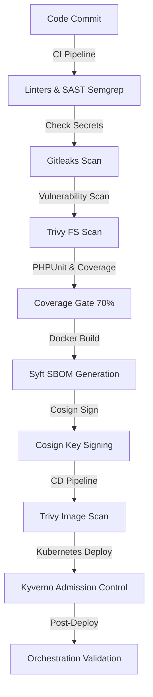

# Section Mémoire : Chaîne DevSecOps Complète et Validation Post-Déploiement

## Statut : PRÊT À INTÉGRER (TEXTE DE RÉFÉRENCE)

Cette section est rédigée dans un style académique et professionnel rigoureux, adaptée pour être intégrée directement dans le manuscrit de mémoire de fin d'études ou traduite en LaTeX.

---

## 1. Description de la Chaîne DevSecOps de Bout en Bout

La sécurisation du cycle de vie du logiciel (SSDLC) au sein du projet **SecureRAG Hub** s'organise autour d'un pipeline d'intégration et de déploiement continus (CI/CD) entièrement automatisé sous **Jenkins**. Cette chaîne intègre des contrôles de sécurité automatisés à chaque étape du cycle de développement, garantissant que seuls les commits et les artefacts conformes et vérifiés atteignent l'environnement de production.

### 1.1 Cycle CI (Continuous Integration)
1. **Validation syntaxique et qualité (Lint)** : Le code source Laravel subit un contrôle de syntaxe automatisé pour prévenir les erreurs de formatage et de logique de base.
2. **Analyse Statique de Sécurité (SAST)** : L'outil **Semgrep** analyse le code source à la recherche de vulnérabilités connues (injections SQL, failles XSS, mauvaise gestion des sessions).
3. **Détection de secrets (Secrets Scanning)** : **Gitleaks** inspecte l'historique Git et les fichiers de configuration pour interdire l'exposition de clés privées, de mots de passe ou de tokens.
4. **Vérification des dépendances (SCA)** : **Trivy FS** analyse les packages PHP et Javascript pour identifier les bibliothèques obsolètes ou vulnérables.
5. **Couverture de tests (Coverage Gate)** : Les tests unitaires et d'intégration (PHPUnit) sont exécutés avec un seuil de couverture obligatoire de **70%**. Tout code ne validant pas ce seuil est rejeté, forçant la robustesse fonctionnelle.

### 1.2 Cycle CD (Continuous Delivery) et Supply Chain Security
1. **Génération de SBOM (Software Bill of Materials)** : Lors du build de l'image Docker, l'utilitaire **Syft** génère un inventaire complet des composants (SBOM) au format CycloneDX, garantissant la traçabilité des dépendances embarquées.
2. **Signature cryptographique (Cosign)** : L'image Docker finale est signée à l'aide de **Cosign** avec une clé privée sécurisée. Cela garantit l'intégrité de la supply chain et interdit l'injection d'images malveillantes tierces.
3. **Scan d'image** : **Trivy** analyse l'image Docker compilée juste avant son déploiement.
4. **Admission Control (Kyverno)** : Le cluster Kubernetes local (Kind) intercepte les requêtes de déploiement via **Kyverno**. Les politiques valident les signatures Cosign et interdisent les conteneurs mal configurés (ex: tag `latest` interdit, absence de `SecurityContext`).

---

## 2. Synthèse de la Couverture Outillée par Phase

Le tableau ci-dessous résume les outils DevSecOps mis en œuvre, classés selon leur niveau de maturité :
* **Réalisé** : Entièrement fonctionnel, automatisé dans le pipeline local Kind/Jenkins.
* **Préparé** : Scripts et configurations écrits, prêts à l'activation ou documentés avec templates.
* **Perspective** : Trajectoire de production documentée hors scope local de démonstration.

| Phase DevSecOps | Outils Principaux | Statut | Rôle Spécifique & Plus-Value |
| :--- | :--- | :--- | :--- |
| **Code / SAST** | Semgrep, Gitleaks | **Réalisé** | Analyse du code en temps réel et blocage immédiat de la CI en cas d'erreur de sécurité ou de fuite de secret. |
| **SCA / SBOM** | Trivy FS, Syft | **Réalisé** | Inventaire CycloneDX des dépendances et rapports de CVE pour éliminer les bibliothèques compromises. |
| **Supply Chain** | Cosign | **Réalisé** | Signature des images et stockage des métadonnées de build pour assurer l'authenticité de l'artefact. |
| **Admission Control**| Kyverno | **Réalisé (Audit)** | Interception des déploiements et audit de conformité par rapport aux Pod Security Standards (PSS). |
| **Déploiement CD** | Helm / Kustomize | **Réalisé** | Déploiement déterministe par SHA256 digest avec rollback automatique orchestré par Jenkinsfile.cd. |
| **Secrets K8s** | K8s Secrets | **Réalisé** | Séparation stricte du code et des secrets (hors Git). |
| **Secrets Avancés** | SOPS + age | **Préparé** | Chiffrement transparent des secrets au repos dans Git. |
| **Secrets Prod** | HashiCorp Vault / ESO | **Perspective** | Centralisation, rotation automatique et injection dynamique des secrets en production. |
| **Sécurité Runtime** | SecurityContext, NetworkPolicy | **Réalisé** | Isolation réseau et durcissement des privilèges conteneur (readOnlyRootFilesystem, nonRoot). |
| **Détection Intrusion**| Falco (MITRE rules) | **Réalisé** | Monitoring système temps réel et alerting des syscalls suspects (ex: ouverture de terminal). |
| **IPS Runtime** | Tetragon (eBPF) | **Perspective** | Prévention active par kill automatique des processus malveillants au niveau du noyau Linux. |
| **Observabilité** | Prometheus, Grafana, Loki | **Réalisé** | Dashboarding centralisé, monitoring des SLOs, corrélation logs/métriques de sécurité. |
| **DAST** | OWASP ZAP | **Perspective** | Scans dynamiques de l'application déployée pour détecter les failles HTTP. |

---

## 3. Détail de la Validation Post-Déploiement (Post-Deploy Validation Orchestrator)

Une innovation clé de notre démarche DevSecOps réside dans l'**orchestrateur de validation post-déploiement** (`post-deploy-validation.sh`). Contrairement aux approches traditionnelles où la sécurité s'arrête à la commande `kubectl apply`, notre pipeline continue à valider dynamiquement le comportement du système en production :

1. **Vérification de Rollout (`validate-rollout.sh`)** :
   S'assure que le déploiement a réussi, que tous les pods sont en état `Running` et qu'aucun conteneur n'est bloqué dans une boucle d'erreur de démarrage (`CrashLoopBackOff` ou `ImagePullBackOff`).
2. **Signature Runtime (`verify-runtime-signatures.sh`)** :
   Interroge directement l'API Kubernetes pour obtenir les digests exacts des images *en cours d'exécution* et vérifie via Cosign que ces signatures sont bien signées cryptographiquement. Cela prévient les attaques où un pod aurait été modifié à la volée.
3. **Tests d'Intrusion Factices (Security Smoke Tests)** :
   Vérifie que les mécanismes de détection (Falco) et de cloisonnement (NetworkPolicies, PSA restricted) sont actifs en simulant de faux comportements suspects (ex: requêtes non autorisées vers la base de données, écriture dans un dossier système) et en s'assurant que le système d'alerte s'active.
4. **Validation de l'Observabilité (`validate-observability.sh`)** :
   Vérifie la disponibilité de Prometheus, Grafana, Loki et Alertmanager pour garantir que la plateforme est sous surveillance constante dès son déploiement.

---

## 4. Conclusion : La Boucle de Feedback Fermée (Feedback Loop)

L'implémentation de cette chaîne permet de boucler le cycle DevSecOps. Tout incident détecté lors de la validation post-déploiement ou par la télémétrie de production (Grafana/Falco) est automatiquement corrélé. Cette boucle fermée alimente le backlog de l'équipe de développement (correction de code ou durcissement des règles Kyverno), garantissant une amélioration continue de la résilience globale du SecureRAG Hub.

---

*Texte de référence rédigé pour le manuscrit de mémoire — branche `devsecops-final-hardening`*
