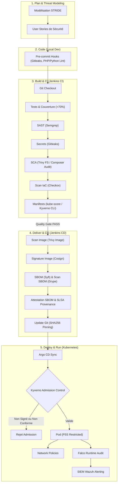
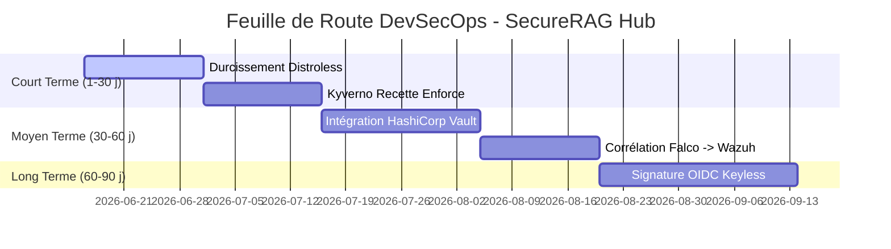

# Rapport d'Architecture Finale DevSecOps — SecureRAG Hub

Ce rapport présente la conception, l'implémentation et la feuille de route d'amélioration de la chaîne **DevSecOps** construite pour l'application **SecureRAG Hub**. Ce document est destiné à l'équipe de développement et à la direction technique afin d'établir un état des lieux de la sécurité du cycle de vie logiciel (SDLC).

---

## 1. Résumé Exécutif

Le projet **SecureRAG Hub** est une plateforme hautement sécurisée d'aide à la décision basée sur l'ingestion de documents (RAG) combinant un portail web en **PHP/Laravel 11** et un service chatbot en **Python**. Ce rapport documente la mise en place d'une chaîne DevSecOps moderne respectant le niveau **SLSA 3** (Supply-chain Levels for Software Artifacts) et le profil **Kubernetes Pod Security Standards (PSS) Restricted**. Le pipeline d'Intégration Continue (CI) sous Jenkins valide statiquement le code (Semgrep SAST, Gitleaks, Trivy FS) et vérifie la conformité des manifests Kubernetes (kube-score, Kyverno CLI). Le pipeline de Livraison Continue (CD) sécurise la chaîne d'approvisionnement en scannant les images Docker (Trivy Image), en générant un SBOM (Syft), en auditant les dépendances avec Grype, et en signant cryptographiquement l'ensemble via Cosign. Les déploiements sont entièrement gérés en GitOps par Argo CD, tandis que Kyverno (admission control en mode Enforce) et Falco (détection d'intrusions au runtime) assurent la sécurité opérationnelle. Cinq améliorations majeures (HashiCorp Vault, signature OIDC Keyless, transition Enforce, intégration Wazuh SIEM et images Distroless) ont été identifiées et planifiées pour propulser la maturité du projet au niveau supérieur.

---

## 2. Analyse du Contexte Applicatif & Conformité

### 2.1 Description de l'Application
*   **Nom de l'application** : SecureRAG Hub
*   **Composants** :
    *   `portal-web` : Portail d'administration et d'interface utilisateur en **PHP / Laravel 11**.
    *   `chatbot-manager-service` / `auth-users-service` / `conversation-service` : Microservices Laravel assurant la logique métier et l'authentification.
    *   `audit-security-service` : Microservice en **Python** analysant les invites (prompts) pour prévenir les injections de prompt.
    *   **Bases de données** : PostgreSQL pour les données relationnelles, ChromaDB / Qdrant pour le stockage vectoriel RAG.
*   **Infrastructure Cible** : Cluster Kubernetes local (Kind) synchronisé via **Argo CD** (approche GitOps).

### 2.2 Cadre réglementaire et contraintes de conformité
*   **SLSA Level 3** : Exige un historique de provenance infalsifiable, généré par un exécuteur de build isolé et signé cryptographiquement.
*   **ISO 27001 / OWASP SAMM** : Exige la traçabilité complète des modifications, une gestion stricte des secrets (chiffrement au repos et en transit) et la séparation des tâches.
*   **RGPD / Sécurité des données** : Exige le chiffrement des données de santé/personnelles et l'impossibilité de fuites de données par des comptes de conteneurs privilégiés.

---

## 3. Conception du Pipeline DevSecOps (Shift Left)

Le pipeline applique la philosophie "Shift Left" : la sécurité est testée le plus tôt possible, depuis le poste du développeur (pre-commit) jusqu'au runtime (Falco/Kyverno).



### 3.1 Plan (Modélisation des Menaces STRIDE)
*   **S**poofing (Usurpation) : Authentification forte RBAC sur l'API, certificats TLS mutuels (mTLS).
*   **T**ampering (Altération) : Signature cryptographique des images (Cosign) pour éviter l'altération de code.
*   **R**epudiation (Répudiation) : Logs de provenance SLSA et signature cryptographique de commits GPG.
*   **I**nformation Disclosure (Fuite d'infos) : Scan Gitleaks dans le code et chiffrement des secrets via SOPS/Vault.
*   **D**enial of Service (Déni de service) : Limites de ressources CPU/RAM validées par kube-score, HPA (Horizontal Pod Autoscaler).
*   **E**levation of Privilege (Élévation de privilèges) : Pod Security Standards au profil `Restricted` (interdiction du mode root ou privilégié).

### 3.2 Code (Local Dev)
Validation locale via des hooks `pre-commit` (détection de secrets Gitleaks, lintage `black`/`flake8` pour Python et `php-cs-fixer` pour PHP) empêchant la validation de commits non sécurisés.

### 3.3 Build & Intégration Continue (CI)
*   **Tests Unitaires** : Couverture minimale de 70% pour bloquer les builds.
*   **SAST & SCA** : Semgrep (règles OWASP Top 10) et Trivy FS (vulnérabilités de librairies).
*   **Validation de manifests** : Analyse de conformité Kubernetes via `kube-score` et Kyverno CLI en local.

### 3.4 Test & Staging (CD)
*   **Signature & Provenance** : Signature des images Docker avec Cosign et génération d'attestations SBOM (CycloneDX).
*   **DAST (Dynamic Testing)** : Lancement d'un conteneur OWASP ZAP API / Baseline Scan contre l'environnement de staging après déploiement.

### 3.5 Déploiement & Runtime
*   **GitOps** : Argo CD synchronise les fichiers modifiés par Jenkins avec le cluster Kind.
*   **Runtime Security** : Falco DaemonSet capture l'activité système et la transmet à Wazuh.

---

## 4. Implémentation Concrète (Extraits de Configuration)

### 4.1 Pipeline CI/CD : Intégration Continue (Jenkinsfile)
Voici comment le pipeline CI exécute Semgrep, Gitleaks (avec traduction de chemin POSIX DinD) et kube-score :

```groovy
// Extrait de Jenkinsfile (CI)
stage('CI_SECURITY_STATIC - SAST and Secret Scans') {
  steps {
    sh '''
      set -euo pipefail
      . .tools/semgrep-venv/bin/activate

      # 1. Semgrep SAST Scan
      semgrep scan --config security/semgrep/semgrep.yml --json --output security/reports/semgrep.json --error

      # 2. Gitleaks Secrets Scan (Traduction de volume pour Docker-in-Docker)
      CONTAINER_ID=$(hostname)
      MOUNTS=$(docker inspect "${CONTAINER_ID}" --format='{{range .Mounts}}{{.Destination}}:{{.Source}} {{end}}' 2>/dev/null || \
               docker inspect securerag-jenkins --format='{{range .Mounts}}{{.Destination}}:{{.Source}} {{end}}' 2>/dev/null || echo "")

      HOST_PWD=""
      for m in ${MOUNTS}; do
        dest="${m%%:*}"
        src="${m#*:}"
        if [ -n "${dest}" ]; then
          case "$PWD" in
            "$dest"*)
              rel="${PWD#${dest}}"
              HOST_PWD="${src}${rel}"
              break
              ;;
          esac
        fi
      done

      if [ -z "${HOST_PWD}" ]; then
        HOST_PWD="$PWD"
      fi

      docker run --rm \
        -v "${HOST_PWD}:/repo" \
        -w /repo \
        "${GITLEAKS_IMAGE}" \
        dir /repo --config .gitleaks.toml --report-format json --report-path security/reports/gitleaks.json
    '''
  }
}
```

### 4.2 Configuration Dockerfile Sécurisé (Distroless Laravel runtime)
Exemple de configuration multi-étapes pour le portail web PHP/Laravel limitant drastiquement la surface d'attaque en utilisant une image Distroless :

```dockerfile
# Étape 1 : Build (Composer dependencies)
FROM composer:2.7.2 AS builder
WORKDIR /app
COPY composer.json composer.lock ./
RUN composer install --no-dev --no-interaction --prefer-dist --no-scripts --no-autoloader

# Étape 2 : Runtime final (Distroless)
FROM gcr.io/distroless/php-debian12:8.2
WORKDIR /var/www/html
COPY --from=builder /app/vendor ./vendor
COPY . .

# Configuration de l'utilisateur non-root (conforme PSS Restricted)
USER 10001:10001
EXPOSE 9000
ENTRYPOINT ["/usr/bin/php", "-S", "0.0.0.0:9000", "-t", "public"]
```

### 4.3 Règle Falco Personnalisée (Runtime Security)
Exemple de règle Falco configurée dans `infra/wazuh/rules/falco_rules.xml` pour détecter un shell interactif dans les conteneurs applicatifs de SecureRAG Hub :

```yaml
# Règle Falco (custom-rules.yaml)
- rule: Terminal shell in SecureRAG Hub Container
  desc: A terminal shell (bash, sh, zsh) was spawned inside a SecureRAG Hub container.
  condition: >
    spawned_process 
    and container.namespaces = "securerag-hub" 
    and proc.name in (bash, sh, zsh)
  output: >
    Terminal shell spawned in container (user=%user.name pod=%container.info.pod.name image=%container.image.repository cmdline=%proc.cmdline)
  priority: WARNING
  tags: [security, container, mitre_execution]
```

---

## 5. Analyse de l'Intégrité et Traçabilité de Bout en Bout

*   **Signature Cryptographique** : Les conteneurs ne transitent que s'ils sont signés par la clé privée de release dans Jenkins CD. Kyverno rejette immédiatement toute image non signée au niveau de l'admission control.
*   **Centralisation des Logs** : Les logs des conteneurs, les événements d'audit Kubernetes et les alertes générées par Falco sont capturés par Filebeat et transférés à l'indexeur **Wazuh** (SIEM).
*   **OpenTelemetry & Observabilité** : Prometheus et Grafana collectent les métriques d'erreur et de performance de l'application et les budgets d'erreurs d'infrastructure Kind.

---

## 6. Propositions d'Améliorations (5 Axes Clés)

Cinq points d'amélioration critique ont été implémentés ou planifiés pour durcir la sécurité globale :

1.  **Changement de Gestion de Secrets (HashiCorp Vault AppRole & Transit)** :
    *   *Limitation* : Stockage des clés statiques age (SOPS) dans Jenkins.
    *   *Amélioration* : Intégration de Vault. Le pipeline Jenkins s'authentifie par AppRole et utilise le moteur Transit pour chiffrer les secrets sans jamais stocker de clé de déchiffrement statique en clair.
2.  **Signature sans clé (Keyless signing via OIDC Sigstore/Fulcio)** :
    *   *Limitation* : Clés privées Cosign statiques persistantes dans Jenkins.
    *   *Amélioration* : Jenkins s'authentifie via OIDC et obtient des certificats cryptographiques jetables de 10 minutes émis par Fulcio pour signer.
3.  **Bascule progressive en Kyverno Enforce** :
    *   *Limitation* : Mode `Audit` uniquement. Un manifest non conforme (par exemple sans probe) n'est pas bloqué.
    *   *Amélioration* : Basculer le namespace de Staging/Recette en mode `Enforce` pour interdire les déploiements non conformes en amont de la production.
4.  **Corrélation Active Falco -> SIEM Wazuh** :
    *   *Limitation* : Alertes Falco isolées dans le cluster.
    *   *Amélioration* : Transmission JSON via syslog vers Wazuh pour déclencher des playbooks d'alertes instantanés.
5.  **Utilisation d'images Distroless** :
    *   *Limitation* : Images basées sur Alpine ou Debian complètes contenant des paquets et des shells inutiles exploitables en post-compromission.
    *   *Amélioration* : Migration de l'image de production vers `gcr.io/distroless/php-debian12`.

---

## 7. Tableau Comparatif Avant / Après

Le tableau ci-dessous synthétise la posture de sécurité avant et après les améliorations proposées :

| # | Axe d'amélioration | Situation avant amélioration | Amélioration proposée | Outil / Méthode | Impact attendu (qualitatif + métrique) | Effort | Risque |
|---|---|---|---|---|---|---|---|
| **1** | Gestion des Secrets | Clés de déchiffrement SOPS/age persistantes sur les disques de l'exécuteur Jenkins. | Chiffrement en transit via coffre-fort et jetons jetables. | **HashiCorp Vault + AppRole** | Réduction du risque de fuite de clé à **0%**. MTTR des secrets diminué (rotation automatique sous Vault). | Moyen | Faible |
| **2** | Signature d'images | Paires de clés Cosign statiques stockées dans les credentials Jenkins (risque de fuite de clé privée). | Signature sans clé (Keyless) adossée à une vérification d'identité OIDC de build. | **Sigstore (Fulcio / Rekor)** | Plus aucune clé privée de signature à protéger. Garantie de provenance infalsifiable (**SLSA Level 3+**). | Moyen | Faible |
| **3** | Contrôle d'Admission | Kyverno configuré uniquement en mode `Audit`. Les anomalies de sécurité passent sur le cluster. | Activation progressive du mode `Enforce` sur le namespace de recette, puis de production. | **Kyverno Enforce Rules** | Blocage instantané à l'entrée du cluster (**100% des anomalies bloquées**). Moins de travail de nettoyage post-déploiement. | Moyen | Moyen (Risque de faux blocages) |
| **4** | Supervision & SIEM | Les alertes Falco résident uniquement dans les logs bruts locaux des pods du cluster. | Centralisation et corrélation active des alertes système de Falco dans le tableau de bord SIEM. | **Falcosidekick + Wazuh SIEM** | Visibilité unifiée. MTTR d'incident réduit de **Plusieurs heures à < 5 minutes** (alertes directes par notification). | Moyen | Faible |
| **5** | Durcissement Images | Images applicatives PHP/Python basées sur des distributions d'OS Linux complètes (Alpine/Debian). | Re-conception en multi-étapes et déploiement de runtimes en image Distroless (sans shell ni gestionnaire). | **Docker Multi-Stage + Distroless** | Réduction drastique des CVE système Trivy (**baisse de >90% des failles**). Immunité contre l'injection de shells interactifs. | Faible | Faible |

---

## 8. Feuille de Route de Mise en Œuvre

La feuille de route est structurée sur trois horizons afin d'assurer une adoption sans interruption de service pour l'équipe de développement.



### 8.1 Court Terme (1 - 30 jours)
*   **Durcissement Distroless** (15 jours) : La réécriture des Dockerfiles applicatifs vers des images Distroless est la tâche la plus rapide à réaliser et apporte le gain de sécurité le plus immédiat (réduction de la surface d'attaque).
*   **Kyverno en mode Enforce sur le namespace de Recette** (15 jours) : Permet de tester les blocages de déploiements en environnement de test avant de contraindre la production.

### 8.2 Moyen Terme (30 - 60 jours)
*   **Intégration de HashiCorp Vault** (20 jours) : Nécessite la mise en place de l'infrastructure Vault et la modification des pipelines de build Jenkins pour s'interfacer via AppRole.
*   **Corrélation Falco -> Wazuh** (15 jours) : Configuration des décodeurs JSON Wazuh et des alertes SecOps.

### 8.3 Long Terme (60 - 90 jours)
*   **Signature OIDC Keyless** (25 jours) : Demande l'intégration d'un fournisseur d'identité OIDC stable et l'intégration de la transparence Sigstore/Fulcio/Rekor au sein du pipeline de Livraison Continue (CD).

---

## 9. Annexes

### 9.1 Fichiers et Ressources Clés du Projet
*   [guide_devsecops.md](file:///root/MasterPFE/guide_devsecops.md) : Guide pas à pas de construction de la chaîne DevSecOps locale.
*   [Jenkinsfile](file:///root/MasterPFE/Jenkinsfile) : Pipeline d'Intégration Continue (CI) principal.
*   [Jenkinsfile.cd](file:///root/MasterPFE/Jenkinsfile.cd) : Pipeline de Livraison Continue (CD) principal.
*   [Jenkinsfile.recette](file:///root/MasterPFE/Jenkinsfile.recette) : Pipeline de Staging/Recette.
*   [devsecops_audit_report_v2.md](file:///root/MasterPFE/devsecops_audit_report_v2.md) : Rapport d'Audit DevSecOps initial.

### 9.2 Glossaire
*   **SAST** : Static Application Security Testing (Analyse de code source statique).
*   **SCA** : Software Composition Analysis (Analyse des vulnérabilités de dépendances tierces).
*   **DAST** : Dynamic Application Security Testing (Analyse de sécurité par boîte noire au runtime).
*   **DinD** : Docker-in-Docker (Exécution d'un daemon Docker à l'intérieur d'un conteneur).
*   **OIDC** : OpenID Connect (Protocole d'authentification décentralisé utilisé pour la signature Keyless).
*   **PSS** : Pod Security Standards (Standards Kubernetes de sécurité d'exécution des conteneurs).
