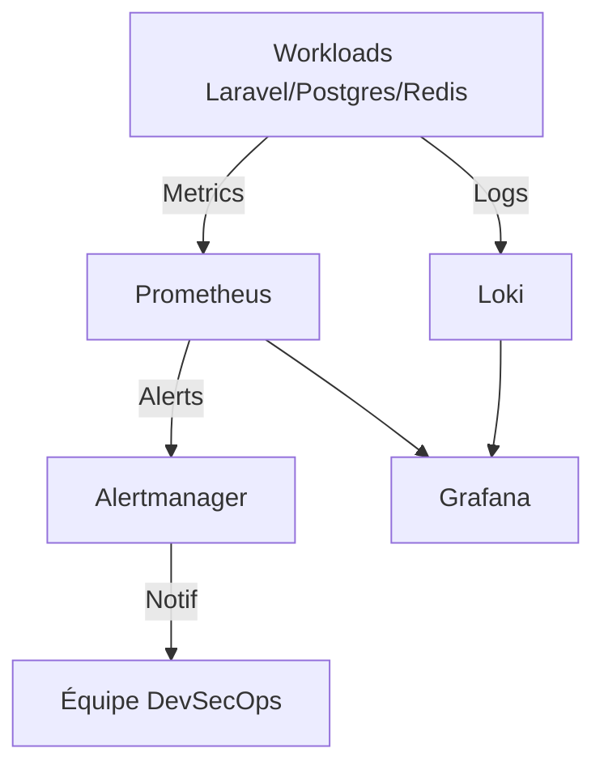

# Guide Opérationnel de l'Observabilité — SecureRAG Hub

## Statut : FONCTIONNEL & CONFIGURÉ

Ce guide fournit les instructions opérationnelles pour démarrer, utiliser et analyser l'état de santé du cluster SecureRAG Hub via la stack d'observabilité intégrée (Prometheus, Grafana, Loki, Alertmanager).

---

## 1. Vue d'ensemble de la Stack

La stack d'observabilité est déployée dans le namespace dédié `securerag-monitoring` et se compose de :
* **Prometheus** : Collecte et stockage des métriques temporelles des pods et du cluster.
* **Grafana** : Visualisation des données via des tableaux de bord interactifs.
* **Loki** : Centralisation et indexation des logs applicatifs et système.
* **Alertmanager** : Gestion, groupement et acheminement des alertes basées sur les règles Prometheus.



---

## 2. Démarrage Rapide

Pour déployer la stack d'observabilité sur votre cluster local Kind :

```bash
# Lancer toute la stack d'observabilité
make observability-up

# Vérifier que tous les pods de monitoring sont prêts
kubectl get pods -n securerag-monitoring
```

---

## 3. Accès aux Interfaces Web

Par défaut, les services sont internes au cluster. Des targets Makefile sont fournies pour exposer les interfaces sur votre machine locale via `kubectl port-forward` :

| Service | Port Local | Commande de connexion | Identifiants par défaut |
| :--- | :---: | :--- | :--- |
| **Grafana** | `3000` | `make grafana-port-forward` | `admin` / `admin` |
| **Prometheus** | `9090` | `make prometheus-port-forward` | Aucun |
| **Alertmanager** | `9093` | `make alertmanager-port-forward` | Aucun |

> [!TIP]
> Laissez les commandes de port-forward tourner dans un terminal séparé pendant vos démonstrations.

---

## 4. Dashboards Grafana Disponibles

Une fois connecté à Grafana (`http://localhost:3000`), les tableaux de bord suivants sont pré-configurés et importés :

1. **SecureRAG - Global Performance & SLO** :
   * Taux de disponibilité global de l'API Laravel.
   * Latence des requêtes HTTP (p50, p95, p99).
   * Volume de requêtes HTTP et taux d'erreurs (5xx/4xx).
2. **Kubernetes - Pods & Resources** :
   * Consommation CPU/Mémoire réelle vs Limites/Requêtes du namespace `securerag-hub`.
   * Nombre de redémarrages (Restarts) de conteneurs.
3. **Falco Runtime Security Audit** :
   * Nombre d'alertes de sécurité runtime par niveau de criticité.
   * Visualisation des tentatives de contournement de sécurité (ex: shell ouvert, écriture non autorisée).
4. **Loki Logs Explorer** :
   * Corrélation directe des logs applicatifs avec les métriques d'erreurs.

---

## 5. Métriques Clés à Surveiller (Maturité SRE)

| Métrique Prometheus | Description | Cible SRE |
| :--- | :--- | :--- |
| `http_requests_total` | Volume de trafic entrant sur les apps Laravel. | N/A |
| `http_request_duration_seconds` | Latence de réponse HTTP. | 95% des requêtes < 200ms |
| `container_memory_working_set_bytes` | Utilisation réelle de la RAM par pod. | < 80% de la limite allouée |
| `kube_pod_container_status_restarts_total` | Nombre de crashs et redémarrages. | 0 redémarrage |
| `kyverno_policy_results_total` | Nombre d'infractions aux règles de sécurité. | 0 violation |

---

## 6. Gestion des Alertes (Règles SLO Configurées)

Six règles d'alerte majeures sont configurées dans Prometheus pour notifier automatiquement Alertmanager :

1. **`SecureRAG_ServiceDown`** (Critical) :
   * *Condition* : `up{namespace="securerag-hub"} == 0`
   * *Description* : Déclenché si un pod applicatif n'est plus joignable par Prometheus.
2. **`SecureRAG_HighErrorRate`** (Critical) :
   * *Condition* : Le taux d'erreurs HTTP 5xx dépasse 5% sur une fenêtre de 5 minutes.
3. **`SecureRAG_LatencySpike`** (Warning) :
   * *Condition* : La latence p95 dépasse 1,5 seconde.
4. **`Container_CrashLooping`** (Critical) :
   * *Condition* : Un conteneur redémarre plus de 3 fois en 10 minutes.
5. **`Kubernetes_MemoryPressure`** (Warning) :
   * *Condition* : Utilisation RAM du pod > 90% du LimitRange.
6. **`Falco_Security_Critical`** (Critical) :
   * *Condition* : Alerte Falco de priorité `CRITICAL` ou `EMERGENCY` détectée au runtime.

---

## 7. Intégration Falco et Loki

Les logs de Falco sont automatiquement analysés par Loki. En cas d'événement anormal (ex: injection de code entraînant l'exécution d'un binaire suspect), l'enchaînement est le suivant :

1. L'application Laravel subit une tentative d'injection.
2. L'attaquant tente d'exécuter `sh` ou `bash` dans le conteneur.
3. **Falco** intercepte l'appel système `execve` et génère un log d'alerte structuré en JSON.
4. **Promtail** collecte ce log et l'envoie à **Loki**.
5. Un graphe de sécurité dans Grafana affiche instantanément le pic d'alertes.
6. **Prometheus/Alertmanager** envoie une alerte critique à l'administrateur DevSecOps.

---

## 8. Commandes Utiles de Debugging Observabilité

Si le monitoring ne remonte pas de données :
```bash
# Vérifier la configuration des cibles (Targets) de Prometheus
kubectl port-forward svc/prometheus-k8s -n securerag-monitoring 9090:9090
# Puis visitez http://localhost:9090/targets pour voir si des cibles sont "DOWN"

# Consulter les logs de Loki pour vérifier la réception des logs applicatifs
kubectl logs -l app=loki -n securerag-monitoring --tail=50
```

---

*Ce document fait partie du support pack final du PFE SecureRAG Hub — branche `devsecops-final-hardening`*
