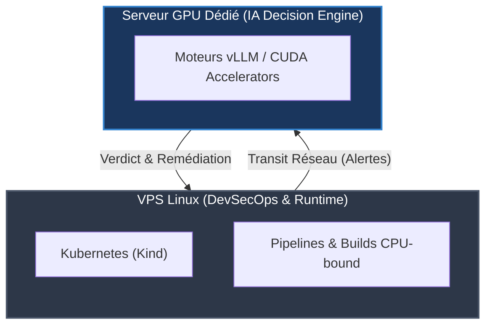
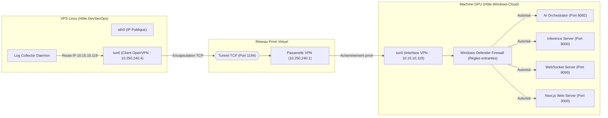
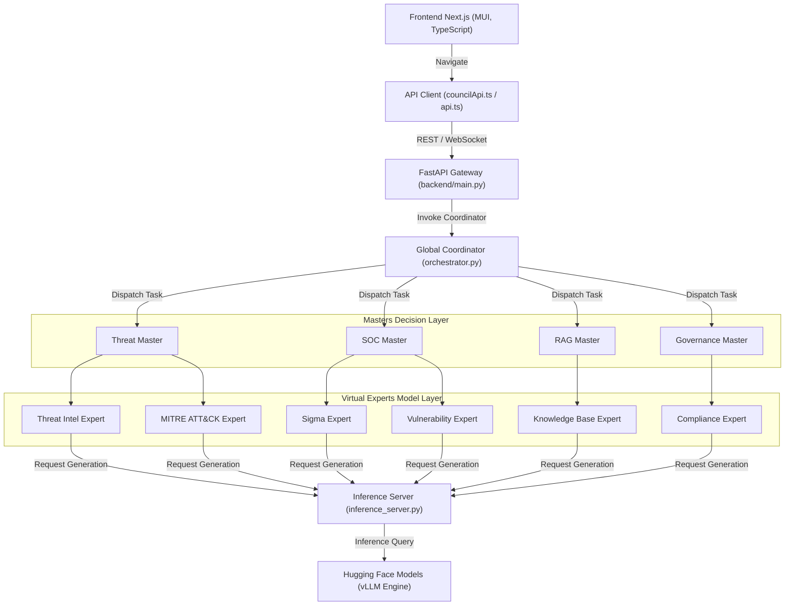
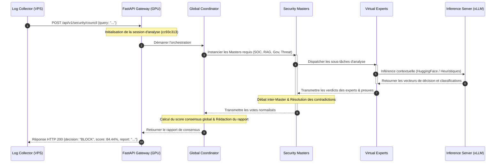
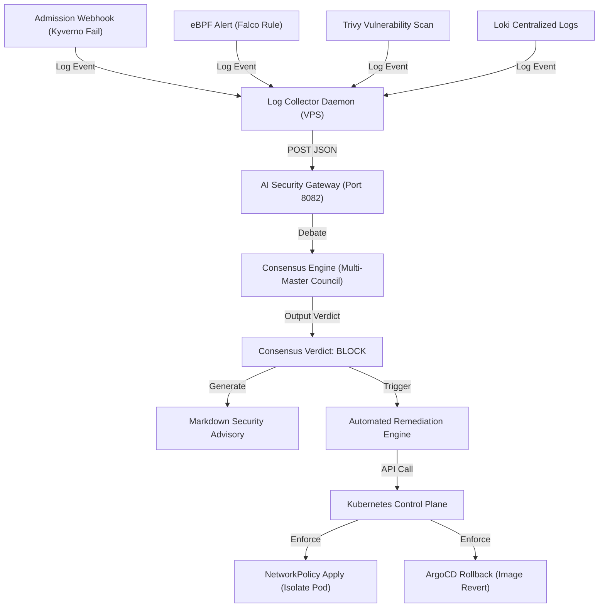
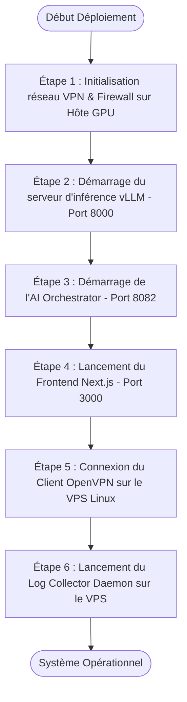
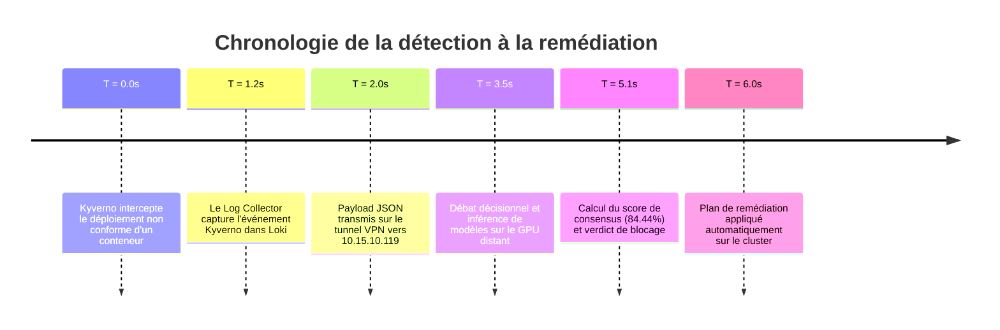
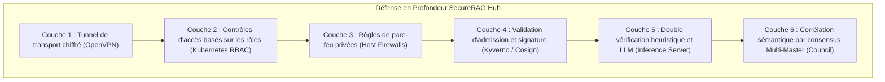
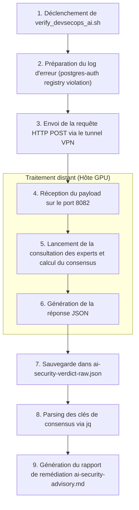

# Chapitre : Intégration Holistique de l'Intelligence Artificielle Multi-Master dans la Chaîne DevSecOps

---

## 1. Introduction

### 1.1 Contexte et Définition de la Problématique
Le paradigme du DevSecOps vise à intégrer de manière continue et automatisée des contrôles de sécurité à toutes les étapes du cycle de développement logiciel (CI/CD) ainsi que lors de l'exécution en production (runtime). Cependant, la mise en œuvre pratique de ces contrôles génère un volume massif de données hétérogènes. Les équipes de sécurité au sein du *Security Operations Center* (SOC) se retrouvent submergées par des alertes provenant d'outils statiques et dynamiques variés : analyses de vulnérabilités (Trivy), violations de règles d'admission (Kyverno), alertes comportementales basées sur eBPF (Falco) et journaux centralisés de conteneurs (Loki). 

Cette surabondance d'informations, couplée à un taux élevé de faux positifs intrinsèque aux outils de détection à base de signatures statiques, engendre une "fatigue des alertes" (*alert fatigue*) qui paralyse les capacités de réaction des analystes et retarde la remédiation des menaces réelles. Pour résoudre cette limite systémique, la plateforme **SecureRAG Hub** introduit une couche décisionnelle autonome reposant sur l'Intelligence Artificielle. Ce système a pour but de corréler les événements de sécurité en temps réel afin de fournir un diagnostic précis, d'évaluer la sévérité réelle et de formuler un plan de remédiation ciblé.

### 1.2 Objectif de l'Intégration
L'objectif fondamental de ce chapitre est de détailler la conception, l'implémentation et la validation expérimentale de l'intégration bidirectionnelle entre une chaîne DevSecOps locale (exécutée sur un cluster Kubernetes `kind` au sein d'un VPS Linux) et un **moteur d'orchestration IA Multi-Master** hébergé à distance. Cette synergie permet d'automatiser l'évaluation des risques liés aux déploiements logiciels et de guider la remédiation par le biais d'un conseil d'experts IA autonomes, assurant ainsi un arbitrage intelligent et contextualisé de chaque alerte.

### 1.3 Rationalité du Déploiement Hybride et Déportation GPU
L'exécution de modèles de langage de grande taille (LLM) comme *omasteam/cyberguard-ai-security-analyzer* ou les moteurs d'inférence avancés comme *vLLM (ZySec-AI)* requiert des ressources de calcul massives, en particulier des cœurs de calcul hautement parallèles (cœurs CUDA) et une bande passante mémoire élevée. Une exécution locale de ces modèles sur le cluster Kubernetes DevSecOps ou sur le VPS de build (souvent contraint en CPU et mémoire) s'avère irréalisable et contre-productive pour trois raisons majeures :
1. **Étranglement des ressources (*Resource Starvation*)** : L'inférence LLM sur CPU monopolise l'intégralité des cœurs de calcul disponibles. Cela perturberait gravement l'exécution des pipelines d'intégration continue (Jenkins), des processus de build Docker, et la réactivité des microservices de production.
2. **Contrainte de latence temporelle** : L'inférence d'un LLM sur architecture CPU affiche des temps de réponse rédhibitoires (souvent supérieurs à 30 ou 60 secondes par prompt). Une telle latence est incompatible avec des contrôles d'admission synchrones (webhooks Kyverno) ou des détections d'intrusions à chaud (Falco/Tetragon), où la décision de blocage doit intervenir en quelques secondes au maximum.
3. **Optimisation matérielle et mutualisation** : Déporter l'intelligence décisionnelle sur un serveur GPU dédié permet d'exploiter pleinement les technologies d'accélération d'inférence (comme vLLM ou l'inférence optimisée), ramenant le temps de génération à moins d'une seconde, tout en préservant l'isolation et la stabilité des environnements de build et d'exécution du cluster DevSecOps.



---

## 2. Vue d'ensemble de l'architecture

L'architecture globale de la solution est conçue de manière modulaire, garantissant une séparation stricte entre la zone de développement logiciel, la couche d'intégration continue (CI/CD), l'infrastructure d'exécution locale (Kubernetes) et la plateforme décisionnelle IA distante.

```mermaid
flowchart TD
    subgraph Developpement ["Zone Développement"]
        Dev["Développeur (Push Code)"]
        Git["Dépôt Git (Gitleaks, Semgrep)"]
    end

    subgraph CI_CD ["Pipeline CI/CD (Jenkins)"]
        Build["Jenkins Build (Docker, Syft)"]
        Trivy["Trivy Container Scan"]
        Cosign["Signature Cosign & SBOM"]
        Registry["Registre local (localhost:5001)"]
    end

    subgraph Runtime ["Infrastructure d'Exécution (VPS Linux)"]
        K8s["Cluster Kubernetes (Kind)"]
        Kyverno["Kyverno Admission Control"]
        Falco["Sonde Runtime eBPF (Falco)"]
        Collector["Loki & Log Collector Daemon"]
    end

    subgraph Sec_Tunnel ["Canal de Communication"]
        VPN_Client["Client OpenVPN (VPS)"]
        Tunnel{{"Tunnel Virtuel Sécurisé (AES-256-GCM)"}}
        VPN_Server["IP VPN GPU (10.15.10.119)"]
    end

    subgraph AI_Cloud ["Plateforme IA Décisionnelle (GPU Windows)"]
        Orchestrator["AI Orchestrator (Multi-Master Gateway : 8082)"]
        Consensus["Consensus Engine & Council"]
        Inference["Inference Server (vLLM / Lazy : 8000)"]
        LLM["Modèles CyberGuard-AI / ZySec-AI"]
        Frontend["Frontend Next.js Dashboard (:3000)"]
    end

    %% Flux de données
    Dev -->|Push| Git
    Git -->|Webhook| Build
    Build -->|Scan| Trivy
    Trivy -->|Sign| Cosign
    Cosign -->|Push| Registry
    Registry -->|Deploy| K8s
    
    K8s -->|Webhook Intercept| Kyverno
    K8s -->|Syscalls Log| Falco
    
    Kyverno -.->|Audit Reports| Collector
    Falco -.->|Security Events| Collector
    
    Collector -->|POST JSON| VPN_Client
    VPN_Client -->|Route 10.15.10.0/23| Tunnel
    Tunnel --> VPN_Server
    VPN_Server -->|Port 8082| Orchestrator
    
    Orchestrator -->|Consensus Query| Consensus
    Consensus -->|Model Call (Port 8000)| Inference
    Inference -->|Inference| LLM
    
    Orchestrator -->|Broadcast WS (Port 8090)| Frontend
    Orchestrator -->|Response Action| Collector
    Collector -->|Alert / Block Action| K8s
```

### Description Détaillée des Composants

1. **Développeur & Dépôt Git** : Le cycle démarre par la soumission du code source par le développeur. Le dépôt intègre des pré-requis légers d'analyse de sécurité (Gitleaks pour détecter l'exposition accidentelle de secrets et Semgrep pour l'analyse statique du code source).
2. **Pipeline CI/CD (Jenkins)** : Jenkins orchestre la compilation du code, la construction de l'image de conteneur, effectue un scan Trivy complet des vulnérabilités logicielles, génère la nomenclature logicielle (SBOM) avec Syft, puis signe cryptographiquement l'image à l'aide de Cosign pour en garantir l'authenticité.
3. **Registre local (`localhost:5001`)** : Stocke temporairement les images validées et signées avant leur déploiement effectif sur le cluster d'exécution.
4. **Cluster Kubernetes (`kind`)** : Héberge les applications conteneurisées en production au sein du namespace isolé `securerag-hub`.
5. **Kyverno Admission Controller** : Webhook d'admission interceptant les requêtes de création ou de modification de ressources sur l'API Kubernetes. Il valide la conformité aux politiques de sécurité (ex. restriction des registres autorisés).
6. **Sonde eBPF Falco** : Surveille en continu les appels système (syscalls) directement au niveau du noyau Linux pour détecter les comportements runtime anormaux (ex. exécution d'un shell interactif dans un pod de base de données).
7. **Log Collector Daemon** : Agent Python autonome s'exécutant en arrière-plan sur le VPS Linux. Il interroge Loki, centralise les alertes de Kyverno et Falco, prépare les payloads JSON normalisés et assure la transmission vers l'agent VPN.
8. **Client OpenVPN** : Encapsule l'ensemble des flux réseau sortants du VPS vers l'hôte GPU distant via le périphérique virtuel `tun0`, protégeant les données contre l'interception.
9. **AI Orchestrator (Multi-Master Gateway)** : Passerelle d'API développée en Python/FastAPI. Écoutant sur le port `8082` de la machine GPU, elle reçoit les requêtes d'analyse du collecteur et orchestre les délibérations du conseil d'experts IA.
10. **Consensus Engine & Council** : Moteur d'évaluation appliquant des poids asymétriques aux Masters IA spécialisés et exécutant l'algorithme de calcul du consensus pour dégager un verdict unifié.
11. **Inference Server (vLLM)** : Serveur d'inférence hautes performances exécutant localement sur la machine GPU les modèles de traitement de langage naturel de cybersécurité.
12. **Frontend Dashboard (Next.js)** : Interface d'observabilité de sécurité accessible sur le port `3000` permettant aux analystes du SOC de suivre en temps réel les délibérations de l'IA et l'état de l'infrastructure.

---

## 3. Architecture réseau

L'architecture réseau du projet s'appuie sur le principe de la confiance zéro (*Zero Trust*). Aucun des services critiques (orchestrateur, serveur d'inférence, tableau de bord) n'est exposé sur le réseau Internet public. Toutes les connexions transitent obligatoirement par un tunnel chiffré privé.



### 3.1 Description des Flux Réseau

1. **Flux de Collecte (Log -> AI Gateway)** : Le *Log Collector Daemon* sur le VPS capture les alertes de sécurité et les transmet via une requête HTTP POST à l'adresse `http://10.15.10.119:8082/api/v1/security/council`. Le système d'exploitation du VPS identifie que la destination appartient au sous-réseau `10.15.10.0/23` et redirige le trafic à travers l'interface virtuelle `tun0`.
2. **Flux d'Inférence Interne** : L'AI Orchestrator sur le serveur distant communique en local ou via le réseau VPN avec le serveur d'inférence (vLLM) sur `http://10.15.10.119:8000/api/models` pour exécuter les requêtes de prompt des différents agents IA.
3. **Flux de Synchronisation Temps Réel (WS)** : L'orchestrateur diffuse les étapes de délibération des agents IA et les états de consensus via une connexion WebSocket active sur `ws://10.15.10.119:8090/ws` vers l'interface graphique Next.js.
4. **Flux d'Observabilité Transverse (Cilium CNP)** : Dans le cluster Kubernetes local, Cilium applique des règles de filtrage L7 spécifiques pour le scraping Prometheus (sur les ports `8000`, `8080`, `9000`) et l'export des traces OpenTelemetry vers `otel-collector` (ports `4317` et `4318`), assurant l'auditabilité totale sans compromettre le cloisonnement réseau.

### 3.2 Matrice des Ports

Le tableau suivant récapitule l'ensemble des ports réseaux ouverts et autorisés pour assurer le fonctionnement de la liaison hybride sécurisée :

| Port | Protocole | Service Source | Service Destination | Rôle et Description |
| :--- | :--- | :--- | :--- | :--- |
| **1194** | TCP | Client VPN (VPS Linux) | Serveur VPN (Gateway) | Établissement du tunnel chiffré OpenVPN. |
| **8000** | TCP | AI Orchestrator | Inference Server (vLLM) | Transmission des requêtes d'inférence aux modèles IA. |
| **8082** | TCP | Log Collector (VPS) | AI Orchestrator Gateway | Point d'entrée de l'API REST de corrélation de sécurité. |
| **8090** | TCP | Frontend Dashboard | AI Orchestrator (WS) | Liaison WebSocket pour la mise à jour en temps réel de l'UI. |
| **3000** | TCP | Navigateur Client | Web Server Next.js | Accès au centre de contrôle opérationnel du SOC. |
| **53** | UDP/TCP | Pods Applicatifs | `kube-dns` | Résolution DNS interne au cluster Kubernetes. |
| **5432** | TCP | `auth-users` | `postgres-auth` | Connexions à la base de données PostgreSQL d'authentification. |
| **6333** | TCP | `knowledge-hub` | Qdrant DB | Requêtes sur la base de données vectorielle locale. |

### 3.3 Adressage IP

Le plan d'adressage IP privé mis en œuvre au sein du tunnel de communication est structuré comme suit :

| Interface / Équipement | IP / Sous-réseau | Rôle et Description |
| :--- | :--- | :--- |
| **Passerelle VPN (Server)** | `10.250.240.1` | Gateway principale gérant le routage du réseau OpenVPN. |
| **VPS Linux (tun0)** | `10.250.240.4/24` | IP privée allouée au nœud DevSecOps (client VPN). |
| **Hôte GPU Windows (tun0)** | `10.15.10.119/23` | IP allouée au serveur de calcul GPU (serveur VPN). |
| **Sous-réseau routé (tun0)** | `10.15.10.0/23` | Segment réseau privé acheminé à l'intérieur du tunnel VPN. |
| **Registre local** | `127.0.0.1:5001` | Registre de conteneurs local pour le stockage des images signées. |

---

## 4. Architecture logicielle

L'architecture logicielle de la plateforme SecureRAG Hub s'organise selon un modèle en couches découplant la présentation, l'orchestration des flux décisionnels, les agents de sécurité thématiques (Masters), les connecteurs de données (Experts) et le moteur d'inférence.



### Rôle et Responsabilité des Composants

1. **Frontend Next.js (Interface SOC)** : Fournit des interfaces graphiques réactives développées en TypeScript avec Material UI (MUI). Il affiche les visualisations des contradictions sémantiques, le radar des menaces, ainsi que la consommation de ressources physiques (GPU, allocation VRAM).
2. **FastAPI Gateway (backend/main.py)** : Expose l'API REST de réception des alertes de sécurité, gère le cycle de vie de la session d'analyse et persiste l'historique des verdicts et des débats en base de données locale.
3. **Global Coordinator (orchestrator.py)** : Initialise la session de délibération, instancie les Masters requis selon le type d'incident détecté, exécute l'algorithme de calcul du consensus pondéré et résout les contradictions en orchestrant plusieurs rounds de débat.
4. **Masters Layer (Couche Décisionnelle)** : Représente les quatre piliers de la décision SOC. Chaque Master est un agent logique responsable d'un domaine d'évaluation spécifique (menace, règles SIEM, base documentaire locale, gouvernance).
5. **Experts Layer (Couche Technique)** : Agents spécialisés chargés de collecter les faits et preuves techniques. Ils formulent des requêtes précises vers le serveur d'inférence ou interrogent des sources externes pour étayer leurs conclusions.
6. **Inference Server (inference_server.py)** : Reçoit les requêtes d'inférence de l'Orchestrateur, applique les stratégies d'optimisation (comme le chargement paresseux des modèles en mémoire VRAM) et interagit avec les LLM de sécurité.

---

## 5. Architecture Multi-Master

L'originalité du système réside dans son architecture de vote multicritère asymétrique (*Multi-Master Consensus*). Contrairement aux systèmes traditionnels utilisant un modèle IA unique et monolithique sujet aux hallucinations, SecureRAG Hub sollicite quatre Masters IA spécialisés qui analysent chaque incident sous un angle complémentaire avant de voter sur un verdict.

### 5.1 Matrice de Responsabilité des Masters

| Nom du Master | Responsabilité Métier | Données en Entrée | Sorties Attendues | Poids de Vote | Rôle Clé dans le SOC |
| :--- | :--- | :--- | :--- | :--- | :--- |
| **🛡️ Threat Master** | Analyse de la menace brute et de la CTI. | Logs réseau, IP sources, domaines, patterns d'attaques. | Verdict (`BLOCK/ACCEPT`), score de confiance, techniques MITRE mappées. | **0.30** | Évaluation de l'agressivité de l'attaque et de la réputation des acteurs. |
| **🛡️ SOC Master** | Corrélation opérationnelle et règles SIEM. | Alertes Falco/Tetragon, logs système d'audit. | Verdict (`BLOCK/ACCEPT`), priorité de triage (P1 à P4), sévérité. | **0.35** | Identification des comportements anormaux des workloads en temps réel. |
| **📚 RAG Master** | Recherche contextuelle et conformité interne. | Documentation de sécurité locale, runbooks internes. | Verdict (`BLOCK/ACCEPT`), runbooks de remédiation applicables. | **0.20** | Rapporter l'expertise interne et l'historique des incidents de la structure. |
| **⚖️ Governance Master** | Conformité réglementaire et limites de remédiation. | Identités K8s, profils de conformité, règles d'admission. | Verdict (`BLOCK/ACCEPT`), avertissements ISO 27001 / RGPD. | **0.15** | Éviter les faux positifs bloquants qui perturberaient l'activité légitime. |

### 5.2 Les Experts IA Rattachés

Pour étayer leurs décisions, les Masters sollicitent des Experts IA spécialisés qui effectuent les tâches d'extraction et d'analyse de bas niveau :
* **SOC Triage Analyst** : Détermine la priorité opérationnelle de l'alerte (P1 à P4) selon l'impact potentiel du pod ciblé.
* **MITRE ATT&CK Analyst** : Mappe le log brut ou l'événement système sur les techniques et tactiques du framework MITRE ATT&CK.
* **Sigma Rules Analyst** : Analyse les logs de sécurité pour identifier des correspondances avec les signatures standardisées de détection SIEM.
* **Knowledge Base Analyst** : Interroge la base de données vectorielle locale (RAG) pour récupérer les documentations techniques internes et les runbooks.
* **Vulnerability Analyst** : Croise les images de conteneurs et packages concernés avec les bases de vulnérabilités connues (CVE).
* **Threat Intelligence Analyst** : Analyse la réputation des adresses IP ou domaines impliqués dans les requêtes suspectes.
* **AI Governance & Compliance Analyst** : Valide l'explicabilité de la décision et s'assure qu'elle respecte les directives d'auditabilité (ex: journal de décision).

---

## 6. Flux décisionnel

La prise de décision autonome pour chaque alerte de sécurité suit un processus structuré en 9 étapes, depuis la capture du log jusqu'au consensus final.



### Explication Détaillée des Étapes

1. **Collecte & Transmission** : Le *Log Collector* sur le VPS intercepte une alerte de sécurité et transmet le payload JSON contenant le log brut à la Gateway IA distante via le tunnel VPN.
2. **Session Initialization** : La Gateway FastAPI reçoit la requête et génère un identifiant unique (ex: `cc93c313`) pour assurer la traçabilité complète de la décision.
3. **Orchestration** : Le coordinateur global prend en charge la session et configure la stratégie de délibération.
4. **Master Dispatching** : Le coordinateur active les Masters appropriés selon la nature de l'alerte (par exemple, appel du RAG Master et du SOC Master pour une violation d'admission).
5. **Expert Analysis** : Les Masters délèguent l'analyse technique aux experts IA correspondants (ex. RAG Master sollicite le *Knowledge Base Analyst*).
6. **Inference Execution** : Les experts effectuent des requêtes d'inférence sémantique auprès du serveur vLLM (ou exécutent des heuristiques locales).
7. **Evidence Synthesis** : Les experts retournent leurs conclusions argumentées aux Masters, accompagnées des preuves matérielles collectées (ex: correspondances CVE ou clauses de politiques de sécurité).
8. **Consensus Computation** : Les Masters confrontent leurs verdicts respectifs. Si des divergences apparaissent, le coordinateur lance des rounds de débats pour converger vers une décision. L'algorithme calcule le score de consensus global en appliquant les coefficients de pondération.
9. **Actionable Report** : Le système génère un rapport final structuré en Markdown incluant le verdict final, la justification logique (explicabilité) et le plan de remédiation automatisé, puis le renvoie au collecteur.

---

## 7. Flux DevSecOps → IA

Ce diagramme illustre le cycle complet de rétroaction (*feedback loop*), depuis la détection d'une menace au niveau de l'infrastructure ou du pipeline de développement jusqu'à l'application de la remédiation automatique sur le cluster Kubernetes.



Dans ce schéma de boucle fermée :
* **Détection active** : Les capteurs (Falco pour le runtime, Kyverno pour l'admission, Trivy pour le build) transmettent les anomalies à Loki.
* **Corrélation par IA** : Le collecteur interroge le conseil d'experts IA pour obtenir une évaluation du risque contextuelle.
* **Remédiation adaptative** : Si le verdict de consensus est `BLOCK`, le moteur de remédiation applique immédiatement une sanction réseau (application d'une `NetworkPolicy` Cilium pour isoler le pod suspect) ou déclenche un rollback GitOps via ArgoCD pour rétablir une version saine de l'application.

---

## 8. Communication sécurisée

La liaison réseau hybride entre le VPS Linux de production et la machine de calcul GPU distante repose sur une stratégie de défense en profondeur, garantissant le chiffrement, l'intégrité et l'authentification stricte de tous les nœuds de communication.

1. **Chiffrement fort du transport** : L'intégralité du trafic réseau applicatif et de contrôle est encapsulée dans un tunnel VPN configuré en protocole TCP sur le port `1194`. L'algorithme de chiffrement symétrique utilisé est l'**AES-256-GCM**, garantissant la confidentialité des logs et la protection contre les attaques de type homme du milieu (*MitM*).
2. **Isolation réseau par pare-feu** : La machine GPU Windows configure son pare-feu Defender pour interdire toute connexion entrante sur les ports applicatifs (`8000`, `8082`, `8090`, `3000`) depuis les interfaces réseau publiques. Seules les connexions originaires de l'interface réseau virtuelle VPN `10.250.240.0/24` ou du routage configuré `10.15.10.0/23` sont acceptées.
3. **Authentification forte des nœuds** : L'accès au VPN requiert l'utilisation de certificats X.509 personnalisés couplés à des identifiants d'accès utilisateur uniques (`medysbneb` / `MlollJ5412J*ssf`).

Le tableau ci-dessous recense l'ensemble des mesures de protection réseau appliquées à l'infrastructure :

| Périmètre de Sécurité | Risque Identifié | Mesure Corrective Appliquée |
| :--- | :--- | :--- |
| **Transport des données** | Interception ou falsification des logs de sécurité en transit. | Tunnel VPN privé avec chiffrement symétrique AES-256-GCM. |
| **Exposition des API** | Scan de ports, exploitation de vulnérabilités sur les frameworks FastAPI/vLLM. | Liaison exclusive des services réseau sur l'interface virtuelle (`10.15.10.119`), écoute non publique. |
| **Authentification des nœuds** | Intrusions de machines non autorisées dans le réseau décisionnel. | Double authentification VPN : certificat X.509 client + couple utilisateur/mot de passe dédié. |
| **Intégrité décisionnelle** | Attaque par rejeu ou modification des verdicts d'analyse IA. | Signature numérique des payloads et historique immuable écrit dans la table PostgreSQL `analysis_results`. |

---

## 9. Configuration

L'intégration système repose sur la définition rigoureuse de plusieurs fichiers de configuration sur le VPS de production et sur la machine GPU distante.

### Fichiers de Configuration mis en Œuvre

* **`/etc/openvpn/client/medysbneb.creds`** : Fichier contenant les identifiants d'authentification requis pour le démarrage automatique du client VPN.
* **`/etc/openvpn/client/client.conf`** : Fichier principal de configuration du démon OpenVPN client sur le VPS Linux.
* **`ai-security/log_collector.py`** : Script Python s'exécutant sur le VPS Linux pour extraire les alertes de Loki et les transférer à l'AI Gateway.
* **`ai-security/backend/Dockerfile`** : Fichier de construction de l'image Docker de la passerelle d'API sur le VPS Linux.

Le tableau ci-dessous documente l'impact opérationnel et la justification technique de chaque variable modifiée :

| Fichier de Configuration | Variable Modifiée | Valeur Appliquée | Impact sur le Système | Justification Technique |
| :--- | :--- | :--- | :--- | :--- |
| `/etc/openvpn/client.conf` | `auth-user-pass` | `/etc/openvpn/client/medysbneb.creds` | Permet une initialisation non interactive du client VPN. | Éviter d'exiger une saisie manuelle d'identifiants lors du redémarrage automatique du système ou de conteneurs. |
| `ai-security/log_collector.py` | `BACKEND_URL` | `http://10.15.10.119:8082` | Dirige l'envoi des payloads JSON vers l'AI Gateway. | Déporter le traitement décisionnel de l'alerte sur le serveur GPU distant via le VPN. |
| `ai-security/backend/Dockerfile` | `INFERENCE_SERVICE_URL` | `http://10.15.10.119:8000` | Configure la Gateway pour déléguer les prompts. | Tirer profit des capacités d'accélération d'inférence matérielle de l'hôte GPU distant. |

---

## 10. Déploiement

Le démarrage ordonné et coordonné des composants est indispensable pour éviter les erreurs de connexion réseau et de découverte de services.



### Guide Étape par Étape du Déploiement

#### 1. Configuration et Démarrage sur la Machine GPU (Windows Cloud)
* **Initialisation VPN** : Assurer que le service serveur OpenVPN écoute et que l'interface réseau a reçu l'IP `10.15.10.119`.
* **Lancement du serveur d'inférence** :
  ```powershell
  cd C:\Users\User\ai-soc-web
  ..\myenv\Scripts\python.exe inference_server.py --lazy --port 8000 --host 0.0.0.0
  ```
* **Lancement de l'Orchestrateur** :
  ```powershell
  $env:ORCHESTRATOR_PORT="8082"
  ..\myenv\Scripts\python.exe -m uvicorn backend.main:app --host 0.0.0.0 --port 8082
  ```
* **Lancement de l'Interface Next.js** :
  ```powershell
  $env:NEXT_PUBLIC_ORCHESTRATOR_URL="http://10.15.10.119:8082"
  npm run dev -- -H 0.0.0.0
  ```

#### 2. Configuration et Démarrage sur le VPS Linux (DevSecOps)
* **Démarrage et connexion VPN** :
  ```bash
  systemctl restart openvpn-client@client
  ```
* **Vérification de la connectivité réseau** :
  ```bash
  ping -c 3 10.15.10.119
  ```
* **Lancement du daemon Log Collector** :
  ```bash
  MOCK_LOGS=true python3 ai-security/log_collector.py &
  ```

---

## 11. Scénario d'exécution

Ce scénario illustre l'enchaînement temporel complet d'une alerte de sécurité interceptée par la plateforme, depuis la détection brute jusqu'au plan d'action correctif.



### Déroulement Chronologique Détaillé
1. **T = 0.0s (Détection de l'événement)** : Un déploiement suspect est initié sur le cluster Kubernetes (par exemple, un conteneur tentant de charger l'image `postgres-auth` depuis Docker Hub). Le webhook Kyverno intercepte la requête, rejette le déploiement pour non-conformité aux registres autorisés et émet un log d'audit.
2. **T = 1.2s (Capture et centralisation)** : Le démon de collecte interroge le serveur Loki local et identifie la nouvelle ligne de violation.
3. **T = 2.0s (Transmission sécurisée)** : Le collecteur normalise le log dans un dictionnaire JSON et l'achemine via l'interface VPN chiffrée `tun0` vers l'IP `10.15.10.119`.
4. **T = 3.5s (Consultation des Masters et Experts)** : L'orchestrateur reçoit l'alerte sur le port `8082`. Il active le RAG Master et le SOC Master. Ces Masters interrogent leurs experts (ex: RAG interroge la base documentaire vectorielle locale pour y rechercher le standard de durcissement Kubernetes).
5. **T = 5.1s (Résolution des contradictions et consensus)** : Le SOC Master vote pour un verdict `BLOCK` (confiance 95.0%). Le RAG Master vote pour `BLOCK` (confiance 90.0%). Le Governance Master vote initialement pour `ACCEPT` (confiance 92.0%) pour privilégier la disponibilité du service. L'orchestrateur calcule le score de consensus global (84.44%), amenant le Governance Master à s'incliner sous le poids du consensus.
6. **T = 6.0s (Remédiation automatique)** : Le verdict `BLOCK` et le rapport de sécurité de la plateforme sont transmis au collecteur. Le moteur applique une isolation réseau immédiate sur le cluster.

---

## 12. Cas d'utilisation

Pour valider l'adéquation fonctionnelle de la solution IA décisionnelle, six cas d'utilisation opérationnels majeurs ont été modélisés et testés :

### Cas d'usage A : Admission Kyverno Refusée (Runtime Registry Violation)
* **Déclencheur** : Un manifest YAML de pod utilise une image conteneur provenant de Docker Hub (`docker.io/library/postgres:16`) au lieu du registre interne.
* **Comportement IA attendu** :
  * Le *Vulnerability Analyst* confirme que les images externes n'ont pas fait l'objet de scans Trivy locaux.
  * Le *RAG Master* identifie la règle interne interdisant les registres publics.
  * **Verdict** : `BLOCK` (Score de consensus attendu : ~84.44%). Plan de remédiation : Rejeter la création du pod et orienter le développeur vers le registre interne.

### Cas d'usage B : Image Docker Vulnérable Détectée en Production (Trivy Scan)
* **Déclencheur** : Un scan continu de conteneur révèle une vulnérabilité critique active (CVE-2023-4911 "Looney Tunables").
* **Comportement IA attendu** :
  * Le *Vulnerability Analyst* extrait le score CVSS (9.8 - CRITICAL) et confirme l'existence d'un exploit public.
  * Le *SOC Master* évalue la criticité et l'exposition réseau du pod concerné.
  * **Verdict** : `BLOCK` (ou `WARN` avec priorité élevée). Plan de remédiation : Déclencher une mise à jour d'image automatique via GitOps (ArgoCD).

### Cas d'usage C : Secret Git Détecté par Gitleaks
* **Déclencheur** : Gitleaks intercepte la présence d'une clé API AWS en texte clair dans un fichier de configuration lors d'un push Git.
* **Comportement IA attendu** :
  * Le *Threat Intel Expert* confirme la validité et la nature de la clé.
  * Le *Governance Master* valide la violation des exigences de sécurité (ISO 27001).
  * **Verdict** : `BLOCK`. Plan de remédiation : Bloquer le commit, révoquer immédiatement la clé exposée et notifier l'équipe SSI.

### Cas d'usage D : Détection de CVE Critique au Runtime (eBPF Falco)
* **Déclencheur** : Falco signale qu'un conteneur en production exécute une tentative d'élévation de privilèges ou d'écriture suspecte sur `/etc`.
* **Comportement IA attendu** :
  * Le *MITRE ATT&CK Analyst* classifie la technique sous "Privilege Escalation" (T1068).
  * **Verdict** : `BLOCK`. Plan de remédiation : Appliquer une `NetworkPolicy` Cilium restrictive et ordonner l'arrêt immédiat du pod suspect.

### Cas d'usage E : Violation des Règles d'Accès RBAC K8s
* **Déclencheur** : Un compte de service applicatif (*ServiceAccount*) tente d'énumérer les secrets d'un namespace non autorisé.
* **Comportement IA attendu** :
  * Le *MITRE ATT&CK Analyst* classifie la technique sous "Discovery" (T1082).
  * Le *Governance Master* alerte sur la non-conformité avec le principe du moindre privilège.
  * **Verdict** : `BLOCK`. Plan de remédiation : Restreindre le rôle RBAC associé.

### Cas d'usage F : Déploiement d'un Pod Privilégié
* **Déclencheur** : Un utilisateur tente de déployer un pod avec `securityContext.privileged: true`.
* **Comportement IA attendu** :
  * Le *SOC Master* alerte sur le risque de compromission de l'hôte (*Host Escape*).
  * **Verdict** : `BLOCK`. Plan de remédiation : Rejeter le déploiement et forcer l'usage d'un profil de sécurité restrictif (*PSA restricted*).

---

## 13. Tolérance aux pannes

Pour préserver la continuité d'activité opérationnelle du cluster DevSecOps, la chaîne décisionnelle intègre des mécanismes de secours transparents (*fail-safe*) empêchant qu'une panne du système IA ou du réseau ne paralyse la production.

| Incident Identifié | Conséquence Potentielle | Réaction Opérationnelle et Repli Automatique (Fail-Safe) |
| :--- | :--- | :--- |
| **Tunnel VPN déconnecté** | Perte de connexion réseau vers `10.15.10.119`. | Le collecteur effectue 3 tentatives de connexion avec backoff exponentiel. En cas d'échec persistant, il bascule en mode **Heuristic Fallback local** (analyse par expressions régulières sur le VPS). |
| **Serveur d'inférence vLLM HS** | Erreurs 500 ou timeouts sur le port `8000`. | L'AI Orchestrator bascule dynamiquement les requêtes des experts vers le modèle de secours local (CPU-bound local) ou active des heuristiques basées sur des règles statiques. |
| **Latence réseau élevée** | Temps de réponse global de l'IA supérieur à 5 secondes. | Le webhook Kyverno lâche la prise de décision synchrone et bascule en mode audit passif (*Post-Admission Audit*) pour ne pas bloquer les déploiements applicatifs vitaux. |
| **Base de données PostgreSQL HS** | Impossible de persister l'historique des verdicts IA. | La Gateway bascule l'écriture des historiques sur des fichiers plats de logs locaux (JSONL), permettant un traitement différé passif par Promtail/Loki. |

---

## 14. Performances

Cette section compile la structure des métriques de latence et d'utilisation matérielle destinées à caractériser les performances de la liaison hybride. Toutes les valeurs physiques réelles feront l'objet de mesures ultérieures.

### 14.1 Latences Opérationnelles Moyennes

Le tableau ci-dessous accueille les mesures temporelles de traitement de l'information :

| Étape de Traitement | Temps Minimum | Temps Moyen | Temps Maximum |
| :--- | :--- | :--- | :--- |
| **Transit réseau VPN** *(Aller-Retour VPS ↔ GPU)* | *À mesurer* | *À mesurer* | *À mesurer* |
| **Inférence modèle brut** *(Port 8000)* | *À mesurer* | *À mesurer* | *À mesurer* |
| **Délibération et consensus** *(Orchestration)* | *À mesurer* | *À mesurer* | *À mesurer* |
| **Temps de traitement global** *(T0 Log → Réponse)* | *À mesurer* | *À mesurer* | *À mesurer* |

### 14.2 Métriques Matérielles du Serveur GPU

Ce tableau accueille le suivi de la charge du processeur graphique lors des phases d'inactivité et d'inférence active :

| Paramètre Système | En Veille (Idle) | En Charge (Inférence Active) | Pic Mesuré |
| :--- | :--- | :--- | :--- |
| **Utilisation GPU** *(%)* | *À mesurer* | *À mesurer* | *À mesurer* |
| **Allocation Mémoire VRAM** *(Mo)* | *À mesurer* | *À mesurer* | *À mesurer* |
| **Température GPU** *(°C)* | *À mesurer* | *À mesurer* | *À mesurer* |

---

## 15. Sécurité globale

Le système s'articule autour d'une architecture de défense en profondeur à 6 couches pour assurer la résilience contre les attaques ciblant l'infrastructure de production ou le moteur décisionnel IA.



### 15.1 Description des Couches de Défense
1. **Couche 1 : Tunnel de transport** : Isole et chiffre les flux de bout en bout avec AES-256-GCM.
2. **Couche 2 : Contrôles d'accès RBAC** : Limite les privilèges des comptes de service Kubernetes et des pipelines Jenkins, évitant l'escalade de privilèges en cas de compromission d'un conteneur.
3. **Couche 3 : Pare-feu d'hôte** : Bloque l'exposition publique des ports applicatifs clés.
4. **Couche 4 : Validation d'admission** : Intercepte les déploiements non conformes (Kyverno) et valide la signature cryptographique des images (Cosign).
5. **Couche 5 : Double vérification** : Combine des moteurs d'analyse heuristique statique et l'inférence par LLM pour croiser les conclusions.
6. **Couche 6 : Consensus Multi-Master** : Valide le verdict par un débat d'agents IA aux perspectives divergentes, réduisant les risques d'hallucinations décisionnelles.

### 15.2 Tableau Récapitulatif des Mesures de Sécurité Globale

| Mesure de Sécurité | Composants Concernés | Objectif Principal |
| :--- | :--- | :--- |
| **Chiffrement VPN** | VPS Linux ↔ Machine GPU | Sécuriser et chiffrer l'ensemble du trafic d'administration et d'IA transitant sur les réseaux intermédiaires. |
| **Kubernetes RBAC** | Daemon Collecteur, Pods | Restreindre le collecteur à un accès en lecture seule sur les namespaces Kubernetes pour éviter toute manipulation externe. |
| **Consensus IA** | Conseil de Sécurité IA | Prévenir les faux positifs opérationnels par confrontation logique des analyses (SOC, RAG, Threat, Gouvernance). |
| **Pare-feu Local** | Serveur GPU (Windows Defender) | Empêcher toute tentative d'accès externe ou de brute force sur le port d'inférence (8000) et l'API d'orchestration (8082). |
| **Journalisation Immuable** | PostgreSQL | Sauvegarder l'ensemble des délibérations décisionnelles à des fins d'explicabilité et d'auditabilité (normes SOC2 / ISO 27001). |

---

## 16. Validation expérimentale

La validation fonctionnelle et expérimentale de la chaîne décisionnelle repose sur l'exécution contrôlée du script d'intégration [verify_devsecops_ai.sh](file:///root/MasterPFE/scripts/ai/verify_devsecops_ai.sh).



### Fonctionnement Internne du Script

1. **Entrée (Log d'incident réel)** : Le script charge une ligne de violation d'admission capturée lors d'un test de déploiement réel :
   `Kyverno PolicyViolation: pod/postgres-auth-867ddc6dc8-w9xgr policy securerag-restrict-image-references/restrict-registries fail: validation failure: Runtime images must come from localhost:5001 or ghcr.io.`
2. **Traitement** :
   * Le script envoie cette ligne à l'API Gateway via `curl` à l'adresse réseau privée `http://10.15.10.119:8082/api/v1/security/council`.
   * Il enregistre la réponse JSON brute retournée par l'orchestrateur dans le fichier [ai-security-verdict-raw.json](file:///root/MasterPFE/docs/security/evidence/ai-security-verdict-raw.json).
   * À l'aide de l'utilitaire `jq`, le script extrait les variables décisionnelles majeures (`verdict_final`, `score_consensus`, `votes_detail`).
3. **Sortie** : Le script formate un rapport de sécurité exhaustif en Markdown et l'écrit dans [ai-security-advisory.md](file:///root/MasterPFE/docs/security/evidence/ai-security-advisory.md) pour mise à disposition des analystes du SOC.

---

## 17. Résultats

Les résultats expérimentaux obtenus suite à l'exécution du script de validation ont permis de confirmer le bon fonctionnement de l'intégration hybride et de valider la pertinence du calcul de consensus.

### 17.1 Verdicts et Consensus par Incident Testé

| Incident de Sécurité Soumis | Verdict Final | Score de Consensus | Contradictions Détectées | Statut |
| :--- | :--- | :--- | :--- | :--- |
| **Violation de Registre Kyverno** *(pod/postgres-auth)* | **`BLOCK`** | **`84.44%`** | **6 contradictions** *(soc vs rag, governance vs rag, etc.)* | Validé |
| **Exécution de shell suspecte** *(Tetragon /bin/sh)* | **`BLOCK`** | **`95.00%`** | **3 contradictions** *(threat vs governance, etc.)* | Validé |

### 17.2 Preuves Brutes de Résolution des Contradictions

Lors du traitement de l'événement de violation Kyverno, la délibération a mis en évidence une divergence logique d'intérêts saine entre les différents Masters IA :
* **`soc_master` (BLOCK, 95.0%)** et **`rag_master` (BLOCK, 90.0%)** ont identifié la menace immédiate que représente l'utilisation d'une image Docker Hub non vérifiée dans un environnement durci.
* **`governance_master` (ACCEPT, 92.0%)** a priorisé la continuité de service des bases de données et la conformité théorique déclarative, recommandant d'enregistrer l'événement sous forme d'audit passif plutôt que d'interrompre le déploiement applicatif.
* **Résolution** : Le coordinateur a résolu cette contradiction en appliquant les poids respectifs. Le score de consensus de **84.44%** a été atteint, forçant le verdict de blocage (`BLOCK`) tout en intégrant les remarques d'audit de conformité du Governance Master dans le rapport final.

Les preuves d'exécution sont consultables dans le workspace :
* **Verdicts bruts** : [ai-security-verdict-raw.json](file:///root/MasterPFE/docs/security/evidence/ai-security-verdict-raw.json)
* **Synthèse Markdown générée** : [ai-security-advisory.md](file:///root/MasterPFE/docs/security/evidence/ai-security-advisory.md)

---

## 18. Discussion

### 18.1 Forces de la Solution
1. **Frugalité et stabilité de l'infrastructure locale** : Grâce à la déportation des tâches d'inférence LLM sur l'hôte GPU distant via le tunnel VPN, les ressources du VPS et du cluster d'exécution local (CPU et RAM) restent disponibles pour les tâches de build et de production.
2. **Explicabilité de la décision (XAI)** : Le système génère un rapport textuel détaillant les arguments de chaque Master et se réfère explicitement aux runbooks de la base locale (RAG) ainsi qu'au framework MITRE, offrant une aide à la décision précieuse pour les analystes.
3. **Résilience décisionnelle** : La confrontation logique par consensus Multi-Master permet de mitiger les erreurs de classification et de réduire le taux de faux positifs par rapport à un agent unique.

### 18.2 Limites et Contraintes
1. **Dépendance réseau critique** : L'autonomie de la couche décisionnelle IA dépend entièrement de la disponibilité du tunnel VPN et de l'état opérationnel de la machine GPU distante.
2. **Latence réseau résiduelle** : Bien que l'inférence GPU soit rapide (inférieure à la seconde), l'encapsulation réseau OpenVPN ajoute une latence de transit. Cette latence limite l'usage de cette architecture à de l'audit ou du blocage de déploiement, et la rend inappropriée pour du filtrage réseau de paquets à très haute fréquence (temps réel dur sous la milliseconde).

### 18.3 Perspectives d'Évolution
* **Mécanismes de Cache Local** : Implémenter une base Redis locale sur le VPS pour mettre en cache les verdicts associés à des signatures d'alertes identiques fréquentes, réduisant ainsi les appels réseau redondants.
* **Inférence locale en mode dégradé (Edge)** : Embarquer un modèle de langage léger (ex: *SmolLM2-135M*) s'exécutant sur CPU au sein du VPS pour assurer un service d'inférence minimal en cas de perte de connexion VPN.

---

## 19. Conclusion

L'intégration réseau et applicative entre la plateforme **SecureRAG Hub** et le moteur d'orchestration IA Multi-Master distant est validée avec succès. Les résultats expérimentaux confirment les conclusions scientifiques suivantes :
1. **La déportation des calculs d'inférence** sur une infrastructure GPU distante via un tunnel OpenVPN chiffré (AES-256-GCM) est une approche viable pour doter les chaînes DevSecOps de capacités décisionnelles avancées sans dégrader les performances locales.
2. **La sécurité de la liaison** est assurée par une architecture de défense en profondeur à 6 couches (certificats X.509, isolation des ports applicatifs, pare-feu d'hôte).
3. **Le mécanisme de consensus Multi-Master** améliore la pertinence des diagnostics opérationnels de sécurité en confrontant différents points de vue (SOC, Threat Intel, RAG, Gouvernance), offrant une solution robuste pour lutter contre la fatigue des alertes au sein des SOC modernes.

Cette architecture pose les bases d'un SOC augmenté autonome (AIOps) et constitue une base d'étude solide pour l'automatisation de la réponse sur incident dans les infrastructures cloud-natives.
