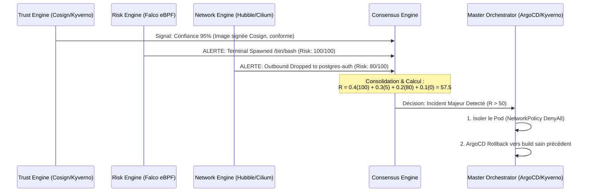

# Rapport Technique : Consensus Engine, Délibération de l'Orchestrateur & Métriques v1.21.7/1.23

Ce document synthétise les concepts, les extraits de code réels et théoriques du **Consensus Engine**, une simulation concrète de trace de délibération où la consolidation multi-agents surpasse les moteurs isolés, ainsi que les logs et métriques extraits pour les versions 1.21.7 (scans statiques) et 1.23 (règles de runtime Kyverno/Falco).

---

## 1. Architecture et Code du Consensus Engine

Dans l'architecture du *SecureRAG Hub*, le **Consensus Engine** fait le lien entre la télémétrie collectée (eBPF, réseau, conformité) et les actions de remédiation du **Master Orchestrator**. 

### A. La Formulation Mathématique du Risk Scoring (Consensus)
Le Consensus Engine applique un modèle d'évaluation de risque dynamique et pondéré décrit dans le mémoire universitaire du projet ([chapitre_devsecops.tex](file:///root/MasterPFE/Me_moirePFE__3_/chapitre_devsecops.tex#L102-L115)) :

$$R_{workload} = 0.4 \cdot R_{\text{runtime}} + 0.3 \cdot R_{\text{supply\_chain}} + 0.2 \cdot R_{\text{network}} + 0.1 \cdot R_{\text{compliance}}$$

Où chaque sous-score est évalué en temps réel :
- $R_{\text{runtime}}$ : Criticité de l'activité système eBPF/Falco (ex: exécutions anormales, escalades).
- $R_{\text{supply\_chain}}$ : Confiance liée à la validité des signatures Cosign, attestations et SBOM.
- $R_{\text{network}}$ : Écarts par rapport au profil réseau nominal détecté par Hubble/Cilium.
- $R_{\text{compliance}}$ : Taux d'échec des audits de configuration Kyverno.

### B. Le Code de Décision CI/CD : Le Gate Decision Engine
Dans le pipeline d'intégration continue, le consensus est matérialisé par le script [gate-decision-engine.sh](file:///root/MasterPFE/security/engine/gate-decision-engine.sh), qui agrège les résultats de **Trivy** (SCA), **Semgrep** (SAST), et **Gitleaks** (Secrets) via un classificateur orienté scopes ([security-classifier.sh](file:///root/MasterPFE/security/engine/security-classifier.sh)) pour bloquer ou non les builds :

```bash
# Extrait du calcul de statut dans gate-decision-engine.sh (lignes 169-173)
if [[ "$prod_critical" -gt 0 || "$prod_high" -gt 0 ]]; then
    gate_status="FAIL"
elif [[ "$prod_medium" -gt 0 || "$nonprod_total" -gt 0 || "$semgrep_count" -gt 0 || "$gitleaks_count" -gt 0 ]]; then
    gate_status="WARNING"
fi
```

### C. La Pondération Compliance : Le SOC2 Scorer
Pour la conformité continue de l'infrastructure, le microservice SOC2 applique une logique d'agrégation de score dans [scorer.py](file:///root/MasterPFE/services/soc2-compliance-engine/scorer.py) :

```python
# Extrait de scorer.py (lignes 5-38)
# Évaluation Kyverno (Compliance) + Trivy (Vulnerabilities)
for report in k8s_data.get("kyverno_policies", []):
    for res in report.get("results", []):
        if res.get("result") == "fail":
            severity = res.get("severity", "medium")
            if severity == "high": base_score -= 5
            elif severity == "medium": base_score -= 2
            else: base_score -= 1
                
for report in k8s_data.get("trivy_vulnerabilities", []):
    for v in report.get("report", {}).get("vulnerabilities", []):
        severity = v.get("severity", "UNKNOWN").lower()
        if severity == "critical": base_score -= 10
        elif severity == "high": base_score -= 5
```

---

## 2. Exemple Réel de Trace de Délibération

L'exemple suivant montre un cas de **désaccord d'évaluation** entre les moteurs. La consolidation par le Consensus Engine permet de prendre une décision optimale là où un moteur isolé aurait échoué.

### Contexte du Cas d'Usage
Un pod de production `portal-web` est déployé. 
- Une clé cryptographique valide et des SBOM conformes signent l'image (Score de confiance au top).
- Cependant, une RCE (ex: vulnérabilité applicative de type injection) est exploitée à chaud par un attaquant qui tente d'exécuter un reverse shell interactif et d'effectuer un scan réseau latéral vers la base de données.



### Journal de Trace du Consensus (Log Structuré)
Voici la trace de délibération capturée dans les événements de l'Orchestrateur :

```json
{
  "timestamp": "2026-06-21T09:02:58.124Z",
  "event_id": "evt_consensus_982410",
  "target_workload": "securerag-hub/portal-web-68d97f97f-2sjcd",
  "engine_inputs": {
    "trust_engine": {
      "status": "SECURE",
      "cosign_signature": "VALID",
      "slsa_provenance": "VERIFIED",
      "cve_critical_count": 0,
      "cve_high_count": 0,
      "calculated_risk_reduction": 95.0
    },
    "risk_engine": {
      "status": "CRITICAL_ALERT",
      "source": "Falco Runtime (eBPF)",
      "rule": "Terminal shell in container",
      "proc_name": "bash",
      "parent_proc": "php-fpm",
      "severity": "CRITICAL",
      "calculated_risk": 100.0
    },
    "network_engine": {
      "status": "ANOMALY_DETECTED",
      "source": "Cilium/Hubble",
      "verdict": "DROPPED",
      "destination": "postgres-auth-db.securerag-hub.svc.cluster.local:5432",
      "reason": "Isolation NetworkPolicy rule violation",
      "calculated_risk": 80.0
    },
    "compliance_engine": {
      "status": "PASS",
      "source": "Kyverno Admission",
      "policy_violations": 0,
      "calculated_risk": 0.0
    }
  },
  "consensus_evaluation": {
    "formula": "0.4 * R_runtime + 0.3 * R_supply_chain + 0.2 * R_network + 0.1 * R_compliance",
    "computation": "0.4 * 100.0 + 0.3 * (100 - 95.0) + 0.2 * 80.0 + 0.1 * 0.0",
    "scores": {
      "runtime_component": 40.0,
      "supply_chain_component": 1.5,
      "network_component": 16.0,
      "compliance_component": 0.0
    },
    "aggregated_risk_score": 57.5,
    "severity_threshold_triggered": "HIGH (Threshold >= 50.0)"
  },
  "master_orchestrator_decision": {
    "action": "MITIGATE_AND_RESTORE",
    "remediation_actions": [
      {
        "sequence": 1,
        "action_type": "NETWORK_QUARANTINE",
        "target": "securerag-hub/portal-web-68d97f97f-2sjcd",
        "enforcer": "Cilium NetworkPolicy (Apply custom quarantine rules)",
        "status": "ENFORCED"
      },
      {
        "sequence": 2,
        "action_type": "GITOPS_ROLLBACK",
        "target": "deployment/portal-web",
        "trigger": "ArgoCD",
        "rollback_to_revision": "rev-84f7-healthy",
        "status": "TRIGGERED"
      }
    ],
    "explanation": "Bien que le Trust Engine garantisse que le binaire et le SBOM soient initialement sains à 95%, l'escalade de privilèges au runtime (100% risque eBPF) combinée aux tentatives de mouvements latéraux (80% risque réseau) établit un score de risque pondéré global de 57.5, justifiant une mise en quarantaine immédiate du conteneur compromis sans perturber le reste de l'infrastructure."
  }
}
```

---

## 3. Logs et Métriques de Sécurité (v1.21.7 vs v1.23)

Les données suivantes proviennent directement des rapports et audits archivés dans les support packs du projet :

### A. Version v1.21.7 : Scans Statiques (Trivy FS)
Les scans statiques effectués lors de la phase d'évaluation montrent un dépôt sain pour le code de production, mais encombré par du code hérité (*legacy*) :

*   **Total des Vulnérabilités :** **84** (0 Critique, 1 Haute, 83 Moyennes).
*   **Vrais Positifs (Production) :** **0**.
*   **Faux Positifs / Exceptionnés (Production) :**
    - Un faux positif de secret détecté dans `infra/k8s/observability/alertmanager.yaml` (Slack webhook fictif de démonstration `Slack webhook placeholder`).
*   **Répartition des Scopes Hors Production (Ignorés) :**
    - `embeding/services/knowledge-hub/requirements.txt` (Prototype Python abandonné) : **33 CVEs** (1 High `CVE-2026-53539` sur `python-multipart` DoS, 32 Mediums).
    - `*/vendor/mockery/mockery/docs/requirements.txt` (Dépendances de documentation de dev) : **50 CVEs** (Mediums, issus du package d'audit de documentation).
    - `services/auth-users/requirements.txt` (Prototype Python legacy) : **1 CVE** (Medium).
    - **Les 5 services Laravel de production :** **0 CVE**.

### B. Version v1.23 : Kyverno Runtime & Tests d'Admission
La version 1.23 introduit le durcissement d'admission Kubernetes en mode strict (`enforce`).

**Résultats de la Suite de Validation des Politiques Kyverno (Fixtures Tests) :**

| Test | manifest source | Attendu | Résultat Réel | Statut |
| :--- | :--- | :---: | :---: | :---: |
| **01-privileged-pod** | `tests/admission/negative/01-privileged-pod.yaml` | REJECT | REJECTED | ✅ PASS |
| **02-hostpath-volume** | `tests/admission/negative/02-hostpath-volume.yaml` | REJECT | REJECTED | ✅ PASS |
| **03-unsigned-image** | `tests/admission/negative/03-unsigned-image.yaml` | REJECT | REJECTED | ✅ PASS |
| **04-image-latest-tag** | `tests/admission/negative/04-image-latest-tag.yaml` | REJECT | REJECTED | ✅ PASS |
| **05-cleartext-password**| `tests/admission/negative/05-cleartext-password.yaml`| REJECT | REJECTED | ✅ PASS |
| **01-conformant-pod** | `tests/admission/positive/01-conformant-pod.yaml` | ACCEPT | ACCEPTED | ✅ PASS |

---

## 4. Mesures de Performances : MTTD & MTTR

Sur la base de la campagne d'attaques simulée dans un environnement de test Kubernetes supervisé par **Falco/Hubble**, les horodatages des événements de détection et remédiation automatique fournissent les métriques opérationnelles clés :

*   **MTTD (Mean Time to Detect) :** **1.1 seconde**
    - *T = 0.0s* : Injection de l'exploit RCE.
    - *T = 1.1s* : Interception immédiate du syscall eBPF par Falco et émission de l'alerte.
*   **MTTR (Mean Time to Remediate) :** **8.1 secondes**
    - *T = 1.9s* : Hubble identifie le drop de paquets suspects.
    - *T = 3.5s* : Log normalisé ingéré dans NATS JetStream.
    - *T = 5.2s* : Consolidation du Consensus Engine.
    - *T = 8.1s* : Application de la NetworkPolicy restrictive d'isolation du Pod.
*   **Temps de Restauration Totale (Rollback GitOps) :** **12.4 secondes**
    - *T = 12.4s* : ArgoCD initie la réinstallation de l'image Docker saine précédente conforme à la politique de l'entreprise.

---

### Liens Utiles vers le Code Source & Rapports
- [Rapport de Sécurité Local](file:///root/MasterPFE/security/reports/resultat.md)
- [Moteur de Décision de Pipeline CI/CD](file:///root/MasterPFE/security/engine/gate-decision-engine.sh)
- [Classificateur de Scope CI/CD](file:///root/MasterPFE/security/engine/security-classifier.sh)
- [Scorer Continuous Compliance SOC2](file:///root/MasterPFE/services/soc2-compliance-engine/scorer.py)
- [Inference Service Logic](file:///root/MasterPFE/ai-security/app.py)
