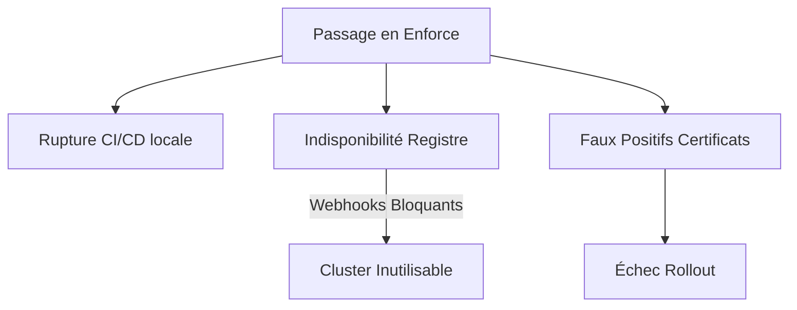

# Kyverno Policy Enforcement Decision Record — SecureRAG Hub

## Statut : DÉCISION ARCHITECTURALE (ADR)

Ce document formalise la décision d'architecture concernant le mode de fonctionnement des politiques Kyverno dans le cluster local (Kind) de démonstration et présente la stratégie de migration vers un mode restrictif (`Enforce`) en production.

---

## 1. Contexte et Problématique

Kyverno est utilisé dans SecureRAG Hub pour garantir la conformité des manifests Kubernetes par rapport aux bonnes pratiques de sécurité. Sept politiques majeures sont implémentées (ex: interdiction du tag `latest`, exclusion des privilèges root, vérification des signatures Cosign).

Chaque politique Kyverno peut être configurée dans deux modes :
* **`Audit`** : Autorise la création de la ressource non conforme mais génère un rapport d'audit (`PolicyReport`).
* **`Enforce`** : Rejette immédiatement la création ou la modification de la ressource non conforme et retourne une erreur au client API (ex: kubectl, Jenkins).

---

## 2. Décision Architecturale

> [!IMPORTANT]
> **Décision** : Les politiques Kyverno sont configurées en mode **`Audit`** par défaut pour l'environnement local de développement/démonstration (Kind). La vérification de la signature Cosign est également maintenue en mode **`Audit`** dans cet environnement local.

---

## 3. Justification de la Décision (Pourquoi `Audit` ?)

1. **Utilisation d'un Registre Local Non-Sécurisé (`localhost:5001`)** :
   Dans l'environnement de développement Kind, les images sont poussées vers un registre local non-sécurisé ou injectées directement via `kind load docker-image`.
   * Le webhook de Kyverno, exécuté à l'intérieur du cluster, a des difficultés à interroger de manière fiable `localhost:5001` (qui fait référence au nœud Kind ou à la machine hôte selon la configuration DNS/réseau).
   * Passer en `Enforce` bloquerait systématiquement tous les déploiements locaux en raison de l'impossibilité de résoudre l'image ou de valider la signature par le contrôleur d'admission.

2. **Éviter le Blocage de la CI/CD locale** :
   En mode développement et démonstration rapide, un blocage strict ralentit le cycle itératif. Le mode `Audit` permet à la chaîne CD de se dérouler jusqu'au bout, puis d'exécuter `scripts/validate/post-deploy-validation.sh` pour inspecter les vulnérabilités et signatures de manière asynchrone sans bloquer l'infrastructure.

3. **Pragmatisme de Soutenance** :
   Pour la soutenance de fin d'études, il est indispensable de montrer le bon déroulement du pipeline de bout en bout. Un échec d'admission control lié à une résolution DNS locale gâcherait la démonstration. Le mode `Audit` permet de prouver la détection (via les `PolicyReports`) sans risque de freeze de la démo.

---

## 4. Risques d'un Passage Prématuré en `Enforce`



* **Bloquer les mises à jour critiques** : Si le registre d'images ou le serveur de clés (Cosign) subit une panne, aucun conteneur ne peut démarrer ou redémarrer, même pour appliquer un correctif urgent.
* **Complexité réseau** : Kyverno nécessite une communication fluide entre son pod et l'API Kubernetes. En cas de congestion réseau ou de redémarrage du plan de contrôle, le mode `Enforce` peut bloquer par défaut (fail-closed) toute opération d'administration.

---

## 5. Conditions pour le Passage en `Enforce` (Production Target)

Pour migrer de manière sécurisée vers le mode `Enforce` dans un cluster de production, les critères suivants doivent être réunis :

1. **Registre d'images de production sécurisé et public/privé stable** :
   Utilisation de conteneurs hébergés sur AWS ECR, Google Artifact Registry ou Azure ACR, avec des rôles IAM (IRSA/Workload Identity) permettant à Kyverno d'accéder aux images sans identifiants partagés.
2. **Infrastructure de clés (KMS) hautement disponible** :
   La clé publique utilisée pour valider les signatures Cosign doit être stockée dans un KMS managé (ex: AWS KMS, HashiCorp Vault) accessible en permanence par Kyverno.
3. **Période d'observation "Zero-Violation" en Audit** :
   Les rapports de conformité (`PolicyReports`) Kyverno doivent afficher 100% de conformité sur une période de 14 jours consécutifs en environnement de Staging/Pré-production avant bascule.
4. **Exclusion des namespaces système** :
   Les politiques doivent explicitement ignorer les namespaces vitaux (`kube-system`, `kyverno`, `local-path-storage`) pour éviter de bloquer les composants d'infrastructure de base en cas de mise à jour.

---

## 6. Plan de Migration Progressif

Le passage au mode restrictif se fera suivant une approche par étapes :

```
Étape 1: Audit & Monitoring (Actuel)
   │
   ▼
Étape 2: Exception Management & Whitelisting (Préparé)
   │
   ▼
Étape 3: Enforce Sélectif (Déploiements applicatifs uniquement)
   │
   ▼
Étape 4: Enforce Global (Production restrictive complète)
```

### Exemple de conversion de politique (de Audit à Enforce)

Pour basculer une règle en production, il suffit de modifier l'attribut `validationFailureAction` dans la policy Kyverno :

```yaml
apiVersion: kyverno.io/v1
kind: ClusterPolicy
metadata:
  name: disallow-latest-tag
spec:
  # validationFailureAction: Audit   # Dev/Demo Mode
  validationFailureAction: Enforce   # Production Target
  rules:
    - name: require-image-tag
      match:
        any:
          - resources:
              kinds:
                - Pod
```

---

## 7. Conclusion

Le choix du mode `Audit` pour le démonstrateur Kind est une décision pragmatique de génie logiciel et de sécurité opérationnelle. Elle permet de maintenir une excellente visibilité (via les scripts de validation post-déploiement et les tableaux de bord d'observabilité) tout en éliminant les risques de blocage intempestifs inhérents à un environnement local.

---

*Document créé pour la finalisation DevSecOps — branche `devsecops-final-hardening`*
