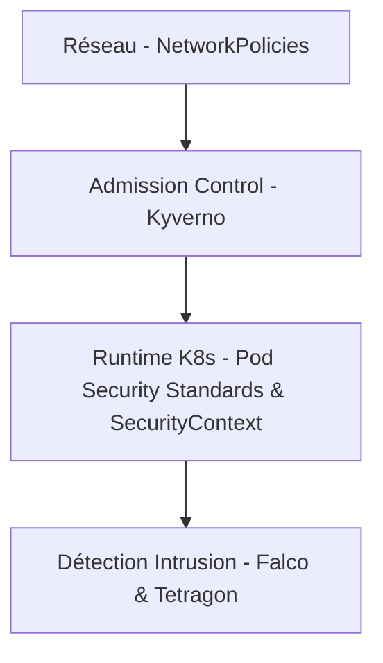
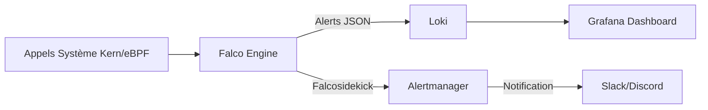

# Runtime Security & Falco/Tetragon Policy — SecureRAG Hub

## Statut : ACTIF & PERSPECTIVES

Ce document décrit l'architecture et les contrôles de sécurité appliqués au moment de l'exécution (runtime) dans le cluster Kubernetes de SecureRAG Hub, combinant les mécanismes natifs de Kubernetes et les outils d'audit avancés Falco et Tetragon.

---

## 1. Modèle de Sécurité par Couche (Defense in Depth)

La sécurité de SecureRAG Hub repose sur un modèle multicouche. La compromission d'une couche ne doit pas compromettre l'ensemble du système.



| Couche | Technologie | Statut | Rôle |
|--------|-------------|--------|------|
| **Réseau** | NetworkPolicies (Cilium/Calico) | **ACTIF** | Isole les pods de l'application et restreint l'accès à la base de données PostgreSQL. |
| **Admission** | Kyverno Policies | **ACTIF** | Valide les signatures Cosign, interdit le tag `latest`, et enforce les profils restreints. |
| **Pod Runtime** | SecurityContext & PSA Restricted | **ACTIF** | Bloque le mode privilégié, force `readOnlyRootFilesystem=true`, et interdit `runAsRoot`. |
| **Détection** | Falco (MITRE ATT&CK Rules) | **ACTIF** | Analyse les appels système (syscalls) pour détecter les intrusions au runtime. |
| **Profilage** | Tetragon | **PERSPECTIVE** | Sécurité au niveau du noyau Linux (eBPF) avec blocage actif. |

---

## 2. Contrôles Pod Security Standards (PSS) & SecurityContexts Actifs

Chaque microservice (Laravel, PostgreSQL, Redis) dispose de configurations strictes appliquées directement au niveau de son descripteur de déploiement.

### Exemple de configuration (Laravel Gateway)

```yaml
spec:
  securityContext:
    runAsNonRoot: true
    runAsUser: 1000
    runAsGroup: 1000
    fsGroup: 1000
    seccompProfile:
      type: RuntimeDefault
  containers:
    - name: gateway
      securityContext:
        allowPrivilegeEscalation: false
        readOnlyRootFilesystem: true
        capabilities:
          drop:
            - ALL
```

### Justification des paramètres :
* **`runAsNonRoot: true`** : Empêche toute exécution sous l'UID 0 (root), neutralisant une grande partie des attaques par élévation de privilèges.
* **`readOnlyRootFilesystem: true`** : Le système de fichiers du conteneur est monté en lecture seule. Un attaquant parvenant à injecter du code ne peut pas écrire de fichiers persistants sur le disque (comme des portes dérobées ou des outils d'attaque).
* **`capabilities.drop: [ALL]`** : Supprime tous les privilèges système Linux (capabilities) non nécessaires, réduisant drastiquement la surface d'attaque du noyau Linux.
* **`seccompProfile.type: RuntimeDefault`** : Applique le profil Seccomp par défaut de Docker/Containerd qui bloque environ 300 appels système non sécurisés.

---

## 3. Détection d'Intrusions Runtime avec Falco

Falco écoute les appels système via un module noyau ou eBPF et évalue ces appels par rapport à des règles prédéfinies.

### Règles Falco sur mesure (MITRE ATT&CK)

Pour SecureRAG Hub, un ensemble de règles spécifiques a été configuré dans `/etc/falco/falco_rules.local.yaml` pour surveiller :
1. **Écriture dans un répertoire binaire ou système** : Détecte les tentatives de persistance.
2. **Terminal ou Shell ouvert dans un conteneur en production** (T1609) : Alerte si un administrateur ou un attaquant exécute `kubectl exec -it`.
3. **Modification de fichiers de configuration sensibles** (`/etc/passwd`, `/etc/shadow`, etc.) (T1083).
4. **Tentative de contournement du système de fichiers en lecture seule**.

### Exemple de règle Falco configurée

```yaml
- rule: Shell in SecureRAG Pod
  desc: Detect any interactive shell spawned inside a production pod
  condition: container and spawned_process and proc.name in (bash, sh, zsh, psql, php) and proc.tty != 0
  output: "CRITICAL: Interactive shell spawned in pod (user=%user.name pod=%k8s.pod.name image=%container.image.repository cmd=%proc.cmdline)"
  priority: CRITICAL
  tags: [mitre_execution, T1609]
```

### Intégration et Alerting



Les alertes de Falco sont acheminées vers :
* **Grafana Loki** : Pour l'historisation, l'indexation et la corrélation avec les logs applicatifs.
* **Alertmanager** : Pour notifier en temps réel l'équipe DevSecOps en cas d'intrusion avérée.

---

## 4. Tetragon : Sécurité Active via eBPF (Perspective)

Alors que Falco est principalement un outil d'**audit et de détection**, **Tetragon** (projet Cilium) permet une **sécurité active** grâce à la technologie eBPF.

### Avantages de Tetragon
* **Zéro Overhead** : Filtrage directement dans le noyau Linux.
* **Enforcement** : Possibilité de tuer immédiatement un processus tentant une action non autorisée (ex: `sigkill` automatique si écriture non autorisée).
* **Visibilité sur le réseau** : Associe chaque processus à sa socket réseau et à son identité Kubernetes.

### Manifeste de sécurité Tetragon préparé (`TracingPolicy`)

```yaml
apiVersion: cilium.io/v1alpha1
kind: TracingPolicy
metadata:
  name: block-binaries-exec
  namespace: securerag-hub
spec:
  kprobes:
    - call: "sys_execve"
      syscall: true
      args:
        - index: 0
          type: "string"
      selectors:
        - matchArgs:
            - index: 0
              operator: "Prefix"
              values:
                - "/bin/nc"
                - "/usr/bin/nc"
                - "/bin/ncat"
          matchActions:
            - action: Sigkill
```

*Ce manifeste ordonne au noyau Linux de tuer instantanément tout conteneur tentant d'exécuter un binaire de reverse shell (`nc`, `ncat`) au sein du namespace `securerag-hub`.*

---

## 5. Validation Runtime Post-Déploiement

Dans notre pipeline DevSecOps, la sécurité est validée automatiquement après chaque déploiement via le script :
`scripts/validate/post-deploy-validation.sh`

Ce script orchestre :
1. **`validate-rollout.sh`** : Vérifie que tous les pods respectent les quotas et ne crashent pas.
2. **`verify-runtime-signatures.sh`** : Utilise **Cosign** pour certifier que les images *actuellement en cours d'exécution* dans le cluster possèdent une signature valide signée par notre autorité de build.
3. **`security-smoke.sh`** : Effectue des tests d'intrusion factices pour s'assurer que les barrières de sécurité et les sondes de détection (Falco) interceptent correctement les comportements suspects.

---

## 6. Conclusion et Alignement Soutenance

Pour la soutenance du PFE, la démonstration s'appuiera sur :
* Le fonctionnement effectif du **SecurityContext** interdisant les écritures disque (testable avec un `kubectl exec` tentant un `touch /test`).
* La détection en temps réel par **Falco** de cette intrusion avec visualisation immédiate dans le dashboard **Grafana**.
* La validation automatique par **Cosign** des signatures runtime.
* La feuille de route pour le passage à **Tetragon** comme système de prévention active (IPS).

---

*Document créé pour la finalisation DevSecOps — branche `devsecops-final-hardening`*
