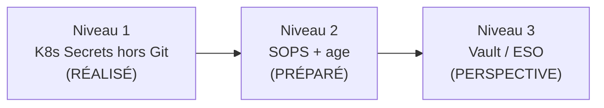
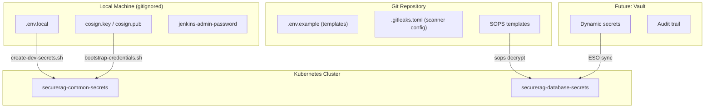

# Secrets Management — SecureRAG Hub

## Objectif

Définir une stratégie de gestion des secrets complète, à trois niveaux de maturité, adaptée au contexte PFE local tout en documentant la trajectoire vers un modèle production.

---

## Les trois niveaux



---

## Niveau 1 : Kubernetes Secrets hors Git — RÉALISÉ ✅

### Principe
Les secrets ne sont **jamais versionnés dans Git**. Ils sont créés localement via des scripts de bootstrap qui refusent les valeurs faibles ou les placeholders.

### Implémentation

| Secret | Source | Injection | Script |
|--------|--------|-----------|--------|
| `securerag-common-secrets` | `.env.local` (gitignored) | `kubectl create secret` | `scripts/secrets/create-dev-secrets.sh` |
| Jenkins admin password | `infra/jenkins/secrets/jenkins-admin-password` (gitignored) | Docker Compose variable | `scripts/jenkins/bootstrap-local-credentials.sh` |
| Cosign keypair | `infra/jenkins/secrets/cosign.*` (gitignored) | Jenkins Credentials | `scripts/jenkins/bootstrap-local-credentials.sh` |

### Protection contre les fuites

- **Gitleaks** : scan automatique en CI avec `.gitleaks.toml` configuré
- **`.gitignore`** : tous les fichiers sensibles exclus (`*.key`, `.env.local`, `cosign.*`)
- **Validation bootstrap** : les scripts refusent les secrets faibles, les `APP_KEY` invalides, et les placeholders

### Commandes

```bash
# Bootstrap initial
bash scripts/secrets/bootstrap-local-secrets.sh
bash scripts/secrets/create-dev-secrets.sh
bash scripts/jenkins/bootstrap-local-credentials.sh
```

---

## Niveau 2 : SOPS + age — PRÉPARÉ 🔧

### Principe
Les secrets sont chiffrés avec `age` et versionnés sous forme chiffrée. Seuls les détenteurs de la clé `age` peuvent les déchiffrer.

### Fichiers préparés

| Fichier | Rôle |
|---------|------|
| `infra/secrets/sops/sops-age.example.yaml` | Template de configuration SOPS |
| `infra/secrets/production/securerag-database-secrets.template.yaml` | Template de secret DB production |
| `scripts/secrets/apply-sops-production-db-secret.sh` | Script d'application |

### Activation

```bash
# 1. Générer une clé age
age-keygen -o key.txt

# 2. Chiffrer le secret
sops --encrypt --age <AGE_PUBLIC_KEY> secret.yaml > secret.enc.yaml

# 3. Appliquer via le script
ENCRYPTED_SECRET_FILE='infra/secrets/production/securerag-database-secrets.enc.yaml' \
make sops-db-secret
```

### Statut
`PRÊT_NON_EXÉCUTÉ` — les templates et scripts existent, mais aucun secret réel n'a été chiffré.

---

## Niveau 3 : Vault / External Secrets Operator — PERSPECTIVE 📋

### Principe
Un backend central (HashiCorp Vault ou équivalent) gère les secrets. L'External Secrets Operator (ESO) synchronise les secrets depuis le backend vers les Secrets Kubernetes.

### Fichiers préparés

| Fichier | Rôle |
|---------|------|
| `infra/secrets/external-secrets/cluster-secret-store.vault.template.yaml` | Template ClusterSecretStore Vault |
| `infra/secrets/external-secrets/securerag-database.external-secret.template.yaml` | Template ExternalSecret |
| `scripts/secrets/render-production-db-external-secret.sh` | Rendu non destructif |
| `scripts/secrets/validate-external-secrets-runtime.sh` | Validation runtime ESO |

### Avantages pour la production

- Rotation automatique des secrets
- Audit trail centralisé
- Accès dynamiques (secrets éphémères)
- Séparation des responsabilités (ops vs dev)

### Statut
`PRÊT_NON_EXÉCUTÉ` — les templates existent, mais Vault et ESO ne sont pas installés.

---

## Rotation des secrets

| Secret | Fréquence recommandée | Impact rotation |
|--------|----------------------|-----------------|
| `SECURERAG_SHARED_API_TOKEN` | Après fuite ou changement de périmètre | Redéploiement des services |
| `APP_KEY` Laravel | Planifiée (destructif pour données chiffrées) | Migration des données chiffrées requise |
| Cosign keypair | Après exposition ou changement d'autorité release | Re-signature de toutes les images |
| Jenkins admin | Après soutenance ou changement d'accès | Mise à jour Docker Compose |
| DB password | Périodique en production | Redéploiement + migration DB |

## Interdiction des secrets dans Git

### Contrôles actifs

1. **`.gitignore`** : exclusion des fichiers sensibles
2. **Gitleaks en CI** : scan à chaque commit, pipeline bloqué si secret détecté
3. **`.gitleaks.toml`** : configuration des règles de détection avec gestion des faux positifs
4. **Bootstrap scripts** : validation de la qualité des secrets à la création

### Configuration Gitleaks

```toml
# .gitleaks.toml — extrait
[allowlist]
description = "Known false positives"
paths = [
  '''security/secrets/\.env\.example''',
  '''\.gitleaks\.toml''',
]
```

---

## Schéma d'architecture



---

*Document créé dans le cadre de la finalisation DevSecOps — branche `devsecops-final-hardening`*
