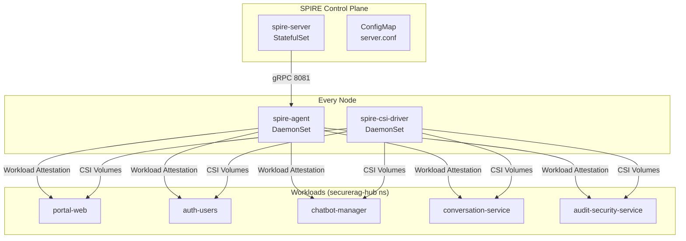
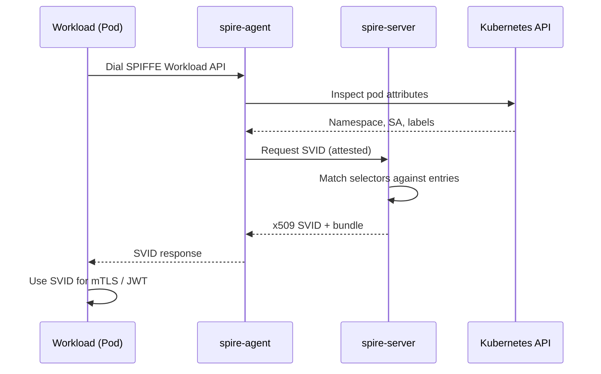
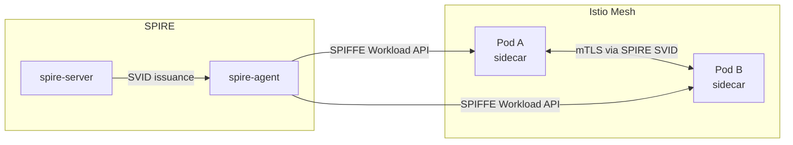

# SPIRE — Workload Identity (SPIFFE) — SecureRAG Hub

## Architecture Overview

SPIRE (SPIFFE Runtime Environment) implements the SPIFFE (Secure Production Identity Framework for Everyone) standard to provide cryptographic identities to every workload in the SecureRAG Hub cluster.



### Components

| Component | Type | Description |
|-----------|------|-------------|
| `spire-server` | StatefulSet (1 replica) | SPIRE control plane; issues SVIDs, manages CA, stores registration entries |
| `spire-agent` | DaemonSet (per node) | Attests workloads, caches SVIDs, exposes SPIFFE workload API via Unix socket |
| `spire-csi-driver` | DaemonSet (per node) | Exposes SVIDs as CSI volumes for pods; enables filesystem-level SVID access |
| `spire-server-config` | ConfigMap | Server configuration (trust domain, CA policy, plugins) |
| `spire-agent-config` | ConfigMap | Agent configuration (server address, attestors, key manager) |

### Trust Domain

```
securerag-hub.securerag.dev
```

All workloads receive identities in the form:

```
spiffe://securerag-hub.securerag.dev/<service-name>
```

Example:

```
spiffe://securerag-hub.securerag.dev/portal-web
spiffe://securerag-hub.securerag.dev/auth-users
spiffe://securerag-hub.securerag.dev/chatbot-manager
spiffe://securerag-hub.securerag.dev/conversation-service
spiffe://securerag-hub.securerag.dev/audit-security-service
```

---

## Deployment Instructions

### Prerequisites

- Kubernetes 1.24+
- kubectl configured with cluster access
- ArgoCD (optional, for GitOps deployment)

### Option 1: Kustomize (Manual)

```bash
# Deploy all SPIRE components
kubectl apply -k infra/k8s/spire

# Wait for server
kubectl wait -n spire --for=condition=ready pod -l app.kubernetes.io/name=spire-server --timeout=120s

# Wait for agent
kubectl wait -n spire --for=condition=ready pod -l app.kubernetes.io/name=spire-agent --timeout=120s
```

### Option 2: Automated Script

```bash
bash scripts/spire/deploy-spire.sh
```

### Option 3: ArgoCD (GitOps)

The ArgoCD Application `securerag-spire` deploys SPIRE automatically via Kustomize. It is configured with sync-wave `15` to deploy after core infrastructure.

```bash
kubectl apply -f infra/k8s/argocd/application-spire.yaml
```

### Registration

Workload entries are registered automatically via:

```bash
bash scripts/spire/register-workloads.sh
```

This creates entries for all five services with the selector pattern:

```
k8s:sa:securerag-hub:<service-account-name>
```

Each entry maps a Kubernetes ServiceAccount to a SPIFFE ID.

---

## How SPIRE Provides Workload Identity

### Attestation Flow

1. **Node Attestation (k8s_psat)**: Each node running `spire-agent` attests to `spire-server` using a Kubernetes Projected Service Account Token (PSAT). The agent proves it runs on a valid cluster node.

2. **Workload Attestation (k8s)**: When a workload (pod) requests an identity, `spire-agent` inspects the pod's attributes (namespace, service account, labels) via the Kubernetes API. It matches these against registration entries to determine the correct SPIFFE ID.

3. **SVID Issuance**: `spire-server` issues an SVID (SPIFFE Verifiable Identity Document) to the agent. The agent caches the SVID and presents it to the workload via the SPIFFE Workload API (Unix socket at `/run/spire/agent-sockets/spire-agent.sock`).



---

## x509 and JWT SVID Usage

### x509 SVID

Used for mutual TLS (mTLS) between services. Each workload receives:

- An x509 certificate with the SPIFFE ID in the SAN extension
- A CA bundle for peer verification

**Example SPIFFE ID in x509 SAN**:

```
URI:spiffe://securerag-hub.securerag.dev/portal-web
```

### JWT SVID

Used for stateless authentication between services or for authenticating to external systems. The JWT contains:

- `sub` claim: the SPIFFE ID
- `aud` claim: target audience
- `exp` claim: expiration time

### Fetching SVIDs

```bash
# Via spire-agent CLI (inside agent pod)
kubectl exec -n spire <agent-pod> -- /opt/spire/bin/spire-agent api fetch x509
kubectl exec -n spire <agent-pod> -- /opt/spire/bin/spire-agent api fetch jwt -audience my-service

# Via CSI volume (inside workload pod)
cat /var/run/secrets/spiffe/svid.crt
cat /var/run/secrets/spiffe/svid.key
cat /var/run/secrets/spiffe/bundle.crt
```

---

## Rotation

### Automatic Certificate Rotation

| Certificate | Rotation Interval | Mechanism |
|-------------|------------------|-----------|
| CA Certificate | 720h (30 days) | Managed by SPIRE KeyManager (memory) |
| x509 SVID | 1h (default_svid_ttl) | Automatically re-issued by spire-server |
| JWT SVID | Per request | Short-lived, issued on demand |
| Agent SVID | 1h | Automatically re-issued |

The SPIRE agent automatically rotates SVIDs before expiration. No manual intervention is required.

### Bundle Rotation

The SPIRE bundle (trusted CA certificates) is pushed to the `k8s_bundle` notifier every 10 minutes. This ensures all agents and workloads have the latest trusted roots.

---

## Integration with Istio for mTLS

SPIRE and Istio can be integrated to use SPIFFE identities for Istio mTLS, replacing Istio's native Citadel/istiod CA.

### Architecture



### Configuration

1. Install Istio with SPIRE integration:

```bash
istioctl install -y \
  --set values.global.caAddress=spire-server.spire.svc.cluster.local:8081 \
  --set values.global.trustDomain=securerag-hub.securerag.dev
```

2. Configure SPIRE as the CA for Istio:

```yaml
# Istio mesh config
apiVersion: v1
kind: ConfigMap
metadata:
  name: istio
  namespace: istio-system
data:
  mesh: |-
    trustDomain: securerag-hub.securerag.dev
    certificateAuthorities:
      spire:
        address: spire-server.spire.svc.cluster.local:8081
```

3. Workloads use the same SPIFFE identities for mTLS:

```yaml
apiVersion: security.istio.io/v1
kind: PeerAuthentication
metadata:
  name: securerag-mtls
  namespace: securerag-hub
spec:
  mtls:
    mode: STRICT
```

---

## Validation Commands

### Server Health

```bash
# Check server health
kubectl exec -n spire <server-pod> -- /opt/spire/bin/spire-server healthcheck

# List attested agents
kubectl exec -n spire <server-pod> -- /opt/spire/bin/spire-server agent list

# List registration entries
kubectl exec -n spire <server-pod> -- /opt/spire/bin/spire-server entry show
```

### Agent Health

```bash
# Check agent health
kubectl exec -n spire <agent-pod> -- /opt/spire/bin/spire-agent healthcheck

# Fetch x509 SVID
kubectl exec -n spire <agent-pod> -- /opt/spire/bin/spire-agent api fetch x509

# Fetch JWT SVID
kubectl exec -n spire <agent-pod> -- /opt/spire/bin/spire-agent api fetch jwt -audience my-service
```

### End-to-End Validation

```bash
# Run full deployment script
bash scripts/spire/deploy-spire.sh
```

### Logs

```bash
kubectl logs -n spire -l app.kubernetes.io/name=spire-server
kubectl logs -n spire -l app.kubernetes.io/name=spire-agent
kubectl logs -n spire -l app.kubernetes.io/name=spire-csi-driver
```

---

## Runbook for Troubleshooting

### Problem: Agent fails to attest

**Symptoms**:
- `spire-server agent list` shows no agents
- Agent logs contain `"failed to attest node"`

**Diagnosis**:
```bash
kubectl logs -n spire -l app.kubernetes.io/name=spire-agent --tail=50
```

**Resolution**:
1. Verify spire-server is running: `kubectl get pod -n spire -l app.kubernetes.io/name=spire-server`
2. Check network connectivity: agent uses `spire-server.spire.svc.cluster.local:8081`
3. Verify ClusterRole has required permissions (tokenreviews, pods, nodes, serviceaccounts)
4. Re-deploy agent: `kubectl rollout restart -n spire daemonset/spire-agent`

---

### Problem: Workload cannot fetch SVID

**Symptoms**:
- Application logs show `"SPIFFE workload API dial failed"`
- Permission denied on `/run/spire/agent-sockets/spire-agent.sock`

**Diagnosis**:
```bash
# Check socket exists on node
ls -la /run/spire/agent-sockets/spire-agent.sock

# Check agent logs
kubectl logs -n spire -l app.kubernetes.io/name=spire-agent --tail=20
```

**Resolution**:
1. Verify workload's ServiceAccount matches a registration entry: `kubectl exec -n spire <server-pod> -- /opt/spire/bin/spire-server entry show`
2. Verify CSI driver is running: `kubectl get pod -n spire -l app.kubernetes.io/name=spire-csi-driver`
3. Add missing registration: `bash scripts/spire/register-workloads.sh`

---

### Problem: Registration entry not matching

**Symptoms**:
- `spire-server entry show` lists the entry, but workloads still receive "no identity found"

**Diagnosis**:
```bash
# Check pod details
kubectl get pod -n securerag-hub <service-pod> -o yaml | grep serviceAccount

# Verify selector syntax
kubectl exec -n spire <server-pod> -- /opt/spire/bin/spire-server entry show -spiffeID spiffe://securerag-hub.securerag.dev/<service>
```

**Resolution**:
1. Ensure the selector format matches the actual pod attributes: `k8s:sa:<namespace>:<sa-name>`
2. The namespace in the selector must match the workload's Kubernetes namespace
3. The service account name must match exactly (case-sensitive)

---

### Problem: x509 certificate expiration

**Symptoms**:
- mTLS handshake failures
- `"certificate has expired"` errors in logs

**Resolution**:
- Automatic rotation is configured (SVID TTL: 1h). No manual action required.
- SPIRE agent automatically fetches new SVIDs before expiration.
- If rotation fails, restart the agent: `kubectl rollout restart -n spire daemonset/spire-agent`

---

### Problem: CSI driver not working

**Symptoms**:
- Pods with CSI volumes stuck in `ContainerCreating`
- `"failed to mount CSI volume"` events

**Diagnosis**:
```bash
kubectl describe pod -n securerag-hub <pod-name>
kubectl logs -n spire -l app.kubernetes.io/name=spire-csi-driver
```

**Resolution**:
1. Verify CSIDriver object exists: `kubectl get csidriver spiffe.csi.csi-driver`
2. Check node-registrar logs for registration issues
3. Ensure `spire-agent` socket exists on the node
4. Re-create CSI driver pods: `kubectl rollout restart -n spire daemonset/spire-csi-driver`

---

### Common Commands Reference

| Purpose | Command |
|---------|---------|
| Deploy SPIRE | `kubectl apply -k infra/k8s/spire` |
| Register workloads | `bash scripts/spire/register-workloads.sh` |
| Full deployment | `bash scripts/spire/deploy-spire.sh` |
| Server logs | `kubectl logs -n spire -l app.kubernetes.io/name=spire-server` |
| Agent logs | `kubectl logs -n spire -l app.kubernetes.io/name=spire-agent` |
| List entries | `kubectl exec -n spire <server-pod> -- /opt/spire/bin/spire-server entry show` |
| List agents | `kubectl exec -n spire <server-pod> -- /opt/spire/bin/spire-server agent list` |
| Fetch x509 | `kubectl exec -n spire <agent-pod> -- /opt/spire/bin/spire-agent api fetch x509` |
| Fetch JWT | `kubectl exec -n spire <agent-pod> -- /opt/spire/bin/spire-agent api fetch jwt -audience <aud>` |
| Uninstall | `kubectl delete -k infra/k8s/spire` |
