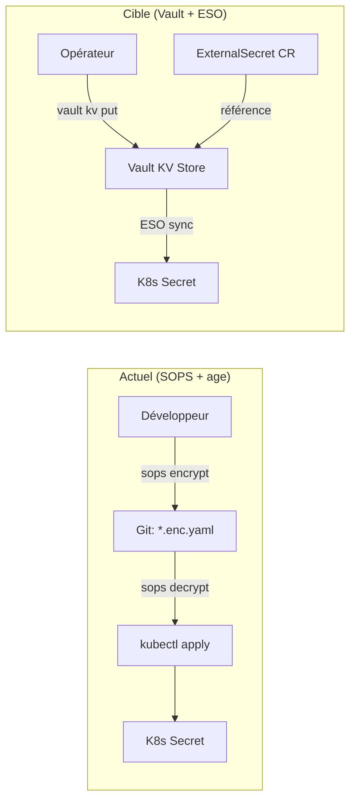
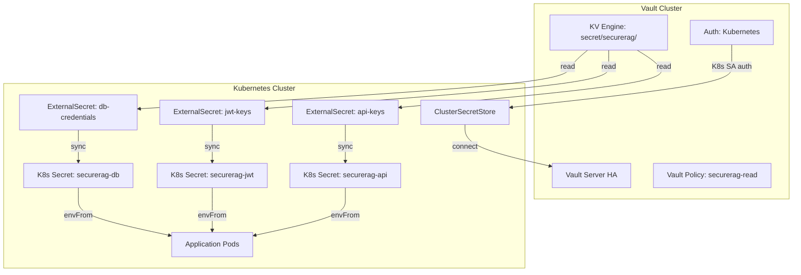

# Roadmap HashiCorp Vault + External Secrets Operator — SecureRAG Hub

## Statut : ROADMAP (Architecture Cible)

Ce document décrit l'architecture cible pour la gestion des secrets en production, migrant de SOPS+age vers HashiCorp Vault couplé à l'External Secrets Operator (ESO).

---

## 1. Architecture Actuelle vs Architecture Cible



| Critère | SOPS + age (actuel) | Vault + ESO (cible) |
|---------|--------------------|--------------------|
| **Stockage** | Fichiers chiffrés dans Git | Vault centralisé |
| **Rotation** | Manuelle (sops edit + commit + apply) | Automatique (Vault lease + ESO refresh) |
| **Audit** | Git log | Vault audit log complet |
| **Contrôle d'accès** | Clé age partagée | Vault policies + AppRole / K8s auth |
| **Scalabilité** | Limité (fichiers par env) | Multi-cluster, multi-tenant |
| **Complexité** | Faible | Modérée (infra supplémentaire) |

## 2. Composants

### 2.1 HashiCorp Vault

Vault centralise le stockage, le contrôle d'accès et l'audit de tous les secrets.

```bash
# Déploiement Vault dans le cluster
helm repo add hashicorp https://helm.releases.hashicorp.com
helm install vault hashicorp/vault \
  -n vault --create-namespace \
  --set "server.ha.enabled=true" \
  --set "server.ha.replicas=3" \
  --set "ui.enabled=true"
```

### 2.2 External Secrets Operator (ESO)

ESO synchronise automatiquement les secrets de Vault vers des K8s Secrets natifs.

```bash
# Déploiement ESO
helm repo add external-secrets https://charts.external-secrets.io
helm install external-secrets external-secrets/external-secrets \
  -n external-secrets --create-namespace
```

## 3. Architecture Détaillée



## 4. Configuration

### 4.1 ClusterSecretStore (déjà préparé)

Le template existe dans `infra/secrets/external-secrets/cluster-secret-store.vault.template.yaml` :

```yaml
apiVersion: external-secrets.io/v1beta1
kind: ClusterSecretStore
metadata:
  name: vault-backend
spec:
  provider:
    vault:
      server: "https://vault.vault.svc.cluster.local:8200"
      path: "secret"
      version: "v2"
      auth:
        kubernetes:
          mountPath: "kubernetes"
          role: "securerag-hub"
          serviceAccountRef:
            name: "external-secrets-sa"
            namespace: "external-secrets"
```

### 4.2 ExternalSecret (déjà préparé)

Le template existe dans `infra/secrets/external-secrets/securerag-database.external-secret.template.yaml` :

```yaml
apiVersion: external-secrets.io/v1beta1
kind: ExternalSecret
metadata:
  name: securerag-database
  namespace: securerag-hub
spec:
  refreshInterval: 1h
  secretStoreRef:
    name: vault-backend
    kind: ClusterSecretStore
  target:
    name: securerag-common-secrets
    creationPolicy: Owner
  data:
    - secretKey: DB_PASSWORD
      remoteRef:
        key: secret/securerag/database
        property: password
    - secretKey: DB_USERNAME
      remoteRef:
        key: secret/securerag/database
        property: username
```

### 4.3 Vault Policy

```hcl
# vault-policy-securerag.hcl
path "secret/data/securerag/*" {
  capabilities = ["read", "list"]
}

path "secret/metadata/securerag/*" {
  capabilities = ["read", "list"]
}
```

```bash
# Appliquer la policy
vault policy write securerag-read vault-policy-securerag.hcl

# Configurer l'auth Kubernetes
vault auth enable kubernetes
vault write auth/kubernetes/config \
  kubernetes_host="https://kubernetes.default.svc"

vault write auth/kubernetes/role/securerag-hub \
  bound_service_account_names="external-secrets-sa" \
  bound_service_account_namespaces="external-secrets" \
  policies="securerag-read" \
  ttl=1h
```

## 5. Plan de Migration depuis SOPS

### Phase 1 : Déploiement parallèle (2 semaines)

1. Déployer Vault + ESO dans le cluster
2. Copier les secrets SOPS vers Vault KV
3. Créer les ExternalSecrets en mode `creationPolicy: Merge`
4. Vérifier que les K8s Secrets sont identiques

### Phase 2 : Basculement (1 semaine)

1. Configurer les deployments pour utiliser les secrets ESO
2. Supprimer les références SOPS des overlays
3. Vérifier le `refreshInterval` et la rotation automatique

### Phase 3 : Décommission SOPS (1 semaine)

1. Archiver les fichiers `.enc.yaml`
2. Révoquer les clés age
3. Mettre à jour la documentation

## 6. Rotation Automatique

Avec Vault + ESO, la rotation devient automatique :

```yaml
# ExternalSecret avec rotation automatique
spec:
  refreshInterval: 30m    # ESO re-sync toutes les 30 min
  target:
    name: securerag-common-secrets
    creationPolicy: Owner
    deletionPolicy: Retain  # Conserver le secret si l'ExternalSecret est supprimé
```

```bash
# Rotation dans Vault (côté opérateur)
vault kv put secret/securerag/database \
  password="$(openssl rand -base64 32)" \
  username="securerag"

# ESO synchronise automatiquement dans les 30 minutes
# Les pods détectent le changement via leur volume mount ou rolling restart
```

## 7. Prérequis

- [ ] Vault Server HA déployé et unsealed
- [ ] External Secrets Operator installé
- [ ] Kubernetes Auth method configurée dans Vault
- [ ] NetworkPolicy autorisant ESO → Vault
- [ ] Backup régulier du Vault backend (Raft/Consul)

---

*Document créé dans le cadre de l'audit DevSecOps — amélioration P2*
