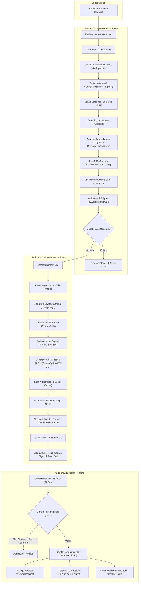
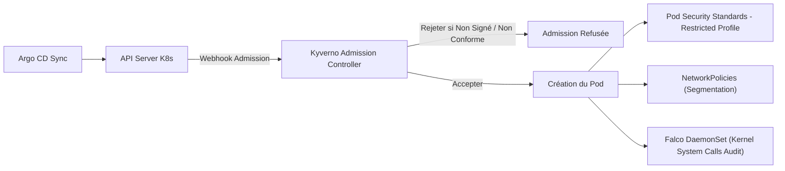

# Guide de Construction et de Déploiement de la Chaîne DevSecOps — SecureRAG Hub

Ce guide présente de manière exhaustive toutes les étapes, les outils, les scripts et les configurations requises pour construire, déployer et exploiter la chaîne **DevSecOps** du projet **SecureRAG Hub**. 

La chaîne DevSecOps est conçue selon les meilleurs standards de sécurité :
*   **SLSA Level 3** (Supply-chain Levels for Software Artifacts) pour la provenance et la traçabilité.
*   **OWASP SAMM** (Software Assurance Maturity Model) pour la gouvernance et le niveau opérationnel.
*   **Kubernetes Pod Security Standards (PSS)** au profil `Restricted` pour la sécurité au runtime.

---

## 1. Architecture Globale du Flux CI/CD/CO (Continuous Operations)

Le flux de livraison et d'opération sécurisées de SecureRAG Hub s'articule autour de trois environnements clés : l'**Intégration Continue (CI)** sous Jenkins, la **Livraison Continue (CD)** gérant la chaîne d'approvisionnement (Supply Chain) et la signature, et le **Runtime Sécurisé (Kubernetes + GitOps)**.



---

## 2. Phase 1 : Intégration Continue (CI)

La phase d'intégration continue s'exécute à chaque commit ou pull request. Elle est orchestrée par le [Jenkinsfile](file:///root/MasterPFE/Jenkinsfile) principal et valide l'intégrité du code source avant la construction des images.

### 2.1 Préparation de l'environnement
Avant d'exécuter les outils de sécurité, le pipeline configure le workspace et installe les outils requis :
*   Création des répertoires de rapport : `security/reports` et `.coverage-artifacts`.
*   Initialisation d'un environnement virtuel Python isolé pour exécuter **Semgrep**.
*   Installation des dépendances d'application (Composer et NPM) en mode sécurisé.

```bash
# Exemple de script Jenkins
python3 -m venv .tools/semgrep-venv
. .tools/semgrep-venv/bin/activate
python -m pip install --upgrade pip
python -m pip install "semgrep==1.156.0" PyYAML
```

### 2.2 Qualité et Linting du Code
Afin d'éviter les défauts de syntaxe et d'assurer un style de code homogène, le pipeline appelle le [Makefile](file:///root/MasterPFE/Makefile) du projet :
```bash
make lint
```
Cette commande exécute :
*   `black` et `isort` pour le formatage Python.
*   `flake8` pour l'analyse statique Python.
*   `php -l` pour la vérification syntaxique des fichiers PHP de l'application Laravel.

### 2.3 Tests Unitaires et Couverture (Coverage Gate)
Les tests sont lancés via [run-tests.sh](file:///root/MasterPFE/scripts/ci/run-tests.sh) :
*   **Backend (Laravel)** : Exécution de `./vendor/bin/phpunit --coverage-cobertura` pour générer les rapports de tests et de couverture.
*   **Chatbot (Python)** : Exécution de `pytest --cov`.
La couverture est analysée par [collect-coverage.sh](file:///root/MasterPFE/scripts/ci/collect-coverage.sh). Le pipeline impose un seuil de **70% minimum de couverture** pour les nouveaux développements sous peine de bloquer la Quality Gate.

### 2.4 Analyse Statique de Sécurité (SAST) - Semgrep
**Semgrep** réalise un scan de sécurité du code source en appliquant les règles définies dans le fichier de configuration centralisé [semgrep.yml](file:///root/MasterPFE/security/semgrep/semgrep.yml) :
```bash
semgrep scan \
  --config security/semgrep/semgrep.yml \
  --json \
  --output security/reports/semgrep.json \
  --error
```
*Le paramètre `--error` garantit que le pipeline échouera immédiatement en cas de détection d'une faille de sévérité élevée.*

### 2.5 Détection de Secrets dans le Code - Gitleaks
Pour empêcher la fuite accidentelle de clés d'API, mots de passe ou certificats, le pipeline exécute **Gitleaks** dans un conteneur éphémère à l'aide de la configuration [.gitleaks.toml](file:///root/MasterPFE/.gitleaks.toml) :
```bash
docker run --rm \
  -v "$PWD:/repo" \
  -w /repo \
  ghcr.io/gitleaks/gitleaks:v8.30.1 \
  dir /repo \
  --config .gitleaks.toml \
  --report-format json \
  --report-path security/reports/gitleaks.json
```

### 2.6 Audit des Dépendances (SCA) - Trivy FS
Les bibliothèques tierces (Composer et NPM) sont scannées pour identifier les vulnérabilités publiques (CVE) via le script [audit-dependencies.sh](file:///root/MasterPFE/scripts/ci/audit-dependencies.sh) et **Trivy FS** :
```bash
trivy fs \
  --config security/trivy/trivy.yaml \
  --ignorefile .trivyignore \
  --format json \
  --output security/reports/trivy-fs.json \
  .
```

### 2.7 Sécurité de l'Infrastructure-as-Code (IaC) - Checkov & Trivy IaC
Les manifests Kubernetes et les graphiques Helm présents dans les répertoires `infra/k8s/` et `infra/helm/` subissent une analyse statique de sécurité avec **Checkov** et **Trivy** pour détecter les mauvaises configurations (ex: conteneurs s'exécutant en root) :
```bash
# Scan Checkov sur les manifests
checkov -d infra/k8s/ --config-file security/checkov-config.yaml -o junitxml > security/reports/checkov-k8s.xml
# Scan Trivy IaC
trivy fs . --scanners config --format json --output security/reports/trivy-iac.json
```

### 2.8 Validation Statique Kubernetes - Kube-score & Kyverno CLI
Avant de pousser les manifests sur le cluster, le pipeline réalise une double validation :
1.  **kube-score** : Analyse les manifests K8s par rapport aux meilleures pratiques de sécurité (limites de ressources, probes HTTP, etc.) via [validate-kube-score.sh](file:///root/MasterPFE/scripts/ci/validate-kube-score.sh).
2.  **Kyverno CLI** : Valide statiquement les manifests en leur appliquant les politiques réelles du cluster via [validate-kyverno-policies.sh](file:///root/MasterPFE/scripts/ci/validate-kyverno-policies.sh).

```bash
# Exemple de validation kube-score
kube-score score infra/k8s/overlays/production/*.yaml --output-format markdown > artifacts/security/kube-score-report.md
```

### 2.9 Quality Gate Consolidée (CI)
Le script [quality-gate.sh](file:///root/MasterPFE/scripts/ci/quality-gate.sh) agrège les métriques de toutes les étapes précédentes. Il applique les règles suivantes pour accorder ou refuser le passage à la phase CD :
*   0 secret détecté par Gitleaks.
*   0 vulnérabilité critique/haute dans le code (Semgrep SAST).
*   Couverture minimale de tests unitaires atteinte (70%).
*   0 violation critique de politique dans les manifests Kubernetes (Kube-score & Kyverno).

---

## 3. Phase 2 : Livraison Continue (CD) & Supply Chain Security

Dès que la CI valide le code, le pipeline [Jenkinsfile.cd](file:///root/MasterPFE/Jenkinsfile.cd) prend le relais pour construire, sécuriser, signer et déployer les images.

### 3.1 Scan de l'Image Docker - Trivy Image
L'image Docker candidate à la release est scannée à l'aide de **Trivy** afin de s'assurer qu'aucune vulnérabilité critique ou haute n'est présente dans l'OS de base ou les packages système :
```bash
trivy image \
  --severity CRITICAL,HIGH \
  --exit-code 1 \
  --format json \
  --output security/reports/trivy-image-scan.json \
  "${REGISTRY_HOST}/${IMAGE_PREFIX}/${SERVICE}:${SOURCE_IMAGE_TAG}"
```

### 3.2 Signature Cryptographique des Images - Cosign
Pour garantir l'authenticité et l'intégrité de l'image sur le cluster, celle-ci est signée cryptographiquement à l'aide de **Cosign** et de clés privées injectées de manière sécurisée par Jenkins :
```bash
cosign sign \
  --key "${COSIGN_KEY}" \
  --tlog-upload=false \
  "${REGISTRY_HOST}/${IMAGE_PREFIX}/${SERVICE}:${SOURCE_IMAGE_TAG}"
```

### 3.3 Vérification et Promotion par Digest (Immutabilité)
Pour empêcher les attaques de type "homme du milieu" ou "Tag-Swapping", les signatures sont d'abord vérifiées :
```bash
cosign verify --key "${COSIGN_PUBLIC_KEY}" "${REGISTRY_HOST}/${IMAGE_PREFIX}/${SERVICE}:${SOURCE_IMAGE_TAG}"
```
Une fois validée, l'image est promue en utilisant son **digest SHA256 immuable** à la place du tag textuel. Ce processus d'épinglage (Pinning SHA256) garantit que le cluster déploie précisément le binaire qui a été inspecté et signé.

### 3.4 Génération et Validation du SBOM (Software Bill of Materials)
Le pipeline génère l'inventaire complet des composants logiciels inclus dans chaque conteneur à l'aide de **Syft** au format standard **CycloneDX JSON**, puis le valide via le schéma officiel :
```bash
# Génération du SBOM
syft "${REGISTRY_HOST}/${IMAGE_PREFIX}/${SERVICE}:${TARGET_IMAGE_TAG}" -o cyclonedx-json > "artifacts/sbom/${SERVICE}.cyclonedx.json"
```

### 3.5 Analyse de Vulnérabilités SBOM - Grype
Le SBOM ainsi généré est scanné par **Grype** pour auditer les vulnérabilités de manière découplée de l'image physique :
```bash
grype "sbom:artifacts/sbom/${SERVICE}.cyclonedx.json" --fail-on high,critical
```

### 3.6 Attestation SBOM
Le SBOM validé est lui-même attaché à l'image sous forme d'attestation cryptographique signée par Cosign. Cela permet aux contrôleurs d'admission du cluster de vérifier non seulement la signature de l'image, mais aussi la validité de son inventaire logiciel associé.
```bash
cosign attest \
  --key "${COSIGN_KEY}" \
  --type cyclonedx \
  --predicate "artifacts/sbom/${SERVICE}.cyclonedx.json" \
  "${REGISTRY_HOST}/${IMAGE_PREFIX}/${SERVICE}:${TARGET_IMAGE_TAG}"
```

### 3.7 Preuves de Release et SLSA Provenance
Pour se conformer au niveau 3 du framework SLSA, le pipeline génère :
1.  **Une attestation de provenance (SLSA Provenance)** : Un document JSON listant l'adresse du dépôt source, le commit SHA exact, les variables d'environnement de build, et les outils utilisés.
2.  **Un rapport consolidé de preuves de release** : Regroupant les logs de scan Trivy, les statuts de tests, et les signatures.

```bash
bash scripts/release/generate-provenance-statement.sh
```

### 3.8 Déploiement GitOps via Argo CD
Pour appliquer les principes GitOps, le pipeline CD ne déploie pas directement les ressources dans Kubernetes avec `kubectl`. Au lieu de cela :
1.  Il exécute [update-image-digest.sh](file:///root/MasterPFE/scripts/gitops/update-image-digest.sh) pour insérer le nouveau digest d'image SHA256 dans l'overlay Kustomize de production (`infra/k8s/overlays/production/kustomization.yaml`).
2.  Il valide la conformité finale du manifest via Kyverno en mode local (Pre-flight validation).
3.  Il effectue un `git commit` et un `git push` sur la branche principale du dépôt Git.
4.  **Argo CD** détecte la modification dans Git et synchronise automatiquement l'état souhaité dans le cluster Kubernetes de production.

---

## 4. Phase 3 : Sécurité au Runtime (Kubernetes & SecOps)

La sécurité au runtime assure la protection active des charges de travail déployées dans le cluster local (Kind) ou de production.



### 4.1 Contrôle d'Admission Kyverno (Mode Enforce)
Le cluster utilise le contrôleur d'admission **Kyverno** configuré en mode **Enforce** (blocage actif). Toute tentative de déploiement d'une ressource qui ne respecte pas les critères suivants est rejetée à l'entrée du cluster :
*   L'image doit obligatoirement posséder une signature valide vérifiable avec la clé publique Cosign configurée dans le cluster.
*   L'image doit disposer d'une attestation SBOM valide attachée.
*   Les spécifications du Pod doivent respecter le profil *Restricted* (ex: pas de privilèges root).

### 4.2 Durcissement des Pods (PSS Restricted)
Chaque microservice déployé applique des règles de sécurité strictes au niveau de son manifeste Kubernetes :
```yaml
securityContext:
  runAsNonRoot: true
  runAsUser: 10001
  runAsGroup: 10001
  readOnlyRootFilesystem: true
  allowPrivilegeEscalation: false
  capabilities:
    drop:
      - ALL
```
*Ces règles empêchent toute modification du système de fichiers du conteneur en cas de compromission de l'application et désactivent l'escalade de privilèges.*

### 4.3 Segmentation Réseau (Network Policies)
Les flux réseau internes sont limités par des ressources `NetworkPolicy` appliquées par namespace. Par défaut, toute communication réseau est bloquée (`Default Deny`), et seules les routes requises sont autorisées (ex: le service `portal-web` peut contacter le service `auth-users-service`, mais le chatbot ne peut pas directement communiquer avec la base de données PostgreSQL principale).

### 4.4 Détection d'Intrusions au Runtime - Falco
**Falco** est déployé comme un `DaemonSet` sur l'ensemble des nœuds du cluster. Il intercepte les appels système du noyau Linux (kernel) et utilise des règles personnalisées pour détecter les comportements suspects en temps réel :
*   Exécution d'un shell (`sh`, `bash`) à l'intérieur d'un conteneur en production.
*   Écriture dans un répertoire protégé (ex: `/bin`, `/sbin`, `/usr/bin`).
*   Ouverture inattendue de sockets réseau.

En cas d'alerte critique, Falco envoie les événements à **Falcosidekick**, qui les route vers Prometheus Alertmanager ou Loki pour une gestion centralisée.

---

## 5. Guide d'Exploitation et de Maintenance Sécurisée

### 5.1 Politique de Rotation des Clés
Pour limiter l'impact en cas de compromission, les secrets cryptographiques obéissent à des cycles de vie stricts :

| Clé / Certificat | Fréquence de Rotation | Déclencheur | Mécanisme |
| :--- | :--- | :--- | :--- |
| **Clé de signature Cosign** | Tous les 90 jours | Expiration temporelle ou suspicion de fuite | Partiellement automatisé (régénération via script, mise à jour manuelle du Secret Kyverno). |
| **Clé de chiffrement SOPS/age** | Annuel | Expiration annuelle ou départ de personnel SecOps | Manuel (`sops updatekeys` sur Git + mise à jour des identifiants Jenkins). |
| **Certificats TLS** | Tous les 90 jours | Seuil de 30 jours avant expiration atteint | Entièrement automatisé via l'opérateur **cert-manager** (Let's Encrypt). |

#### Procédure de rotation Cosign :
```bash
# 1. Génération de la nouvelle paire de clés
cosign generate-key-pair

# 2. Signature des nouvelles images candidates avec la clé fraîche
cosign sign --key cosign.key "${IMAGE}"

# 3. Mise à jour de la clé publique de vérification dans la politique Kyverno
kubectl apply -f infra/k8s/kyverno/kyverno-verify-images-policy.yaml
```

### 5.2 Stratégie de Résilience (RTO / RPO) et Chaos Engineering
Les objectifs de résilience dépendent des composants de stockage :
*   **PostgreSQL (Tier 1)** : RPO cible = 5 minutes, RTO cible = 30 minutes. Sauvegardes continues des journaux de transaction (WAL) combinées à un script de validation périodique de restauration (`restore-drill.sh`).
*   **ChromaDB / Qdrant (Tier 2)** : RPO cible = 1 heure, RTO cible = 15 minutes. Snapshots réguliers du volume persistant (PVC).
*   **Applications stateless (Tier 3)** : RPO = 0, RTO < 10 minutes. Déploiement via Argo CD.

Le script de chaos engineering `pod-delete-and-prove.sh` est exécuté périodiquement pour supprimer de manière aléatoire des pods applicatifs en production et valider que l'architecture Kubernetes assure une tolérance aux pannes transparente pour l'utilisateur.

### 5.3 Sécurisation du Réseau Local (nftables)
Sur la machine hôte hébergeant le cluster Kind, les ports d'administration doivent être bridés pour empêcher leur exposition publique. Le fichier `/etc/nftables.conf` applique les règles suivantes :
*   Accès public autorisé : ports `80` (HTTP) et `443` (HTTPS) pour l'Ingress applicatif.
*   Accès restreint au loopback (`127.0.0.1`) : ports `8080/8085` (Jenkins), `3000` (Grafana), `9090` (Prometheus), `8443` (Argo CD) et `5001` (Registre Docker local).

```text
table inet filter {
    chain input {
        type filter hook input priority filter; policy drop;
        iif "lo" accept
        ct state established,related accept
        tcp dport 22 accept
        tcp dport { 80, 443 } accept
        tcp dport { 8080, 8085, 3000, 9090, 8443, 5001 } drop
    }
}
```
